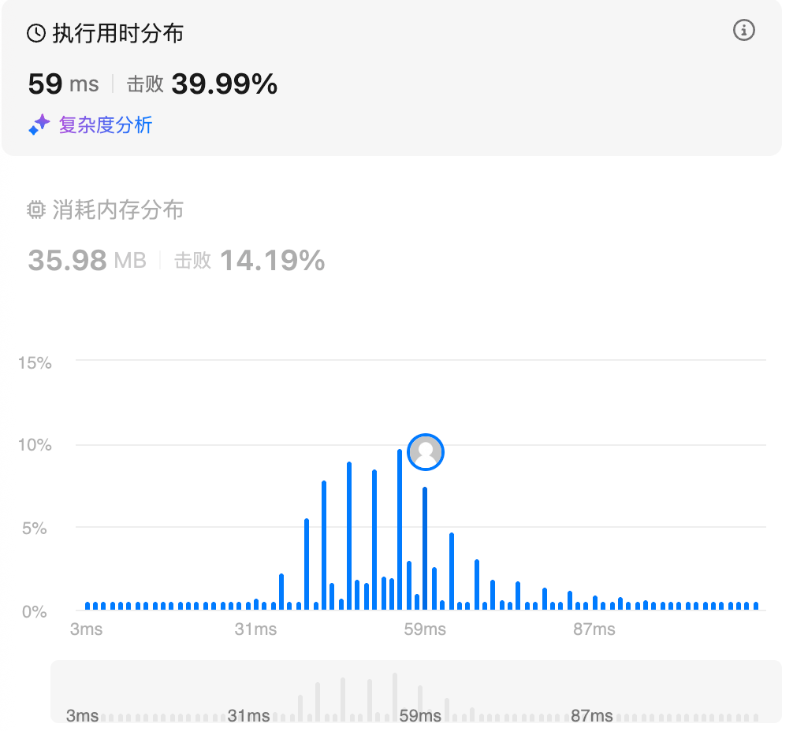
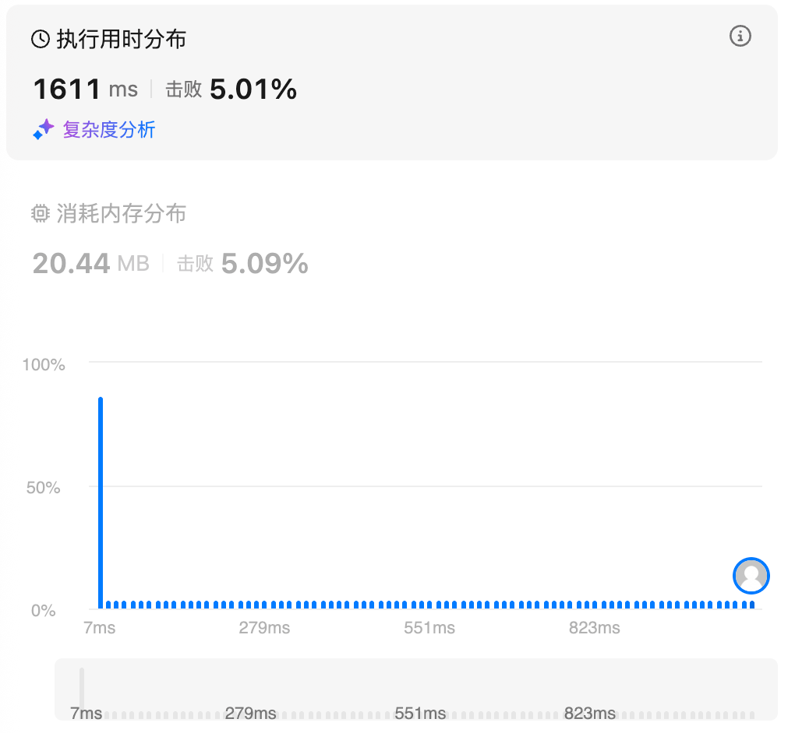
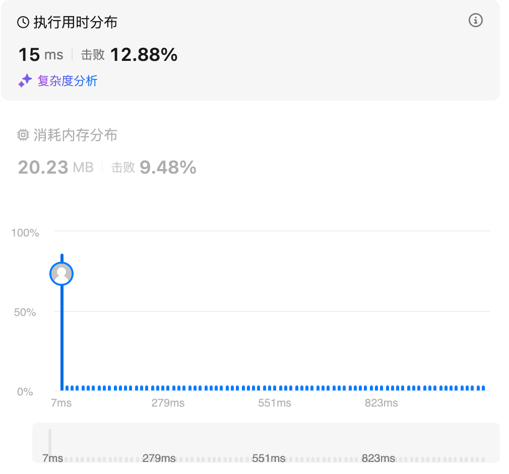

# 128.最长连续序列（中等）

## 题目描述

给定一个未排序的整数数组 `nums` ，找出数字连续的最长序列（不要求序列元素在原数组中连续）的长度。

请你设计并实现时间复杂度为 `O(n)` 的算法解决此问题。

 

**示例 1：**

```
输入：nums = [100,4,200,1,3,2]
输出：4
解释：最长数字连续序列是 [1, 2, 3, 4]。它的长度为 4。
```

**示例 2：**

```
输入：nums = [0,3,7,2,5,8,4,6,0,1]
输出：9
```

**示例 3：**

```
输入：nums = [1,0,1,2]
输出：3
```

 

**提示：**

- `0 <= nums.length <= 105`
- `-109 <= nums[i] <= 109`

## 我的Python解答

最直接的想法就是先set化进行去重操作，然后再排序。排序之后就可以直接逐个元素读取，维护一个长度即可

但是实际上python的sort函数的时间复杂度为o(nlogn)，不满足题目要求的o(n)

小坑1：排序后先判断长度是否小于等于1，确保元素至少有两个

小坑2：最好每一次for都重新判断一下res，否则如果一整个数组有序，或者整个都不连续，返回的结果就会有问题

```python
class Solution:
    def longestConsecutive(self, nums: List[int]) -> int:
        # 初步的想法：set去重，然后排序，再顺次读取，维护一个长度
        nums = list(set(nums))
        nums.sort()
        if len(nums) <= 1:
            return len(nums)
        res = 0
        inner_res = 0
        # 确保了起码有两个元素
        for i in range(0,len(nums)-1):
            if nums[i] + 1 == nums[i+1]:
                inner_res += 1
            else:
                inner_res = 0
            res = max(res, inner_res+1)
        return res
```

结果：



时间上的优化，就不能排序了


## Python参考答案

本题是不能排序的，因为排序的时间复杂度是 O(nlogn)，不符合题目 O(n) 的要求。

核心思路：对于 nums 中的元素 x，以 x 为起点，不断查找下一个数 x+1,x+2,⋯ 是否在 nums 中，并统计序列的长度。

为了做到 O(n) 的时间复杂度，需要两个关键优化：

把 nums 中的数都放入一个哈希集合中，这样可以 O(1) 判断数字是否在 nums 中。
如果 x−1 在哈希集合中，则不以 x 为起点。为什么？因为以 x−1 为起点计算出的序列长度，一定比以 x 为起点计算出的序列长度要长！这样可以避免大量重复计算。比如 nums=[3,2,4,5]，从 3 开始，我们可以找到 3,4,5 这个连续序列；而从 2 开始，我们可以找到 2,3,4,5 这个连续序列，一定比从 3 开始的序列更长。
⚠注意：遍历元素的时候，要遍历哈希集合，而不是 nums！如果 nums=[1,1,1,…,1,2,3,4,5,…]（前一半都是 1），遍历 nums 的做法会导致每个 1 都跑一个 O(n) 的循环，总的循环次数是 O(n 2 )，会超时。

```python
class Solution:
    def longestConsecutive(self, nums: List[int]) -> int:
        st = set(nums)  # 把 nums 转成哈希集合
        ans = 0
        for x in st:  # 遍历哈希集合
            if x - 1 in st:  # 如果 x 不是序列的起点，直接跳过
                continue
            # x 是序列的起点
            y = x + 1
            while y in st:  # 不断查找下一个数是否在哈希集合中
                y += 1
            # 循环结束后，y-1 是最后一个在哈希集合中的数
            ans = max(ans, y - x)  # 从 x 到 y-1 一共 y-x 个数
        return ans
```

小优化：设 m 为 nums 中的不同元素个数（即哈希集合的大小）。各个连续序列（链）是互相独立的，如果我们发现其中一条链的长度至少为 $\frac{m}{2}$（长度乘 2 大于等于 m），由于不可能还有一条长度大于 $\frac{m}{2}$的链（否则这两条链的长度之和就超过 m 了），答案不会再增大，此时可以直接返回答案。

```python
class Solution:
    def longestConsecutive(self, nums: List[int]) -> int:
        nums = set(nums)
        ans = 0
        for x in nums:
            if x-1 in nums:
                continue
            y = x+1
            while y in nums:
                y+=1
            ans = max(ans, y-x)
            if ans *2 >= len(nums):
                break
        return ans
```


## Python收获

### python中的set()函数

#### **一、set 的基本概念**

set 是 Python 内置的一种数据结构，中文通常称为“集合”。它的本质是一个**无序、不重复、基于哈希表实现的容器**。与 list 或 tuple 不同，set 中的元素没有位置索引概念，也不会保存插入顺序，其核心目标是快速判断“某个元素是否存在”，以及进行集合运算。set 中的每个元素都必须是可哈希的对象，例如整数、字符串、元组等，而像 list、dict 这样的可变对象不能作为 set 的元素。

#### **二、set 的创建方式**

创建集合最常见的方式是使用花括号字面量：

```
s = {1, 2, 3}
```

如果想创建空集合，必须使用构造函数：

```
s = set()
```

直接写 {} 会创建一个空字典，而不是空集合。也可以通过 set(iterable) 从任意可迭代对象创建集合：

```
s = set([1, 2, 2, 3])
```

由于 set 自动去重，结果会是 {1, 2, 3}。利用这一点，可以非常方便地实现列表去重：

```
unique = list(set([1, 1, 2, 3, 3]))
```

#### **三、set 的基本特性**

set 具有三个最核心的特性：第一是**无序性**，元素在集合中的排列顺序不固定；第二是**唯一性**，同一个值不会重复出现；第三是**高效性**，基于哈希表实现的查找、插入和删除操作在平均情况下时间复杂度为 O(1)。由于这些特性，set 非常适合用于成员判断、去重、集合运算等场景。

#### **四、set 的增删查改操作**

向集合中添加元素使用 add 方法：

```
s.add(10)
```

如果元素已经存在，再次 add 不会产生任何效果。若要一次性添加多个元素，可以使用 update 方法：

```
s.update([1, 2, 3])
```

删除元素有多种方式。remove(x) 会删除元素 x，如果 x 不存在会抛出 KeyError：

```
s.remove(2)
```

discard(x) 也用于删除元素，但如果元素不存在不会报错：

```
s.discard(2)
```

pop() 会随机删除并返回一个元素，因为 set 是无序的，所以 pop 删除的元素无法预测：

```
x = s.pop()
```

clear() 用于清空整个集合：

```
s.clear()
```

成员查询非常高效，使用 in 运算符即可：

```
if 3 in s:
    print("exists")
```

#### **五、set 的集合运算**

set 的最大价值体现在数学意义上的集合运算上，包括并集、交集、差集和对称差等操作。并集运算表示两个集合中所有不同元素的集合，可以使用 | 运算符或 union 方法：

```
a | b
a.union(b)
```

交集运算表示两个集合共有的元素，可以使用 & 或 intersection：

```
a & b
a.intersection(b)
```

差集运算表示属于 a 但不属于 b 的元素，使用 - 或 difference：

```
a - b
a.difference(b)
```

对称差表示属于 a 或 b 但不同时属于两者的元素，使用 ^ 或 symmetric_difference：

```
a ^ b
a.symmetric_difference(b)
```

这些运算都不会修改原集合，而是返回新的集合对象。

#### **六、集合运算的原地版本**

如果希望直接修改原集合而不是生成新集合，可以使用带 update 的版本。并集原地更新：

```
a.update(b)
```

交集原地更新：

```
a.intersection_update(b)
```

差集原地更新：

```
a.difference_update(b)
```

对称差原地更新：

```
a.symmetric_difference_update(b)
```

这些方法会直接改变 a 的内容，在需要节省内存或减少中间对象创建时非常有用。

#### **七、集合关系判断**

set 还支持集合关系的判断操作。判断一个集合是否是另一个集合的子集：

```
a <= b
a.issubset(b)
```

判断是否是超集：

```
a >= b
a.issuperset(b)
```

判断两个集合是否没有交集：

```
a.isdisjoint(b)
```

这些操作在逻辑判断和权限控制等场景中非常常见。

#### **八、set 的遍历与长度**

虽然 set 无序，但仍然可以遍历：

```
for x in s:
    print(x)
```

获取集合中元素个数使用 len(s)，时间复杂度为 O(1)。

#### **九、set 的时间复杂度特点**

由于 set 基于哈希表实现，其核心操作的平均时间复杂度如下：查找 O(1)，插入 O(1)，删除 O(1)，集合运算通常为 O(len(a) + len(b))。这使得 set 在处理大规模数据时比 list 更高效，特别是在频繁进行成员判断时，性能优势非常明显。

#### **十、set 的常见应用场景**

set 在实际编程中用途非常广泛。最典型的是列表去重，通过 set(list) 快速得到不重复元素。成员判断场景中，使用 set 替代 list 可以极大提高效率。集合运算可以方便地处理权限交集、标签匹配、数据过滤等问题。set 还常用于算法题中的“已访问节点记录”，例如图遍历或搜索算法中记录 visited 状态。

#### **十一、不可变集合 frozenset**

普通 set 是可变对象，因此不能作为字典的 key 或另一个 set 的元素。Python 提供了不可变版本 frozenset，它具有与 set 相同的运算能力，但创建后不能修改：

```
fs = frozenset([1, 2, 3])
```

frozenset 可以作为字典键或放入其他 set 中，这在某些复杂数据结构中非常有用。

#### **十二、常见陷阱与注意事项**

创建空集合时必须使用 set() 而不是 {}，这是新手最常见的错误。set 中的元素必须可哈希，尝试将 list 或 dict 放入 set 会报 TypeError。由于 set 无序，不要依赖其遍历顺序。pop 操作删除的是随机元素，不适合用来实现“队列”或“栈”。在大量元素的场景下，set 虽然查询快，但会比 list 占用更多内存，这是空间换时间的典型例子。

#### **十三、与 list 的对比选择**

当需要频繁进行“是否存在”判断时，应优先选择 set 而不是 list。当需要保持顺序或允许重复元素时，应使用 list。当需要既去重又要保持顺序，可以考虑 dict.fromkeys 或 Python 3.7 以后的有序字典特性。set 更适合数学集合运算，而 list 更适合顺序处理和索引访问。

#### **十四、总结**

set 是 Python 中极为重要的数据结构，它通过哈希表实现了高效的去重、查找和集合运算能力。掌握 set 的各种操作方法，可以显著提升代码性能和表达能力。在实际开发中，合理使用 set 往往能把原本复杂的逻辑简化为简洁高效的集合表达式，是 Python 编程中不可或缺的基础工具。

# 283.移动零

## 题目描述

给定一个数组 `nums`，编写一个函数将所有 `0` 移动到数组的末尾，同时保持非零元素的相对顺序。

**请注意** ，必须在不复制数组的情况下原地对数组进行操作。

 

**示例 1:**

```
输入: nums = [0,1,0,3,12]
输出: [1,3,12,0,0]
```

**示例 2:**

```
输入: nums = [0]
输出: [0]
```

 

**提示**:

- `1 <= nums.length <= 104`
- `-231 <= nums[i] <= 231 - 1`

 

**进阶：**你能尽量减少完成的操作次数吗？

## 我的Python解答

最开始的想法是数组分割再聚合，但是不满足提议

所以下一步设想的是双指针，一个指向0，另一个指向0元的下一个非0元素，直接交换二者

```python
class Solution:
    def moveZeroes(self, nums: List[int]) -> None:
        """
        Do not return anything, modify nums in-place instead.
        """
        # 可以直接数组分割再聚合，但是这不符合题意，原地操作
        if len(nums) == 1:
            return
        # 双指针，a是指向0，b指向a之后的第一个非0元素，都从0元素出发
        for a in range(len(nums)):
            if nums[a] != 0:
                continue
            for b in range(a,len(nums)):# 找到了第一个0
                if nums[b] != 0:
                    nums[a], nums[b] = nums[b], nums[a] # 交换
                    break
        return
```

结果：



操了，其实发现0元素直接nums先del再append

```python
class Solution:
    def moveZeroes(self, nums: List[int]) -> None:
        """
        Do not return anything, modify nums in-place instead.
        """
        times = 0
        for i in range(len(nums)):
            i -= times
            if nums[i] == 0:
                del nums[i]
                nums.append(0)
                times += 1
        return
```

最开始我是没有添加times的操作的，运行了一下错误了，错例：[0,0,1]，发现确实是这样，返回的结果是[0,1,0]，因为i是一直向前走的，要想回溯i的位置，还不能在append后直接i-=1，因为外部的i不会因为内部的变化而改变下一个取值，所以只能外部添加times，使用times计数来回溯i

结果：



## Python参考答案

方法1:把nums当作栈

遇到0则不入栈，最后再添加若干个0即可

```python
class Solution:
    def moveZeroes(self, nums: List[int]) -> None:
        stack_size = 0
        for x in nums:
            if x:
                nums[stack_size] = x  # 把 x 入栈
                stack_size += 1
        for i in range(stack_size, len(nums)):
            nums[i] = 0
        # nums[stack_size:] = [0] * (len(nums) - stack_size) # 等价
```

方法2:双指针+交换元素

方法一在最坏情况下（*nums* 全为 0），需要遍历 *nums* 两次。能否做到一次遍历？

把 0 视作空位。我们要把所有非零元素都移到数组左边的空位上，并保证非零元素的顺序不变。

例如 nums=[0,0,1,2]，把 1 放到最左边的空位上，数组变成 [ 1 ,0, 0 ,2]。注意 1 移动过去后，在原来 1 的位置又产生了一个新的空位。也就是说，我们交换了 nums[0]=0 和 nums[2]=1 这两个数。

为了保证非零元素的顺序不变，我们需要维护最左边的空位的位置（下标）。

```python
class Solution:
    def moveZeroes(self, nums: List[int]) -> None:
        i0 = 0
        for i in range(len(nums)):
            if nums[i]:
                nums[i], nums[i0] = nums[i0], nums[i]
                i0 += 1
```

这个双指针思路确实妙啊

## Python收获