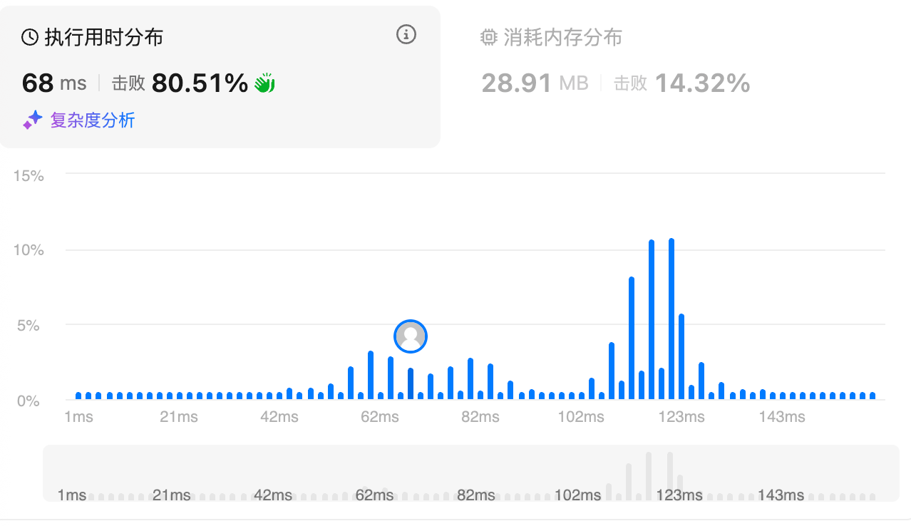

# 11.盛最多水的容器（中等）

## 题目描述

给定一个长度为 `n` 的整数数组 `height` 。有 `n` 条垂线，第 `i` 条线的两个端点是 `(i, 0)` 和 `(i, height[i])` 。

找出其中的两条线，使得它们与 `x` 轴共同构成的容器可以容纳最多的水。

返回容器可以储存的最大水量。

**说明：**你不能倾斜容器。

 

**示例 1：**


```
输入：[1,8,6,2,5,4,8,3,7]
输出：49 
解释：图中垂直线代表输入数组 [1,8,6,2,5,4,8,3,7]。在此情况下，容器能够容纳水（表示为蓝色部分）的最大值为 49。
```

**示例 2：**

```
输入：height = [1,1]
输出：1
```

 

**提示：**

- `n == height.length`
- `2 <= n <= 105`
- `0 <= height[i] <= 104`

## 我的Python解答

暴力能做，但是一定超时。时间复杂度o(n2)

```python
class Solution:
    def maxArea(self, height: List[int]) -> int:
        # 以某两个元素作为height，取最小的，和二者的index差值乘积
        # 先暴力
        ans = 0
        for i in range(len(height)-1):
            for j in range(i+1,len(height)):
                h = min(height[i],height[j])
                ans = max(h*(j-i), ans)
        return ans
```

可以简化：如果当前左指针的值小于等于上一个元素，可以直接跳过了。那如果数组始终递增呢？实际上就应该从右侧开始了

直接看答案的思路吧

## Python参考答案

从两边向中间夹，短板效应，每一次都移动最短的板子

```python
class Solution:
    def maxArea(self, height: List[int]) -> int:
        ans = left = 0
        right = len(height) - 1
        while left < right:
            area = (right - left) * min(height[left], height[right])
            ans = max(ans, area)
            if height[left] < height[right]:
                # height[left] 与右边的任意垂线都无法组成一个比 ans 更大的面积
                left += 1
            else:
                # height[right] 与左边的任意垂线都无法组成一个比 ans 更大的面积
                right -= 1
        return ans
```

时间o(n)空间o(1)

结果：



## Python收获

