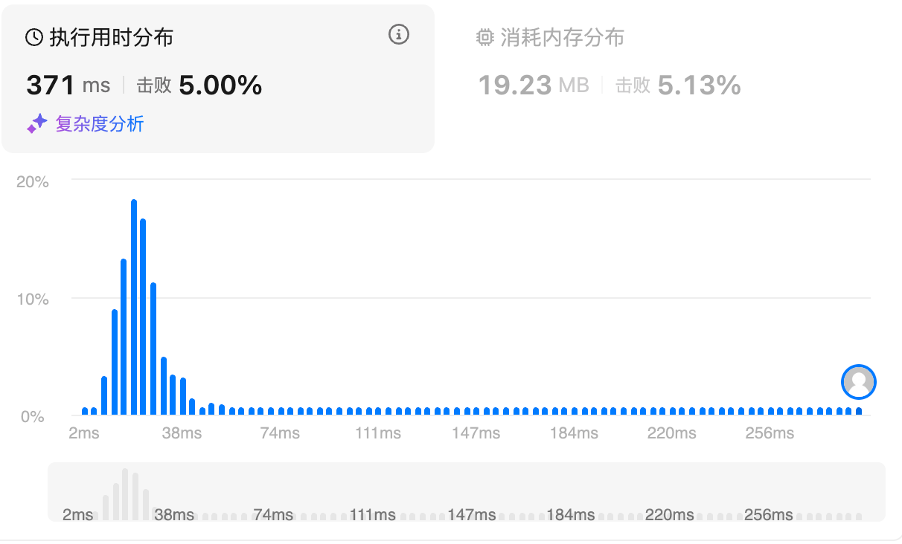
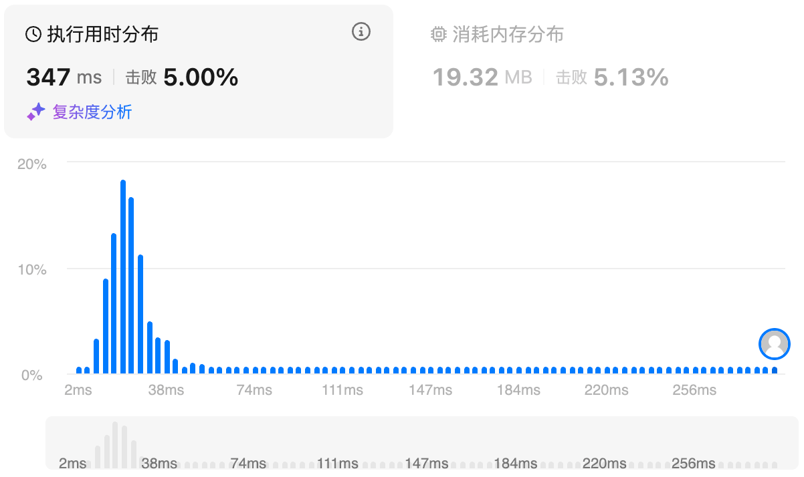
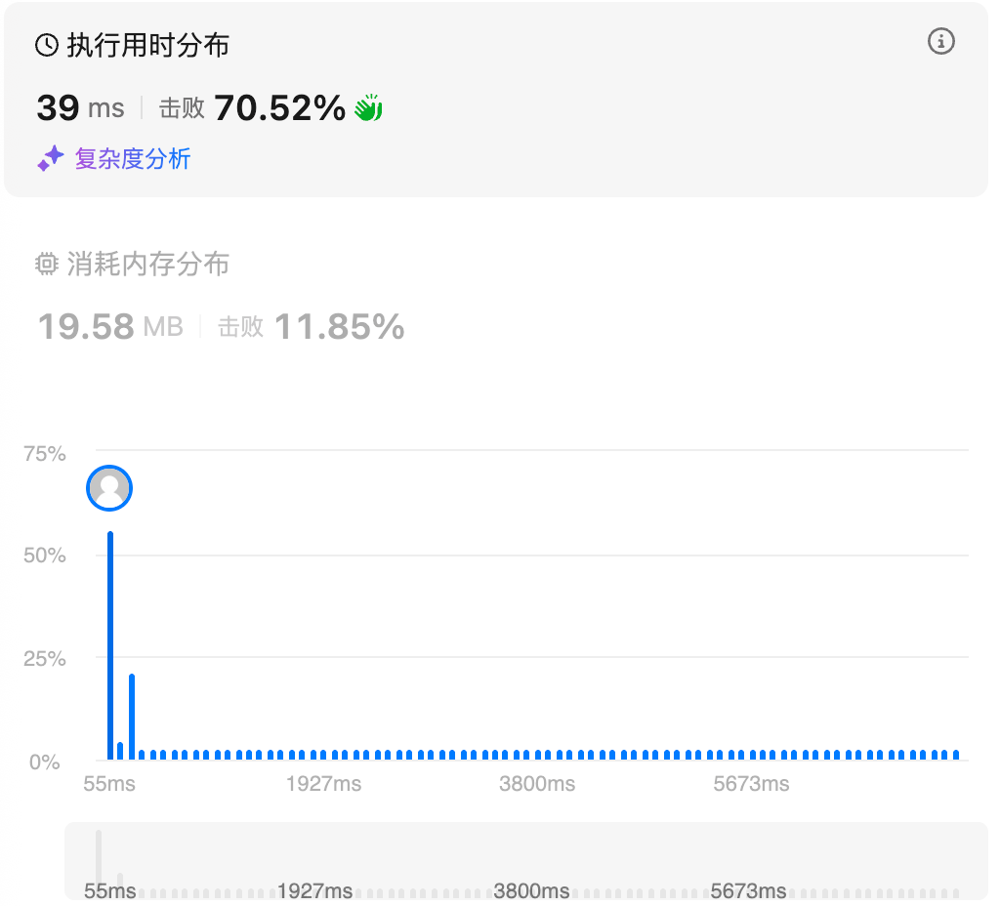

# 3.无重复字符的最长子串（中等）

## 题目描述

给定一个字符串 `s` ，请你找出其中不含有重复字符的 **最长 子串** 的长度。

 

**示例 1:**

```
输入: s = "abcabcbb"
输出: 3 
解释: 因为无重复字符的最长子串是 "abc"，所以其长度为 3。注意 "bca" 和 "cab" 也是正确答案。
```

**示例 2:**

```
输入: s = "bbbbb"
输出: 1
解释: 因为无重复字符的最长子串是 "b"，所以其长度为 1。
```

**示例 3:**

```
输入: s = "pwwkew"
输出: 3
解释: 因为无重复字符的最长子串是 "wke"，所以其长度为 3。
     请注意，你的答案必须是 子串 的长度，"pwke" 是一个子序列，不是子串。
```

 

**提示：**

- `0 <= s.length <= 5 * 104`
- `s` 由英文字母、数字、符号和空格组成

## 我的Python解答

最开始看错题了，以为要返回的是最长子串的数目，所以想到双指针模拟滑动窗口外加一个哈希表去重，后来提交了一下发现了这个问题，就删掉了哈希表

```python
class Solution:
    def lengthOfLongestSubstring(self, s: str) -> int:
        # 说白了应该是双指针移动，是一个动态的滑动窗口
        if len(s)<=1:
            return len(s)
        max_len = 0 # 最长字串长度
        list_s = list(s) # 可以先把字符串转list
        n = len(list_s)
        for i in range(0,n):
            # 左指针，表示窗口的开始
            for j in range(i+1,n):
                if list_s[j] in s[i:j]: # 已经有重复的，所以只有s[i:j]
                    if j-i>max_len:
                        max_len = j-i
                    break
        return max_len
```

第一次提交的错误是因为没有及时更新max_len的值，如果本体就是最长子串，那么返回的结果实际上是0，修改一下，就是多了个else，及时更新max_len

```python
class Solution:
    def lengthOfLongestSubstring(self, s: str) -> int:
        # 说白了应该是双指针移动，是一个动态的滑动窗口
        if len(s)<=1:
            return len(s)
        max_len = 0 # 最长字串长度
        list_s = list(s) # 可以先把字符串转list
        n = len(list_s)
        for i in range(0,n):
            # 左指针，表示窗口的开始
            for j in range(i+1,n):
                if list_s[j] in s[i:j]: # 已经有重复的，所以只有s[i:j]
                    if j-i>max_len:
                        max_len = j-i
                    break
                else:
                    max_len = max(max_len,j-i+1)
        return max_len
```

结果：



（其实上面写的还是有问题的，访问元素用的list_s，后面的in又用的原始的s字符串，这是个坏习惯）

似乎可以优化的点：对j的开始应该是从i+max_len，如果这样修改，就还要判断滑动窗口内部有没有重复元素，如果有的话就继续i++

更进一步，因为s[j]在s[i:j]中，所以下一个i应该从s[j]的相同元素出发，j还是从i+1开始

```python
class Solution:
    def lengthOfLongestSubstring(self, s: str) -> int:
        # 说白了应该是双指针移动，是一个动态的滑动窗口
        if len(s)<=1:
            return len(s)
        max_len = 1 # 最长字串长度
        n = len(s)
        i = 0
        while i<n:
            # 左指针，表示窗口的开始
            for j in range(i+1,n):
                if s[j] in s[i:j]: # 已经有重复的，所以只有s[i:j]
                    pos = s[i:j].index(s[j])
                    i = i+pos
                    if j-i>max_len:
                        max_len = j-i
                    break
                else:
                    max_len = max(max_len,j-i+1)
            i = i+1
        return max_len
```

结果：



## Python参考答案

方法1:哈希表

```python
class Solution:
    def lengthOfLongestSubstring(self, s: str) -> int:
        ans = left = 0
        cnt = defaultdict(int)  # 维护从下标 left 到下标 right 的字符及其出现次数
        for right, c in enumerate(s):
            cnt[c] += 1
            while cnt[c] > 1:  # 窗口内有重复字母
                cnt[s[left]] -= 1  # 移除窗口左端点字母
                left += 1  # 缩小窗口
            ans = max(ans, right - left + 1)  # 更新窗口长度最大值
        return ans
```

方法2:哈希集合

```python
class Solution:
    def lengthOfLongestSubstring(self, s: str) -> int:
        ans = left = 0
        window = set()  # 维护从下标 left 到下标 right 的字符
        for right, c in enumerate(s):
            # 如果窗口内已经包含 c，那么再加入一个 c 会导致窗口内有重复元素
            # 所以要在加入 c 之前，先移出窗口内的 c
            while c in window:  # 窗口内有 c
                window.remove(s[left])
                left += 1  # 缩小窗口
            window.add(c)  # 加入 c
            ans = max(ans, right - left + 1)  # 更新窗口长度最大值
        return ans
```

## Python收获


# 438.找到字符串中所有字母异位词（中等）

## 题目描述

给定两个字符串 `s` 和 `p`，找到 `s` 中所有 `p` 的 **异位词** 的子串，返回这些子串的起始索引。不考虑答案输出的顺序。

 

**示例 1:**

```
输入: s = "cbaebabacd", p = "abc"
输出: [0,6]
解释:
起始索引等于 0 的子串是 "cba", 它是 "abc" 的异位词。
起始索引等于 6 的子串是 "bac", 它是 "abc" 的异位词。
```

 **示例 2:**

```
输入: s = "abab", p = "ab"
输出: [0,1,2]
解释:
起始索引等于 0 的子串是 "ab", 它是 "ab" 的异位词。
起始索引等于 1 的子串是 "ba", 它是 "ab" 的异位词。
起始索引等于 2 的子串是 "ab", 它是 "ab" 的异位词。
```

 

**提示:**

- `1 <= s.length, p.length <= 3 * 104`
- `s` 和 `p` 仅包含小写字母

## 我的解答

整体思路是使用哈希表来实现，因为哈希表不管元素的排列，可以直接进行 == 运算，所以只需要存入窗口内元素的哈希表结果，直接和target对比即可，如果匹配的上，ans直接添加一个left元素

```python
class Solution:
    def findAnagrams(self, s: str, p: str) -> List[int]:
        if len(p) > len(s):
            return []
        window = len(p) # 窗口大小，只有窗口内元素一致，才返回开始的index
        hash_map = defaultdict(int) # 还是要有一个哈希表
        target_hash_map = defaultdict(int)
        ans = []
        for c in p:
            target_hash_map[c] += 1
        for i in range(window-1):
            hash_map[s[i]] += 1
        for right in range(window-1, len(s)):
            # 定位右边界,整体左闭右闭
            hash_map[s[right]] += 1
            if hash_map == target_hash_map:
                ans.append(right-window+1)
            if hash_map[s[right-window+1]] == 1:
                # hash_map.remove(right-window+1)
                del hash_map[s[right-window+1]]
            else:
                hash_map[s[right-window+1]] -= 1
        return ans
```

结果：



## 参考答案

方法1:定长滑动窗口

用滑动窗口枚举 s 的所有长为 n 的子串 t。在滑的同时，维护 t 的每种字母的出现次数。

如果 t 的每种字母的出现次数，和 p 的每种字母的出现次数都相同，那么 t 是 p 的异位词，把 t 左端点下标加入答案。

```python
class Solution:
    def findAnagrams(self, s: str, p: str) -> List[int]:
        cnt_p = Counter(p)  # 统计 p 的每种字母的出现次数
        cnt_s = Counter()  # 统计 s 的长为 len(p) 的子串 t 的每种字母的出现次数
        ans = []

        for right, c in enumerate(s):
            cnt_s[c] += 1  # 右端点字母进入窗口

            left = right - len(p) + 1
            if left < 0:  # 窗口长度不足 len(p)
                continue

            if cnt_s == cnt_p:  # t 和 p 的每种字母的出现次数都相同
                ans.append(left)  # t 左端点下标加入答案

            cnt_s[s[left]] -= 1  # 左端点字母离开窗口

        return ans
```

复杂度分析
时间复杂度：O(∣Σ∣m+n)，其中 m 是 s 的长度，n 是 p 的长度，∣Σ∣=26 是字符集合的大小。
空间复杂度：O(∣Σ∣)。返回值不计入

方法2:不定长滑动窗口

枚举子串 t 的右端点，如果发现 t 其中一种字母的出现次数大于 p 的这种字母的出现次数，则右移 t 的左端点（缩小窗口）。如果发现 t 的长度等于 p 的长度，则说明 t 的每种字母的出现次数，等于 p 的每种字母的出现次数，即 t 是 p 的异位词。

证明：内层循环结束后，t 的每种字母的出现次数，都小于等于 p 的每种字母的出现次数。如果 t 的其中一种字母的出现次数比 p 的小，那么 t 的长度必然小于 p 的长度。所以只要 t 的长度等于 p 的长度，就说明 t 的每种字母的出现次数，和 p 的每种字母的出现次数都相同，t 是 p 的异位词，把 t 左端点下标加入答案。

代码实现时，可以把 cntS 和 cntP 合并成一个 cnt：

对于 p 的字母 c，把 cnt[p] 加一。
对于 t 的字母 c，把 cnt[c] 减一。
如果 cnt[c]<0，说明窗口中的字母 c 的个数比 p 的多，右移左端点。
答疑
问：为什么只需判断字母 c 的出现次数？

答：字母 c 进入窗口后，如果导致 cnt[c]<0，由于其余字母的出现次数没有变化，所以有且仅有字母 c 的个数比 p 的多。

```python
class Solution:
    def findAnagrams(self, s: str, p: str) -> List[int]:
        cnt = Counter(p)  # 统计 p 的每种字母的出现次数
        ans = []

        left = 0
        for right, c in enumerate(s):
            cnt[c] -= 1  # 右端点字母进入窗口
            while cnt[c] < 0:  # 字母 c 太多了
                cnt[s[left]] += 1  # 左端点字母离开窗口
                left += 1
            if right - left + 1 == len(p):  # t 和 p 的每种字母的出现次数都相同（证明见上）
                ans.append(left)  # t 左端点下标加入答案

        return ans
```

复杂度分析
时间复杂度：O(m+n)，其中 m 是 s 的长度，n 是 p 的长度。虽然写了个二重循环，但是内层循环中对 left 加一的总执行次数不会超过 m 次，所以滑窗的时间复杂度为 O(m)。
空间复杂度：O(∣Σ∣)，其中 ∣Σ∣=26 是字符集合的大小。返回值不计入。

## 收获

### python常用数据类型的增删改查

#### **一、str（字符串，immutable）**

str 是**不可变的字符序列**，任何“修改”本质上都会创建新对象。

查

可以通过索引、切片、成员判断、方法查询内容

```
s = "hello"
s[0]
s[1:4]
"h" in s
s.find("ll")
s.count("l")
```

增

字符串不能原地增加，只能通过拼接生成新字符串

```
s2 = s + " world"
s3 = "".join([s, " world"])
```

删

不存在真正的删除字符操作，只能通过切片“绕过”

```
s2 = s[:1] + s[2:]
```

改

不能修改单个字符，只能整体替换

```
s2 = s.replace("l", "x")
```

要点

str 的“增删改”全是**新建字符串**，适合只读文本，不适合频繁修改。

#### **二、list（列表，mutable，有序）**

list 是**最灵活、最常用**的可变序列。

查

```
a = [1, 2, 3]
a[0]
a[-1]
a[1:3]
2 in a
len(a)
```

增

```
a.append(4)
a.extend([5, 6])
a.insert(1, 10)
```

删

```
a.pop()
a.pop(1)
a.remove(2)
del a[0]
a.clear()
```

改

```
a[0] = 100
a[1:3] = [7, 8]
```

要点

- append / pop 尾部操作快
- remove 是线性搜索
- 适合顺序数据和频繁修改

#### **三、tuple（元组，immutable，有序）**

tuple 是**不可变列表**，多用于固定结构数据。

查

```
t = (1, 2, 3)
t[0]
t[1:]
2 in t
```

增 / 删 / 改

不支持，所有操作都要新建

```
t2 = t + (4,)
```

要点

- 不可变
- 可作为 dict 的 key
- 常用于函数返回值、结构化记录

#### **四、set（集合，mutable，无序，去重）**

set 是基于哈希表的无序集合，强调“存在性”和“集合运算”。

查

```
s = {1, 2, 3}
2 in s
len(s)
```

增

```
s.add(4)
s.update([5, 6])
```

删

```
s.remove(2)    # 不存在会报错
s.discard(2)   # 不存在不报错
s.pop()        # 随机删除
s.clear()
```

改

集合中元素不可修改，只能删后再加。

要点

- 成员判断 O(1)
- 无序
- 非常适合去重、交并差运算

#### **五、frozenset（不可变集合）**

frozenset 是 set 的不可变版本。

查

```
fs = frozenset([1, 2, 3])
1 in fs
```

增 / 删 / 改

全部不支持，只能生成新对象。

要点

- 可作为 dict key
- 用于“集合本身需要可哈希”的场景

#### **六、dict（字典，mutable，key 唯一）**

dict 是 Python 中**最核心的数据结构**之一，基于哈希表。

查

```
d = {"a": 1, "b": 2}
d["a"]
d.get("c")
"a" in d
d.keys()
d.values()
d.items()
```

增

```
d["c"] = 3
d.update({"d": 4})
```

改

```
d["a"] = 100
```

删

```
del d["a"]
d.pop("b")
d.pop("x", None)
d.clear()
```

要点

- key 必须可哈希
- 查找、插入、删除平均 O(1)
- 3.7+ 保证插入顺序

#### **七、defaultdict（dict 的子类，自动初始化）**

defaultdict 用来**避免“先判断 key 是否存在”的模板代码**。

查

```
from collections import defaultdict
d = defaultdict(list)
d["x"]          # 返回空 list，并写入
```

增 / 改

```
d["a"].append(1)
d["a"].append(2)
```

删

和 dict 完全一致

```
del d["a"]
```

要点

- 访问不存在的 key 会**自动创建**
- 适合统计、分组、聚合
- 不适合“只读查询”

#### **八、Counter（计数器，本质是 dict）**

Counter 是 defaultdict(int) 的语义化版本。

查

```
from collections import Counter
c = Counter("ababc")
c["a"]
```

增 / 改

```
c["a"] += 1
c.update("ccc")
```

删

```
del c["b"]
```

要点

- 专为计数设计
- 可直接做加减、交并操作

#### **九、deque（双端队列）**

deque 适合**头尾高效操作**。

查

```
from collections import deque
q = deque([1, 2, 3])
q[0]
```

增

```
q.append(4)
q.appendleft(0)
```

删

```
q.pop()
q.popleft()
```

改

```
q[1] = 10
```

要点

- 头尾操作 O(1)
- 比 list 更适合队列、滑动窗口

#### **十、bytes / bytearray（二进制数据）**

bytes 是不可变，bytearray 是可变。

查

```
b = b"abc"
b[0]
```

增 / 删 / 改

bytes 不支持

```
ba = bytearray(b"abc")
ba[0] = 100
ba.append(101)
```

要点

- 网络、文件、加密常用
- bytearray 用于原地修改

#### **十一、NoneType**

None 只有一个值：None。

查

```
x is None
```

增 / 删 / 改

不存在

要点

- 表示“无值 / 缺失 / 未初始化”

#### 十二、bool（布尔）**

bool 是 int 的子类。

查

```
True and False
```

增 / 删 / 改

不可变

要点

- True == 1, False == 0
- 主要用于条件判断

#### **十三、数值类型（int / float）**

数值类型是不可变的。

查

```
x + 1
x * 2
```

改

```
x = x + 1
```

要点

- 不可变
- 修改就是重新绑定

#### **十四、一个总览对照表（核心记忆）**

| **类型**    | **是否可变** | **是否有序** | **是否可哈希** | **典型用途** |
| ----------- | ------------ | ------------ | -------------- | ------------ |
| str         | 否           | 是           | 是             | 文本         |
| list        | 是           | 是           | 否             | 顺序数据     |
| tuple       | 否           | 是           | 是             | 结构化记录   |
| set         | 是           | 否           | 否             | 去重、集合   |
| frozenset   | 否           | 否           | 是             | 不可变集合   |
| dict        | 是           | 是           | 否             | 映射         |
| defaultdict | 是           | 是           | 否             | 分组统计     |
| Counter     | 是           | 是           | 否             | 计数         |
| deque       | 是           | 是           | 否             | 队列         |
| bytes       | 否           | 是           | 是             | 二进制       |
| bytearray   | 是           | 是           | 否             | 可变二进制   |


#### **十五、总结性理解**

Python 的数据类型可以从三个维度理解：

第一，**是否可变**（决定能不能原地改）；

第二，**是否有序**（决定能不能用索引、切片）；

第三，**是否基于哈希**（决定查找效率和可否作为 key）。


真正写得好的 Python 代码，往往不是“会用所有类型”，而是**在合适的地方用合适的数据结构**。

### **Python 常用数据类型增删改查关键词总表**

| **数据类型**    | **查（查询/访问）**                          | **增（添加）**                  | **删（删除）**                          | **改（修改）**         |
| --------------- | -------------------------------------------- | ------------------------------- | --------------------------------------- | ---------------------- |
| **str**         | in, [], [:], .find(), .count()               | +, .join()                      | 切片重组                                | .replace()（生成新串） |
| **list**        | in, [], [:], .index()                        | .append(), .extend(), .insert() | .pop(), .remove(), del, .clear()        | []= , [:] =            |
| **tuple**       | in, [], [:], .index(), .count()              | 重新构造 +                      | 不支持                                  | 不支持                 |
| **set**         | in, len()                                    | .add(), .update()               | .remove(), .discard(), .pop(), .clear() | 不支持（删后再加）     |
| **frozenset**   | in, len()                                    | 不支持                          | 不支持                                  | 不支持                 |
| **dict**        | in, [], .get(), .keys(), .values(), .items() | d[k]=v, .update()               | del, .pop(), .clear()                   | d[k]=new_v             |
| **defaultdict** | in, []（自动建值）                           | 自动创建 + 修改                 | del, .pop(), .clear()                   | 同 dict                |
| **Counter**     | [], .get()                                   | +=, .update()                   | del, .subtract()                        | +=, -=                 |
| **deque**       | [], len()                                    | .append(), .appendleft()        | .pop(), .popleft(), .clear()            | []=                    |
| **bytes**       | in, [], [:]                                  | 不支持                          | 不支持                                  | 不支持                 |
| **bytearray**   | in, [], [:]                                  | .append(), .extend()            | .pop(), del, .clear()                   | []=                    |
| **int / float** | 数值运算                                     | 不支持                          | 不支持                                  | 重新赋值               |
| **bool**        | 逻辑运算                                     | 不支持                          | 不支持                                  | 重新赋值               |
| **NoneType**    | is None                                      | 不支持                          | 不支持                                  | 不支持                 |

#### **三个非常重要的速记原则**

1️⃣ **是否可变，决定“能不能原地改”**

- 不可变：str, tuple, int, float, bytes
- 可变：list, set, dict, deque, bytearray

2️⃣ **是否基于哈希，决定是否支持 in 的 O(1) 查询**

- 哈希结构：set, dict, defaultdict, Counter
- 非哈希顺序结构：list, tuple, deque

3️⃣ **in 的语义不同**

- list / tuple：线性查找
- set / dict：哈希查找
- dict 中：in 查的是 **key**

#### **一个极简“记忆版”**

- **顺序 + 可改** → list
- **顺序 + 不可改** → tuple / str
- **去重 + 查快** → set
- **键值映射** → dict
- **统计计数** → Counter
- **自动初始化映射** → defaultdict
- **队列 / 双端** → deque

### Python中的Counter

#### **一、Counter 的本质与定位**

Counter 位于 collections 模块中，是 **dict 的一个子类**，专门用于“计数”场景。它的核心语义是：

**key 表示元素，value 表示该元素出现的次数（计数值，整数）**。

从数据结构角度看，Counter 并没有引入新的底层机制，它仍然是基于哈希表实现的映射结构；从语义角度看，它对“计数”这一高频模式进行了标准化和增强。

换句话说，Counter 可以被理解为：

一个“自带计数语义和集合运算能力的字典”。

#### **二、Counter 的创建方式**

最常见的创建方式是直接从可迭代对象构造：

```
from collections import Counter

c = Counter("ababc")
```

此时结果等价于：

```
{'a': 2, 'b': 2, 'c': 1}
```

也可以从列表、元组等构造：

```
Counter([1, 2, 2, 3])
```

可以从普通字典构造（视作初始计数）：

```
Counter({"a": 2, "b": 1})
```

还可以创建空 Counter：

```
Counter()
```

需要注意的是，**Counter 并不会限制 value 为非负数**，它允许 0 和负数存在，这一点在后续运算中非常重要。

#### **三、Counter 的“查”操作**

作为 dict 的子类，Counter 支持所有常规的查询方式。

使用下标访问：

```
c["a"]
```

如果 key 不存在，**不会抛出 KeyError，而是返回 0**，这是 Counter 与 dict 的一个关键差异。

```
c["not_exist"]   # 返回 0
```

也可以使用 get：

```
c.get("a", 0)
```

成员判断：

```
"a" in c
```

注意：

in 判断的是 key 是否存在，而不是计数是否大于 0。如果某个 key 的计数是 0，但仍在 Counter 中，那么 in 仍然返回 True。

#### **四、Counter 的“增”与“改”操作**

Counter 的核心操作就是“累加计数”。

最直接的方式是使用加法：

```
c["a"] += 1
c["b"] += 3
```

即使 key 原本不存在，也不会报错，因为不存在的 key 默认计数是 0。

可以批量更新：

```
c.update("abc")
c.update([1, 2, 2])
```

update 的语义是“加法更新”，而不是覆盖：

```
Counter("ab").update("a")
```

结果中 "a" 的计数会增加 1，而不是被替换。

#### **五、Counter 的“删”操作**

可以像 dict 一样使用 del：

```
del c["a"]
```

也可以手动把计数减到 0 或负数：

```
c["a"] -= 2
```

需要注意的是：

**Counter 不会自动删除计数为 0 或负数的 key**。

如果你希望清理这些元素，需要手动处理，例如：

```
c += Counter()   # 会移除计数 <= 0 的 key
```

这是一个常见但不直观的技巧。

#### **六、Counter 的核心增强能力：计数运算**

这是 Counter 相比 dict 最大的价值所在。

##### **1. 加法（合并计数）**

```
c1 = Counter("ab")
c2 = Counter("bc")

c1 + c2 # Counter({'b': 2, 'a': 1, 'c': 1})
```

结果是逐 key 相加，并且 **只保留正计数**。

##### **2. 减法（差分计数）**

```
c1 - c2 # Counter({'a': 1})
```

结果是逐 key 相减，同样只保留正计数。

##### **3. 交集（取最小值）**

```
c1 & c2 # Counter({'b': 1})
```

表示每个 key 的计数取 min。

##### **4. 并集（取最大值）**

```
c1 | c2 # Counter({'a': 1, 'b': 1, 'c': 1})
```

表示每个 key 的计数取 max。

这些运算使 Counter 在“多重集合（multiset）”语义下非常强大。

#### **七、最常用的高级接口**

##### **most_common**

用于返回计数最多的元素：

```
c = Counter([1,2,2,3,3,3,4,4,4,4,5,5,5,5,5])
c.most_common(3) # [(5, 5), (4, 4), (3, 3)]
```

返回一个按计数降序排列的 (key, count) 列表。

##### **elements**

将 Counter 还原为“元素流”：

```
list(c.elements()) # [1, 2, 2, 3, 3, 3, 4, 4, 4, 4, 5, 5, 5, 5, 5]
```

每个元素会重复出现 count 次（忽略 count <= 0 的元素）。

#### **八、Counter 与 defaultdict(int) 的区别**

虽然二者都能用于计数，但设计目标不同。

defaultdict(int)：

- 是“自动初始化为 0 的字典”
- 不理解“计数”语义
- 没有集合运算能力

Counter：

- 明确的“计数器”语义
- 不存在 key 时返回 0
- 支持加减、交并、排序、提取 top-k

可以认为：

**defaultdict(int) 是工具，Counter 是模型化抽象。**

#### **九、Counter 的时间复杂度特性**

由于底层仍是哈希表：

- 查询、更新单个元素：平均 O(1)
- update：O(n)
- most_common：O(n log n)（内部排序）

因此 Counter 非常适合中等到较大规模的统计任务。

#### **十、常见应用场景**

Counter 最典型的使用场景包括：

- 词频统计
- 日志事件统计
- 标签出现次数统计
- 多重集合操作
- Top-K 频率分析

在算法题中，Counter 常用于“频率对齐”“元素消耗”“可重集合比较”等问题。

#### **十一、容易踩的坑与注意事项**

第一，不要忘记 Counter 允许负数和 0，这可能导致逻辑错误。

第二，in 只判断 key 是否存在，不判断计数是否大于 0。

第三，update 是加法而不是赋值，和 dict.update 的语义不同。

第四，Counter 的加减运算会自动丢弃非正计数，而直接赋值不会。

#### **十二、总结**

Counter 是 Python 中一个高度工程化的数据结构，用于解决“计数”这一极其常见的问题。它在 dict 的基础上引入了清晰的计数语义、默认 0 行为以及多重集合运算能力，使得原本冗长、易错的计数逻辑变得简洁、可组合、可推理。理解 Counter 的行为边界与运算规则，可以显著提升代码的表达力与可靠性。