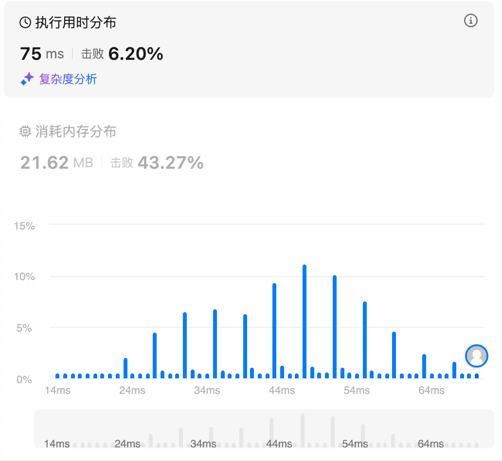
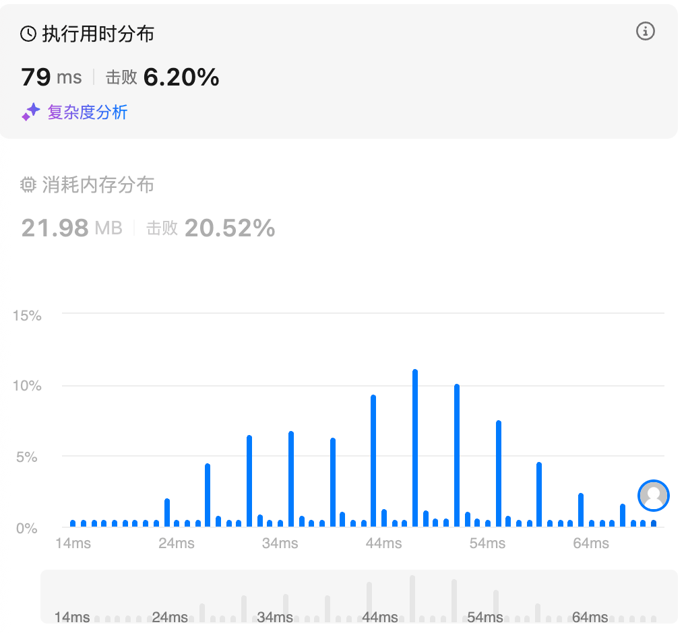

# 560.和为K的子数组（中等）

## 题目描述

给你一个整数数组 `nums` 和一个整数 `k` ，请你统计并返回 *该数组中和为 `k` 的子数组的个数* 。

子数组是数组中元素的连续非空序列。

 

**示例 1：**

```
输入：nums = [1,1,1], k = 2
输出：2
```

**示例 2：**

```
输入：nums = [1,2,3], k = 3
输出：2
```

 

**提示：**

- `1 <= nums.length <= 2 * 104`
- `-1000 <= nums[i] <= 1000`
- `-107 <= k <= 107`

## 我的Python解答

优先暴力，必然超时

```python
class Solution:
    def subarraySum(self, nums: List[int], k: int) -> int:
        ans = 0
        for i in range(len(nums)):
            for j in range(i+1,len(nums)+1):
                if k == sum(nums[i:j]):
                    ans += 1
        return ans
```

本质上是找sum(nums[i:j])，可以表征为sum[i:j] = sum[0:j] - sum[0:i]

所以构造一个哈希表和一个数组，数组记录从0号元素到当前元素的累加和（左右闭合），哈希表存储这个累加和的统计

从-1号元素，向后找k+sum[0:i+1]对应的元素的个数，所以对s_list错位一下最佳

```python
class Solution:
    def subarraySum(self, nums: List[int], k: int) -> int:
        ans = 0
        # sum[i:j] = sum[0:j] - sum[0:i]
        hash_map = defaultdict(int)
        s_list = [0]*len(nums)
        s = s_list[0] = nums[0]
        hash_map[s] += 1
        for i in range(1,len(nums)):
            s += nums[i]
            s_list[i] = s
            hash_map[s] += 1
        # 构建好哈希表之后就可以先找k
        if k in hash_map:
            ans += hash_map[k]
        # 其次是逐个查找 k+sum(nums[0:i])
        for i in range(len(nums)):
            # 在i后元素从s_list中找k+s_list[i]对应元素的个数
            hash_map[s_list[i]] -= 1
            if hash_map[s_list[i]] == 0:
                del hash_map[s_list[i]]
            if k+s_list[i] in hash_map:
                ans += hash_map[k+s_list[i]]
        return ans
```

结果：

 

整合一下：

```python
class Solution:
    def subarraySum(self, nums: List[int], k: int) -> int:
        ans = 0
        # sum[i:j] = sum[0:j] - sum[0:i]
        hash_map = defaultdict(int)
        s_list = [0]*(len(nums)+1)
        s = 0
        hash_map[0] += 1
        for i in range(len(nums)):
            s += nums[i]
            s_list[i+1] = s
            hash_map[s] += 1
        # 逐个查找 k+sum(nums[0:i])
        for i in range(len(nums)+1):
            # 在i后元素从s_list中找k+s_list[i]对应元素的个数
            hash_map[s_list[i]] -= 1
            if hash_map[s_list[i]] == 0:
                del hash_map[s_list[i]]
            if k+s_list[i] in hash_map:
                ans += hash_map[k+s_list[i]]
        return ans
```

结果：



## Python参考答案

两次遍历：

```python
class Solution:
    def subarraySum(self, nums: List[int], k: int) -> int:
        s = [0] * (len(nums) + 1)
        for i, x in enumerate(nums):
            s[i + 1] = s[i] + x

        cnt = defaultdict(int)
        ans = 0
        for sj in s:
            ans += cnt[sj - k]
            cnt[sj] += 1
        return ans
```

一次遍历：

```python
class Solution:
    def subarraySum(self, nums: List[int], k: int) -> int:
        cnt = defaultdict(int)
        cnt[0] = 1  # s[0]=0 单独统计
        ans = s = 0
        for x in nums:
            s += x
            ans += cnt[s - k]
            cnt[s] += 1
        return ans
```

```python
class Solution:
    def subarraySum(self, nums: List[int], k: int) -> int:
        cnt = defaultdict(int)
        ans = s = 0
        for x in nums:
            cnt[s] += 1
            s += x
            ans += cnt[s - k]
        return ans
```


## Python收获