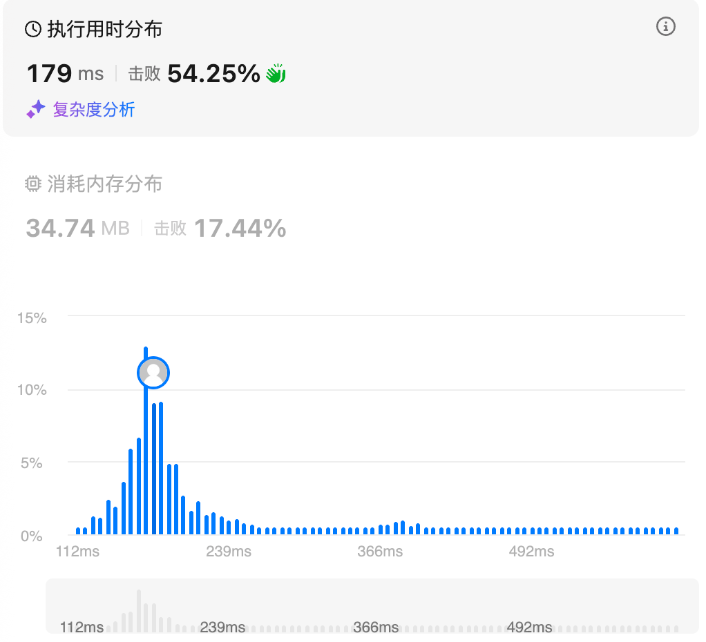

# 239.滑动窗口最大值（困难）

## 题目描述

给你一个整数数组 `nums`，有一个大小为 `k` 的滑动窗口从数组的最左侧移动到数组的最右侧。你只可以看到在滑动窗口内的 `k` 个数字。滑动窗口每次只向右移动一位。

返回 *滑动窗口中的最大值* 。

 

**示例 1：**

```
输入：nums = [1,3,-1,-3,5,3,6,7], k = 3
输出：[3,3,5,5,6,7]
解释：
滑动窗口的位置                最大值
---------------               -----
[1  3  -1] -3  5  3  6  7       3
 1 [3  -1  -3] 5  3  6  7       3
 1  3 [-1  -3  5] 3  6  7       5
 1  3  -1 [-3  5  3] 6  7       5
 1  3  -1  -3 [5  3  6] 7       6
 1  3  -1  -3  5 [3  6  7]      7
```

**示例 2：**

```
输入：nums = [1], k = 1
输出：[1]
```

 

**提示：**

- `1 <= nums.length <= 105`
- `-104 <= nums[i] <= 104`
- `1 <= k <= nums.length`

## 我的Python解答

下面是最初步的想法，后面自己否决了，因为不知道次元素的相关信息

```python
class Solution:
    def maxSlidingWindow(self, nums: List[int], k: int) -> List[int]:
        # 按理来说之间两个元素，一个记录max，一个记录当前窗口的左元素大小
        # 关键的是时间
        ans = []
        n = len(nums)
        if n==1:
            return nums
        # 开始的位置为i，先考虑第一个滑动窗口，维护max_pos和max
        max_pos = 0
        max_e = nums[0]
        for i in range(1,k):
            if nums[i] >= max_e:
                max_pos = i
                max_e = nums[i]
        ans.append(max_e)
        for i in range(1, n-k):
            # 每次只用比较最后一个元素和max_e
```

第二想法就是单调队列，但是具体的实现方式已经忘记，直接看答案。

## Python参考答案

就是一个单调队列，保证队列元素的递减，只有当前i>=k-1，也就是维护了一个滑动窗口之后，才记录答案；如何进入元素？因为要递减，那么q非空且最后元素（队列中的最小元素）不大于当前元素，那就弹出，直到保证插入元素后队列递减。插入的是index，方便判断是否记录过。所以超过窗口的初始值，就popleft

```python
class Solution:
    def maxSlidingWindow(self, nums: List[int], k: int) -> List[int]:
        ans = []
        q = deque()
        for i, x in enumerate(nums):
            # 1.入元素
            while q and nums[q[-1]] <= x:
                q.pop()
            q.append(i)
            # 2.出元素
            if i-q[0] >= k:
                q.popleft()
            # 3.记录答案，只有i在k-1及以后才记录答案
            if i>=k-1:
                ans.append(nums[q[0]])
        return ans
```

结果：



## Python收获

### python中的队列

#### **一、什么是队列（Queue）的核心抽象**

队列是一种**先进先出（FIFO, First-In First-Out）的数据结构，其基本约束是：元素只能从队尾进入（入队），只能从队头移除（出队）。最早进入队列的元素，最先被取出。队列的核心价值在于顺序性与公平性**，在任务调度、消息传递、缓冲区管理等场景中非常常见。与栈（LIFO）不同，队列强调的是“先来先服务”。

#### **二、Python 中“队列”的多种实现方式总览**

Python 并没有一个唯一的“队列类型”，而是根据使用场景提供了多种实现方案。最常见的有四类：使用 list 模拟队列、使用 collections.deque、使用 queue.Queue（线程安全）、使用 asyncio.Queue（异步场景）。它们在操作方式、性能特征和适用场景上有明显差异，理解这些差异比记 API 更重要。

#### **三、使用 list 实现队列（不推荐用于高频出队）**

list 是最直观但也是最容易误用的队列实现。其典型做法是：尾部 append 入队，头部 pop(0) 出队。操作方式如下：

```
q = []
q.append(1)
q.append(2)
x = q.pop(0)
```

入队 append 的时间复杂度是 O(1)，但出队 pop(0) 的时间复杂度是 O(n)，因为所有后续元素都需要整体前移。因此，当队列规模较大或出队操作频繁时，list 会产生明显性能问题。list 更适合“偶尔当队列用”的轻量场景，不适合严肃的队列需求。

#### **四、collections.deque：Python 中最常用的队列实现**

deque（double-ended queue，双端队列）位于 collections 模块中，是 Python 官方为队列和双端操作优化的数据结构。deque 底层并非连续数组，而是块状链表结构，因此在两端的插入和删除操作都具有 O(1) 时间复杂度。

基本创建与查询操作如下：

```
from collections import deque
q = deque()
len(q)
```

入队与出队操作：

```
q.append(1)       # 右端入队
q.append(2)
x = q.popleft()   # 左端出队
```

deque 还支持反向操作，使其既能作为队列也能作为栈：

```
q.appendleft(0)
q.pop()
```

deque 支持索引访问（q[0]），但这是 O(n) 操作，因此不应将 deque 当作随机访问容器使用。deque 的核心优势在于：高效、语义明确、线程安全性由调用方控制，是**单线程或轻量并发场景下的首选队列结构**。

#### **五、queue.Queue：线程安全队列**

queue.Queue 位于 queue 模块中，是为**多线程环境**设计的队列实现。它在内部通过锁机制保证并发安全，并提供阻塞式的入队和出队接口。创建方式如下：

```
from queue import Queue
q = Queue(maxsize=10)
```

基本操作：

```
q.put(item)        # 入队，队列满时阻塞
x = q.get()        # 出队，队列空时阻塞
```

附加的控制方法：

```
q.put_nowait(item)
q.get_nowait()
q.empty()
q.full()
q.qsize()
```

queue.Queue 的一个重要特性是**生产者-消费者模型支持**，它常与多线程配合使用，例如任务队列、工作池。需要注意的是，queue.Queue 不支持索引访问，也不暴露底层存储结构，其设计目标是“安全而非灵活”。

#### **六、asyncio.Queue：异步队列**

asyncio.Queue 是为 Python 的异步编程模型（async/await）设计的队列，用于协程之间的通信。其 API 风格与 queue.Queue 类似，但所有阻塞操作都变成了 await 形式。基本使用方式如下：

```
import asyncio
q = asyncio.Queue()
await q.put(item)
x = await q.get()
```

asyncio.Queue 的核心作用是在事件循环中协调生产者与消费者协程，它不会使用线程锁，而是依赖事件循环调度，因此只适用于异步上下文。

#### **七、队列的核心操作语义总结（增删改查）**

从抽象角度看，所有队列都围绕四类操作展开。

查：查看队列长度（len / qsize），判断是否为空（len==0 / empty），但通常不支持随机访问。

增：入队操作（append / put），语义是“加入队尾”。

删：出队操作（popleft / get），语义是“移除队头”。

改：严格意义上的队列不支持中间修改元素，若需要修改，说明该结构可能并不适合用队列建模。

队列的设计哲学是**限制操作能力以换取行为确定性**。

#### **八、不同队列实现的性能与适用场景对比**

list：入队快，出队慢，仅适合极小规模或教学示例。

deque：入队出队都快，API 简洁，是最常用的通用队列实现。

queue.Queue：线程安全，支持阻塞，适合多线程任务调度。

asyncio.Queue：协程安全，适合异步程序，不可用于普通同步代码。

选择队列实现时，首先要问的是：是否需要线程/协程安全，其次才是性能与功能。

#### **九、队列在实际编程中的典型应用**

队列广泛用于广度优先搜索（BFS）、生产者-消费者模型、任务调度系统、消息缓冲、IO 管道、并发任务池等场景。在这些问题中，FIFO 顺序不是“实现细节”，而是问题语义本身的一部分，因此使用队列能够让代码结构更贴合问题模型。

#### **十、常见误区与注意事项**

第一，不要用 list 的 pop(0) 实现高频出队，这是性能陷阱。第二，不要在需要线程安全的场景中直接使用 deque 或 list。第三，如果你频繁想“查看或修改队列中间的元素”，说明你真正需要的可能不是队列，而是 list、heap 或其他数据结构。第四，队列的“简单”来自于操作受限，滥用会破坏这种简洁性。

#### **十一、总结**

Python 中的队列不是单一类型，而是一组围绕 FIFO 抽象构建的数据结构与工具。deque 是最通用、最推荐的同步队列实现；queue.Queue 是并发场景下的安全选择；asyncio.Queue 服务于异步编程模型。理解队列的操作边界与适用场景，能够帮助你在算法设计与工程实践中做出更合理的数据结构选择，从而写出更清晰、更高效的代码。