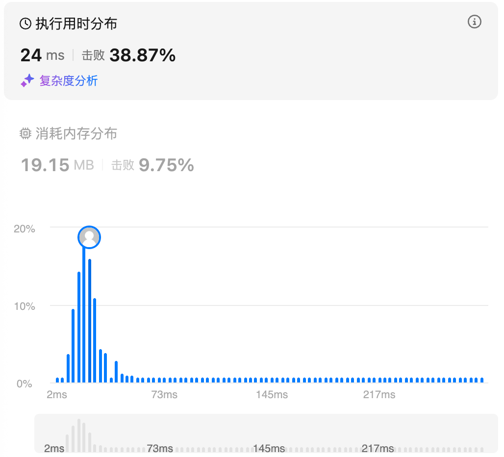
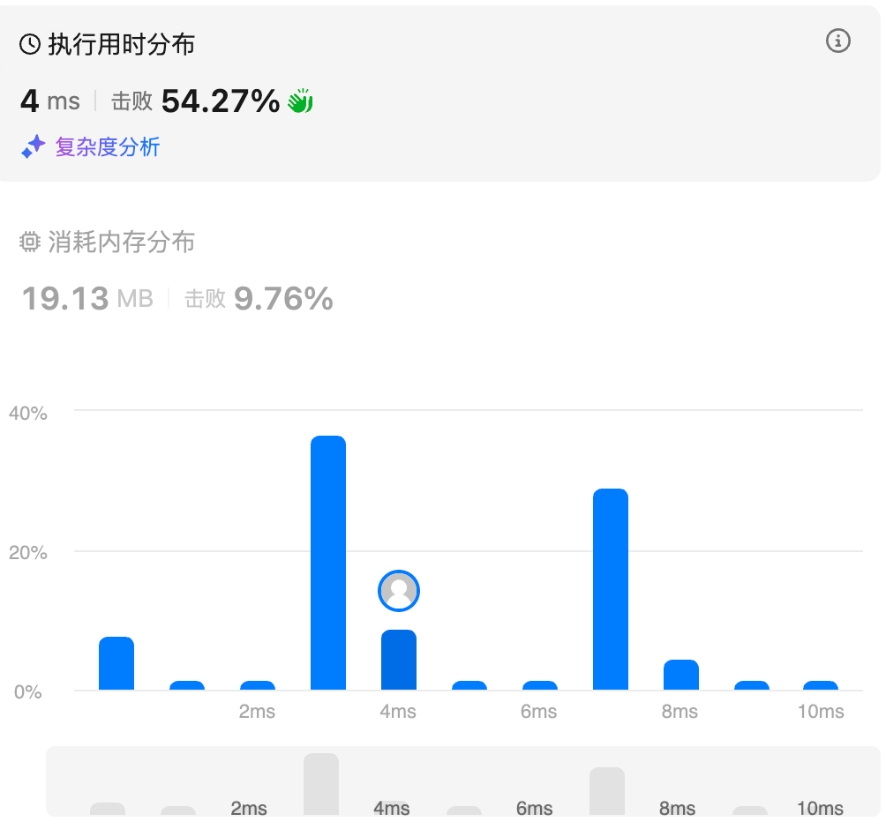
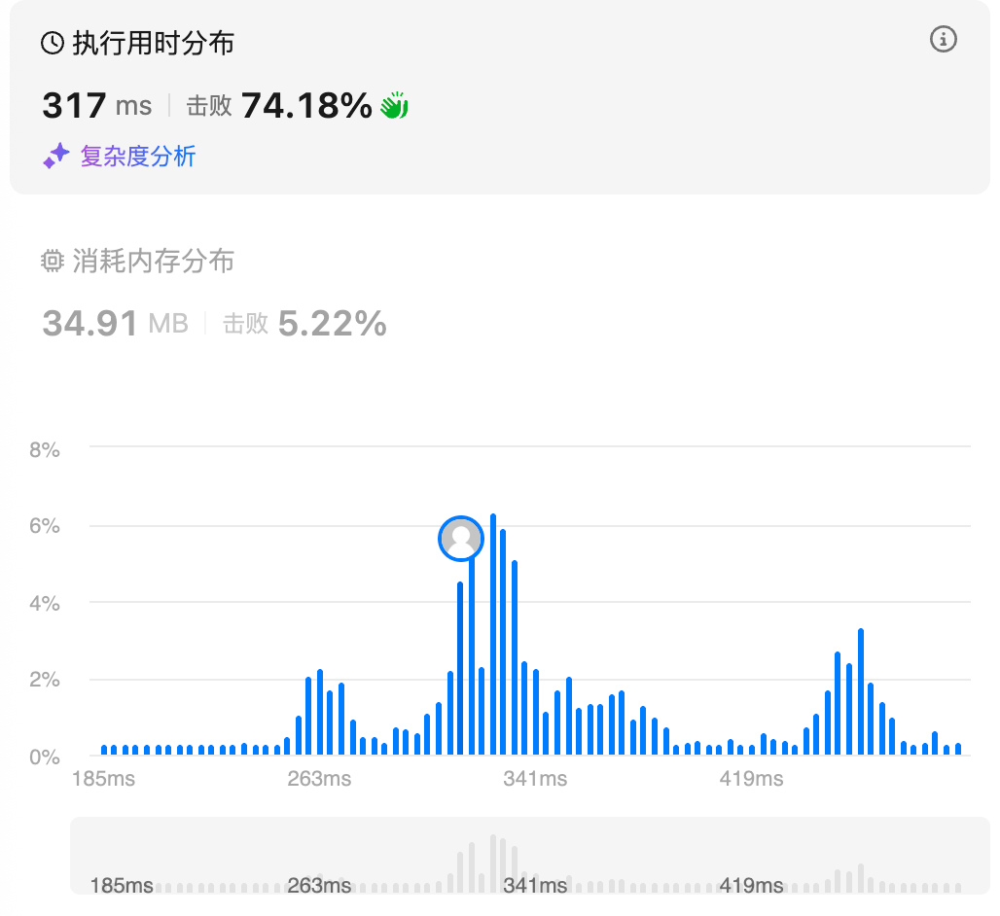
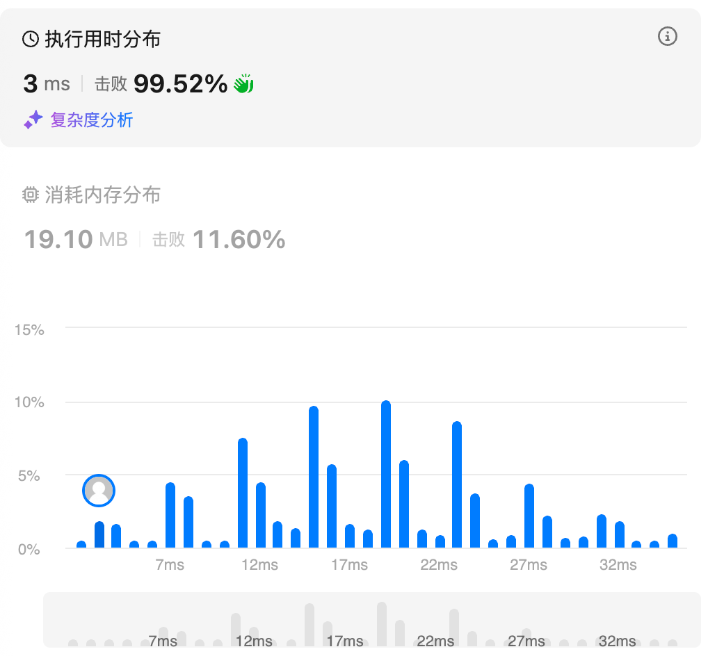
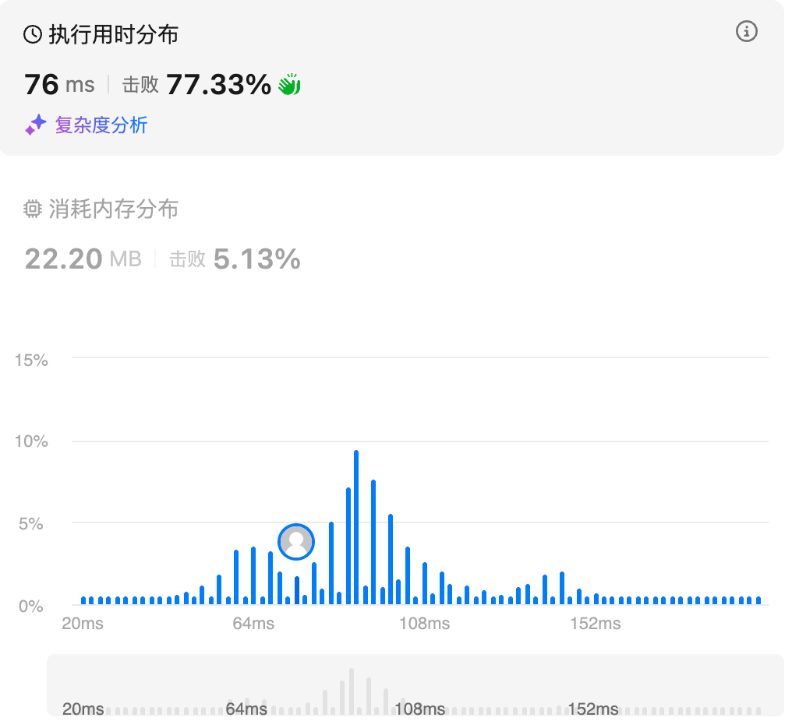
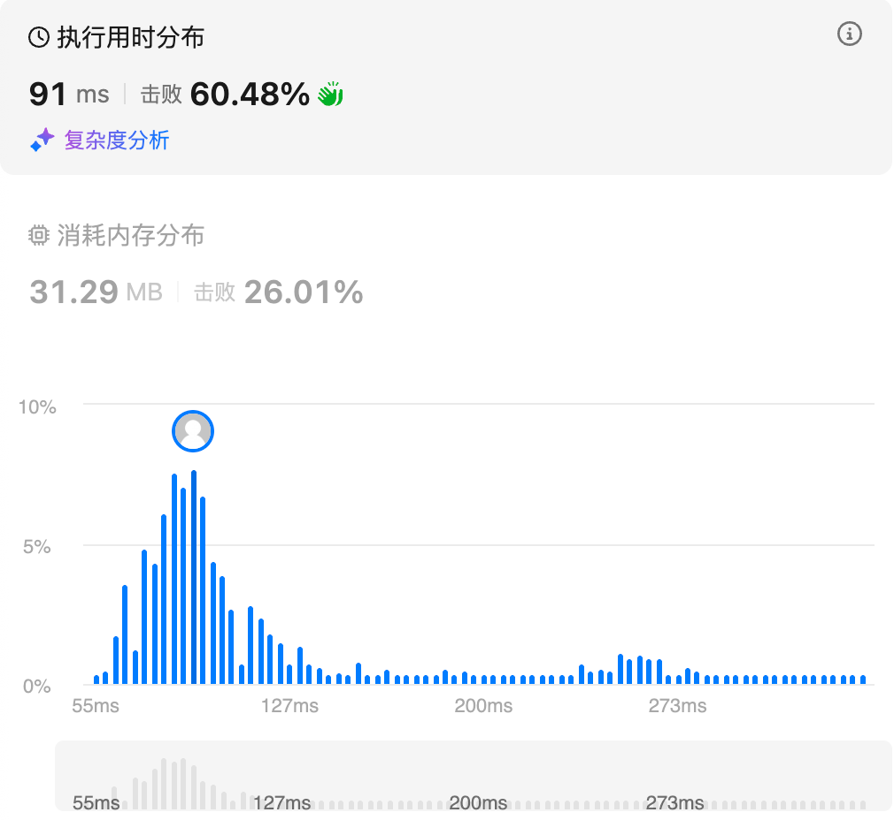

# 713.乘积小于k的子数组（中等）

## 题目描述

给你一个整数数组 `nums` 和一个整数 `k` ，请你返回子数组内所有元素的乘积严格小于 `k` 的连续子数组的数目。

 

**示例 1：**

```
输入：nums = [10,5,2,6], k = 100
输出：8
解释：8 个乘积小于 100 的子数组分别为：[10]、[5]、[2]、[6]、[10,5]、[5,2]、[2,6]、[5,2,6]。
需要注意的是 [10,5,2] 并不是乘积小于 100 的子数组。
```

**示例 2：**

```
输入：nums = [1,2,3], k = 0
输出：0
```

 

**提示:** 

- `1 <= nums.length <= 3 * 104`
- `1 <= nums[i] <= 1000`
- `0 <= k <= 106`

## 我的Python解答

```python
class Solution:
    def numSubarrayProductLessThanK(self, nums: List[int], k: int) -> int:
        if k<=1:
            return 0
        ans = 0
        cur = 1
        left = 0
        # 固定右端点
        for right, x in enumerate(nums):
            cur *= x
            while cur >= k and left<=right:
                # 缩小左端点
                cur /= nums[left]
                left += 1
            n = right-left+1
            ans += n
        return ans
```

滑动窗口问题，一般来说都是扩大右端点，缩小左端点，枚举右端点，在枚举的过程中缩小左端点

## Python参考答案


## Python收获


# 3.无重复字符的最长子串（中等）

## 题目描述

给定一个字符串 `s` ，请你找出其中不含有重复字符的 **最长 子串** 的长度。

 

**示例 1:**

```
输入: s = "abcabcbb"
输出: 3 
解释: 因为无重复字符的最长子串是 "abc"，所以其长度为 3。注意 "bca" 和 "cab" 也是正确答案。
```

**示例 2:**

```
输入: s = "bbbbb"
输出: 1
解释: 因为无重复字符的最长子串是 "b"，所以其长度为 1。
```

**示例 3:**

```
输入: s = "pwwkew"
输出: 3
解释: 因为无重复字符的最长子串是 "wke"，所以其长度为 3。
     请注意，你的答案必须是 子串 的长度，"pwke" 是一个子序列，不是子串。
```

 

**提示：**

- `0 <= s.length <= 5 * 104`
- `s` 由英文字母、数字、符号和空格组成

## 我的解答

哈希表记录是否有重复元，遍历右端点，逐渐删除左端点元素的哈希值，直到删除了重复元素

```python
class Solution:
    def lengthOfLongestSubstring(self, s: str) -> int:
        left = 0
        ans = 0
        hash_map = defaultdict(int)
        for right, c in enumerate(s):
            while hash_map[c] > 0 and left<=right:
                del hash_map[s[left]]
                left += 1
            hash_map[c] += 1
            ans = max(ans, len(hash_map))
        return ans
```

结果：



# 3090.每个字符最多出现两次的最长子字符串

## 题目描述

给你一个字符串 `s` ，请找出满足每个字符最多出现两次的最长子字符串，并返回该子字符串的 **最大** 长度。

 

**示例 1：**

**输入：** s = "bcbbbcba"

**输出：** 4

**解释：**

以下子字符串长度为 4，并且每个字符最多出现两次：`"bcbbbcba"`。

**示例 2：**

**输入：** s = "aaaa"

**输出：** 2

**解释：**

以下子字符串长度为 2，并且每个字符最多出现两次：`"aaaa"`。

 

**提示：**

- `2 <= s.length <= 100`
- `s` 仅由小写英文字母组成。

## 我的解答

```python
class Solution:
    def maximumLengthSubstring(self, s: str) -> int:
        ans = 0
        cnt = Counter()
        left = 0
        for right, c in enumerate(s):
            cnt[c] += 1
            while cnt[c]>2 and left<=right:
                cnt[s[left]] -= 1
                left += 1
            ans = max(ans,right-left+1)
        return ans
```

结果：



# 2958.最多K个重复元素的最长子数组（中等）

## 题目描述

给你一个整数数组 `nums` 和一个整数 `k` 。

一个元素 `x` 在数组中的 **频率** 指的是它在数组中的出现次数。

如果一个数组中所有元素的频率都 **小于等于** `k` ，那么我们称这个数组是 **好** 数组。

请你返回 `nums` 中 **最长好** 子数组的长度。

**子数组** 指的是一个数组中一段连续非空的元素序列。

 

**示例 1：**

```
输入：nums = [1,2,3,1,2,3,1,2], k = 2
输出：6
解释：最长好子数组是 [1,2,3,1,2,3] ，值 1 ，2 和 3 在子数组中的频率都没有超过 k = 2 。[2,3,1,2,3,1] 和 [3,1,2,3,1,2] 也是好子数组。
最长好子数组的长度为 6 。
```

**示例 2：**

```
输入：nums = [1,2,1,2,1,2,1,2], k = 1
输出：2
解释：最长好子数组是 [1,2] ，值 1 和 2 在子数组中的频率都没有超过 k = 1 。[2,1] 也是好子数组。
最长好子数组的长度为 2 。
```

**示例 3：**

```
输入：nums = [5,5,5,5,5,5,5], k = 4
输出：4
解释：最长好子数组是 [5,5,5,5] ，值 5 在子数组中的频率没有超过 k = 4 。
最长好子数组的长度为 4 。
```

 

**提示：**

- `1 <= nums.length <= 105`
- `1 <= nums[i] <= 109`
- `1 <= k <= nums.length`

## 我的解答

```python
class Solution:
    def maxSubarrayLength(self, nums: List[int], k: int) -> int:
        ans = 0
        left = 0
        cnt = defaultdict(int)
        for right, x in enumerate(nums):
            cnt[x] += 1
            while cnt[x] > k and left<=right:
                cnt[nums[left]] -= 1
                left += 1
            ans = max(ans, right-left+1)
        return ans
```

结果：



# 2730.找到最长的半重复子字符串（中等）

## 题目描述

给你一个下标从 **0** 开始的字符串 `s` ，这个字符串只包含 `0` 到 `9` 的数字字符。

如果一个字符串 `t` 中至多有一对相邻字符是相等的，那么称这个字符串 `t` 是 **半重复的** 。例如，`"0010"` 、`"002020"` 、`"0123"` 、`"2002"` 和 `"54944"` 是半重复字符串，而 `"00101022"` （相邻的相同数字对是 00 和 22）和 `"1101234883"` （相邻的相同数字对是 11 和 88）不是半重复字符串。

请你返回 `s` 中最长 **半重复** 子字符串 的长度。

 

**示例 1：**

**输入：**s = "52233"

**输出：**4

**解释：**

最长的半重复子字符串是 "5223"。整个字符串 "52233" 有两个相邻的相同数字对 22 和 33，但最多只能选取一个。

**示例 2：**

**输入：**s = "5494"

**输出：**4

**解释：**

`s` 是一个半重复字符串。

**示例 3：**

**输入：**s = "1111111"

**输出：**2

**解释：**

最长的半重复子字符串是 "11"。子字符串 "111" 有两个相邻的相同数字对，但最多允许选取一个。

 

**提示：**

- `1 <= s.length <= 50`
- `'0' <= s[i] <= '9'`

## 我的解答

本质仍然是滑动窗口，无非是判别方式变了

```python
class Solution:
    def longestSemiRepetitiveSubstring(self, s: str) -> int:
        left = ans = 0
        cnt = 0 # 统计最大相邻相同元素对数
        for right, x in enumerate(s):
            if left<right and s[right]==s[right-1]:
                cnt += 1
            while cnt>1 and left<right:
                if s[left] == s[left+1]:
                    cnt -= 1
                left+=1
            ans = max(ans,right-left+1)
        return ans
```

结果：



## 参考答案

```python
class Solution:
    def longestSemiRepetitiveSubstring(self, s: str) -> int:
        ans, left, same = 1, 0, 0
        for right in range(1, len(s)):
            same += s[right] == s[right - 1]
            if same > 1:  # same == 2
                left += 1
                while s[left] != s[left - 1]:
                    left += 1
                same = 1
            ans = max(ans, right - left + 1)
        return ans
```

# 1004.最大连续1的个数Ⅲ（中等）

## 题目描述

给定一个二进制数组 `nums` 和一个整数 `k`，假设最多可以翻转 `k` 个 `0` ，则返回执行操作后 *数组中连续 `1` 的最大个数* 。

 

**示例 1：**

```
输入：nums = [1,1,1,0,0,0,1,1,1,1,0], K = 2
输出：6
解释：[1,1,1,0,0,1,1,1,1,1,1]
粗体数字从 0 翻转到 1，最长的子数组长度为 6。
```

**示例 2：**

```
输入：nums = [0,0,1,1,0,0,1,1,1,0,1,1,0,0,0,1,1,1,1], K = 3
输出：10
解释：[0,0,1,1,1,1,1,1,1,1,1,1,0,0,0,1,1,1,1]
粗体数字从 0 翻转到 1，最长的子数组长度为 10。
```

 

**提示：**

- `1 <= nums.length <= 105`
- `nums[i]` 不是 `0` 就是 `1`
- `0 <= k <= nums.length`

## 我的解答

本质上还是滑动窗口，只不过需要维护一个是否翻转以及翻转位置的队列

```python
class Solution:
    def longestOnes(self, nums: List[int], k: int) -> int:
        left = ans = 0
        turn_over = deque() # 记录翻转的位置
        for right, x in enumerate(nums):
            if not x:
                turn_over.append(right)
            while len(turn_over)>k and left<=turn_over[0]:
                left+=1
            if len(turn_over)>k:
                turn_over.popleft()
            ans = max(ans, right-left+1)
        return ans
```

结果：



## 参考答案

统计窗口内 0 的个数 *cnt*0，则问题转化成在 *cnt*0≤*k* 的前提下，窗口大小的最大值。

这样看来用队列确实多此一举了

```python
class Solution:
    def longestOnes(self, nums: List[int], k: int) -> int:
        ans = left = cnt0 = 0
        for right, x in enumerate(nums):
            cnt0 += 1 - x  # 0 变成 1，用来统计 cnt0
            while cnt0 > k:
                cnt0 -= 1 - nums[left]
                left += 1
            ans = max(ans, right - left + 1)
        return ans
```

# 2962.统计最大元素出现至少k次的子数组（中等）

## 题目描述

给你一个整数数组 `nums` 和一个 **正整数** `k` 。

请你统计有多少满足 「 `nums` 中的 **最大** 元素」至少出现 `k` 次的子数组，并返回满足这一条件的子数组的数目。

子数组是数组中的一个连续元素序列。

 

**示例 1：**

```
输入：nums = [1,3,2,3,3], k = 2
输出：6
解释：包含元素 3 至少 2 次的子数组为：[1,3,2,3]、[1,3,2,3,3]、[3,2,3]、[3,2,3,3]、[2,3,3] 和 [3,3] 。
```

**示例 2：**

```
输入：nums = [1,4,2,1], k = 3
输出：0
解释：没有子数组包含元素 4 至少 3 次。
```

 

**提示：**

- `1 <= nums.length <= 105`
- `1 <= nums[i] <= 106`
- `1 <= k <= 105`

## 我的解答

超时了

```python
class Solution:
    def countSubarrays(self, nums: List[int], k: int) -> int:
        left = ans = 0
        max_e = max(nums)
        times = 0
        max_times = times
        for right, x in enumerate(nums):
            if x==max_e:
                max_times += 1
            times = max_times
            while times>=k and left<=right:
                if nums[left]==max_e:
                    times -= 1
                left += 1
                ans += 1
            left = 0
        return ans
```

想了一想，上面的做法是o(N2)的时间复杂度，因为对于每一个right，都从头遍历了right。还能怎么做？说白了，left最大就移动到right的前一个max_e，那么前面的left个元素加进来还是满足的，所以应该是ans+=left

```python
class Solution:
    def countSubarrays(self, nums: List[int], k: int) -> int:
        left = ans = 0
        max_e = max(nums)
        times = 0
        for right, x in enumerate(nums):
            if x==max_e:
                times += 1
            while times>=k and left<=right:
                if nums[left]==max_e:
                    times -= 1
                left += 1
            ans += left
        return ans
```

结果：



## 参考答案

```python
class Solution:
    def countSubarrays(self, nums: List[int], k: int) -> int:
        mx = max(nums)
        ans = cnt_mx = left = 0
        for x in nums:
            if x == mx:
                cnt_mx += 1
            while cnt_mx == k:
                if nums[left] == mx:
                    cnt_mx -= 1
                left += 1
            ans += left
        return ans
```

