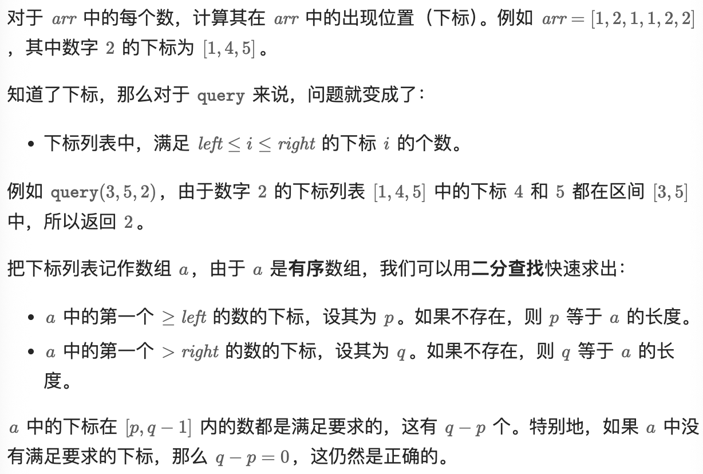

# 34.[在排序数组中查找元素的第一个和最后一个位置](https://leetcode.cn/problems/find-first-and-last-position-of-element-in-sorted-array/)（中等）

## 题目描述

给你一个按照非递减顺序排列的整数数组 `nums`，和一个目标值 `target`。请你找出给定目标值在数组中的开始位置和结束位置。

如果数组中不存在目标值 `target`，返回 `[-1, -1]`。

你必须设计并实现时间复杂度为 `O(log n)` 的算法解决此问题。

 

**示例 1：**

```
输入：nums = [5,7,7,8,8,10], target = 8
输出：[3,4]
```

**示例 2：**

```
输入：nums = [5,7,7,8,8,10], target = 6
输出：[-1,-1]
```

**示例 3：**

```
输入：nums = [], target = 0
输出：[-1,-1]
```

 

**提示：**

- `0 <= nums.length <= 105`
- `-109 <= nums[i] <= 109`
- `nums` 是一个非递减数组
- `-109 <= target <= 109`

## 我的Python解答

最开始没有在真正的函数里面判断是否存在目标元，所以结果错了。

但是实际上是跑了三个二分查找，第一个找元素是否存在，第二个找左边界，第三个找右边界

```python
class Solution:
    def find_last(self, nums: List[int], target: int) -> int:
        # 找最后一个元素的位置
        left, right = 0, len(nums) # 左闭
        while left < right:
            mid = (left + right)//2
            if nums[mid] > target:
                right = mid
            elif nums[mid] <= target:
                left = mid+1
        return left-1
    def searchRange(self, nums: List[int], target: int) -> List[int]:
        # 一眼二分查找，说白了，找开始位置可以找target-1的结束位置，找结束位置，正常找
        left, right = 0, len(nums)
        while left < right:
            mid = (left+right)//2
            if nums[mid] > target:
                right = mid
            elif nums[mid] < target:
                left = mid+1
            else:
                return [self.find_last(nums,target-1)+1, self.find_last(nums,target)]
        return [-1,-1]
```

结果：


实际上可以在得到左侧结果的时候判断：

最主要的是if判断语句

```python
class Solution:
    def find_last(self, nums: List[int], target: int) -> int:
        # 找最后一个元素的位置
        left, right = 0, len(nums) # 左闭
        while left < right:
            mid = (left + right)//2
            if nums[mid] > target:
                right = mid
            elif nums[mid] <= target:
                left = mid+1
        return left-1
    def searchRange(self, nums: List[int], target: int) -> List[int]:
        # 一眼二分查找，说白了，找开始位置可以找target-1的结束位置，找结束位置，正常找
        left = self.find_last(nums,target-1)+1
        if left == len(nums) or nums[left] != target:
            return [-1,-1]
        right = self.find_last(nums,target)
        return [left, right]
```


## Python参考答案

```python
class Solution:
    # lower_bound 返回最小的满足 nums[i] >= target 的下标 i
    # 如果数组为空，或者所有数都 < target，则返回 len(nums)
    # 要求 nums 是非递减的，即 nums[i] <= nums[i + 1]
    def lower_bound(self, nums: List[int], target: int) -> int:
        left, right = 0, len(nums) - 1  # 闭区间 [left, right]
        while left <= right:  # 区间不为空
            # 循环不变量：
            # nums[left-1] < target
            # nums[right+1] >= target
            mid = (left + right) // 2
            if nums[mid] >= target:
                right = mid - 1  # 范围缩小到 [left, mid-1]
            else:
                left = mid + 1  # 范围缩小到 [mid+1, right]
        # 循环结束后 left = right+1
        # 此时 nums[left-1] < target 而 nums[left] = nums[right+1] >= target
        # 所以 left 就是第一个 >= target 的元素下标
        return left

    def searchRange(self, nums: List[int], target: int) -> List[int]:
        start = self.lower_bound(nums, target)
        if start == len(nums) or nums[start] != target:
            return [-1, -1]  # nums 中没有 target
        # 如果 start 存在，那么 end 必定存在
        end = self.lower_bound(nums, target + 1) - 1
        return [start, end]
```

## Python收获


# 2529.正整数和负整数的最大计数

## 题目描述

给你一个按 **非递减顺序** 排列的数组 `nums` ，返回正整数数目和负整数数目中的最大值。

- 换句话讲，如果 `nums` 中正整数的数目是 `pos` ，而负整数的数目是 `neg` ，返回 `pos` 和 `neg`二者中的最大值。

**注意：**`0` 既不是正整数也不是负整数。

 

**示例 1：**

```
输入：nums = [-2,-1,-1,1,2,3]
输出：3
解释：共有 3 个正整数和 3 个负整数。计数得到的最大值是 3 。
```

**示例 2：**

```
输入：nums = [-3,-2,-1,0,0,1,2]
输出：3
解释：共有 2 个正整数和 3 个负整数。计数得到的最大值是 3 。
```

**示例 3：**

```
输入：nums = [5,20,66,1314]
输出：4
解释：共有 4 个正整数和 0 个负整数。计数得到的最大值是 4 。
```

 

**提示：**

- `1 <= nums.length <= 2000`
- `-2000 <= nums[i] <= 2000`
- `nums` 按 **非递减顺序** 排列。

 

**进阶：**你可以设计并实现时间复杂度为 `O(log(n))` 的算法解决此问题吗？

## 我的解法

直接二分查找，找0的左右边界

```python
class Solution:
    def find_last(self, nums: List[int], target: int) -> int:
        # 返回target的左右边界
        left, right = 0, len(nums) # 左闭右开
        while left < right:
            mid = (left + right) // 2
            if nums[mid] > target:
                right = mid
            else:
                left = mid + 1
        return left - 1
    def maximumCount(self, nums: List[int]) -> int:
        # 说白了暴力o(n)，还可以二分查找，找0的左边界和右边界
        total = len(nums)
        left = self.find_last(nums, 0-1)
        right = self.find_last(nums, 0)
        # print(left)
        # print(right)
        return max(left+1, total-right-1)
```

结果：


## 参考答案

直接使用了python自带的二分查找

```python
class Solution:
    def maximumCount(self, nums: List[int]) -> int:
        neg = bisect_left(nums, 0)
        pos = len(nums) - bisect_right(nums, 0)
        return max(neg, pos)
```

## Python收获

### python中自带的二分查找

#### **1. 它们是什么：在“已排序序列”里做二分插入定位**

bisect_left / bisect_right 都来自 Python 标准库 bisect，用于在**保持序列有序**的前提下，给定目标值 x，返回它在有序序列 a 中应插入的位置 i（索引），使得插入后仍然有序；它们的区别只在于：遇到“相等元素”时插到**左边**还是**右边**。重要前提：a 必须按升序排列（除非你自己实现降序逻辑），否则结果不可靠。

- bisect_left(a, x, lo=0, hi=len(a))：返回最左插入点 i，满足：a[:i] 中所有元素都 < x，a[i:] 中所有元素都 >= x；等价不等式（在区间 [lo, hi) 上）：a[i-1] < x <= a[i]（边界处按存在性理解）。

- bisect_right(a, x, lo=0, hi=len(a))（别名 bisect(a, x, ...)）：返回最右插入点 i，满足：a[:i] 中所有元素都 <= x，a[i:] 中所有元素都 > x；等价不等式：a[i-1] <= x < a[i]。

  这两个函数都只返回“位置”，不负责插入；若要插入，用 insort_left/insort_right（内部也是二分定位 + list.insert）。

#### **2. 最核心的差异：相等元素的“稳定边界”**

设有序数组 a，目标 x，记 L = bisect_left(a, x)，R = bisect_right(a, x)，那么：a[L:R] 恰好是所有等于 x 的元素（可能为空）；因此 R - L 就是 x 出现次数。

用一个例子直观感受：

```python
from bisect import bisect_left, bisect_right
a = [1, 2, 2, 2, 4, 7]
print(bisect_left(a, 2))   # 1
print(bisect_right(a, 2))  # 4
# a[1:4] == [2,2,2]
```

再看“插入后顺序”：

```python
from bisect import bisect_left, bisect_right
a = [1,2,2,2,4]
x = 2
i1 = bisect_left(a, x)
i2 = bisect_right(a, x)
print(i1, i2)  # 1 4
# 若插到 i1：新2会排在所有2之前
# 若插到 i2：新2会排在所有2之后
```

#### **3. 形式化条件与区间语义（非常重要，避免 off-by-one）**

它们都支持 lo 与 hi，表示只在半开区间 [lo, hi) 上做二分；返回值 i 也必然在 [lo, hi]（注意右端是 hi 而不是 hi-1，因为“插入点”可能在末尾）。形式化地：

- i = bisect_left(a, x, lo, hi) 满足：对所有 j in [lo, i)，有 a[j] < x；对所有 j in [i, hi)，有 a[j] >= x。

- i = bisect_right(a, x, lo, hi) 满足：对所有 j in [lo, i)，有 a[j] <= x；对所有 j in [i, hi)，有 a[j] > x。

  边界情况：若 x 小于区间内最小值，两个函数都返回 lo；若 x 大于区间内最大值，两个函数都返回 hi；若区间为空（lo == hi），返回 lo。

#### **4. 时间复杂度与适用数据结构**

- 定位（bisect_left/right）是二分：比较次数 O(log n)；对 Python list 来说随机访问是 O(1)，所以定位很快。
- 但若你随后真的插入到 list（list.insert 或 insort_*），需要移动元素，整体插入成本是 O(n)；所以 bisect 适合“**只查询位置**”或“**查询频繁、插入不频繁**”的场景；若要大量动态插入并维持有序，通常考虑 bisect + array/deque（仍要搬移）、或第三方结构（如 sortedcontainers）等。

#### **5. 常用技巧与典型用法（带可直接复用的模板）**

**5.1 找“是否存在”与“第一次出现的位置”**：已排序 a，判断 x 是否存在：先求 i = bisect_left(a, x)，再检查 i < len(a) and a[i] == x。

```python
from bisect import bisect_left
def contains(a, x):
    i = bisect_left(a, x)
    return i < len(a) and a[i] == x
```

**5.2 统计出现次数**：count = bisect_right(a, x) - bisect_left(a, x)。

```python
from bisect import bisect_left, bisect_right
def count_x(a, x):
    return bisect_right(a, x) - bisect_left(a, x)
```

**5.3 获取等值区间 [L, R)**：直接得到所有 x 的切片范围。

```python
from bisect import bisect_left, bisect_right
def equal_range(a, x):
    L = bisect_left(a, x)
    R = bisect_right(a, x)
    return L, R  # a[L:R] 全是 x
```

**5.4 lower_bound / upper_bound（算法竞赛同款）**：C++ 里的 lower_bound≈bisect_left，upper_bound≈bisect_right；很多“找第一个 >=x”或“第一个 >x”的问题直接套用。

**5.5 找“最后一个 <= x”的索引**：这类题常见，但注意边界；做法是 i = bisect_right(a, x) - 1，再判断 i >= 0。

```python
from bisect import bisect_right
def last_leq(a, x):
    i = bisect_right(a, x) - 1
    return i if i >= 0 else None
```

**5.6 找“第一个 >= x”的索引**：就是 bisect_left(a, x)；找“第一个 > x”就是 bisect_right(a, x)。

**5.7 用于阈值分桶（bucket）/区间映射**：给定有序分割点 cuts（如分数线、时间段边界），要把值 v 放入哪个桶，常用 bisect_right：返回的索引就是桶编号（取决于你如何定义区间闭开）。

```python
from bisect import bisect_right
cuts = [60, 70, 80, 90]  # 分割点
def grade_bucket(score):
    # 约定：( -inf,60], (60,70], (70,80], (80,90], (90,inf)
    return bisect_right(cuts, score)
```

如果你想要区间形如 [cut_i, cut_{i+1})（左闭右开），一般用 bisect_left 更自然；关键是你要明确“边界包含谁”，再选 left/right。

#### **6. insort_left / insort_right：真正插入（但插入是 O(n)）**

```
from bisect import insort_left, insort_right
a = [1,2,2,4]
insort_left(a, 2)   # 插到所有2之前
# a == [1,2,2,2,4]
insort_right(a, 2)  # 插到所有2之后
# a == [1,2,2,2,2,4]
```

内部逻辑就是：i = bisect_left/right(...) 然后 a.insert(i, x)；所以定位快，但搬移慢。

#### **7. “自定义 key”怎么办：bisect 本身不带 key，常见替代方案**

标准库 bisectht 不接受 key= 参数；如果你要在“按某个字段排序”的对象列表上二分，有两种主流做法：**(A) 用平行 key 数组二分** 或 **(B) 用元组让 Python 比较**。

**7.1 平行 key 数组（最清晰）**：维护 keys = [obj.k for obj in objs] 与 objs 同步；二分在 keys 上定位，再对 objs 做同位置操作。

```python
from bisect import bisect_left
objs = [{"k": 10}, {"k": 20}, {"k": 20}, {"k": 35}]
keys = [o["k"] for o in objs]
x = 20
i = bisect_left(keys, x)  # 1
```

**7.2 用元组比较（常用于“稳定左/右边界”）**：若对象可映射为 (key, tie_breaker)，可把列表存为元组序列并保持排序，然后 bisect 直接对元组做字典序比较；比如要找 key==20 的区间：左边界用 (20, -inf)，右边界用 (20, +inf)（实际用能覆盖范围的哨兵值）。

```python
from bisect import bisect_left, bisect_right
pairs = [(10,"a"), (20,"b"), (20,"c"), (35,"d")]  # 按 (key, second) 排序
L = bisect_left(pairs, (20, ""))      # "" 作为很小的 second（取决于数据域）
R = bisect_right(pairs, (20, chr(0x10FFFF)))  # 作为很大的 second
```

注意：哨兵要与第二维类型可比且能保证上下界；如果第二维不是字符串而是数字，就用极小/极大数。

#### **8. 亲手实现一版：用不变量理解 bisect（理解它为什么对）**

理解 bisect 的关键是“维护不变量（invariant）”：在循环过程中保持一个区间 [lo, hi)，保证插入点一定在其中；每次取 mid 缩小区间直到 lo == hi。bisect_left 选择条件 a[mid] < x 决定往右，否则往左；bisect_right 选择条件 a[mid] <= x 决定往右，否则往左；这正是“相等时偏左/偏右”的根源。

```python
def my_bisect_left(a, x, lo=0, hi=None):
    if hi is None: hi = len(a)
    while lo < hi:
        mid = (lo + hi) // 2
        if a[mid] < x:
            lo = mid + 1
        else:
            hi = mid
    return lo

def my_bisect_right(a, x, lo=0, hi=None):
    if hi is None: hi = len(a)
    while lo < hi:
        mid = (lo + hi) // 2
        if a[mid] <= x:
            lo = mid + 1
        else:
            hi = mid
    return lo
```

你可以看到它们只差一个符号：< vs <=；也正因为这个符号，left 会把等于 x 的元素归入右侧（从而插到最左），right 会把等于 x 的元素归入左侧（从而插到最右）。

#### **9. 易错点清单（高频坑位）**

- 没排序就 bisect：结果可能“看似合理但不对”，属于隐蔽 bug；必须保证升序排序一致。

- hi 是“右开”而不是包含端点：hi=len(a) 表示可以插在末尾；很多 off-by-one 都出在这里。

- 想找“最后一个 <=x”却用了 bisect_left：正确是 bisect_right(a,x)-1，并处理空结果（返回 -1 时要小心）。

- 对对象列表二分时忘了 key：bisect 不会帮你按字段比较；需要平行 key 或元组技巧。

- 浮点数比较边界：如果数据来自计算误差，== 或边界插入可能表现不符合直觉；必要时先做容差处理或用 decimal。

  

# 2300.咒语和药水的成功对数（中等）

## 题目描述

给你两个正整数数组 `spells` 和 `potions` ，长度分别为 `n` 和 `m` ，其中 `spells[i]` 表示第 `i` 个咒语的能量强度，`potions[j]` 表示第 `j` 瓶药水的能量强度。

同时给你一个整数 `success` 。一个咒语和药水的能量强度 **相乘** 如果 **大于等于** `success` ，那么它们视为一对 **成功** 的组合。

请你返回一个长度为 `n` 的整数数组 `pairs`，其中 `pairs[i]` 是能跟第 `i` 个咒语成功组合的 **药水** 数目。

 

**示例 1：**

```
输入：spells = [5,1,3], potions = [1,2,3,4,5], success = 7
输出：[4,0,3]
解释：
- 第 0 个咒语：5 * [1,2,3,4,5] = [5,10,15,20,25] 。总共 4 个成功组合。
- 第 1 个咒语：1 * [1,2,3,4,5] = [1,2,3,4,5] 。总共 0 个成功组合。
- 第 2 个咒语：3 * [1,2,3,4,5] = [3,6,9,12,15] 。总共 3 个成功组合。
所以返回 [4,0,3] 。
```

**示例 2：**

```
输入：spells = [3,1,2], potions = [8,5,8], success = 16
输出：[2,0,2]
解释：
- 第 0 个咒语：3 * [8,5,8] = [24,15,24] 。总共 2 个成功组合。
- 第 1 个咒语：1 * [8,5,8] = [8,5,8] 。总共 0 个成功组合。
- 第 2 个咒语：2 * [8,5,8] = [16,10,16] 。总共 2 个成功组合。
所以返回 [2,0,2] 。
```

 

**提示：**

- `n == spells.length`
- `m == potions.length`
- `1 <= n, m <= 105`
- `1 <= spells[i], potions[i] <= 105`
- `1 <= success <= 1010`

## 我的解法


```python
class Solution:
    def find_index(self, input:int, potions: List[int], success: int) -> int:
        # 找对于input满足最小success的index
        left, right = 0, len(potions) # 左闭合
        while left<right:
            mid = left + (right-left)//2
            if input*potions[mid] > success-1:
                right = mid
            else:
                left = mid+1
        return left-1
    def successfulPairs(self, spells: List[int], potions: List[int], success: int) -> List[int]:
        # 先排序，然后再二分查找
        potions.sort()
        ans = []
        for x in spells:
            left = self.find_index(x,potions,success)
            print(left)
            ans.append(len(potions)-left-1)
        return ans
```

结果：


## 参考答案

浮点数+二分查找，找左边界

```python
class Solution:
    def successfulPairs(self, spells: List[int], potions: List[int], success: int) -> List[int]:
        potions.sort()
        m = len(potions)
        return [m - bisect_left(potions, success / x) for x in spells]
```

整数+二分查找，找右边界

```python
class Solution:
    def successfulPairs(self, spells: List[int], potions: List[int], success: int) -> List[int]:
        potions.sort()
        m = len(potions)
        success -= 1  # 提前减一，避免在循环中反复减一
        return [m - bisect_right(potions, success // x) for x in spells]
```

计数+值域后缀和

```python
class Solution:
    def successfulPairs(self, spells: List[int], potions: List[int], success: int) -> List[int]:
        mx = max(potions)
        cnt = [0] * (mx + 1)
        for y in potions:
            cnt[y] += 1  # 统计每种药水的出现次数

        # 计算 cnt 的后缀和
        for i in range(mx - 1, -1, -1):
            cnt[i] += cnt[i + 1]
        # 计算完毕后，cnt[i] 就是 potions 值 >= i 的药水个数

        for i, x in enumerate(spells):
            low = (success - 1) // x + 1
            spells[i] = cnt[low] if low <= mx else 0
        return spells
```

# 1385.两个数组间的距离值

## 题目描述

给你两个整数数组 `arr1` ， `arr2` 和一个整数 `d` ，请你返回两个数组之间的 **距离值** 。

「**距离值**」 定义为符合此距离要求的元素数目：对于元素 `arr1[i]` ，不存在任何元素 `arr2[j]` 满足 `|arr1[i]-arr2[j]| <= d` 。

 

**示例 1：**

```
输入：arr1 = [4,5,8], arr2 = [10,9,1,8], d = 2
输出：2
解释：
对于 arr1[0]=4 我们有：
|4-10|=6 > d=2 
|4-9|=5 > d=2 
|4-1|=3 > d=2 
|4-8|=4 > d=2 
所以 arr1[0]=4 符合距离要求

对于 arr1[1]=5 我们有：
|5-10|=5 > d=2 
|5-9|=4 > d=2 
|5-1|=4 > d=2 
|5-8|=3 > d=2
所以 arr1[1]=5 也符合距离要求

对于 arr1[2]=8 我们有：
|8-10|=2 <= d=2
|8-9|=1 <= d=2
|8-1|=7 > d=2
|8-8|=0 <= d=2
存在距离小于等于 2 的情况，不符合距离要求 

故而只有 arr1[0]=4 和 arr1[1]=5 两个符合距离要求，距离值为 2
```

**示例 2：**

```
输入：arr1 = [1,4,2,3], arr2 = [-4,-3,6,10,20,30], d = 3
输出：2
```

**示例 3：**

```
输入：arr1 = [2,1,100,3], arr2 = [-5,-2,10,-3,7], d = 6
输出：1
```

 

**提示：**

- `1 <= arr1.length, arr2.length <= 500`
- `-10^3 <= arr1[i], arr2[j] <= 10^3`
- `0 <= d <= 100`

## 我的解答

主要是各种边界的判断

```python
class Solution:
    def findTheDistanceValue(self, arr1: List[int], arr2: List[int], d: int) -> int:
        arr2.sort()
        ans = 0
        for x in arr1:
            i = bisect_left(arr2, x - d)
            if i == len(arr2) or arr2[i] > x + d:
                ans += 1
        return ans
```

结果：


## 参考答案

对于 arr 1  中的元素 x，如果 arr 2  没有值在闭区间 [x−d,x+d] 中的元素，把答案（计数器）加一。

方法一：排序 + 二分查找
把 arr 2  从小到大排序，这样我们可以二分查找。

遍历 arr 1 ，设 x=arr 1 [i]。我们要判断在 arr 2  中是否存在元素，在闭区间 [x−d,x+d] 中。考虑 [x−d,x+d] 中的第一个数（最左边的数），也就是在 arr 2  中二分查找 ≥x−d 的最小的数 y。如果 y 不存在，或者 y>x+d，则说明没有在 [x−d,x+d] 中的元素，符合题目要求，把答案加一。

```python
class Solution:
    def findTheDistanceValue(self, arr1: List[int], arr2: List[int], d: int) -> int:
        arr2.sort()
        ans = 0
        for x in arr1:
            i = bisect_left(arr2, x - d)
            if i == len(arr2) or arr2[i] > x + d:
                ans += 1
        return ans
```

复杂度分析
时间复杂度：O((m+n)logm)，其中 n 是 arr 1  的长度，m 是 arr 2  的长度。
空间复杂度：O(1)。忽略排序的栈开销。
方法二：排序 + 双指针
把 arr 1  和 arr 2  从小到大排序。遍历 arr 1 ，设 x=arr 1 [i]，同时用另一个指针 j 维护最小的满足 arr 2 [j]≥x−d 的数的下标。如果发现 arr 2 [j]>x+d，那么 arr 2  没有在 [x−d,x+d] 中的数，答案加一。

```python
class Solution:
    def findTheDistanceValue(self, arr1: List[int], arr2: List[int], d: int) -> int:
        arr1.sort()
        arr2.sort()
        ans = j = 0
        for x in arr1:
            while j < len(arr2) and arr2[j] < x - d:
                j += 1
            if j == len(arr2) or arr2[j] > x + d:
                ans += 1
        return ans
```

复杂度分析
时间复杂度：O(nlogn+mlogm)，其中 n 是 arr 1  的长度，m 是 arr 2  的长度。瓶颈在排序上，双指针是 O(n+m) 的。
空间复杂度：O(1)。忽略排序的栈开销。

# 2080.区间内查询数字的频率（中等）

## 题目描述

请你设计一个数据结构，它能求出给定子数组内一个给定值的 **频率** 。

子数组中一个值的 **频率** 指的是这个子数组中这个值的出现次数。

请你实现 `RangeFreqQuery` 类：

- `RangeFreqQuery(int[] arr)` 用下标从 **0** 开始的整数数组 `arr` 构造一个类的实例。
- `int query(int left, int right, int value)` 返回子数组 `arr[left...right]` 中 `value` 的 **频率** 。

一个 **子数组** 指的是数组中一段连续的元素。`arr[left...right]` 指的是 `nums` 中包含下标 `left` 和 `right` **在内** 的中间一段连续元素。

 

**示例 1：**

```
输入：
["RangeFreqQuery", "query", "query"]
[[[12, 33, 4, 56, 22, 2, 34, 33, 22, 12, 34, 56]], [1, 2, 4], [0, 11, 33]]
输出：
[null, 1, 2]

解释：
RangeFreqQuery rangeFreqQuery = new RangeFreqQuery([12, 33, 4, 56, 22, 2, 34, 33, 22, 12, 34, 56]);
rangeFreqQuery.query(1, 2, 4); // 返回 1 。4 在子数组 [33, 4] 中出现 1 次。
rangeFreqQuery.query(0, 11, 33); // 返回 2 。33 在整个子数组中出现 2 次。
```

 

**提示：**

- `1 <= arr.length <= 105`
- `1 <= arr[i], value <= 104`
- `0 <= left <= right < arr.length`
- 调用 `query` 不超过 `105` 次。

## 我的解答

```python
class RangeFreqQuery:

    def __init__(self, arr: List[int]):
        self.arr = arr
        return

    def query(self, left: int, right: int, value: int) -> int:
        tmp = self.arr[left:right+1]
        tmp.sort()
        times = 0
        left_index = bisect_left(tmp,value)
        right_index = bisect_right(tmp,value)
        return right_index-left_index


# Your RangeFreqQuery object will be instantiated and called as such:
# obj = RangeFreqQuery(arr)
# param_1 = obj.query(left,right,value)
```

结果超时了

## 参考答案

属于是被思维固化了，每一次对子数组排序，都会o(nlogn)的时间复杂度




```python
class RangeFreqQuery:
    def __init__(self, arr: List[int]):
        pos = defaultdict(list)
        for i, x in enumerate(arr):
            pos[x].append(i)
        self.pos = pos

    def query(self, left: int, right: int, value: int) -> int:
        a = self.pos[value]
        return bisect_right(a, right) - bisect_left(a, left)
```

结果：


# 2563.统计公平数对的数目（中等）

## 题目描述

给你一个下标从 **0** 开始、长度为 `n` 的整数数组 `nums` ，和两个整数 `lower` 和 `upper` ，返回 **公平数对的数目** 。

如果 `(i, j)` 数对满足以下情况，则认为它是一个 **公平数对** ：

- `0 <= i < j < n`，且
- `lower <= nums[i] + nums[j] <= upper`

 

**示例 1：**

```
输入：nums = [0,1,7,4,4,5], lower = 3, upper = 6
输出：6
解释：共计 6 个公平数对：(0,3)、(0,4)、(0,5)、(1,3)、(1,4) 和 (1,5) 。
```

**示例 2：**

```
输入：nums = [1,7,9,2,5], lower = 11, upper = 11
输出：1
解释：只有单个公平数对：(2,3) 。
```

 

**提示：**

- `1 <= nums.length <= 105`
- `nums.length == n`
- `-109 <= nums[i] <= 109`
- `-109 <= lower <= upper <= 109`

## 我的解答

没做出来，超时了

```python
class Solution:
    def countFairPairs(self, nums: List[int], lower: int, upper: int) -> int:
        ans = 0
        # 不可以排序
        pos = defaultdict(list)
        for i,x in enumerate(nums):
            pos[x].append(i)
        for i,x in enumerate(nums):
            for v in pos:
                if (x+v >= lower) and (x+v<=upper):
                    left = bisect_right(pos[v],i)
                    ans += (len(pos[v])-left)
        return ans
```

## 参考答案

### 方法1:二分查找

```python
class Solution:
    def countFairPairs(self, nums: List[int], lower: int, upper: int) -> int:
        nums.sort()
        ans = 0
        for j, x in enumerate(nums):
            # 注意要在 [0, j-1] 中二分，因为题目要求两个下标 i < j
            r = bisect_right(nums, upper - x, 0, j)
            l = bisect_left(nums, lower - x, 0, j)
            ans += r - l  
        return ans
```

### 方法2:相向三指针

```python
class Solution:
    def countFairPairs(self, nums: List[int], lower: int, upper: int) -> int:
        nums.sort()
        ans = 0
        l = r = len(nums)
        for j, x in enumerate(nums):
            while r and nums[r - 1] > upper - x:
                r -= 1
            while l and nums[l - 1] >= lower - x:
                l -= 1
            # 在方法一中，二分的结果必须 <= j
            # 方法二同理，要保证 l 和 r 都 <= j
            ans += min(r, j) - min(l, j)
        return ans
```

### 方法3:两次相向双指针

```python
class Solution:
    def countFairPairs(self, nums: List[int], lower: int, upper: int) -> int:
        nums.sort()
        def count(upper: int) -> int:
            res = 0
            j = len(nums) - 1
            for i, x in enumerate(nums):
                while j > i and nums[j] > upper - x:
                    j -= 1
                if j == i:
                    break
                res += j - i
            return res
        return count(upper) - count(lower - 1)
```

```python
class Solution:
    def countFairPairs(self, nums: List[int], lower: int, upper: int) -> int:
        nums.sort()
        def count(upper: int) -> int:
            res = 0
            i, j = 0, len(nums) - 1
            while i < j:
                if nums[i] + nums[j] <= upper:
                    res += j - i
                    i += 1
                else:
                    j -= 1
            return res
        return count(upper) - count(lower - 1)
```

