# 2563.统计公平数对的数目（中等）

## 题目描述

给你一个下标从 **0** 开始、长度为 `n` 的整数数组 `nums` ，和两个整数 `lower` 和 `upper` ，返回 **公平数对的数目** 。

如果 `(i, j)` 数对满足以下情况，则认为它是一个 **公平数对** ：

- `0 <= i < j < n`，且
- `lower <= nums[i] + nums[j] <= upper`

 

**示例 1：**

```
输入：nums = [0,1,7,4,4,5], lower = 3, upper = 6
输出：6
解释：共计 6 个公平数对：(0,3)、(0,4)、(0,5)、(1,3)、(1,4) 和 (1,5) 。
```

**示例 2：**

```
输入：nums = [1,7,9,2,5], lower = 11, upper = 11
输出：1
解释：只有单个公平数对：(2,3) 。
```

 

**提示：**

- `1 <= nums.length <= 105`
- `nums.length == n`
- `-109 <= nums[i] <= 109`
- `-109 <= lower <= upper <= 109`

## 我的Python解答

```python
class Solution:
    def countFairPairs(self, nums: List[int], lower: int, upper: int) -> int:
        ans = 0
        nums.sort()
        for j,x in enumerate(nums):
            left = bisect_left(nums,lower-x,j+1,len(nums))
            right = bisect_right(nums,upper-x,j+1,len(nums))
            ans += right-left
        return ans
```

结果：

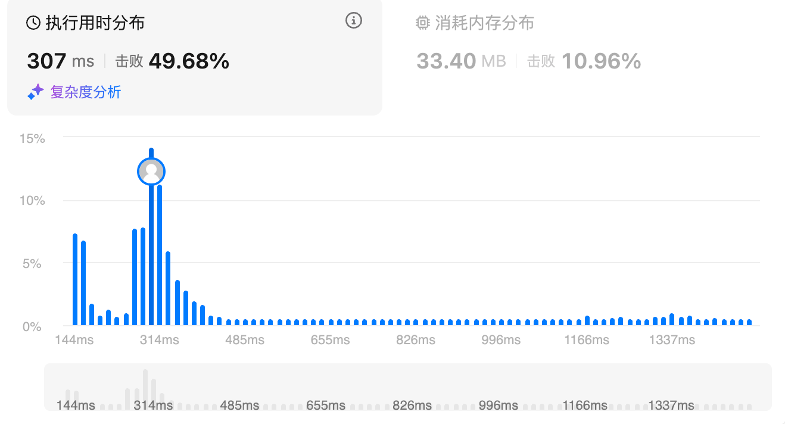

# 875.爱吃香蕉的轲轲（中等）

## 题目描述

珂珂喜欢吃香蕉。这里有 `n` 堆香蕉，第 `i` 堆中有 `piles[i]` 根香蕉。警卫已经离开了，将在 `h` 小时后回来。

珂珂可以决定她吃香蕉的速度 `k` （单位：根/小时）。每个小时，她将会选择一堆香蕉，从中吃掉 `k` 根。如果这堆香蕉少于 `k` 根，她将吃掉这堆的所有香蕉，然后这一小时内不会再吃更多的香蕉。 

珂珂喜欢慢慢吃，但仍然想在警卫回来前吃掉所有的香蕉。

返回她可以在 `h` 小时内吃掉所有香蕉的最小速度 `k`（`k` 为整数）。

 

**示例 1：**

```
输入：piles = [3,6,7,11], h = 8
输出：4
```

**示例 2：**

```
输入：piles = [30,11,23,4,20], h = 5
输出：30
```

**示例 3：**

```
输入：piles = [30,11,23,4,20], h = 6
输出：23
```

 

**提示：**

- `1 <= piles.length <= 104`
- `piles.length <= h <= 109`
- `1 <= piles[i] <= 109`

## 我的解答

本质上，是pile/k向上取整的求和刚好等于h

下限为piles求和除以h 其次是如果h刚好等于len(piles)，那就是piles最大值，所以上限是max(piles)

没有做出来，用时太久，直接看答案。

## 参考答案

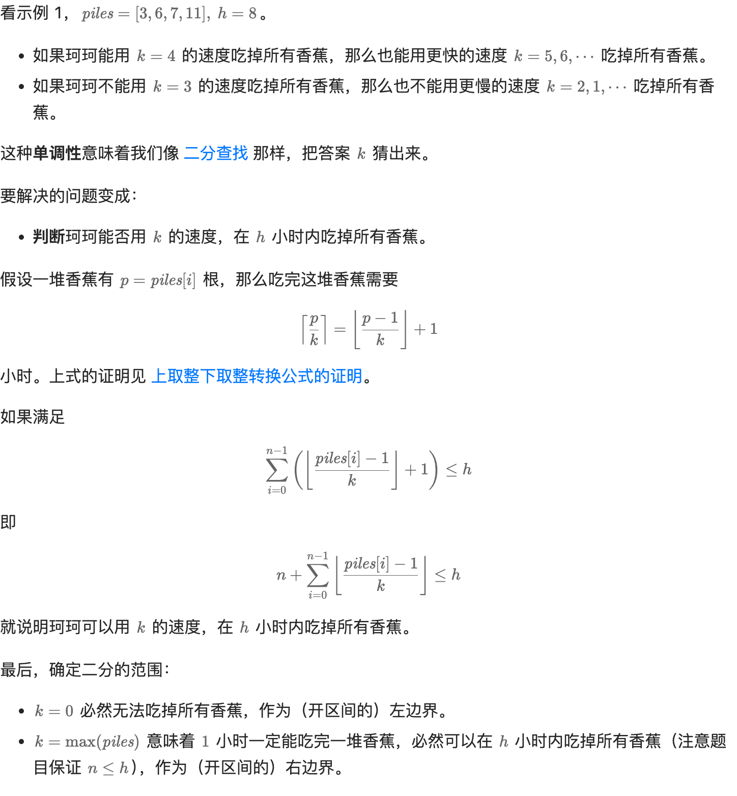

```python
class Solution:
    def minEatingSpeed(self, piles: List[int], h: int) -> int:
        n = len(piles)
        left = 0  # 恒为 False
        right = max(piles)  # 恒为 True
        while left + 1 < right:  # 开区间不为空
            mid = (left + right) // 2
            if sum((p - 1) // mid for p in piles) <= h - n:
                right = mid  # 循环不变量：恒为 True
            else:
                left = mid  # 循环不变量：恒为 False
        return right  # 最小的 True
```

结果：

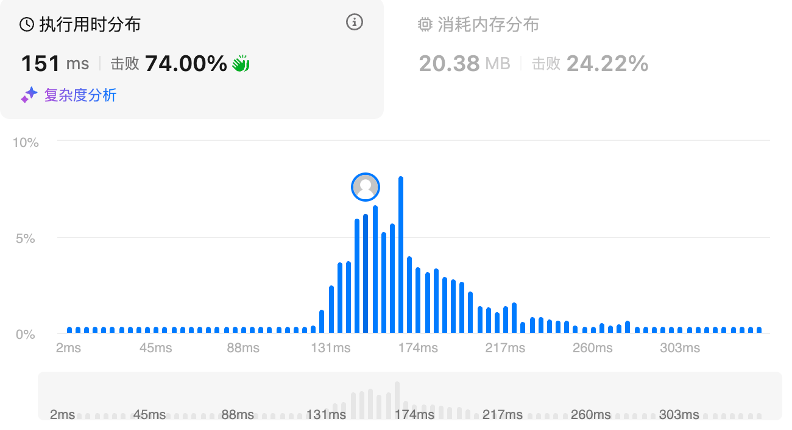

# 2187.完成旅途的最少时间（中等）

## 题目描述

给你一个数组 `time` ，其中 `time[i]` 表示第 `i` 辆公交车完成 **一趟****旅途** 所需要花费的时间。

每辆公交车可以 **连续** 完成多趟旅途，也就是说，一辆公交车当前旅途完成后，可以 **立马开始** 下一趟旅途。每辆公交车 **独立** 运行，也就是说可以同时有多辆公交车在运行且互不影响。

给你一个整数 `totalTrips` ，表示所有公交车 **总共** 需要完成的旅途数目。请你返回完成 **至少** `totalTrips` 趟旅途需要花费的 **最少** 时间。

 

**示例 1：**

```
输入：time = [1,2,3], totalTrips = 5
输出：3
解释：
- 时刻 t = 1 ，每辆公交车完成的旅途数分别为 [1,0,0] 。
  已完成的总旅途数为 1 + 0 + 0 = 1 。
- 时刻 t = 2 ，每辆公交车完成的旅途数分别为 [2,1,0] 。
  已完成的总旅途数为 2 + 1 + 0 = 3 。
- 时刻 t = 3 ，每辆公交车完成的旅途数分别为 [3,1,1] 。
  已完成的总旅途数为 3 + 1 + 1 = 5 。
所以总共完成至少 5 趟旅途的最少时间为 3 。
```

**示例 2：**

```
输入：time = [2], totalTrips = 1
输出：2
解释：
只有一辆公交车，它将在时刻 t = 2 完成第一趟旅途。
所以完成 1 趟旅途的最少时间为 2 。
```

 

**提示：**

- `1 <= time.length <= 105`
- `1 <= time[i], totalTrips <= 107`

## 我的解答

公式化作答，和上一个题目很相似，直接确定上下界后二分查找

可以优化的点：上下界，上界可以是min*total，下界可以是min-1

```python
class Solution:
    def minimumTime(self, time: List[int], totalTrips: int) -> int:
        left = 0
        right = max(time)*totalTrips
        while left+1<right:
            mid = (left+right)//2
            if sum(mid//t for t in time)>=totalTrips:
                right = mid
            else:
                left = mid
        return left+1
```

结果：

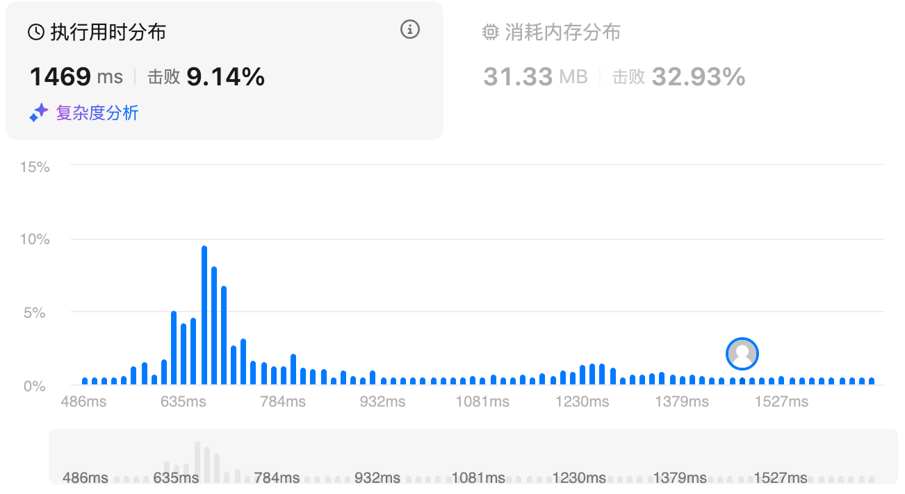

## 参考答案

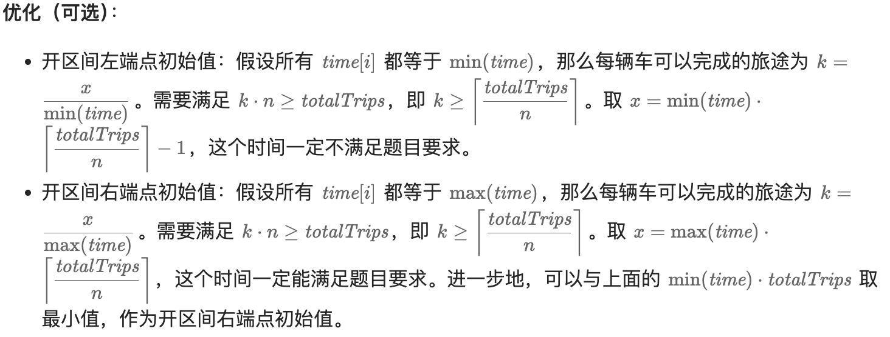

```python
class Solution:
    def minimumTime(self, time: List[int], totalTrips: int) -> int:
        min_t = min(time)
        left = min_t - 1  # 循环不变量：sum >= totalTrips 恒为 False
        right = min_t * totalTrips  # 循环不变量：sum >= totalTrips 恒为 True
        while left + 1 < right:  # 开区间 (left, right) 不为空
            mid = (left + right) // 2
            if sum(mid // t for t in time) >= totalTrips:
                right = mid  # 缩小二分区间为 (left, mid)
            else:
                left = mid  # 缩小二分区间为 (mid, right)
        # 此时 left 等于 right-1
        # sum(left) < totalTrips 且 sum(right) >= totalTrips，所以答案是 right
        return right
```

# 275.H指数指数Ⅱ（中等）

## 题目描述

给你一个整数数组 `citations` ，其中 `citations[i]` 表示研究者的第 `i` 篇论文被引用的次数，`citations` 已经按照 **非降序排列** 。计算并返回该研究者的 h 指数。

[h 指数的定义](https://baike.baidu.com/item/h-index/3991452?fr=aladdin)：h 代表“高引用次数”（high citations），一名科研人员的 `h` 指数是指他（她）的 （`n` 篇论文中）**至少** 有 `h` 篇论文分别被引用了**至少** `h` 次。

请你设计并实现对数时间复杂度的算法解决此问题。

 

**示例 1：**

```
输入：citations = [0,1,3,5,6]
输出：3
解释：给定数组表示研究者总共有 5 篇论文，每篇论文相应的被引用了 0, 1, 3, 5, 6 次。
     由于研究者有3篇论文每篇 至少 被引用了 3 次，其余两篇论文每篇被引用 不多于 3 次，所以她的 h 指数是 3 。
```

**示例 2：**

```
输入：citations = [1,2,100]
输出：2
```

 

**提示：**

- `n == citations.length`
- `1 <= n <= 105`
- `0 <= citations[i] <= 1000`
- `citations` 按 **升序排列**

## 我的解答

这个题和之前的不太一样，关键是需要理清思路，mid及右边的数的个数表征h，如果个数都比当前真实引用量小，说明符合要求，可以再向左找

```python
class Solution:
    def hIndex(self, citations: List[int]) -> int:
        if citations[-1]==0:
            return 0
        left = 0
        right = len(citations)
        while left<right:
            mid = (left+right)//2
            if len(citations) - mid <= citations[mid]:
                right = mid
            else:
                left = mid + 1
        return len(citations)-left
```

结果：

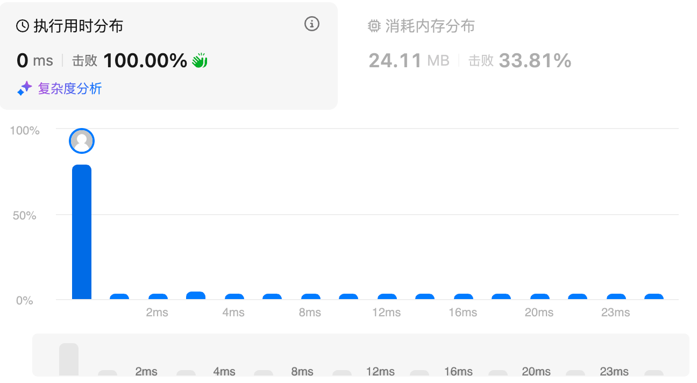

## 参考答案

这个参考答案倒是正着走的思路，是对答案进行二分查找，细节使用citations[-mid]这种trick

```python
class Solution:
    def hIndex(self, citations: List[int]) -> int:
        # 在区间 [left, right) 内询问
        left = 1
        right = len(citations) + 1
        while left < right:  # 区间不为空
            # 循环不变量：
            # left-1 的回答一定为「是」
            # right 的回答一定为「否」
            mid = (left + right) // 2
            # 引用次数最多的 mid 篇论文，引用次数均 >= mid
            if citations[-mid] >= mid:
                left = mid + 1  # 询问范围缩小到 [mid+1, right)
            else:
                right = mid  # 询问范围缩小到 [left, mid)
        # 根据循环不变量，left-1 现在是最大的回答为「是」的数
        return left - 1
```

# 2861.最大合金数（中等）

## 题目描述

假设你是一家合金制造公司的老板，你的公司使用多种金属来制造合金。现在共有 `n` 种不同类型的金属可以使用，并且你可以使用 `k` 台机器来制造合金。每台机器都需要特定数量的每种金属来创建合金。

对于第 `i` 台机器而言，创建合金需要 `composition[i][j]` 份 `j` 类型金属。最初，你拥有 `stock[x]` 份 `x` 类型金属，而每购入一份 `x` 类型金属需要花费 `cost[x]` 的金钱。

给你整数 `n`、`k`、`budget`，下标从 **1** 开始的二维数组 `composition`，两个下标从 **1** 开始的数组 `stock` 和 `cost`，请你在预算不超过 `budget` 金钱的前提下，**最大化** 公司制造合金的数量。

**所有合金都需要由同一台机器制造。**

返回公司可以制造的最大合金数。

 

**示例 1：**

```
输入：n = 3, k = 2, budget = 15, composition = [[1,1,1],[1,1,10]], stock = [0,0,0], cost = [1,2,3]
输出：2
解释：最优的方法是使用第 1 台机器来制造合金。
要想制造 2 份合金，我们需要购买：
- 2 份第 1 类金属。
- 2 份第 2 类金属。
- 2 份第 3 类金属。
总共需要 2 * 1 + 2 * 2 + 2 * 3 = 12 的金钱，小于等于预算 15 。
注意，我们最开始时候没有任何一类金属，所以必须买齐所有需要的金属。
可以证明在示例条件下最多可以制造 2 份合金。
```

**示例 2：**

```
输入：n = 3, k = 2, budget = 15, composition = [[1,1,1],[1,1,10]], stock = [0,0,100], cost = [1,2,3]
输出：5
解释：最优的方法是使用第 2 台机器来制造合金。 
要想制造 5 份合金，我们需要购买： 
- 5 份第 1 类金属。
- 5 份第 2 类金属。 
- 0 份第 3 类金属。 
总共需要 5 * 1 + 5 * 2 + 0 * 3 = 15 的金钱，小于等于预算 15 。 
可以证明在示例条件下最多可以制造 5 份合金。
```

**示例 3：**

```
输入：n = 2, k = 3, budget = 10, composition = [[2,1],[1,2],[1,1]], stock = [1,1], cost = [5,5]
输出：2
解释：最优的方法是使用第 3 台机器来制造合金。
要想制造 2 份合金，我们需要购买：
- 1 份第 1 类金属。
- 1 份第 2 类金属。
总共需要 1 * 5 + 1 * 5 = 10 的金钱，小于等于预算 10 。
可以证明在示例条件下最多可以制造 2 份合金。
```

 

**提示：**

- `1 <= n, k <= 100`
- `0 <= budget <= 108`
- `composition.length == k`
- `composition[i].length == n`
- `1 <= composition[i][j] <= 100`
- `stock.length == cost.length == n`
- `0 <= stock[i] <= 108`
- `1 <= cost[i] <= 100`

## 我的解答

只能想到暴力，必然超时：

```python
class Solution:
    def maxNumberOfAlloys(self, n: int, k: int, budget: int, composition: List[List[int]], stock: List[int], cost: List[int]) -> int:
        ans_list = [0]*(len(composition)) # 每一台机器计算一个最大合金数目
        for machine in range(k):
            # 枚举机器
            cur_cost = 0 # 当前开销
            cur_stock = copy.deepcopy(stock)
            ans = 0
            while cur_cost <= budget:
                for i in range(n):
                    cur_stock[i] -= composition[machine][i]
                cur_cost = sum(cost[i]*abs(cur_stock[i]) if cur_stock[i]<0 else 0 for i in range(n))
                ans += 1
            ans_list[machine] = ans-1
        return max(ans_list)
```


## 参考答案

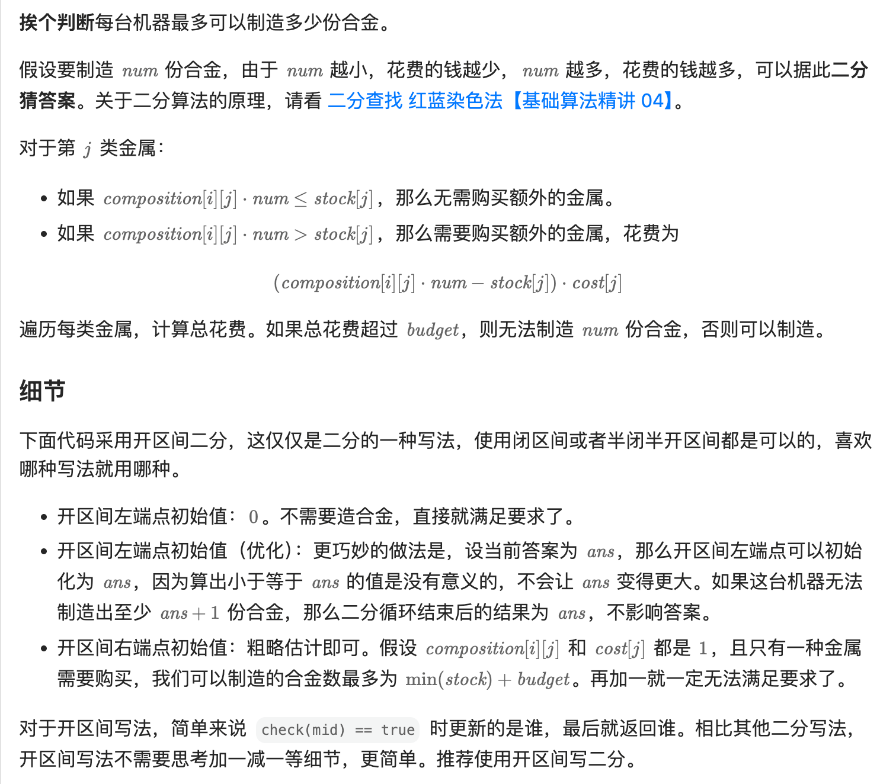

```python
class Solution:
    def maxNumberOfAlloys(self, n: int, k: int, budget: int, composition: List[List[int]], stock: List[int], cost: List[int]) -> int:
        ans = 0
        mx = min(stock) + budget
        for comp in composition:
            def check(num: int) -> bool:
                money = 0
                for s, base, c in zip(stock, comp, cost):
                    if s < base * num:
                        money += (base * num - s) * c
                        if money > budget:
                            return False
                return True

            left, right = ans, mx + 1
            while left + 1 < right:  # 开区间写法
                mid = (left + right) // 2
                if check(mid):
                    left = mid
                else:
                    right = mid
            ans = left
        return ans
```

结果：

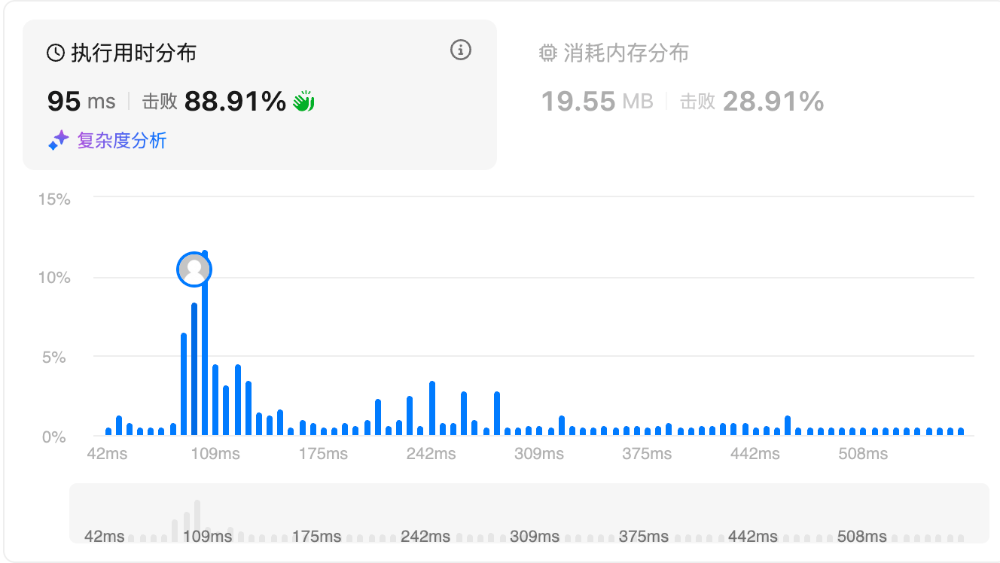

## python收获

### python中的zip

#### **1. zip 是什么：把多个可迭代对象“按位置配对”成元组序列**

zip(*iterables, strict=False) 会并行遍历多个可迭代对象（iterable），每次各取出一个元素，组成一个元组 (a_i, b_i, c_i, ...)，不断产出这些元组，直到停止；在 Python 3 中，zip 返回的是**惰性迭代器**（iterator），需要用 list(zip(...))、循环、或再次迭代消费。最常见的理解是“列对齐→按行打包”，如果把每个 iterable 看作一列，那么 zip 生成的就是一行行的记录。最基础用法：zip([1,2,3], ['a','b','c']) -> (1,'a'), (2,'b'), (3,'c')。

```
a = [1, 2, 3]
b = ["x", "y", "z"]
for pair in zip(a, b):
    print(pair)  # (1,'x'), (2,'y'), (3,'z')
```

#### **2. 核心语义：长度/维度不一致时怎么办（默认：截断到最短）**

**2.1 “维度不一致”在 zip 里通常指“长度不一致”**：比如两个列表一个长 5 一个长 3；默认行为是**以最短的为准**，迭代到某一个 iterable 耗尽就停止，剩余更长 iterable 的元素会被忽略。

设各 iterable 长度为 n1, n2, ..., nk，则 zip 产出条数为：m = min(n1, n2, ..., nk)。

```
a = [1, 2, 3, 4]
b = ["a", "b"]
print(list(zip(a, b)))  # [(1,'a'), (2,'b')]  后面的 3,4 被丢弃
```

**2.2 strict=True：要求长度完全一致，否则报错**：从 Python 3.10 起，zip(..., strict=True) 会在发现某个 iterable 提前结束时抛出 ValueError，用于“我必须保证每列对齐”的数据处理场景，避免静默截断导致数据错位。

```
a = [1, 2, 3, 4]
b = ["a", "b"]
try:
    list(zip(a, b, strict=True))
except ValueError as e:
    print("ValueError:", e)
```

**2.3 想要“按最长对齐并填充缺失值”怎么办：用 itertools.zip_longest**：标准库 itertools.zip_longest(*iterables, fillvalue=...) 会以最长为准，短的用 fillvalue 补齐。

```
from itertools import zip_longest
a = [1, 2, 3, 4]
b = ["a", "b"]
print(list(zip_longest(a, b, fillvalue=None)))
# [(1,'a'), (2,'b'), (3,None), (4,None)]
```

#### **3. 数据类型不一致时怎么办：zip 不做类型转换，只做“打包”**

**3.1 zip 不关心元素类型，只要可迭代就行**：不同 iterable 的元素可以是任意类型，zip 只是把同位置元素放进同一个元组里；因此“数据类型不一致”不会导致 zip 本身报错。

```
a = [1, 2, 3]                    # int
b = ["x", "y", "z"]              # str
c = [{"k":1}, {"k":2}, {"k":3}]  # dict
print(list(zip(a, b, c)))
# [(1,'x',{'k':1}), (2,'y',{'k':2}), (3,'z',{'k':3})]
```

**3.2 但要注意：后续对打包结果做运算时可能类型错误**：比如你把 (int, str) 当作能相加；zip 不负责保证可运算性。

```
pairs = list(zip([1,2,3], ["10","20","30"]))
# 你若直接做 1 + "10" 会 TypeError，需要显式转换
nums = [x + int(y) for x, y in pairs]  # [11,22,33]
```

**3.3 iterable 的“数据结构类型”不一致也没关系**：list、tuple、set、dict、generator、string 都能混用，但注意它们的迭代规则不同：字符串按字符迭代；字典默认迭代的是 key；集合无序导致配对不稳定。

```
print(list(zip([1,2,3], (10,20,30))))          # list + tuple OK
print(list(zip([1,2,3], "abc")))               # "abc" -> 'a','b','c'
print(list(zip([1,2,3], {"k1":9,"k2":8,"k3":7})))  # dict -> keys
print(list(zip([1,2,3], {100,200,300})))       # set 无序，结果顺序不保证
```

处理字典时想按 value 或 items：

```
d = {"k1": 9, "k2": 8, "k3": 7}
print(list(zip([1,2,3], d.values())))  # values
print(list(zip([1,2,3], d.items())))   # items: ('k1',9)...
```

#### **4. “维度不一致”的更深层：元素本身是向量/矩阵时如何理解 zip 的配对层级**

很多人说“维度不一致”，其实包含两层意思：外层长度不一致（zip 的停止条件），内层元素是序列/数组，其形状可能不一致（zip 不会管，只会把它们当作普通元素打包）。

**4.1 外层长度一致，但内层形状不一致：zip 仍然正常**：

```
xs = [[1,2,3], [4,5], [6]]   # 内层长度 3,2,1
ys = ["A", "B", "C"]
print(list(zip(xs, ys)))
# [([1,2,3],'A'), ([4,5],'B'), ([6],'C')]
```

这里 zip 完全不关心 [1,2,3] 和 [4,5] 的“维度”，它们只是两个对象。

**4.2 你想“逐元素配对内层”时，需要嵌套 zip 或先对齐内层**：

例如把二维“按列对齐”转置：

```
mat = [
    [1, 2, 3],
    [4, 5, 6],
]
print(list(zip(*mat)))  # [(1,4), (2,5), (3,6)]  转置（行->列）
```

但如果内层长度不一致，zip(*mat) 默认会截断到最短内层：

```
ragged = [
    [1, 2, 3],
    [4, 5],
    [6],
]
print(list(zip(*ragged)))  # [(1,4,6)]  只保留第0列
```

想保留所有列并填充缺失：

```
from itertools import zip_longest
print(list(zip_longest(*ragged, fillvalue=None)))
# [(1,4,6), (2,5,None), (3,None,None)]
```

#### **5. zip 与“解包 \*”的组合：转置、反转、重组（但要小心可重复迭代性）**

**5.1 zip(\*iterables) 常用于“解包后转置”**：上面矩阵转置就是经典例子。

**5.2 反向 unzip：把 zip 的结果拆回多列**：

```
pairs = [(1,"a"), (2,"b"), (3,"c")]
xs, ys = zip(*pairs)
print(xs)  # (1,2,3)
print(ys)  # ('a','b','c')
```

注意：zip(*pairs) 要求 pairs 非空；空会报 ValueError: not enough values to unpack，更稳健写法：

```
pairs = []
xs, ys = zip(*pairs) if pairs else ((), ())
```

**5.3 zip 的输入是迭代器/生成器时，只能消费一次**：

```
g = (i*i for i in range(3))
z = zip(g, ["a","b","c"])
print(list(z))  # 第一次消费 OK
print(list(z))  # 第二次为空，因为 zip 迭代器已耗尽
```

#### **6. 与“数据维度/长度不一致”相关的工程处理模式（非常常用）**

**6.1 数据表对齐：要求长度一致就用 strict=True**：例如训练数据 (texts, labels) 必须一一对应，否则直接报错比静默截断安全。

```
def make_records(texts, labels):
    return list(zip(texts, labels, strict=True))
```

**6.2 流式数据：一边读一边 zip（惰性）**：zip 不会把所有数据读进内存，适合大文件逐行配对，但依旧会受最短流的结束影响。

```
def line_pairs(f1, f2):
    for l1, l2 in zip(f1, f2):
        yield l1.rstrip("\n"), l2.rstrip("\n")
```

**6.3 不同长度要保留全部：zip_longest + 后处理**：比如有缺失标签/缺失特征要填默认值或跳过。

```
from itertools import zip_longest
def align_longest(a, b, fill=None):
    for x, y in zip_longest(a, b, fillvalue=fill):
        yield x, y
```

**6.4 只想截断但要显式：先取最短长度 min_len 再切片**：比隐式截断更可读，尤其在审计代码时。

```
a = [1,2,3,4]
b = ["a","b"]
m = min(len(a), len(b))
pairs = list(zip(a[:m], b[:m]))
```

#### **7. 常见坑与细节（和“类型/维度不一致”强相关）**

- 字典：zip(d1, d2) 默认配对的是 key，而且两个 dict 的 key 集不一定一致；如果你要按相同 key 对齐，应先对 key 取交集或统一排序：

```
d1 = {"a":1,"b":2}
d2 = {"a":10,"c":30}
common = sorted(d1.keys() & d2.keys())
pairs = [(k, d1[k], d2[k]) for k in common]  # [('a',1,10)]
```

- 集合：无序导致每次运行配对结果顺序可能不同，不适合需要稳定对齐的数据处理；若必须用，先排序：zip(sorted(s1), sorted(s2))。
- 字符串：按字符迭代，经常不是你想要的“单个字符串作为一个元素”；若要把整个字符串当一个元素，包一层：zip([s], other) 或 (s,)。
- 内层不齐的二维数据：zip(*rows) 会截断到最短行；想保留列用 zip_longest(*rows)。
- 惰性迭代：zip 结果如果要复用，必须保存为 list/tuple；否则第二次迭代为空。
- strict=True 的版本要求：若运行环境 <3.10，则没有 strict 参数；这时可手动检测长度或使用 itertools.zip_longest 检测是否有填充值出现来模拟一致性检查。

#### **8. 用一个综合例子串起来：类型不一致 + 长度不一致 + 内层维度不一致**

目标：把 ids、texts、embeddings 对齐成记录；其中 ids 是 int 列表，texts 是字符串列表，embeddings 是不规则向量（内层长度可能不同），而且 texts 缺一条。

```
from itertools import zip_longest
ids = [101, 102, 103, 104]
texts = ["q1", "q2", "q3"]                 # 少一个
embs = [[0.1,0.2], [0.3,0.4,0.5], [0.6], [0.7,0.8]]  # 内层不齐但无所谓
records = []
for i, t, e in zip_longest(ids, texts, embs, fillvalue=None):
    # zip_longest 保证 ids 的最后一条不会丢；t 缺失时为 None
    records.append({"id": i, "text": t, "emb": e, "emb_dim": None if e is None else len(e)})
print(records)
```

这里展示了三点：外层长度不一致用 zip_longest 保留全部；元素类型不一致完全没问题；内层维度不一致 zip 不关心，但你可以在后处理里记录 len(e) 或做 padding。

# 2439.最小化数组中的最大值（中等）

## 题目描述

给你一个下标从 **0** 开始的数组 `nums` ，它含有 `n` 个非负整数。

每一步操作中，你需要：

- 选择一个满足 `1 <= i < n` 的整数 `i` ，且 `nums[i] > 0` 。
- 将 `nums[i]` 减 1 。
- 将 `nums[i - 1]` 加 1 。

你可以对数组执行 **任意** 次上述操作，请你返回可以得到的 `nums` 数组中 **最大值** **最小** 为多少。

 

**示例 1：**

```
输入：nums = [3,7,1,6]
输出：5
解释：
一串最优操作是：
1. 选择 i = 1 ，nums 变为 [4,6,1,6] 。
2. 选择 i = 3 ，nums 变为 [4,6,2,5] 。
3. 选择 i = 1 ，nums 变为 [5,5,2,5] 。
nums 中最大值为 5 。无法得到比 5 更小的最大值。
所以我们返回 5 。
```

**示例 2：**

```
输入：nums = [10,1]
输出：10
解释：
最优解是不改动 nums ，10 是最大值，所以返回 10 。
```

 

**提示：**

- `n == nums.length`
- `2 <= n <= 105`
- `0 <= nums[i] <= 109`

## 我的解答

这个做法是绝对错误的，因为实际上是右侧的大数据可以向左侧洪范的，这个做法没有考虑。

这个题单是二分查找的，但是现在还是没有想到二分的思路

```python
class Solution:
    def minimizeArrayValue(self, nums: List[int]) -> int:
        # 从0开始选中某一元，如过它比后者小，那就二者取平均，多的还是后者的
        # 如果某一个区间是递增的，那么这个区间就可以磨平了
        start = 0
        end = 0 # 左闭右开
        ans_list = []
        while end < len(nums):
            if nums[end]<nums[start]:
                # 找到了新的区间
                ans_list.append((sum(nums[start:end])-1)//(end-start) + 1)
                start = end
            end += 1
        return max(ans_list)
```

耗时过长，看答案

## 参考答案

**最小的最大值 -> 需要条件反射二分查找猜测答案**

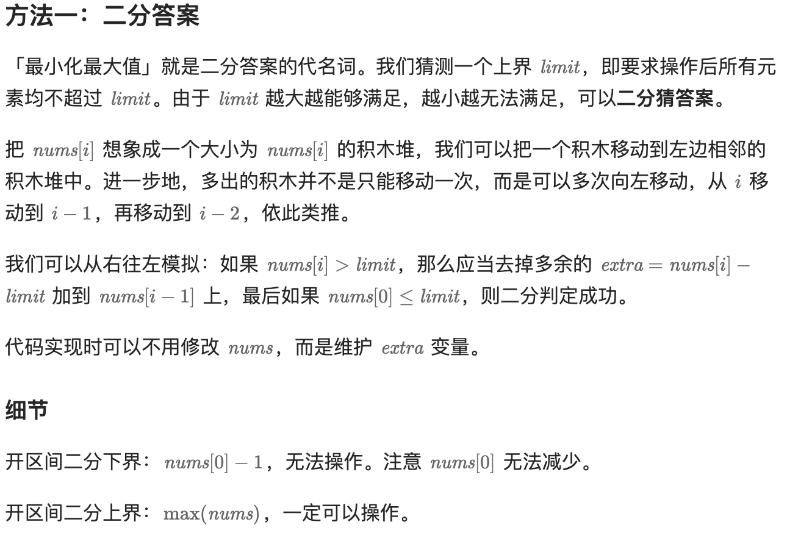

```python
class Solution:
    def minimizeArrayValue(self, nums: List[int]) -> int:
        def check(limit: int) -> bool:
            extra = 0
            for i in range(len(nums) - 1, 0, -1):
                new_num = nums[i] + extra  # 把多出的积木堆到 nums[i] 上
                extra = max(new_num - limit, 0)  # 如果 new_num - limit > 0，那么多出的积木继续丢给左边
            return nums[0] + extra <= limit

        return bisect_left(range(max(nums)), True, lo=nums[0], key=check)
```

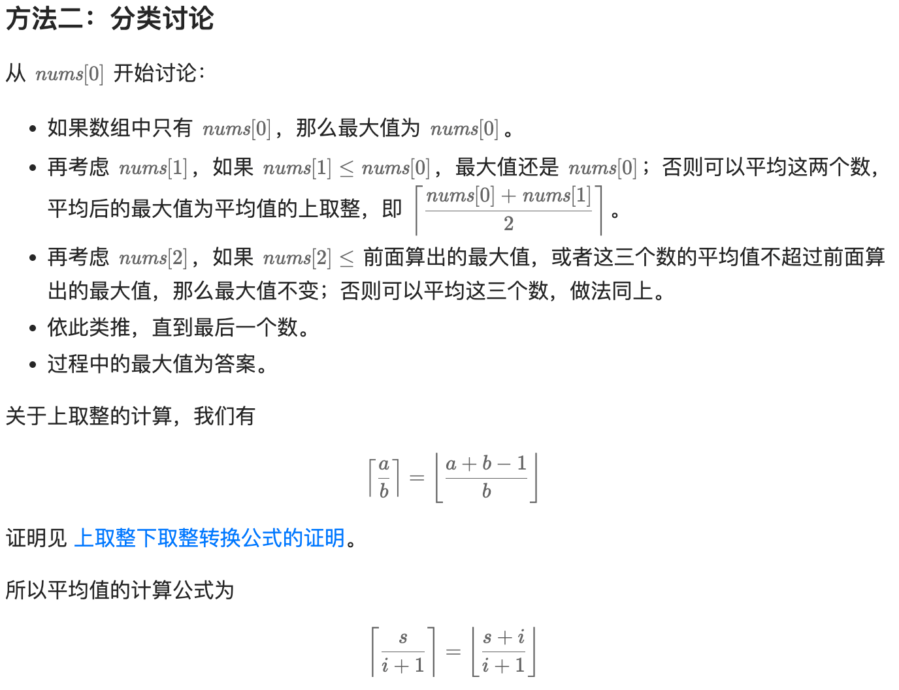

```python
class Solution:
    def minimizeArrayValue(self, nums: List[int]) -> int:
        return max((s + i) // (i + 1) for i, s in enumerate(accumulate(nums)))
```

# 2517.礼盒的最大甜蜜度（中等）

## 题目描述

给你一个正整数数组 `price` ，其中 `price[i]` 表示第 `i` 类糖果的价格，另给你一个正整数 `k` 。

商店组合 `k` 类 **不同** 糖果打包成礼盒出售。礼盒的 **甜蜜度** 是礼盒中任意两种糖果 **价格** 绝对差的最小值。

返回礼盒的 **最大** 甜蜜度*。*

 

**示例 1：**

```
输入：price = [13,5,1,8,21,2], k = 3
输出：8
解释：选出价格分别为 [13,5,21] 的三类糖果。
礼盒的甜蜜度为 min(|13 - 5|, |13 - 21|, |5 - 21|) = min(8, 8, 16) = 8 。
可以证明能够取得的最大甜蜜度就是 8 。
```

**示例 2：**

```
输入：price = [1,3,1], k = 2
输出：2
解释：选出价格分别为 [1,3] 的两类糖果。 
礼盒的甜蜜度为 min(|1 - 3|) = min(2) = 2 。
可以证明能够取得的最大甜蜜度就是 2 。
```

**示例 3：**

```
输入：price = [7,7,7,7], k = 2
输出：0
解释：从现有的糖果中任选两类糖果，甜蜜度都会是 0 。
```

 

**提示：**

- `2 <= k <= price.length <= 105`
- `1 <= price[i] <= 109`

## 我的解答

很大程度上参考了上一题的解答方式，但是做的还是一知半解的

```python
class Solution:
    def maximumTastiness(self, price: List[int], k: int) -> int:
        def cal(mid:int)->int:
            pre = price[0] # 最小值
            count = 1 # 本身是一个
            for p in price:
                if p-pre>=mid:
                    count+=1
                    pre = p
            return count

        # 这个意思就是最大的最小值
        price.sort()
        left = 0
        right = price[-1]-price[0]+1 # 左闭右开
        while left<right:
            mid = (left+right)//2
            # 判断mid是否小于等于最后结果
            # 也就是判断如果结果是mid，可以选的数目是否大于k
            if cal(mid) >= k:
                left = mid+1
            else:
                right = mid
        return left-1
```

结果：

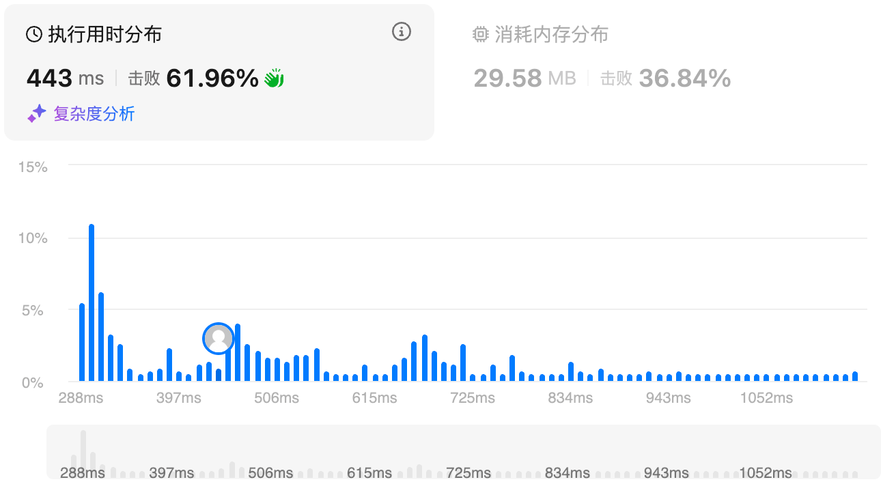

## 参考答案

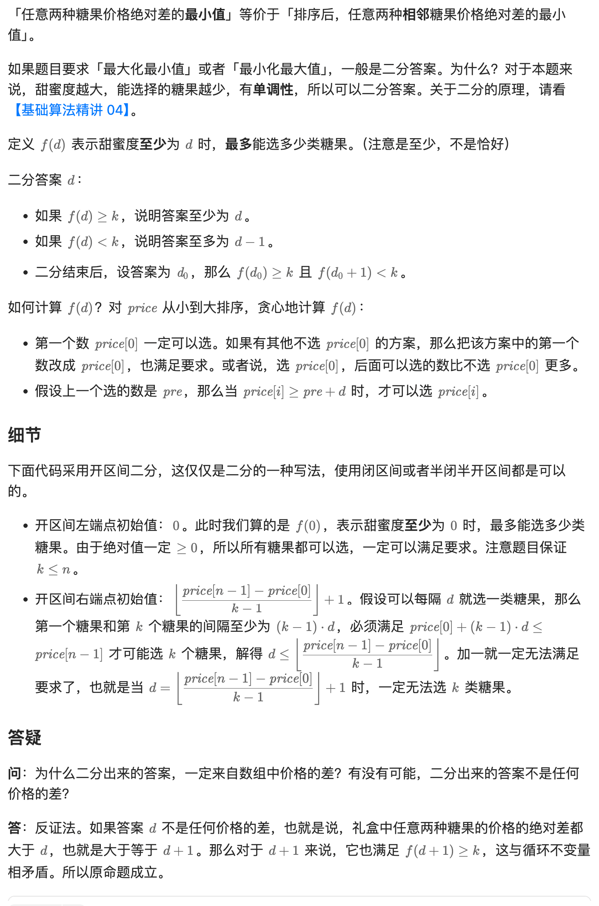

```python
class Solution:
    def maximumTastiness(self, price: List[int], k: int) -> int:
        def f(d: int) -> int:
            cnt = 1
            pre = price[0]  # 先选一个最小的甜蜜度
            for p in price:
                if p - pre >= d:  # 可以选
                    cnt += 1
                    pre = p  # 上一个选的甜蜜度
            return cnt

        price.sort()
        left = 0
        right = (price[-1] - price[0]) // (k - 1) + 1
        while left + 1 < right:  # 开区间不为空
            # 循环不变量：
            # f(left) >= k
            # f(right) < k
            mid = (left + right) // 2
            if f(mid) >= k:
                left = mid  # 下一轮二分 (mid, right)
            else:
                right = mid  # 下一轮二分 (left, mid)
        return left  # 最大的满足 f(left) >= k 的数
```

