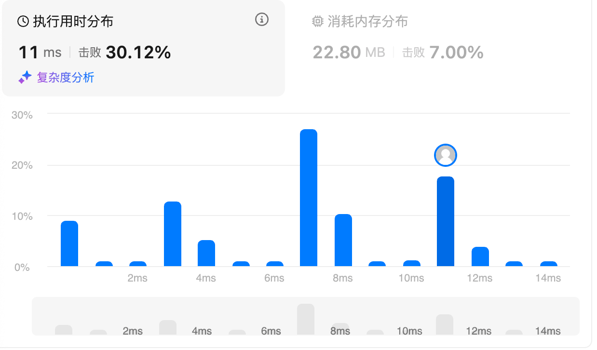
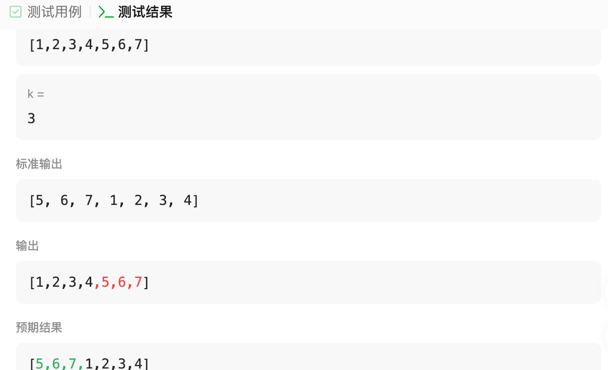
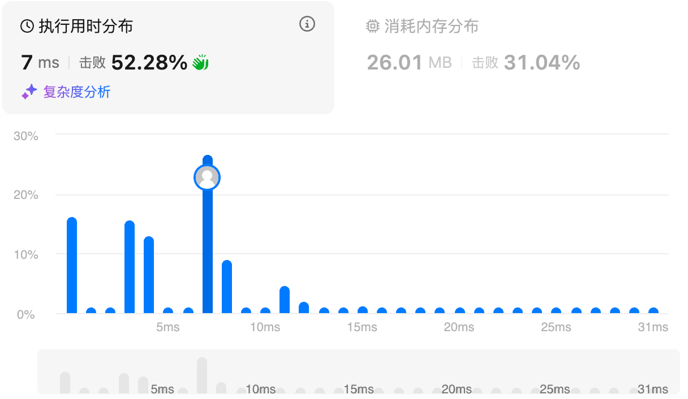
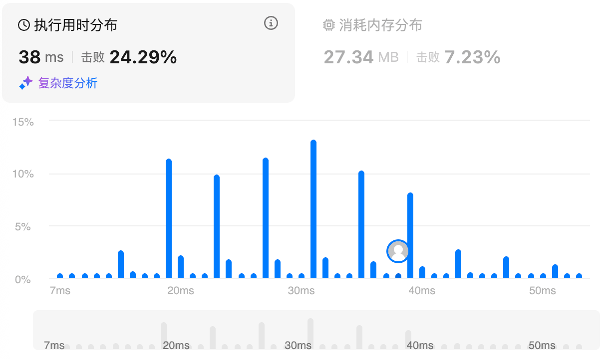
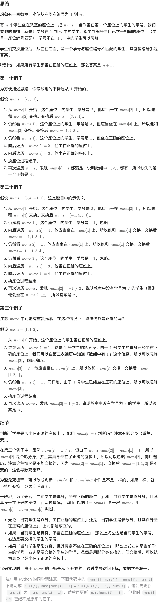
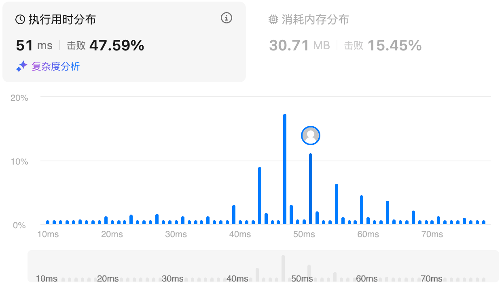
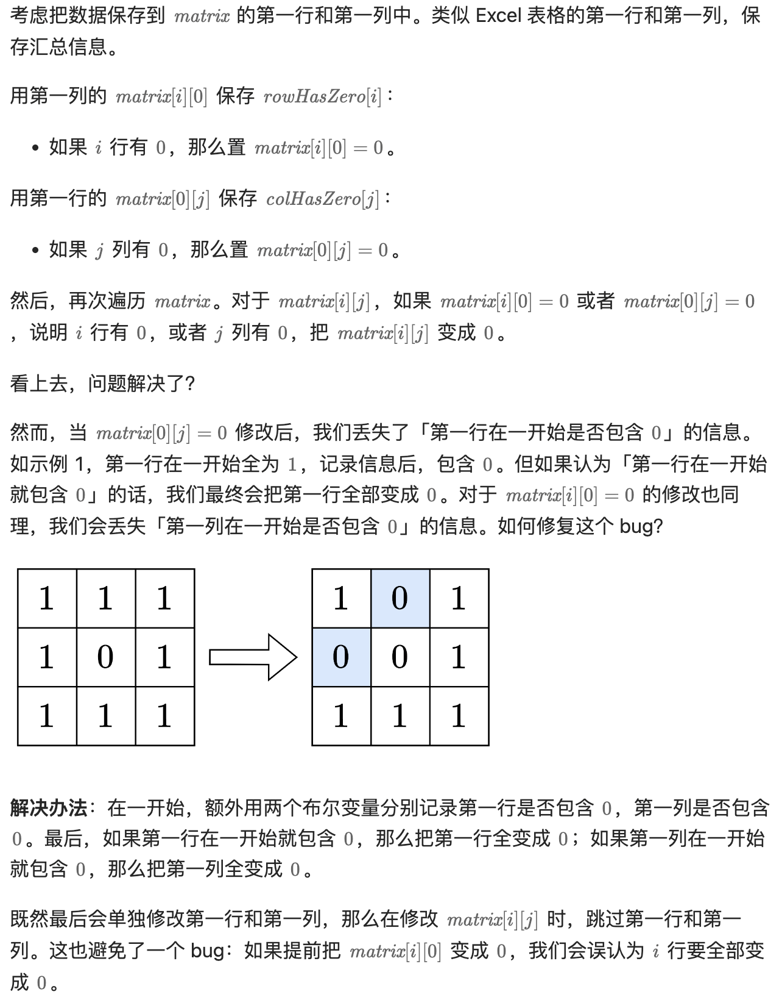
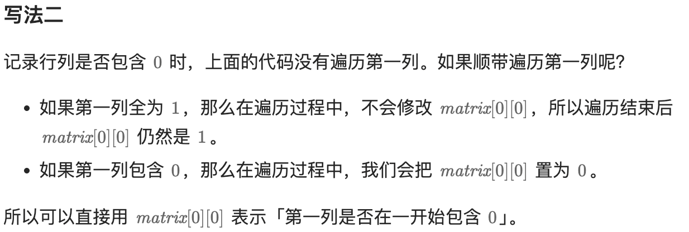
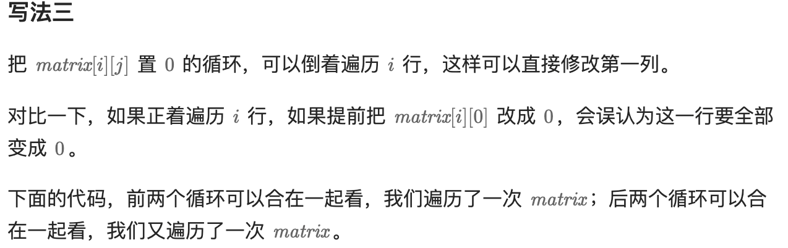

# 56.合并区间（中等）

## 题目描述

以数组 `intervals` 表示若干个区间的集合，其中单个区间为 `intervals[i] = [starti, endi]` 。请你合并所有重叠的区间，并返回 *一个不重叠的区间数组，该数组需恰好覆盖输入中的所有区间* 。

 

**示例 1：**

```
输入：intervals = [[1,3],[2,6],[8,10],[15,18]]
输出：[[1,6],[8,10],[15,18]]
解释：区间 [1,3] 和 [2,6] 重叠, 将它们合并为 [1,6].
```

**示例 2：**

```
输入：intervals = [[1,4],[4,5]]
输出：[[1,5]]
解释：区间 [1,4] 和 [4,5] 可被视为重叠区间。
```

**示例 3：**

```
输入：intervals = [[4,7],[1,4]]
输出：[[1,7]]
解释：区间 [1,4] 和 [4,7] 可被视为重叠区间。
```

 

**提示：**

- `1 <= intervals.length <= 104`
- `intervals[i].length == 2`
- `0 <= starti <= endi <= 104`

## 我的Python解答

第一次尝试：

```python
class Solution:
    def merge(self, intervals: List[List[int]]) -> List[List[int]]:
        # 本质上还是滑动窗口的形式把，先根据第一个元素对intervals排序
        intervals.sort()
        # 或者单调队列
        q = deque()
        q.append(intervals[0][0])
        q.append(intervals[0][1])
        ans = []
        for i in range(1,len(intervals)):
            element = intervals[i]
            tmp = []
            if element[0] > q[-1]:
                ans.append([q[0],q[-1]])
                q.clear()
                q.append(element[0])
                q.append(element[1])
                continue
            while len(q)>0 and element[0]<=q[-1]:
                q.pop()
            if not len(q):
                q.append(element[0]) # 全部弹出去，也就是说两个元素的0号一致，则需要填入内容
            q.append(element[1])
        ans.append([q[0],q[-1]])
        return ans
```

错例：`[[1,4],[2,3]]`因为删除错了，现在想想一个数组即可解决，只需要两位

```python
class Solution:
    def merge(self, intervals: List[List[int]]) -> List[List[int]]:
        # 本质上还是滑动窗口的形式把，先根据第一个元素对intervals排序
        intervals.sort()
        ans = []
        tmp = intervals[0]
        for e in intervals:
            if e[0] > tmp[1]:
                # 新的区间，需要弹出了
                ans.append(tmp[:])
                tmp = e
            elif e[1]>tmp[1]:
                # 更新区间
                tmp[1] = e[1]
        ans.append(tmp[:])
        return ans
```

答案：



## Python参考答案

```python
class Solution:
    def merge(self, intervals: List[List[int]]) -> List[List[int]]:
        intervals.sort(key=lambda p: p[0])  # 按照左端点从小到大排序
        ans = []
        for p in intervals:
            if ans and p[0] <= ans[-1][1]:  # 可以合并
                ans[-1][1] = max(ans[-1][1], p[1])  # 更新右端点最大值
            else:  # 不相交，无法合并
                ans.append(p)  # 新的合并区间
        return ans
```


## Python收获

### sort函数

#### 一、sort的定位与基本特性

sort 是 **list 的原地排序方法**，调用形式为 list.sort(...)，它会直接修改原列表顺序并返回 None。它与 sorted() 的核心区别在于：sort 原地修改、仅适用于 list；sorted 返回新列表、适用于任意可迭代对象。二者底层算法相同，均为 **稳定排序 TimSort**，时间复杂度平均与最坏情况为 `O(nlog n)`，在部分有序数据上接近 O(n)。

#### **二、函数签名与参数含义**

```python
list.sort(*, key=None, reverse=False)
```

key：排序键函数，指定“按什么比较”；默认 None 表示直接比较元素本身。

reverse：是否反转排序结果；False 为升序，True 为降序。

重要性质：稳定性（相等键值的元素保持原相对顺序）、原地修改（不返回新列表）。

#### **三、比较规则与可比性约束**

当 key=None 时，元素本身必须两两可比较；当提供 key 时，比较的是 key(x) 的返回值，因此 **所有 key 返回值必须可相互比较**。Python3 不允许比较不相关类型（如 int 与 str），否则抛出 TypeError。工程修复套路：统一 key 返回类型；或返回结构化元组，在第一维放置可比较的“类型/缺失标记”。

#### **四、核心参数** key的用法与模式

key 接收一元函数，对每个元素计算一次排序键并缓存，再按键排序。

按字符串长度排序：

```py
words = ["apple", "a", "banana", "cat"]
words.sort(key=len)
```

忽略大小写排序：

```python
names = ["bob", "Alice", "carol"]
names.sort(key=str.lower)
```

按字典字段排序：

```python
rows = [{"id":3,"score":9},{"id":1,"score":2},{"id":2,"score":5}]
rows.sort(key=lambda r: r["score"])
```

按对象属性排序（更可读）：

```python
from operator import attrgetter
rows.sort(key=attrgetter("score"))
```

多关键字排序（key 返回元组，按从左到右逐字段比较）：

```python
pairs = [(1,5),(0,7),(1,2)]
pairs.sort(key=lambda x: (x[0], x[1]))
```

#### **五、**reverse **的语义与“局部降序”的实现**

整体降序：

```py
a = [3,1,2]
a.sort(reverse=True)
```

配合 key 的整体降序：

```python
pairs.sort(key=lambda x: x[1], reverse=True)
```

字段 A 升序、字段 B 降序（B 为数值）：

```python
pairs.sort(key=lambda x: (x[0], -x[1]))
```

若字段不可取负（如字符串），可用“稳定排序链式法”（见下一节）或排名映射。

#### **六、稳定排序的利用：链式多字段排序**

稳定性允许“先次要、后主要”的多次排序：

```python
rows.sort(key=lambda r: r["name"])          # 次要键
rows.sort(key=lambda r: r["score"], reverse=True)  # 主要键（降序）
```

最终效果：以 score 为主序（降序），同分时按 name 升序。

#### **七、按“数组某一维度”排序（二维/记录结构）**

二维列表按第 k 列升序/降序：

```py
rows = [[3,9],[1,2],[2,5]]
rows.sort(key=lambda r: r[0])               # 第0列升序
rows.sort(key=lambda r: r[0], reverse=True) # 第0列降序
```

多维混合方向：

```python
rows.sort(key=lambda r: (r[0], -r[1]))       # 第0列升序，第1列降序（数值）
```

字典数组按字段（含缺失处理，缺失放后）：

```python
rows.sort(key=lambda r: (r.get("score") is None, r.get("score", 0)))
```

#### **八、常见实用技巧**

排序索引而不移动原数组：

```python
a = [50,10,20]
idx = list(range(len(a)))
idx.sort(key=lambda i: a[i])
```

按绝对值排序（稳定性保留同绝对值的原顺序）：

```python
a = [-3,1,-2,5]
a.sort(key=abs)
```

自定义优先级排序（业务规则映射）：

```python
rank = {"high":0,"mid":1,"low":2}
items = ["mid","low","high","mid"]
items.sort(key=lambda x: rank.get(x, 999))
```

#### **九、常见误用与注意事项**

list.sort() 返回 None，不要写 a = a.sort()；混合不可比较类型会报错；key 返回值必须统一可比；若只需 Top-K 且数据很大，避免全量 sort（可考虑更合适的算法工具）。

#### **十、总结**

sort 的本质是“**稳定、原地、以 key 为核心的排序**”。掌握三点即可覆盖绝大多数需求：1）用 key 明确排序依据；2）用 reverse 或 key 变换控制方向；3）用稳定性实现多字段与混合方向排序。

# 189.轮转数组（中等）

## 题目描述

给定一个整数数组 `nums`，将数组中的元素向右轮转 `k` 个位置，其中 `k` 是非负数。

 

**示例 1:**

```
输入: nums = [1,2,3,4,5,6,7], k = 3
输出: [5,6,7,1,2,3,4]
解释:
向右轮转 1 步: [7,1,2,3,4,5,6]
向右轮转 2 步: [6,7,1,2,3,4,5]
向右轮转 3 步: [5,6,7,1,2,3,4]
```

**示例 2:**

```
输入：nums = [-1,-100,3,99], k = 2
输出：[3,99,-1,-100]
解释: 
向右轮转 1 步: [99,-1,-100,3]
向右轮转 2 步: [3,99,-1,-100]
```

 

**提示：**

- `1 <= nums.length <= 105`
- `-231 <= nums[i] <= 231 - 1`
- `0 <= k <= 105`

 

**进阶：**

- 尽可能想出更多的解决方案，至少有 **三种** 不同的方法可以解决这个问题。
- 你可以使用空间复杂度为 `O(1)` 的 **原地** 算法解决这个问题吗？

## 我的解答

```python
class Solution:
    def rotate(self, nums: List[int], k: int) -> None:
        """
        Do not return anything, modify nums in-place instead.
        """
        n = len(nums)
        k = k%n
        nums = nums[n-k:n] + nums[0:n-k]
        print(nums)
        return
```

明明标准输出是正确的，可是输出是错误的



上面的错因是`nums = nums[n-k:n] + nums[0:n-k]`这一行代码创建了一个**新的列表**，并将其赋值给局部变量 `nums`。但是：

1. 这并没有修改调用者传入的原始列表
2. `nums` 现在指向一个新列表，原列表内容未变

最直观的解决方案是等号前面换为`nums[:]`


原地换位，可以前半部分逆置，后半部分逆置，再全局逆置

```python
class Solution:
    def rotate(self, nums: List[int], k: int) -> None:
        """
        Do not return anything, modify nums in-place instead.
        """
        # 原地换，需要前面若干个和后面若干个换，
        # 实际上可以前半部分逆置，后半部分逆置，再逆置全局
        def reverse(nums: List[int], start: int, end: int):
            # 左闭右闭合
            while start<end:
                nums[start], nums[end] = nums[end],nums[start]
                start += 1
                end -= 1
            return
        n = len(nums)
        k = k%n
        reverse(nums,0,n-k-1)
        reverse(nums,n-k,n-1)
        reverse(nums,0,n-1)
```

结果：



## 参考答案

```python
# 注：请勿使用切片，会产生额外空间
class Solution:
    def rotate(self, nums: List[int], k: int) -> None:
        def reverse(i: int, j: int) -> None:
            while i < j:
                nums[i], nums[j] = nums[j], nums[i]
                i += 1
                j -= 1

        n = len(nums)
        k %= n  # 轮转 k 次等于轮转 k % n 次
        reverse(0, n - 1)
        reverse(0, k - 1)
        reverse(k, n - 1)
```

# 238.除了自身以外数组的乘积（中等）

## 题目描述

给你一个整数数组 `nums`，返回 数组 `answer` ，其中 `answer[i]` 等于 `nums` 中除了 `nums[i]` 之外其余各元素的乘积 。

题目数据 **保证** 数组 `nums`之中任意元素的全部前缀元素和后缀的乘积都在 **32 位** 整数范围内。

请 **不要使用除法，**且在 `O(n)` 时间复杂度内完成此题。

 

**示例 1:**

```
输入: nums = [1,2,3,4]
输出: [24,12,8,6]
```

**示例 2:**

```
输入: nums = [-1,1,0,-3,3]
输出: [0,0,9,0,0]
```

 

**提示：**

- `2 <= nums.length <= 105`
- `-30 <= nums[i] <= 30`
- 输入 **保证** 数组 `answer[i]` 在 **32 位** 整数范围内

 

**进阶：**你可以在 `O(1)` 的额外空间复杂度内完成这个题目吗？（ 出于对空间复杂度分析的目的，输出数组 **不被视为** 额外空间。）

## 我的解答

 我看了一下提示1，它建议以线形时间复杂度先统计前缀积和后缀积

下面这个本质上做了三次遍历，除了ans之外创建了两个数组

```python
class Solution:
    def productExceptSelf(self, nums: List[int]) -> List[int]:
        # 又要o(n) 又要不用除法 有点难度啊
        prefix = [1]*len(nums)
        suffix = [1]*len(nums)
        for i in range(1,len(nums)):
            prefix[i] = prefix[i-1]* nums[i-1]
        for j in range(len(nums)-2,-1,-1):
            suffix[j] = suffix[j+1]*nums[j+1]
        ans = []
        for i in range(len(nums)):
            ans.append(prefix[i]*suffix[i])
        return ans
```

结果：



空间优化：直接在ans上做，只需要额外维护一个后缀积结果tmp即可

```python
class Solution:
    def productExceptSelf(self, nums: List[int]) -> List[int]:
        # 空间优化
        ans = [1]*len(nums)
        for i in range(1,len(nums)):
            ans[i] = ans[i-1]*nums[i-1]
        tmp = 1
        for j in range(len(nums)-1,-1,-1):
            ans[j] = ans[j]*tmp
            tmp *= nums[j]
        return ans
```

结果：


## 参考答案

优化前：

```python
class Solution:
    def productExceptSelf(self, nums: List[int]) -> List[int]:
        n = len(nums)
        pre = [1] * n
        for i in range(1, n):
            pre[i] = pre[i - 1] * nums[i - 1]

        suf = [1] * n
        for i in range(n - 2, -1, -1):
            suf[i] = suf[i + 1] * nums[i + 1]

        return [p * s for p, s in zip(pre, suf)]
```

优化后：

```python
class Solution:
    def productExceptSelf(self, nums: List[int]) -> List[int]:
        n = len(nums)
        suf = [1] * n
        for i in range(n - 2, -1, -1):
            suf[i] = suf[i + 1] * nums[i + 1]

        pre = 1
        for i, x in enumerate(nums):
            # 此时 pre 为 nums[0] 到 nums[i-1] 的乘积，直接乘到 suf[i] 中
            suf[i] *= pre
            pre *= x

        return suf
```

# 41.缺失的第一个正数（困难）

## 题目描述

给你一个未排序的整数数组 `nums` ，请你找出其中没有出现的最小的正整数。

请你实现时间复杂度为 `O(n)` 并且只使用常数级别额外空间的解决方案。

 

**示例 1：**

```
输入：nums = [1,2,0]
输出：3
解释：范围 [1,2] 中的数字都在数组中。
```

**示例 2：**

```
输入：nums = [3,4,-1,1]
输出：2
解释：1 在数组中，但 2 没有。
```

**示例 3：**

```
输入：nums = [7,8,9,11,12]
输出：1
解释：最小的正数 1 没有出现。
```

 

**提示：**

- `1 <= nums.length <= 105`
- `-231 <= nums[i] <= 231 - 1`

 

## 我的解答

耗时太长，直接放弃

```python
class Solution:
    def firstMissingPositive(self, nums: List[int]) -> int:
        # 如果没有规定常数级的空间，那我会用Counter
        # 要求时间o(n) 那也不能排序了
        # 看了提示1，那就是对nums进行操作了
        # 先把非正移动到左边吧
        left, right = 0, len(nums)-1
        # 左右闭合，左找正，右找非正
        while left<right:
            while left<len(nums) and nums[left]<=0:
                left += 1
            while right>-1 and nums[right] > 0:
                right -= 1
            if left<len(nums) and right>-1:
                nums[left], nums[right] = nums[right], nums[left]
                left += 1
                right -= 1
        # 此时非正都在左边，正数都在右边
        # 最小是1，最大是len(nums)+1 所以直接在nums上错位
        print(nums)
        for i in range(len(nums)):
            if nums[i]<=0:
                continue
            # 此时进入正数范围内
            x = nums[i]
            if x<len(nums)+1:
                if x-1<=i:
                    nums[x-1] = 1
                    if x==1 and i!=0:
                        nums[i] = 0
                else:
                    nums[i] = 0
            else:
                nums[i] = 0
        print(nums)
        for i in range(len(nums)):
            if nums[i] != 1:
                return i+1
        return len(nums)+1

```

结果是错误的

## 参考答案



```python
class Solution:
    def firstMissingPositive(self, nums: List[int]) -> int:
        n = len(nums)
        for i in range(n):
            while 1<=nums[i] <= n and nums[nums[i]-1]!=nums[i]:
                j = nums[i]-1
                nums[i], nums[j] = nums[j], nums[i]
        for i in range(n):
            if nums[i] != i+1:
                return i+1
        return n+1
```

结果：



# 73.矩阵置0（中等）

## 题目描述

给定一个 `*m* x *n*` 的矩阵，如果一个元素为 **0** ，则将其所在行和列的所有元素都设为 **0** 。请使用 **[原地](http://baike.baidu.com/item/原地算法)** 算法**。**

 

**示例 1：**


```
输入：matrix = [[1,1,1],[1,0,1],[1,1,1]]
输出：[[1,0,1],[0,0,0],[1,0,1]]
```

**示例 2：**


```
输入：matrix = [[0,1,2,0],[3,4,5,2],[1,3,1,5]]
输出：[[0,0,0,0],[0,4,5,0],[0,3,1,0]]
```

 

**提示：**

- `m == matrix.length`
- `n == matrix[0].length`
- `1 <= m, n <= 200`
- `-231 <= matrix[i][j] <= 231 - 1`

 

**进阶：**

- 一个直观的解决方案是使用  `O(*m**n*)` 的额外空间，但这并不是一个好的解决方案。
- 一个简单的改进方案是使用 `O(*m* + *n*)` 的额外空间，但这仍然不是最好的解决方案。
- 你能想出一个仅使用常量空间的解决方案吗？

## 我的解答

直接先暴力，这个空间就是o(m+n)

```python
class Solution:
    def setZeroes(self, matrix: List[List[int]]) -> None:
        """
        Do not return anything, modify matrix in-place instead.
        """
        # 暴力：保存0的索引，然后再去遍历
        zero_list_rows = []
        zero_list_cols = []
        for i in range(len(matrix)):
            for j in range(len(matrix[0])):
                if matrix[i][j] == 0:
                    zero_list_rows.append(i) # 顺序天然有序，先i后j
                    zero_list_cols.append(j)
        
        for i in range(len(matrix)):
            for j in range(len(matrix[0])):
                if i in zero_list_rows or j in zero_list_cols:
                    matrix[i][j] = 0
        matrix = matrix[:]
```

结果：


## 参考答案

### 方法1:额外数组

```python
class Solution:
    def setZeroes(self, matrix: List[List[int]]) -> None:
        row_has_zero = [0 in row for row in matrix]  # 行是否包含 0
        col_has_zero = [0 in col for col in zip(*matrix)]  # 列是否包含 0

        for i, row0 in enumerate(row_has_zero):
            for j, col0 in enumerate(col_has_zero):
                if row0 or col0:  # i 行或 j 列有 0
                    matrix[i][j] = 0  # 题目要求原地修改，无返回值
```

#### 复杂度分析

- 时间复杂度：O(*mn*)，其中 *m* 和 *n* 分别是 *matrix* 的行数和列数。
- 空间复杂度：O(*m*+*n*)。

### 方法2:不使用额外数组



```python
class Solution:
    def setZeroes(self, matrix: List[List[int]]) -> None:
        m, n = len(matrix), len(matrix[0])
        first_row_has_zero = 0 in matrix[0]  # 记录第一行是否包含 0
        first_col_has_zero = any(row[0] == 0 for row in matrix)  # 记录第一列是否包含 0

        # 用第一列 matrix[i][0] 保存 row_has_zero[i]
        # 用第一行 matrix[0][j] 保存 col_has_zero[j]
        for i in range(1, m):  # 无需遍历第一行，如果 matrix[0][j] 本身是 0，那么相当于 col_has_zero[j] 已经是 True
            for j in range(1, n):  # 无需遍历第一列，如果 matrix[i][0] 本身是 0，那么相当于 row_has_zero[i] 已经是 True
                if matrix[i][j] == 0:
                    matrix[i][0] = 0  # 相当于 row_has_zero[i] = True
                    matrix[0][j] = 0  # 相当于 col_has_zero[j] = True

        for i in range(1, m):  # 跳过第一行，留到最后修改
            for j in range(1, n):  # 跳过第一列，留到最后修改
                if matrix[i][0] == 0 or matrix[0][j] == 0:  # i 行或 j 列有 0
                    matrix[i][j] = 0

        # 如果第一列一开始就包含 0，那么把第一列全变成 0
        if first_col_has_zero:
            for row in matrix:
                row[0] = 0

        # 如果第一行一开始就包含 0，那么把第一行全变成 0
        if first_row_has_zero:
            for j in range(n):
                matrix[0][j] = 0
```



```python
class Solution:
    def setZeroes(self, matrix: List[List[int]]) -> None:
        m, n = len(matrix), len(matrix[0])
        first_row_has_zero = 0 in matrix[0]

        for i in range(1, m):
            for j in range(n):  # 如果第一列包含 0，那么 matrix[0][0] 会置为 0
                if matrix[i][j] == 0:
                    matrix[i][0] = matrix[0][j] = 0

        for i in range(1, m):
            for j in range(1, n):
                if matrix[i][0] == 0 or matrix[0][j] == 0:
                    matrix[i][j] = 0

        # 注意顺序，先改第一列，再改第一行（避免把 matrix[0][0] 从 1 改成 0 影响判断）
        if matrix[0][0] == 0:  # 替换原来的 first_col_has_zero
            for row in matrix:
                row[0] = 0

        if first_row_has_zero:
            for j in range(n):
                matrix[0][j] = 0
```



```python
class Solution:
    def setZeroes(self, matrix: List[List[int]]) -> None:
        m, n = len(matrix), len(matrix[0])
        first_row_has_zero = 0 in matrix[0]

        for i in range(1, m):
            for j in range(n):
                if matrix[i][j] == 0:
                    matrix[i][0] = matrix[0][j] = 0

        for i in range(1, m):
            # 倒着遍历，避免提前把 matrix[i][0] 改成 0，误认为这一行要全部变成 0
            for j in range(n - 1, -1, -1):
                if matrix[i][0] == 0 or matrix[0][j] == 0:
                    matrix[i][j] = 0

        if first_row_has_zero:
            for j in range(n):
                matrix[0][j] = 0
```

