# 54.螺旋矩阵（中等）

## 题目描述

给你一个 `m` 行 `n` 列的矩阵 `matrix` ，请按照 **顺时针螺旋顺序** ，返回矩阵中的所有元素。

 

**示例 1：**


```
输入：matrix = [[1,2,3],[4,5,6],[7,8,9]]
输出：[1,2,3,6,9,8,7,4,5]
```

**示例 2：**


```
输入：matrix = [[1,2,3,4],[5,6,7,8],[9,10,11,12]]
输出：[1,2,3,4,8,12,11,10,9,5,6,7]
```

 

**提示：**

- `m == matrix.length`
- `n == matrix[i].length`
- `1 <= m, n <= 10`
- `-100 <= matrix[i][j] <= 100`

## 我的Python解答

本来想的是转置之后读取

耗时太长，没有a出来，直接看答案

## Python参考答案

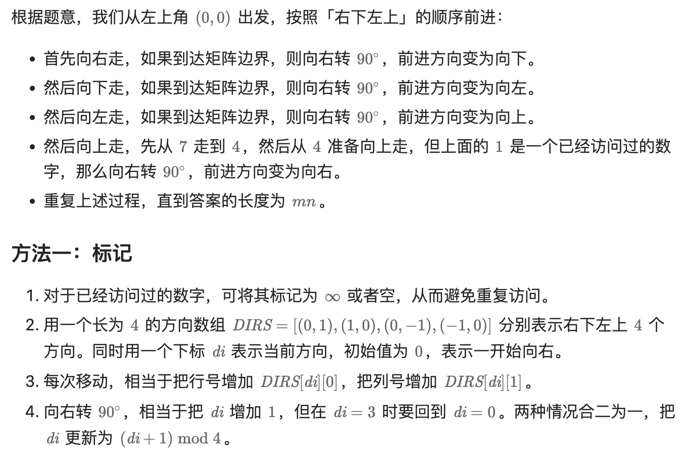

```python
DIRS = (0, 1), (1, 0), (0, -1), (-1, 0)  # 右下左上

class Solution:
    def spiralOrder(self, matrix: List[List[int]]) -> List[int]:
        m, n = len(matrix), len(matrix[0])
        ans = []
        i = j = di = 0
        for _ in range(m * n):  # 一共走 mn 步
            ans.append(matrix[i][j])
            matrix[i][j] = None  # 标记，表示已经访问过（已经加入答案）
            x, y = i + DIRS[di][0], j + DIRS[di][1]  # 下一步的位置
            # 如果 (x, y) 出界或者已经访问过
            if x < 0 or x >= m or y < 0 or y >= n or matrix[x][y] is None:
                di = (di + 1) % 4  # 右转 90°
            i += DIRS[di][0]
            j += DIRS[di][1]  # 走一步
        return ans
```

#### 复杂度分析

- 时间复杂度：O(*mn*)，其中 *m* 和 *n* 分别为 *matrix* 的行数和列数。
- 空间复杂度：O(1)。返回值不计入。

结果：

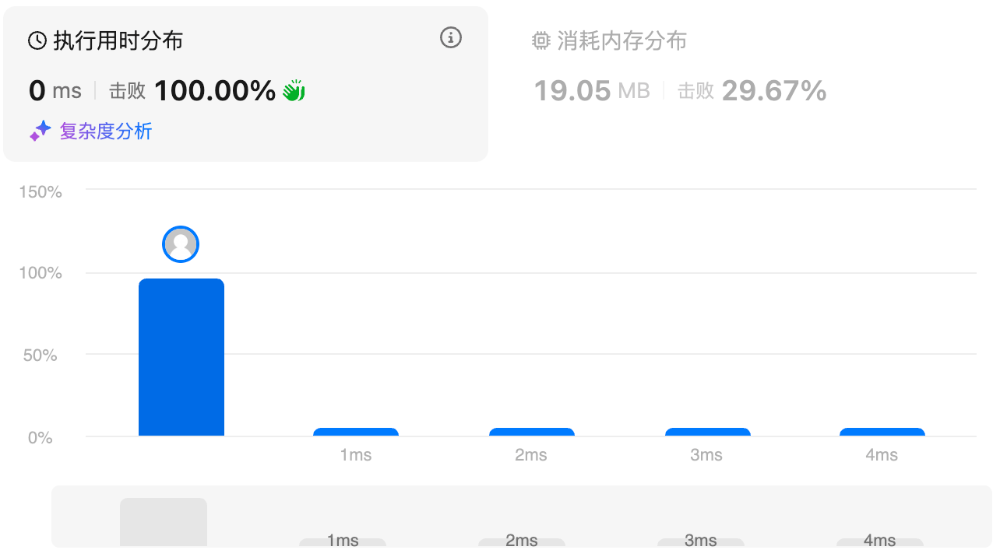

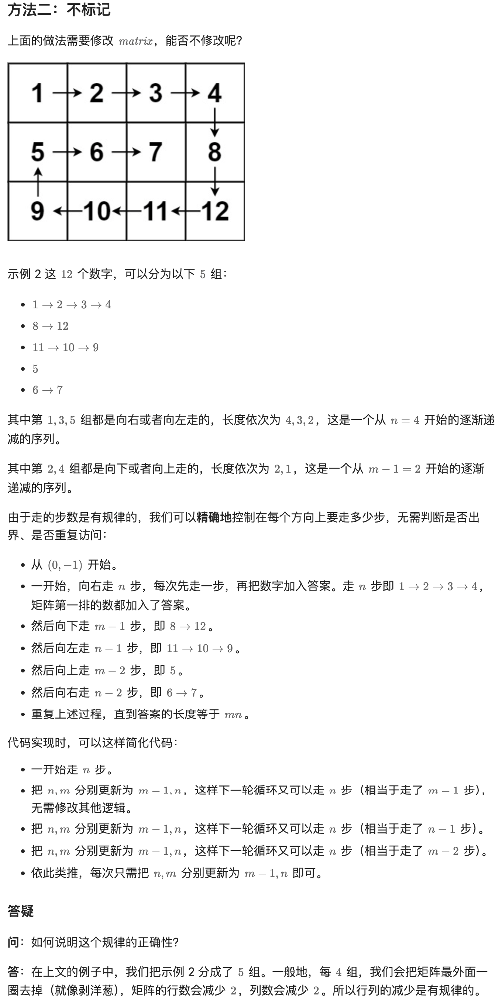

```python
DIRS = (0, 1), (1, 0), (0, -1), (-1, 0)  # 右下左上

class Solution:
    def spiralOrder(self, matrix: List[List[int]]) -> List[int]:
        m, n = len(matrix), len(matrix[0])
        size = m * n
        ans = []
        i, j, di = 0, -1, 0  # 从 (0, -1) 开始
        while len(ans) < size:
            dx, dy = DIRS[di]
            for _ in range(n):  # 走 n 步（注意 n 会减少）
                i += dx
                j += dy  # 先走一步
                ans.append(matrix[i][j])  # 再加入答案
            di = (di + 1) % 4  # 右转 90°
            n, m = m - 1, n  # 减少后面的循环次数（步数）
        return ans
```

# 48.旋转图像（中等）

## 题目描述

给定一个 *n* × *n* 的二维矩阵 `matrix` 表示一个图像。请你将图像顺时针旋转 90 度。

你必须在**[ 原地](https://baike.baidu.com/item/原地算法)** 旋转图像，这意味着你需要直接修改输入的二维矩阵。**请不要** 使用另一个矩阵来旋转图像。

 

**示例 1：**


```
输入：matrix = [[1,2,3],[4,5,6],[7,8,9]]
输出：[[7,4,1],[8,5,2],[9,6,3]]
```

**示例 2：**


```
输入：matrix = [[5,1,9,11],[2,4,8,10],[13,3,6,7],[15,14,12,16]]
输出：[[15,13,2,5],[14,3,4,1],[12,6,8,9],[16,7,10,11]]
```

 

**提示：**

- `n == matrix.length == matrix[i].length`
- `1 <= n <= 20`
- `-1000 <= matrix[i][j] <= 1000`

## 我的解答 

纯纯的数学推导，最外层先转，固定最外层不变，转内层。

旋转逻辑就是：

i,j -> j, n-1-i -> n-1-i, n-1-j -> n-1-j, i

外层只用转向上取整的一半，内层只用转到倒数第二个元素（开区间）

```python
class Solution:
    def rotate(self, matrix: List[List[int]]) -> None:
        """
        Do not return anything, modify matrix in-place instead.
        """
        # [i][j] -> [j][n-1-i]
        n = len(matrix)
        # 一层一层转
        layer = 0
        for i in range((n-1)//2 + 1):
            layer += 1
            for j in range(i,n-layer):
                matrix[j][n-1-i], matrix[n-1-i][n-1-j], matrix[n-1-j][i],matrix[i][j] = matrix[i][j], matrix[j][n-1-i], matrix[n-1-i][n-1-j], matrix[n-1-j][i]

```

结果：

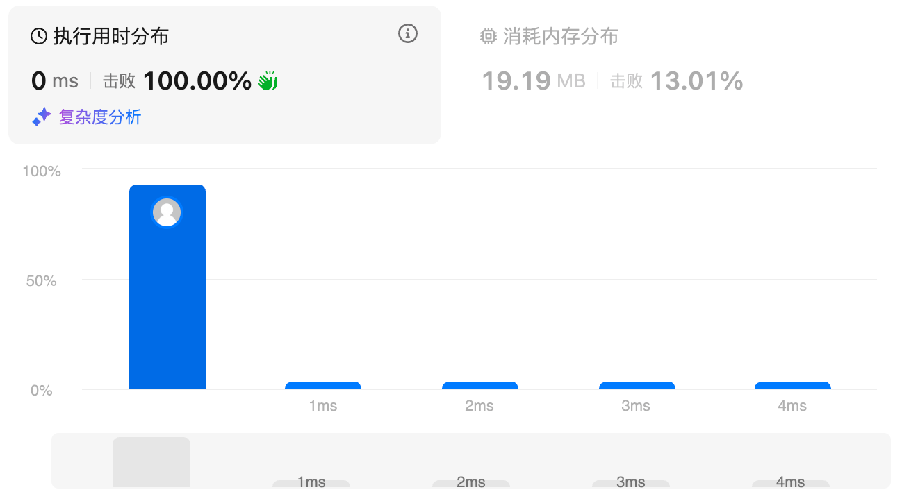

## 参考答案

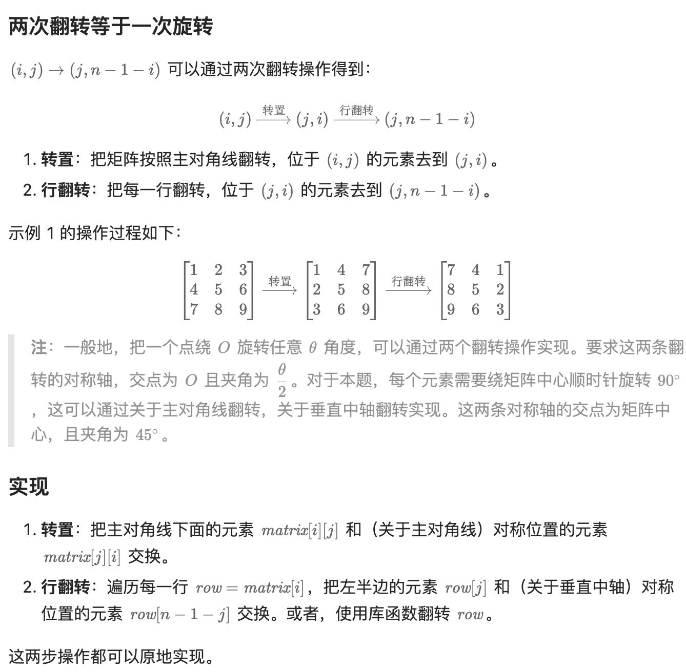

```python
class Solution:
    def rotate(self, matrix: List[List[int]]) -> None:
        n = len(matrix)
        # 第一步：转置
        for i in range(n):
            for j in range(i):  # 遍历对角线下方元素
                matrix[i][j], matrix[j][i] = matrix[j][i], matrix[i][j]

        # 第二步：行翻转
        for row in matrix:
            row.reverse()
```

```python
class Solution:
    def rotate(self, matrix: List[List[int]]) -> None:
        n = len(matrix)
        for i, row in enumerate(matrix):
            for j in range(i + 1, n):  # 遍历对角线上方元素，做转置
                row[j], matrix[j][i] = matrix[j][i], row[j]
            row.reverse()  # 行翻转
```

# 240.搜索二维矩阵II（中等）

## 题目描述

编写一个高效的算法来搜索 `*m* x *n*` 矩阵 `matrix` 中的一个目标值 `target` 。该矩阵具有以下特性：

- 每行的元素从左到右升序排列。
- 每列的元素从上到下升序排列。

 

**示例 1：**


```
输入：matrix = [[1,4,7,11,15],[2,5,8,12,19],[3,6,9,16,22],[10,13,14,17,24],[18,21,23,26,30]], target = 5
输出：true
```

**示例 2：**


```
输入：matrix = [[1,4,7,11,15],[2,5,8,12,19],[3,6,9,16,22],[10,13,14,17,24],[18,21,23,26,30]], target = 20
输出：false
```

 

**提示：**

- `m == matrix.length`
- `n == matrix[i].length`
- `1 <= n, m <= 300`
- `-109 <= matrix[i][j] <= 109`
- 每行的所有元素从左到右升序排列
- 每列的所有元素从上到下升序排列
- `-109 <= target <= 109`

## 我的解答

最直观的，o(mn)，遍历数据表，但是没有用到任何矩阵的性质：

```python
from collections import defaultdict
class Solution:
    def searchMatrix(self, matrix: List[List[int]], target: int) -> bool:
        # counter
        cnt = defaultdict(int)
        for i in range(len(matrix)):
            for j in range(len(matrix[0])):
                cnt[matrix[i][j]] += 1
        return target in cnt
```

结果：

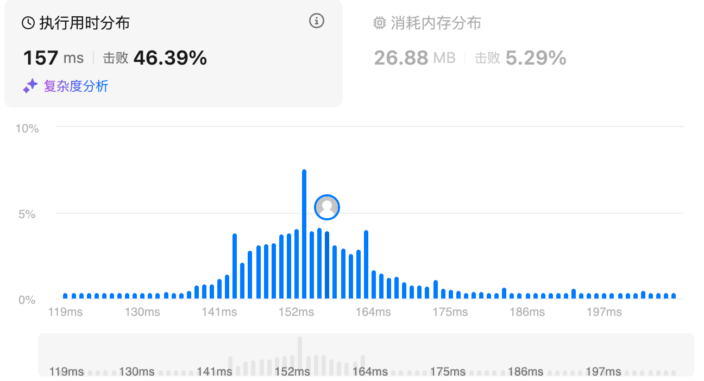

每一行进行二分查找，时间o(mlogn)

```python
from bisect import bisect_right
class Solution:
    def searchMatrix(self, matrix: List[List[int]], target: int) -> bool:
        # 每一行二分
        for i in range(len(matrix)):
            pos = bisect_right(matrix[i],target)
            if matrix[i][pos-1] == target:
                return True
        return False
```

结果：

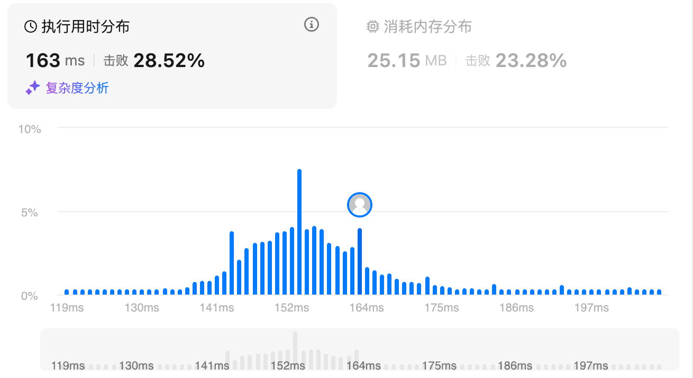

转置之后，同步查找，也就是在每一行和每一列都二分，最坏的时间复杂度是o(min(m,n)$\times$log(max(m,n)))

```python
from bisect import bisect_right
class Solution:
    def searchMatrix(self, matrix: List[List[int]], target: int) -> bool:
        # 每一行二分
        reverse = list(zip(*matrix))
        for i in range(min(len(matrix),len(reverse))):
            pos1 = bisect_right(matrix[i],target)
            pos2 = bisect_right(reverse[i],target)
            if matrix[i][pos1-1] == target or reverse[i][pos2-1] == target:
                return True
        return False
```

结果：

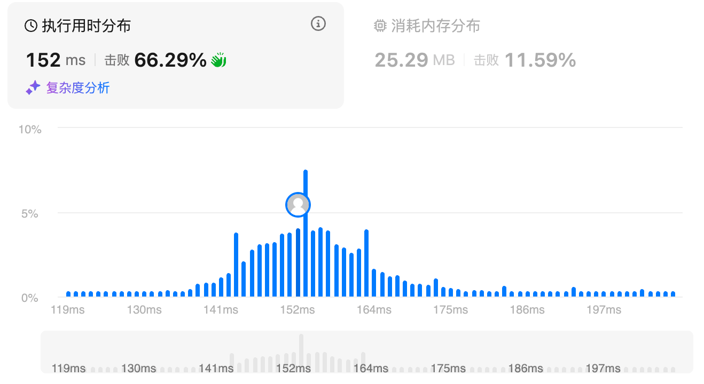

## 参考答案

排除法

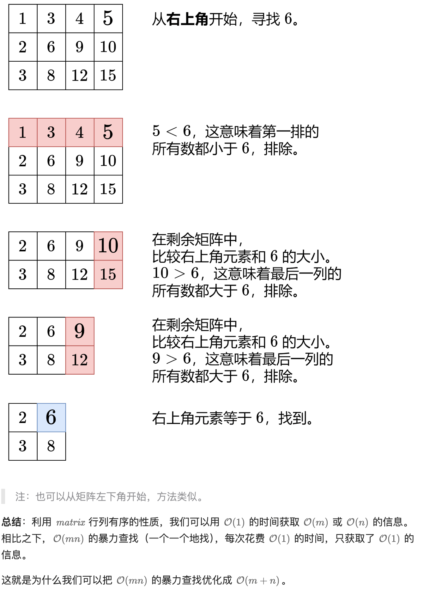

```python
class Solution:
    def searchMatrix(self, matrix: List[List[int]], target: int) -> bool:
        m, n = len(matrix), len(matrix[0])
        i, j = 0, n - 1  # 从右上角开始
        while i < m and j >= 0:  # 还有剩余元素
            if matrix[i][j] == target:
                return True  # 找到 target
            if matrix[i][j] < target:
                i += 1  # 这一行剩余元素全部小于 target，排除
            else:
                j -= 1  # 这一列剩余元素全部大于 target，排除
        return False
```

复杂度分析
时间复杂度：O(m+n)，其中 m 和 n 分别为 matrix 的行数和列数。每次循环排除掉一行或者一列，一共 m+n 行列，最坏情况下需要排除 m+n−1 行列才能找到答案。
空间复杂度：O(1)。

# 160.相交链表（简单）

## 题目描述。

给你两个单链表的头节点 `headA` 和 `headB` ，请你找出并返回两个单链表相交的起始节点。如果两个链表不存在相交节点，返回 `null` 。

图示两个链表在节点 `c1` 开始相交**：**

[](https://assets.leetcode.cn/aliyun-lc-upload/uploads/2018/12/14/160_statement.png)

题目数据 **保证** 整个链式结构中不存在环。

**注意**，函数返回结果后，链表必须 **保持其原始结构** 。

**自定义评测：**

**评测系统** 的输入如下（你设计的程序 **不适用** 此输入）：

- `intersectVal` - 相交的起始节点的值。如果不存在相交节点，这一值为 `0`
- `listA` - 第一个链表
- `listB` - 第二个链表
- `skipA` - 在 `listA` 中（从头节点开始）跳到交叉节点的节点数
- `skipB` - 在 `listB` 中（从头节点开始）跳到交叉节点的节点数

评测系统将根据这些输入创建链式数据结构，并将两个头节点 `headA` 和 `headB` 传递给你的程序。如果程序能够正确返回相交节点，那么你的解决方案将被 **视作正确答案** 。

 

**示例 1：**

[](https://assets.leetcode.com/uploads/2018/12/13/160_example_1.png)

```
输入：intersectVal = 8, listA = [4,1,8,4,5], listB = [5,6,1,8,4,5], skipA = 2, skipB = 3
输出：Intersected at '8'
解释：相交节点的值为 8 （注意，如果两个链表相交则不能为 0）。
从各自的表头开始算起，链表 A 为 [4,1,8,4,5]，链表 B 为 [5,6,1,8,4,5]。
在 A 中，相交节点前有 2 个节点；在 B 中，相交节点前有 3 个节点。
— 请注意相交节点的值不为 1，因为在链表 A 和链表 B 之中值为 1 的节点 (A 中第二个节点和 B 中第三个节点) 是不同的节点。换句话说，它们在内存中指向两个不同的位置，而链表 A 和链表 B 中值为 8 的节点 (A 中第三个节点，B 中第四个节点) 在内存中指向相同的位置。
```

 

**示例 2：**

[](https://assets.leetcode.com/uploads/2018/12/13/160_example_2.png)

```
输入：intersectVal = 2, listA = [1,9,1,2,4], listB = [3,2,4], skipA = 3, skipB = 1
输出：Intersected at '2'
解释：相交节点的值为 2 （注意，如果两个链表相交则不能为 0）。
从各自的表头开始算起，链表 A 为 [1,9,1,2,4]，链表 B 为 [3,2,4]。
在 A 中，相交节点前有 3 个节点；在 B 中，相交节点前有 1 个节点。
```

**示例 3：**

[](https://assets.leetcode.com/uploads/2018/12/13/160_example_3.png)

```
输入：intersectVal = 0, listA = [2,6,4], listB = [1,5], skipA = 3, skipB = 2
输出：No intersection
解释：从各自的表头开始算起，链表 A 为 [2,6,4]，链表 B 为 [1,5]。
由于这两个链表不相交，所以 intersectVal 必须为 0，而 skipA 和 skipB 可以是任意值。
这两个链表不相交，因此返回 null 。
```

 

**提示：**

- `listA` 中节点数目为 `m`
- `listB` 中节点数目为 `n`
- `1 <= m, n <= 3 * 104`
- `1 <= Node.val <= 105`
- `0 <= skipA <= m`
- `0 <= skipB <= n`
- 如果 `listA` 和 `listB` 没有交点，`intersectVal` 为 `0`
- 如果 `listA` 和 `listB` 有交点，`intersectVal == listA[skipA] == listB[skipB]`

 

**进阶：**你能否设计一个时间复杂度 `O(m + n)` 、仅用 `O(1)` 内存的解决方案？

## 我的解答

```python
# Definition for singly-linked list.
# class ListNode:
#     def __init__(self, x):
#         self.val = x
#         self.next = None

class Solution:
    def getIntersectionNode(self, headA: ListNode, headB: ListNode) -> Optional[ListNode]:
        # 双指针，先对齐，再同步移动
        # 但是如何获取长度呢？
        a = 0
        b = 0
        start = headA
        while start:
            a+=1
            start = start.next
        start = headB
        while start:
            b += 1
            start = start.next
        if a<=b:
            headA, headB = headB, headA
            a,b = b,a
        startA = headA
        startB = headB
        while a != b:
            startA = startA.next
            a -= 1
        for _ in range(b):
            if startA == startB:
                return startA
            startA = startA.next
            startB = startB.next
        return None
```

结果：

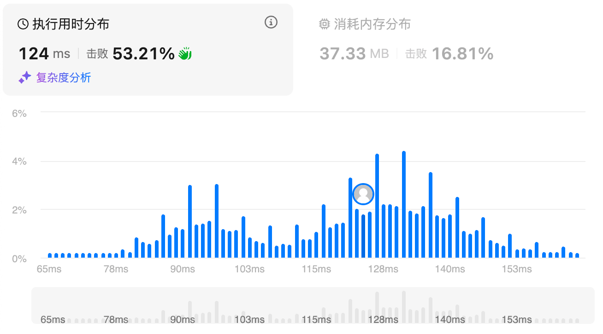

## 参考答案

如果a走到了空之后从b开始；b走到了空之后从a开始，那么如果二者有交点，一定会相遇

假设a = x+z, b = y+z，其中z为交集的长度

那么a+y = b+x

```python
class Solution:
    def getIntersectionNode(self, headA: ListNode, headB: ListNode) -> Optional[ListNode]:
        p, q = headA, headB
        while p is not q:
            p = p.next if p else headB
            q = q.next if q else headA
        return p
```

# 206.反转链表

## 题目描述

给你单链表的头节点 `head` ，请你反转链表，并返回反转后的链表。

 

**示例 1：**


```
输入：head = [1,2,3,4,5]
输出：[5,4,3,2,1]
```

**示例 2：**


```
输入：head = [1,2]
输出：[2,1]
```

**示例 3：**

```
输入：head = []
输出：[]
```

 

**提示：**

- 链表中节点的数目范围是 `[0, 5000]`
- `-5000 <= Node.val <= 5000`

 

**进阶：**链表可以选用迭代或递归方式完成反转。你能否用两种方法解决这道题？

## 我的解答

双指针解法

```python
# Definition for singly-linked list.
# class ListNode:
#     def __init__(self, val=0, next=None):
#         self.val = val
#         self.next = next
class Solution:
    def reverseList(self, head: Optional[ListNode]) -> Optional[ListNode]:
        if not head:
            return head
        # start,end双指针
        start = head
        p = head
        end = ListNode()
        while p:
            end = p
            p = p.next
        q = end
        p = start
        while p!=q:
            p = start.next
            start.next = q.next
            q.next = start
            start = p
        return q
```

结果：

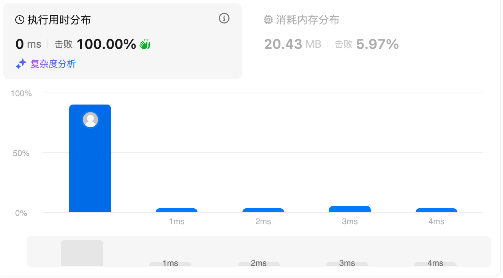

栈

```python
# Definition for singly-linked list.
# class ListNode:
#     def __init__(self, val=0, next=None):
#         self.val = val
#         self.next = next
from collections import deque
class Solution:
    def reverseList(self, head: Optional[ListNode]) -> Optional[ListNode]:
        if not head:
            return head
        # 直接搞一个栈
        stack = deque()
        while head:
            stack.append(head)
            head = head.next
        head = stack.pop()
        p = head
        while stack:
            q = stack.pop()
            q.next = None
            p.next = q
            p = p.next
        return head
```

结果：

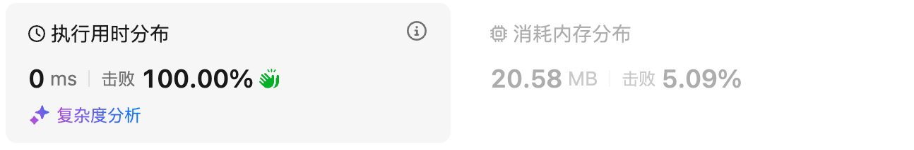

## 参考答案

### 方法1:递归（尾插法

```python
class Solution:
    # 首先「递」到链表末尾，把末尾节点作为新链表的头节点 rev_head
    # 然后在「归」的过程中，把经过的节点依次插在新链表的末尾（尾插法）
    def reverseList(self, head: Optional[ListNode]) -> Optional[ListNode]:
        # 判断 head is None 是为了兼容一开始链表就是空的情况
        if head is None or head.next is None:
            return head  # 链表末尾，即下面的 rev_head
        rev_head = self.reverseList(head.next)  # 「递」到链表末尾，拿到新链表的头节点
        tail = head.next  # 在「归」的过程中，head.next 就是新链表的末尾
        tail.next = head  # 把 head 插在新链表的末尾
        head.next = None  # 如果不写这行，新链表的末尾两个节点成环，这俩节点互相指向对方
        return rev_head
```

### 方法2:迭代（头插法

```python
class Solution:
    def reverseList(self, head: Optional[ListNode]) -> Optional[ListNode]:
        pre = None
        cur = head
        while cur:
            nxt = cur.next
            cur.next = pre  # 把 cur 插在 pre 链表的前面（头插法）
            pre = cur
            cur = nxt
        return pre
```

