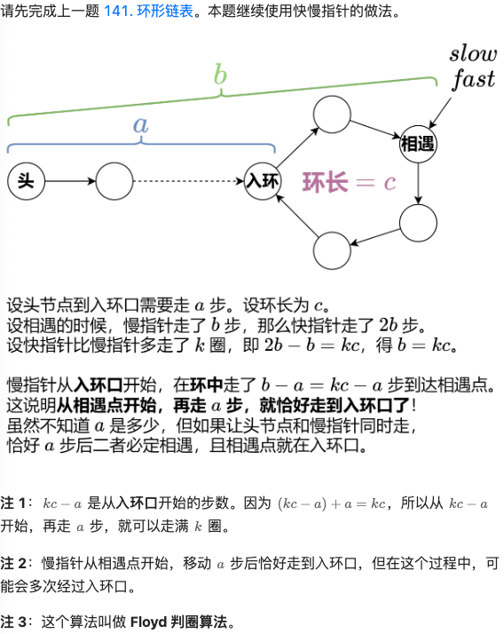

# 234.回文链表

## 题目描述

给你一个单链表的头节点 `head` ，请你判断该链表是否为回文链表。如果是，返回 `true` ；否则，返回 `false` 。

 

**示例 1：**


```
输入：head = [1,2,2,1]
输出：true
```

**示例 2：**


```
输入：head = [1,2]
输出：false
```

 

**提示：**

- 链表中节点数目在范围`[1, 105]` 内
- `0 <= Node.val <= 9`

 

**进阶：**你能否用 `O(n)` 时间复杂度和 `O(1)` 空间复杂度解决此题？

## 我的Python解答

一下子想到使用栈来做，因为链表本体是无法直接反向遍历的，当然也可以创建数组，再双指针遍历

```python
# Definition for singly-linked list.
# class ListNode:
#     def __init__(self, val=0, next=None):
#         self.val = val
#         self.next = next
from collections import deque
class Solution:
    def isPalindrome(self, head: Optional[ListNode]) -> bool:
        # 一下想到栈，全部入栈，同步出栈+便利
        st = deque()
        p = head
        while p:
            st.append(p)
            p = p.next
        p = head
        while p:
            q = st.pop()
            if p.val != q.val:
                return False
            p = p.next
        return True
```

结果：


如何减小空间？目前暂时没有想法，如何遍历的时候同步记忆之前的节点信息呢？

## Python参考答案

要想减小空间，需要做的是找到链表的中间节点，然后从中间节点开始，把后面的链表原地逆置，然后这样就找到了双指针，同步遍历判断即可，所以本质上是两个题的集合：先找中间节点，再逆置

```python
class Solution:
    # 876. 链表的中间结点
    def middleNode(self, head: Optional[ListNode]) -> Optional[ListNode]:
        slow = fast = head
        while fast and fast.next:
            slow = slow.next
            fast = fast.next.next
        return slow

    # 206. 反转链表
    def reverseList(self, head: Optional[ListNode]) -> Optional[ListNode]:
        pre, cur = None, head
        while cur:
            nxt = cur.next
            cur.next = pre
            pre = cur
            cur = nxt
        return pre

    def isPalindrome(self, head: Optional[ListNode]) -> bool:
        mid = self.middleNode(head)
        head2 = self.reverseList(mid)
        while head2:
            if head.val != head2.val:  # 不是回文链表
                return False
            head = head.next
            head2 = head2.next
        return True
```


## Python收获

### 单链表查找中间节点、原地逆置

对于单链表，找二等分节点的方式是维护快慢指针，快指针的速度是慢指针的一倍

```python
class Solution:
    def middleNode(self, head: Optional[ListNode]) -> Optional[ListNode]:
        slow = fast = head
        while fast and fast.next:
            slow = slow.next
            fast = fast.next.next
        return slow
```

原地逆置，通常采用头插法，断开当前链接，插入到新链表的头部

```python
class Solution:
    def reverseList(self, head: Optional[ListNode]) -> Optional[ListNode]:
        pre, cur = None, head
        while cur:
            nxt = cur.next
            cur.next = pre
            pre = cur
            cur = nxt
        return pre
```

# 141.环形链表

## 题目描述

给你一个链表的头节点 `head` ，判断链表中是否有环。

如果链表中有某个节点，可以通过连续跟踪 `next` 指针再次到达，则链表中存在环。 为了表示给定链表中的环，评测系统内部使用整数 `pos` 来表示链表尾连接到链表中的位置（索引从 0 开始）。**注意：`pos` 不作为参数进行传递** 。仅仅是为了标识链表的实际情况。

*如果链表中存在环* ，则返回 `true` 。 否则，返回 `false` 。

 

**示例 1：**


```
输入：head = [3,2,0,-4], pos = 1
输出：true
解释：链表中有一个环，其尾部连接到第二个节点。
```

**示例 2：**


```
输入：head = [1,2], pos = 0
输出：true
解释：链表中有一个环，其尾部连接到第一个节点。
```

**示例 3：**


```
输入：head = [1], pos = -1
输出：false
解释：链表中没有环。
```

 

**提示：**

- 链表中节点的数目范围是 `[0, 104]`
- `-105 <= Node.val <= 105`
- `pos` 为 `-1` 或者链表中的一个 **有效索引** 。

 

**进阶：**你能用 `O(1)`（即，常量）内存解决此问题吗？

## 我的解答

充分利用题意，val有界，所以原地修改节点的val，但是不可以修改为True False，因为在py中，1和True是等价的，如果有1，就会直接返回True了，所以第三个示例过不了

```python
# Definition for singly-linked list.
# class ListNode:
#     def __init__(self, x):
#         self.val = x
#         self.next = None

class Solution:
    def hasCycle(self, head: Optional[ListNode]) -> bool:
        # 最基本：原地修改节点的元素
        p = head
        while p:
            if p.val==100001:
                return True
            p.val = 100001
            p = p.next
        return False
```

结果：


不投机取巧的做法：快慢指针。快指针一定会追上慢指针的，如果有环，一定会相遇，这就用到了上一题的找中间节点的思想

```python
# Definition for singly-linked list.
# class ListNode:
#     def __init__(self, x):
#         self.val = x
#         self.next = None

class Solution:
    def hasCycle(self, head: Optional[ListNode]) -> bool:
        fast = slow = head
        while fast and fast.next:
            fast = fast.next.next
            slow = slow.next
            if fast==slow:
                return True
        return False
```

结果：


## 参考答案

```python
class Solution:
    def hasCycle(self, head: Optional[ListNode]) -> bool:
        slow = fast = head  # 乌龟和兔子同时从起点出发
        while fast and fast.next:
            slow = slow.next  # 乌龟走一步
            fast = fast.next.next  # 兔子走两步
            if fast is slow:  # 兔子追上乌龟（套圈），说明有环
                return True
        return False  # 访问到了链表末尾，无环
```

# 142.环形链表II

## 题目描述

给定一个链表的头节点  `head` ，返回链表开始入环的第一个节点。 *如果链表无环，则返回 `null`。*

如果链表中有某个节点，可以通过连续跟踪 `next` 指针再次到达，则链表中存在环。 为了表示给定链表中的环，评测系统内部使用整数 `pos` 来表示链表尾连接到链表中的位置（**索引从 0 开始**）。如果 `pos` 是 `-1`，则在该链表中没有环。**注意：`pos` 不作为参数进行传递**，仅仅是为了标识链表的实际情况。

**不允许修改** 链表。

 

**示例 1：**


```
输入：head = [3,2,0,-4], pos = 1
输出：返回索引为 1 的链表节点
解释：链表中有一个环，其尾部连接到第二个节点。
```

**示例 2：**


```
输入：head = [1,2], pos = 0
输出：返回索引为 0 的链表节点
解释：链表中有一个环，其尾部连接到第一个节点。
```

**示例 3：**


```
输入：head = [1], pos = -1
输出：返回 null
解释：链表中没有环。
```

 

**提示：**

- 链表中节点的数目范围在范围 `[0, 104]` 内
- `-105 <= Node.val <= 105`
- `pos` 的值为 `-1` 或者链表中的一个有效索引

 

**进阶：**你是否可以使用 `O(1)` 空间解决此题？

## 我的解答

看了答案才发现我理解错了，要返回的是入环的节点，而不是pos

## 参考答案

在2024.05.05我提交了一个解答，是使用哈希表实现的‘

```python
# Definition for singly-linked list.
# class ListNode:
#     def __init__(self, x):
#         self.val = x
#         self.next = None

class Solution:
    def detectCycle(self, head: Optional[ListNode]) -> Optional[ListNode]:
        p=head
        hash_set=set()
        while p:
            if p in hash_set:
                return p
            else:
                hash_set.add(p)
                p=p.next
        return None
```



```python
class Solution:
    def detectCycle(self, head: Optional[ListNode]) -> Optional[ListNode]:
        slow = fast = head
        while fast and fast.next:
            slow = slow.next
            fast = fast.next.next
            if fast is slow:  # 相遇
                while slow is not head:  # 再走 a 步
                    slow = slow.next
                    head = head.next
                return slow
        return None
```

# 21.合并两个有序链表

## 题目描述

将两个升序链表合并为一个新的 **升序** 链表并返回。新链表是通过拼接给定的两个链表的所有节点组成的。 

 

**示例 1：**


```
输入：l1 = [1,2,4], l2 = [1,3,4]
输出：[1,1,2,3,4,4]
```

**示例 2：**

```
输入：l1 = [], l2 = []
输出：[]
```

**示例 3：**

```
输入：l1 = [], l2 = [0]
输出：[0]
```

 

**提示：**

- 两个链表的节点数目范围是 `[0, 50]`
- `-100 <= Node.val <= 100`
- `l1` 和 `l2` 均按 **非递减顺序** 排列

## 我的解答

双指针

```python
# Definition for singly-linked list.
# class ListNode:
#     def __init__(self, val=0, next=None):
#         self.val = val
#         self.next = next
class Solution:
    def mergeTwoLists(self, list1: Optional[ListNode], list2: Optional[ListNode]) -> Optional[ListNode]:
        if not list1:
            return list2
        if not list2:
            return list1
        # 双指针
        p = list1
        q = list2
        start = None
        end = None
        while p and q:
            if p.val < q.val:
                p, q = q, p
            # 加入小的q
            if start is None:
                start = q
                end = start
            else:
                end.next = q
                end = end.next
            tmp = q.next
            end.next = None
            q = tmp
        end.next = p
        return start
```

结果：


## 参考答案

### 方法1:迭代（尾插法）

```python
class Solution:
    def mergeTwoLists(self, list1: Optional[ListNode], list2: Optional[ListNode]) -> Optional[ListNode]:
        cur = dummy = ListNode()  # 用哨兵节点简化代码逻辑
        while list1 and list2:
            if list1.val < list2.val:
                cur.next = list1  # 把 list1 加到新链表中
                list1 = list1.next
            else:  # 注：相等的情况加哪个节点都是可以的
                cur.next = list2  # 把 list2 加到新链表中
                list2 = list2.next
            cur = cur.next
        cur.next = list1 or list2  # 拼接剩余链表
        return dummy.next
```


### 方法2:递归（头插法）

```python
class Solution:
    def mergeTwoLists(self, list1: Optional[ListNode], list2: Optional[ListNode]) -> Optional[ListNode]:
        if list1 is None: return list2  # 注：如果都为空则返回空
        if list2 is None: return list1
        if list1.val < list2.val:
            list1.next = self.mergeTwoLists(list1.next, list2)
            return list1
        list2.next = self.mergeTwoLists(list1, list2.next)
        return list2
```

# 2.两数相加（中等）

## 题目描述

给你两个 **非空** 的链表，表示两个非负的整数。它们每位数字都是按照 **逆序** 的方式存储的，并且每个节点只能存储 **一位** 数字。

请你将两个数相加，并以相同形式返回一个表示和的链表。

你可以假设除了数字 0 之外，这两个数都不会以 0 开头。

 

**示例 1：**


```
输入：l1 = [2,4,3], l2 = [5,6,4]
输出：[7,0,8]
解释：342 + 465 = 807.
```

**示例 2：**

```
输入：l1 = [0], l2 = [0]
输出：[0]
```

**示例 3：**

```
输入：l1 = [9,9,9,9,9,9,9], l2 = [9,9,9,9]
输出：[8,9,9,9,0,0,0,1]
```

 

**提示：**

- 每个链表中的节点数在范围 `[1, 100]` 内
- `0 <= Node.val <= 9`
- 题目数据保证列表表示的数字不含前导零

## 我的解答

挺暴力的，获取数，然后头插法

```python
# Definition for singly-linked list.
# class ListNode:
#     def __init__(self, val=0, next=None):
#         self.val = val
#         self.next = next
from collections import deque
class Solution:
    def addTwoNumbers(self, l1: Optional[ListNode], l2: Optional[ListNode]) -> Optional[ListNode]:
        # 直接栈，结果直接头插法插入
        st = deque()
        while l1:
            st.append(l1)
            l1 = l1.next
        a = 0
        times = len(st)
        for i in range(times):
            a+= (st.pop().val * (10**(times-i-1)))
        while l2:
            st.append(l2)
            l2 = l2.next
        b = 0
        times = len(st)
        for i in range(times):
            b+=(st.pop().val * (10**(times-i-1)))
        print(a)
        print(b)
        a+=b
        a = list(str(a))
        start = ListNode()
        for c in a:
            p = ListNode(int(c))
            p.next = start.next
            start.next = p
        return start.next
```

结果：


直接修改，因为最低位是对齐的，直接累加

```python
# Definition for singly-linked list.
# class ListNode:
#     def __init__(self, val=0, next=None):
#         self.val = val
#         self.next = next
class Solution:
    def addTwoNumbers(self, l1: Optional[ListNode], l2: Optional[ListNode]) -> Optional[ListNode]:
        # 没这么麻烦，左侧是最低位，直接相加，结果大于10则进位
        p = l1
        q = l2
        flag = 0
        pre = p
        while p and q:
            # 统一在l1上
            tmp = p.val
            p.val = (p.val+q.val+flag)%10
            flag = (tmp+q.val+flag)//10
            pre = p
            p = p.next
            q = q.next
        if q:
            pre.next = q
            p = q
        while p:
            tmp = p.val
            p.val = (p.val+flag)%10
            flag = (tmp+flag)//10
            pre = p
            p = p.next
        if flag:
            pre.next = ListNode(flag)
        return l1
```

结果：


## 参考答案

### 递归-创建新节点

```python
class Solution:
    # l1 和 l2 为当前遍历的节点，carry 为进位
    def addTwoNumbers(self, l1: Optional[ListNode], l2: Optional[ListNode], carry=0) -> Optional[ListNode]:
        if l1 is None and l2 is None and carry == 0:  # 递归边界
            return None

        s = carry
        if l1:
            s += l1.val  # 累加进位与节点值
            l1 = l1.next
        if l2:
            s += l2.val
            l2 = l2.next

        # s 除以 10 的余数为当前节点值，商为进位
        return ListNode(s % 10, self.addTwoNumbers(l1, l2, s // 10))
```

### 递归-原地修改

```python
class Solution:
    # l1 和 l2 为当前遍历的节点，carry 为进位
    def addTwoNumbers(self, l1: Optional[ListNode], l2: Optional[ListNode], carry=0) -> Optional[ListNode]:
        if l1 is None and l2 is None:  # 递归边界
            return ListNode(carry) if carry else None  # 如果进位了，就额外创建一个节点
        if l1 is None:  # 如果 l1 是空的，那么此时 l2 一定不是空节点
            l1, l2 = l2, l1  # 交换 l1 与 l2，保证 l1 非空，从而简化代码
        s = carry + l1.val + (l2.val if l2 else 0)  # 节点值和进位加在一起
        l1.val = s % 10  # 每个节点保存一个数位（直接修改原链表）
        l1.next = self.addTwoNumbers(l1.next, l2.next if l2 else None, s // 10)  # 进位
        return l1
```

### 迭代

```python
class Solution:
    def addTwoNumbers(self, l1: Optional[ListNode], l2: Optional[ListNode]) -> Optional[ListNode]:
        cur = dummy = ListNode()  # 哨兵节点
        carry = 0  # 进位
        while l1 or l2 or carry:  # 有一个不是空节点，或者还有进位，就继续迭代
            if l1:
                carry += l1.val  # 节点值和进位加在一起
                l1 = l1.next  # 下一个节点
            if l2:
                carry += l2.val  # 节点值和进位加在一起
                l2 = l2.next  # 下一个节点
            cur.next = ListNode(carry % 10)  # 每个节点保存一个数位
            carry //= 10  # 新的进位
            cur = cur.next  # 下一个节点
        return dummy.next  # 哨兵节点的下一个节点就是头节点
```

