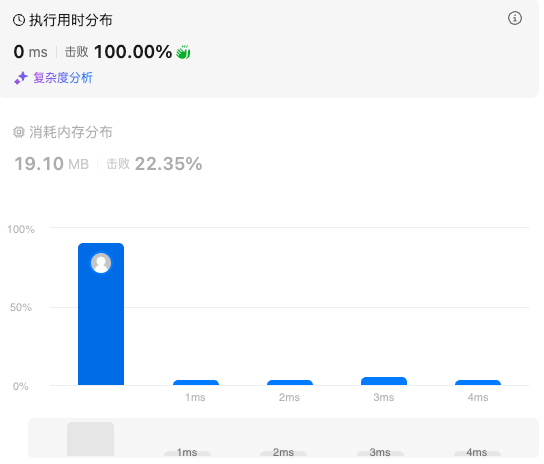
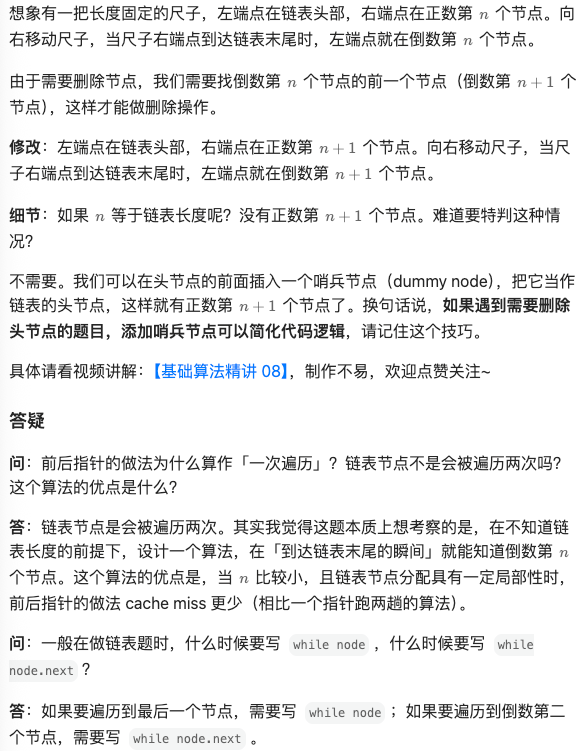
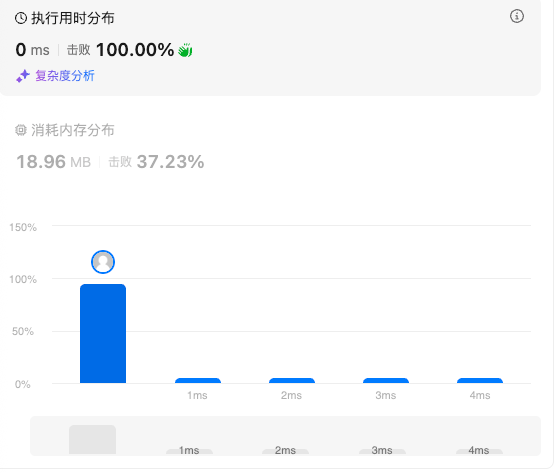
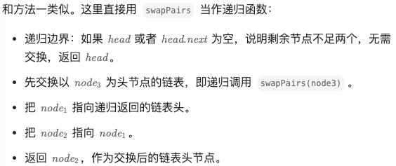
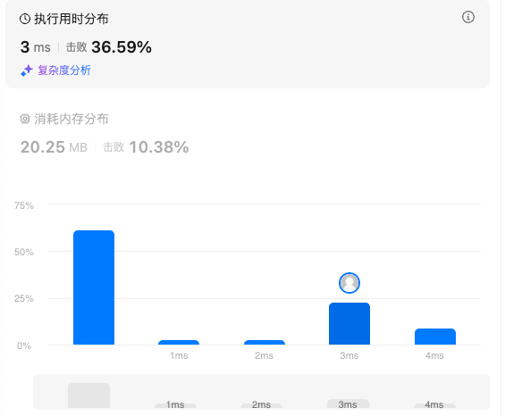

# 19.删除链表的倒数第N个结点（中等）

## 题目描述

给你一个链表，删除链表的倒数第 `n` 个结点，并且返回链表的头结点。

 

**示例 1：**


```
输入：head = [1,2,3,4,5], n = 2
输出：[1,2,3,5]
```

**示例 2：**

```
输入：head = [1], n = 1
输出：[]
```

**示例 3：**

```
输入：head = [1,2], n = 1
输出：[1]
```

 

**提示：**

- 链表中结点的数目为 `sz`
- `1 <= sz <= 30`
- `0 <= Node.val <= 100`
- `1 <= n <= sz`

 

**进阶：**你能尝试使用一趟扫描实现吗？

## 我的Python解答

两次遍历解决问题

```python
# Definition for singly-linked list.
# class ListNode:
#     def __init__(self, val=0, next=None):
#         self.val = val
#         self.next = next
class Solution:
    def removeNthFromEnd(self, head: Optional[ListNode], n: int) -> Optional[ListNode]:
        # 第一遍获取数目，第二遍删除节点
        size = 0
        p = head
        while p:
            size += 1
            p = p.next
        if size == n:
            return head.next
        cur = dummy = head
        for _ in range(size-n):
            dummy = cur
            cur = cur.next
        tmp = cur
        if tmp:
            dummy.next = tmp.next
            tmp.next = None
        del tmp
        return head
```

结果：




## Python参考答案

维护左右指针，左指针保持不动，右指针先向右走n步，然后左右指针同时走，如果右指针是末尾节点，那么说明此时的左指针是倒数第n+1个节点。



```python
# Definition for singly-linked list.
# class ListNode:
#     def __init__(self, val=0, next=None):
#         self.val = val
#         self.next = next
class Solution:
    def removeNthFromEnd(self, head: Optional[ListNode], n: int) -> Optional[ListNode]:
        left = right = dummy = ListNode(next=head)
        for _ in range(n):
            right = right.next
        while right.next:
            left = left.next
            right = right.next
        left.next = left.next.next
        return dummy.next
```

# 24.两两交换链表中的节点（中等）

## 题目描述

给你一个链表，两两交换其中相邻的节点，并返回交换后链表的头节点。你必须在不修改节点内部的值的情况下完成本题（即，只能进行节点交换）。

 

**示例 1：**


```
输入：head = [1,2,3,4]
输出：[2,1,4,3]
```

**示例 2：**

```
输入：head = []
输出：[]
```

**示例 3：**

```
输入：head = [1]
输出：[1]
```

 

**提示：**

- 链表中节点的数目在范围 `[0, 100]` 内
- `0 <= Node.val <= 100`

## 我的解答

快慢指针，交换

```python
# Definition for singly-linked list.
# class ListNode:
#     def __init__(self, val=0, next=None):
#         self.val = val
#         self.next = next
class Solution:
    def swapPairs(self, head: Optional[ListNode]) -> Optional[ListNode]:
        # 仍旧快慢指针
        dummy = ListNode(next=head)
        if not head:
            return dummy.next
        left = right = head
        right = right.next
        if right:
            head = right
        while right:
            # 左右可以交换
            left.next = right.next
            right.next = left
            dummy.next = right
            dummy = left
            left = left.next
            if left:
                right = left.next
            else:
                right = None
        return head
```

结果：



在做题的时候想起来可以把奇数位置和偶数位置的节点拆开，然后先偶数再奇数，这样插回去

```python
# Definition for singly-linked list.
# class ListNode:
#     def __init__(self, val=0, next=None):
#         self.val = val
#         self.next = next
class Solution:
    def swapPairs(self, head: Optional[ListNode]) -> Optional[ListNode]:
        if not head:
            return head
        odd_dummy = odd_end = ListNode()
        even_dummy = even_end = ListNode()
        times = 1
        while head:
            tmp = head.next
            if times%2:
                odd_end.next = head
                head.next = None
                odd_end = odd_end.next
            else:
                even_end.next = head
                head.next = None
                even_end = even_end.next
            head = tmp
            times += 1
        # 构建了两条尾插法的链
        odd = odd_dummy.next
        even = even_dummy.next
        dummy = end = ListNode()
        while odd and even:
            tmp1 = odd.next
            tmp2 = even.next
            even.next = odd
            odd.next = None
            end.next = even
            even = tmp2
            odd = tmp1
            end = end.next.next
        if odd:
            end.next = odd
            odd.next = None
        return dummy.next
```

结果：


## 参考答案

### 迭代 


```python
class Solution:
    def swapPairs(self, head: Optional[ListNode]) -> Optional[ListNode]:
        node0 = dummy = ListNode(next=head)  # 用哨兵节点简化代码逻辑
        node1 = head
        while node1 and node1.next:  # 至少有两个节点
            node2 = node1.next
            node3 = node2.next

            node0.next = node2  # 0 -> 2
            node2.next = node1  # 2 -> 1
            node1.next = node3  # 1 -> 3

            node0 = node1  # 下一轮交换，0 是 1
            node1 = node3  # 下一轮交换，1 是 3
        return dummy.next  # 返回新链表的头节点
```

### 递归



```python
class Solution:
    def swapPairs(self, head: Optional[ListNode]) -> Optional[ListNode]:
        if head is None or head.next is None:  # 递归边界
            return head  # 不足两个节点，无需交换

        node1 = head
        node2 = head.next
        node3 = node2.next

        node1.next = self.swapPairs(node3)  # 1 指向递归返回的链表头
        node2.next = node1  # 2 指向 1

        return node2  # 返回交换后的链表头节点
```

# 25.K个一组翻转链表（困难）

## 题目描述

给你链表的头节点 `head` ，每 `k` 个节点一组进行翻转，请你返回修改后的链表。

`k` 是一个正整数，它的值小于或等于链表的长度。如果节点总数不是 `k` 的整数倍，那么请将最后剩余的节点保持原有顺序。

你不能只是单纯的改变节点内部的值，而是需要实际进行节点交换。

 

**示例 1：**


```
输入：head = [1,2,3,4,5], k = 2
输出：[2,1,4,3,5]
```

**示例 2：**


```
输入：head = [1,2,3,4,5], k = 3
输出：[3,2,1,4,5]
```

 

**提示：**

- 链表中的节点数目为 `n`
- `1 <= k <= n <= 5000`
- `0 <= Node.val <= 1000`

 

**进阶：**你可以设计一个只用 `O(1)` 额外内存空间的算法解决此问题吗？

## 我的解答

使用栈，需要注意的是，初始化dummy, end, start必须是同一个等号，这样才能确保它们是同一个链路，而不是独立的三条链路

```python
# Definition for singly-linked list.
# class ListNode:
#     def __init__(self, val=0, next=None):
#         self.val = val
#         self.next = next
class Solution:
    def reverseKGroup(self, head: Optional[ListNode], k: int) -> Optional[ListNode]:
        # 不如用栈，压入k个，弹出
        st = deque()
        dummy = end = start = ListNode(next=head)
        # end = ListNode(next=head)
        # start = ListNode(next=head)
        while head:
            while len(st)!=k and head:
                st.append(head)
                # print("append ",head.val)
                head = head.next
            if len(st) == k:
                start = st[-1].next
                while len(st)>0:
                    cur = st.pop()
                    # print("cur val: ",cur.val)
                    end.next = cur
                    end = end.next
                    cur.next = None
            end.next = start
        return dummy.next
```

结果：



## 参考答案

```python
class Solution:
    def reverseKGroup(self, head: Optional[ListNode], k: int) -> Optional[ListNode]:
        # 统计节点个数
        n = 0
        cur = head
        while cur:
            n += 1
            cur = cur.next

        p0 = dummy = ListNode(next=head)
        pre = None
        cur = head

        # k 个一组处理
        while n >= k:
            n -= k
            for _ in range(k):  # 同 92 题
                nxt = cur.next
                cur.next = pre  # 每次循环只修改一个 next，方便大家理解
                pre = cur
                cur = nxt

            # 见视频
            nxt = p0.next
            nxt.next = cur
            p0.next = pre
            p0 = nxt
        return dummy.next
```

