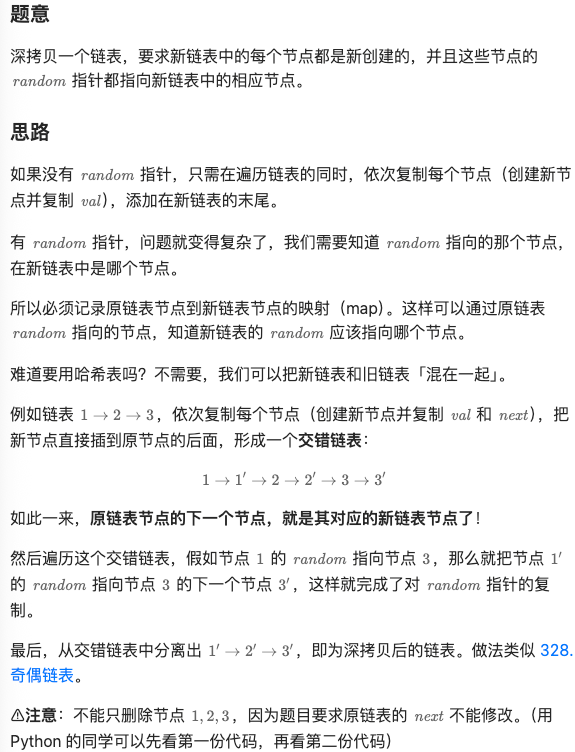
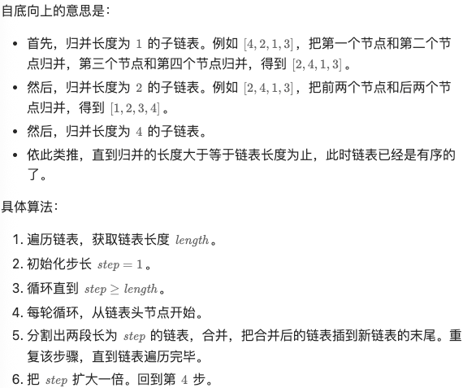
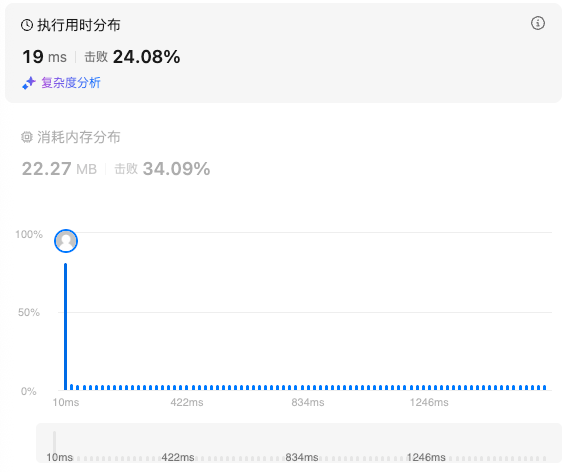
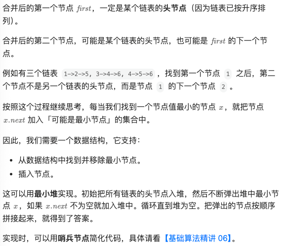
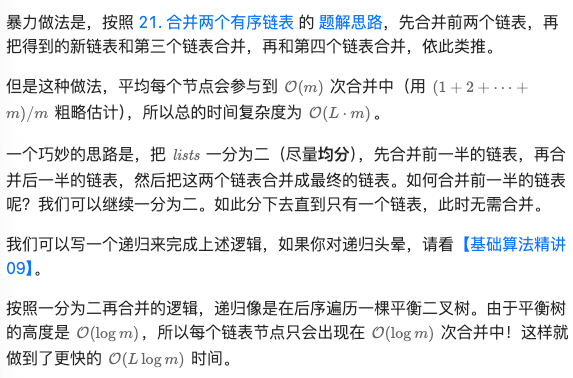
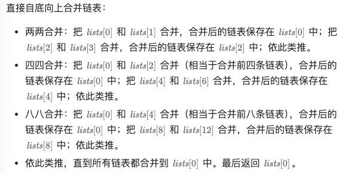

# 25.K个一组翻转链表（困难）

## 题目描述

给你链表的头节点 `head` ，每 `k` 个节点一组进行翻转，请你返回修改后的链表。

`k` 是一个正整数，它的值小于或等于链表的长度。如果节点总数不是 `k` 的整数倍，那么请将最后剩余的节点保持原有顺序。

你不能只是单纯的改变节点内部的值，而是需要实际进行节点交换。

**示例 1：**

```
输入：head = [1,2,3,4,5], k = 2
输出：[2,1,4,3,5]
```

**示例 2：**

```
输入：head = [1,2,3,4,5], k = 3
输出：[3,2,1,4,5]
```

 

**提示：**

- 链表中的节点数目为 `n`
- `1 <= k <= n <= 5000`
- `0 <= Node.val <= 1000`

 

**进阶：**你可以设计一个只用 `O(1)` 额外内存空间的算法解决此问题吗？

## 我的Python解答

```python
# Definition for singly-linked list.
# class ListNode:
#     def __init__(self, val=0, next=None):
#         self.val = val
#         self.next = next
class Solution:
    def reverseKGroup(self, head: Optional[ListNode], k: int) -> Optional[ListNode]:
        cur = head
        n = 0
        while cur:
            n += 1
            cur = cur.next
        dummy = p0 = ListNode(next=head)
        pre = None
        cur = head
        while n>=k:
            n-=k
            for _ in range(k):
                later = cur.next
                cur.next = pre
                pre = cur
                cur = later
            later = p0.next
            later.next = cur
            p0.next = pre
            p0 = later
        return dummy.next                       
```

# 138.随机链表的复制（中等）

## 题目描述

给你一个长度为 `n` 的链表，每个节点包含一个额外增加的随机指针 `random` ，该指针可以指向链表中的任何节点或空节点。

构造这个链表的 **[深拷贝](https://baike.baidu.com/item/深拷贝/22785317?fr=aladdin)**。 深拷贝应该正好由 `n` 个 **全新** 节点组成，其中每个新节点的值都设为其对应的原节点的值。新节点的 `next` 指针和 `random` 指针也都应指向复制链表中的新节点，并使原链表和复制链表中的这些指针能够表示相同的链表状态。**复制链表中的指针都不应指向原链表中的节点** 。

例如，如果原链表中有 `X` 和 `Y` 两个节点，其中 `X.random --> Y` 。那么在复制链表中对应的两个节点 `x` 和 `y` ，同样有 `x.random --> y` 。

返回复制链表的头节点。

用一个由 `n` 个节点组成的链表来表示输入/输出中的链表。每个节点用一个 `[val, random_index]` 表示：

- `val`：一个表示 `Node.val` 的整数。
- `random_index`：随机指针指向的节点索引（范围从 `0` 到 `n-1`）；如果不指向任何节点，则为 `null` 。

你的代码 **只** 接受原链表的头节点 `head` 作为传入参数。

 

**示例 1：**


```
输入：head = [[7,null],[13,0],[11,4],[10,2],[1,0]]
输出：[[7,null],[13,0],[11,4],[10,2],[1,0]]
```

**示例 2：**


```
输入：head = [[1,1],[2,1]]
输出：[[1,1],[2,1]]
```

**示例 3：**

****

```
输入：head = [[3,null],[3,0],[3,null]]
输出：[[3,null],[3,0],[3,null]]
```

 

**提示：**

- `0 <= n <= 1000`
- `-104 <= Node.val <= 104`
- `Node.random` 为 `null` 或指向链表中的节点。

## 我的解答

暂时只能想到笨方法：

列表实现按照索引取节点，哈希表存储原始链表及其idx，这样就可以通过idx确认新链表的random指向谁了

```python
"""
# Definition for a Node.
class Node:
    def __init__(self, x: int, next: 'Node' = None, random: 'Node' = None):
        self.val = int(x)
        self.next = next
        self.random = random
"""

class Solution:
    def copyRandomList(self, head: 'Optional[Node]') -> 'Optional[Node]':
        # 深度拷贝本质上是新建链表，让它和原始链表一致
        # 但是只能逐个访问，才能知道random指向的谁，所以同时还需要位置的index
        # 那同步构建一个列表吧，可以直接按照索引找节点
        if head is None:
            return None
        hash_map = defaultdict(int)
        node_list = []
        cur = head
        idx = 0
        while cur:
            h = Node(cur.val)
            node_list.append(h)
            hash_map[cur] = idx
            cur = cur.next
            idx += 1
        cur = head
        idx = 0
        while cur:
            h = node_list[idx]
            if idx<len(node_list)-1:
                h.next = node_list[idx+1]
            else:
                h.next = None
            if cur.random is not None:
                h.random =  node_list[hash_map[cur.random]]
            idx += 1
            cur = cur.next
        return node_list[0]
```

  结果：


## 参考答案



```python
class Solution:
    def copyRandomList(self, head: 'Optional[Node]') -> 'Optional[Node]':
        # 复制每个节点，把新节点直接插到原节点的后面
        cur = head
        while cur:
            cur.next = Node(cur.val, cur.next)
            cur = cur.next.next

        # 遍历交错链表中的原链表节点
        cur = head
        while cur:
            if cur.random:
                # 要复制的 random 是 cur.random 的下一个节点
                cur.next.random = cur.random.next
            cur = cur.next.next

        # 删除交错链表中的原链表节点，剩下的节点即为新链表
        cur = dummy = Node(0, head)
        while cur.next:
            # 删除原链表的节点，即当前节点的下一个节点
            # 如果要恢复原链表，见另一份代码【Python3 写法二】
            cur.next = cur.next.next
            cur = cur.next

        return dummy.next
```

```python
class Solution:
    def copyRandomList(self, head: 'Optional[Node]') -> 'Optional[Node]':
        # 复制每个节点，把新节点直接插到原节点的后面
        cur = head
        while cur:
            cur.next = Node(cur.val, cur.next)
            cur = cur.next.next

        # 遍历交错链表中的原链表节点
        cur = head
        while cur:
            if cur.random:
                # 要复制的 random 是 cur.random 的下一个节点
                cur.next.random = cur.random.next
            cur = cur.next.next

        # 把交错链表分离成两个链表
        tail = dummy = Node(0, head)
        cur = head
        while cur:
            copy = cur.next  # 新节点
            tail.next = copy  # 把新节点插在 tail 的后面，构建新的链表
            cur.next = copy.next  # 恢复原节点的 next
            cur = cur.next
            tail = tail.next

        return dummy.next
```

# 148.排序链表（中等）

## 题目描述

给你链表的头结点 `head` ，请将其按 **升序** 排列并返回 **排序后的链表** 。

 

**示例 1：**


```
输入：head = [4,2,1,3]
输出：[1,2,3,4]
```

**示例 2：**


```
输入：head = [-1,5,3,4,0]
输出：[-1,0,3,4,5]
```

**示例 3：**

```
输入：head = []
输出：[]
```

 

**提示：**

- 链表中节点的数目在范围 `[0, 5 * 104]` 内
- `-105 <= Node.val <= 105`

 

**进阶：**你可以在 `O(n log n)` 时间复杂度和常数级空间复杂度下，对链表进行排序吗？

## 我的解答

最笨的方法，存到list，使用lambda排序

时间o(nlogn)，空间o(n)

```python
# Definition for singly-linked list.
# class ListNode:
#     def __init__(self, val=0, next=None):
#         self.val = val
#         self.next = next
class Solution:
    def sortList(self, head: Optional[ListNode]) -> Optional[ListNode]:
        if head is None:
            return None
        # 先用笨方法，存到list里面，排序依据：val
        node_list = []
        cur = head
        while cur:
            node_list.append(cur)
            cur = cur.next
        node_list.sort(key = lambda x:x.val)
        for i in range(len(node_list)-1):
            node_list[i].next = node_list[i+1]
        node_list[-1].next = None
        return node_list[0]
```

结果：


## 参考答案

### 方法1:归并排序（分治）本质上是递归，划分为最小单元

```python
class Solution:
    # 876. 链表的中间结点（快慢指针）
    def middleNode(self, head: Optional[ListNode]) -> Optional[ListNode]:
        slow = fast = head
        while fast and fast.next:
            pre = slow  # 记录 slow 的前一个节点
            slow = slow.next
            fast = fast.next.next
        pre.next = None  # 断开 slow 的前一个节点和 slow 的连接
        return slow

    # 21. 合并两个有序链表（双指针）
    def mergeTwoLists(self, list1: Optional[ListNode], list2: Optional[ListNode]) -> Optional[ListNode]:
        cur = dummy = ListNode()  # 用哨兵节点简化代码逻辑
        while list1 and list2:
            if list1.val < list2.val:
                cur.next = list1  # 把 list1 加到新链表中
                list1 = list1.next
            else:  # 注：相等的情况加哪个节点都是可以的
                cur.next = list2  # 把 list2 加到新链表中
                list2 = list2.next
            cur = cur.next
        cur.next = list1 if list1 else list2  # 拼接剩余链表
        return dummy.next

    def sortList(self, head: Optional[ListNode]) -> Optional[ListNode]:
        # 如果链表为空或者只有一个节点，无需排序
        if head is None or head.next is None:
            return head
        # 找到中间节点 head2，并断开 head2 与其前一个节点的连接
        # 比如 head=[4,2,1,3]，那么 middleNode 调用结束后 head=[4,2] head2=[1,3]
        head2 = self.middleNode(head)
        # 分治
        head = self.sortList(head)
        head2 = self.sortList(head2)
        # 合并
        return self.mergeTwoLists(head, head2)
```

复杂度分析

- 时间复杂度：O(nlogn)，其中 n 是链表长度。递归式 T(n)=2T(n/2)+O(n)，由主定理可得时间复杂度为 O(nlogn)。从图形上理解，递归深度是 O(logn)，每一层的链表长度之和是 O(n)。计算高为 O(logn)，底边长为 O(n) 的矩形面积，得到 O(nlogn)。
- 空间复杂度：O(logn)。递归需要 O(logn) 的栈开销。

### 方法2:归并排序（迭代）

自底向上计算，空间复杂度退化为o（1）



```python
class Solution:
    # 获取链表长度
    def getListLength(self, head: Optional[ListNode]) -> int:
        length = 0
        while head:
            length += 1
            head = head.next
        return length

    # 分割链表
    # 如果链表长度 <= size，不做任何操作，返回空节点
    # 如果链表长度 > size，把链表的前 size 个节点分割出来（断开连接），并返回剩余链表的头节点
    def splitList(self, head: Optional[ListNode], size: int) -> Optional[ListNode]:
        # 先找到 next_head 的前一个节点
        cur = head
        for _ in range(size - 1):
            if cur is None:
                break
            cur = cur.next

        # 如果链表长度 <= size
        if cur is None or cur.next is None:
            return None  # 不做任何操作，返回空节点

        next_head = cur.next
        cur.next = None  # 断开 next_head 的前一个节点和 next_head 的连接
        return next_head

    # 21. 合并两个有序链表（双指针）
    # 返回合并后的链表的头节点和尾节点
    def mergeTwoLists(self, list1: Optional[ListNode], list2: Optional[ListNode]) -> Optional[ListNode]:
        cur = dummy = ListNode()  # 用哨兵节点简化代码逻辑
        while list1 and list2:
            if list1.val < list2.val:
                cur.next = list1  # 把 list1 加到新链表中
                list1 = list1.next
            else:  # 注：相等的情况加哪个节点都是可以的
                cur.next = list2  # 把 list2 加到新链表中
                list2 = list2.next
            cur = cur.next
        cur.next = list1 or list2  # 拼接剩余链表
        while cur.next:
            cur = cur.next
        # 循环结束后，cur 是合并后的链表的尾节点
        return dummy.next, cur

    def sortList(self, head: Optional[ListNode]) -> Optional[ListNode]:
        length = self.getListLength(head)  # 获取链表长度
        dummy = ListNode(next=head)  # 用哨兵节点简化代码逻辑
        step = 1  # 步长（参与合并的链表长度）
        while step < length:
            new_list_tail = dummy  # 新链表的末尾
            cur = dummy.next  # 每轮循环的起始节点
            while cur:
                # 从 cur 开始，分割出两段长为 step 的链表，头节点分别为 head1 和 head2
                head1 = cur
                head2 = self.splitList(head1, step)
                cur = self.splitList(head2, step)  # 下一轮循环的起始节点
                # 合并两段长为 step 的链表
                head, tail = self.mergeTwoLists(head1, head2)
                # 合并后的头节点 head，插到 new_list_tail 的后面
                new_list_tail.next = head
                new_list_tail = tail  # tail 现在是新链表的末尾
            step *= 2
        return dummy.next
```

#### 复杂度分析

- 时间复杂度：O(*n*log*n*)，其中 *n* 是链表长度。
- 空间复杂度：O(1)。

# 23.合并K个升序链表（困难）

## 题目描述

给你一个链表数组，每个链表都已经按升序排列。

请你将所有链表合并到一个升序链表中，返回合并后的链表。

 

**示例 1：**

```
输入：lists = [[1,4,5],[1,3,4],[2,6]]
输出：[1,1,2,3,4,4,5,6]
解释：链表数组如下：
[
  1->4->5,
  1->3->4,
  2->6
]
将它们合并到一个有序链表中得到。
1->1->2->3->4->4->5->6
```

**示例 2：**

```
输入：lists = []
输出：[]
```

**示例 3：**

```
输入：lists = [[]]
输出：[]
```

 

**提示：**

- `k == lists.length`
- `0 <= k <= 10^4`
- `0 <= lists[i].length <= 500`
- `-10^4 <= lists[i][j] <= 10^4`
- `lists[i]` 按 **升序** 排列
- `lists[i].length` 的总和不超过 `10^4`

## 我的解答

二路归并

```python
# Definition for singly-linked list.
# class ListNode:
#     def __init__(self, val=0, next=None):
#         self.val = val
#         self.next = next
class Solution:
    def mergeTwoLists(self, list1: Optional[ListNode], list2: Optional[ListNode]) -> Optional[ListNode]:
        dummy = cur = ListNode()
        while list1 and list2:
            if list1.val < list2.val:
                cur.next = list1
                list1 = list1.next
            else:
                cur.next = list2
                list2 = list2.next
            cur = cur.next
        cur.next = list1 if list1 else list2
        return dummy.next
    
    def mergeKLists(self, lists: List[Optional[ListNode]]) -> Optional[ListNode]:
        # 二路归并
        k = len(lists)
        if k==0:
            return None
        if k == 1:
            return lists[0]
        while k >= 2:
            tmp = []
            if k%2 == 1:
                lists.append(None)
            for i in range((k-1)//2+1):
                # 向上取整的个数
                tmp.append(self.mergeTwoLists(lists[2*i],lists[2*i+1]))
            lists = tmp[:]
            # print(lists)
            del tmp
            k = (k-1)//2+1
        return lists[0]
```

结果：



## 参考答案

### 方法1:堆排序，最小堆



```python
ListNode.__lt__ = lambda a, b: a.val < b.val  # 让堆可以比较节点大小

class Solution:
    def mergeKLists(self, lists: List[Optional[ListNode]]) -> Optional[ListNode]:
        cur = dummy = ListNode()  # 哨兵节点，作为合并后链表头节点的前一个节点
        h = [head for head in lists if head]  # 把所有非空链表的头节点入堆
        heapify(h)  # 堆化
        while h:  # 循环直到堆为空
            node = heappop(h)  # 剩余节点中的最小节点
            if node.next:  # 下一个节点不为空
                heappush(h, node.next)  # 下一个节点有可能是最小节点，入堆
            cur.next = node  # 把 node 添加到新链表的末尾
            cur = cur.next  # 准备合并下一个节点
        return dummy.next  # 哨兵节点的下一个节点就是新链表的头节点
```

#### 复杂度分析

- 时间复杂度：O(*L*log*m*)，其中 *m* 为 *lists* 的长度，*L* 为所有链表的长度之和。
- 空间复杂度：O(*m*)。堆中至多有 *m* 个元素。

### 方法2:分治



递归写法：

#### 复杂度分析

- 时间复杂度：O(*L*log*m*)，其中 *m* 为 *lists* 的长度，*L* 为所有链表的长度之和。每个节点参与链表合并的次数为 O(log*m*) 次，一共有 *L* 个节点，所以总的时间复杂度为 O(*L*log*m*)。
- 空间复杂度：O(log*m*)。递归深度为 O(log*m*)，需要 O(log*m*) 的栈空间。Python 忽略切片产生的额外空间。

```python
class Solution:
    # 21. 合并两个有序链表
    def mergeTwoLists(self, list1: Optional[ListNode], list2: Optional[ListNode]) -> Optional[ListNode]:
        cur = dummy = ListNode()  # 用哨兵节点简化代码逻辑
        while list1 and list2:
            if list1.val < list2.val:
                cur.next = list1  # 把 list1 加到新链表中
                list1 = list1.next
            else:  # 注：相等的情况加哪个节点都是可以的
                cur.next = list2  # 把 list2 加到新链表中
                list2 = list2.next
            cur = cur.next
        cur.next = list1 if list1 else list2  # 拼接剩余链表
        return dummy.next

    def mergeKLists(self, lists: List[Optional[ListNode]]) -> Optional[ListNode]:
        m = len(lists)
        if m == 0:
            return None
        if m == 1:
            return lists[0]  # 无需合并，直接返回
        left = self.mergeKLists(lists[:m // 2])  # 合并左半部分
        right = self.mergeKLists(lists[m // 2:])  # 合并右半部分
        return self.mergeTwoLists(left, right)  # 最后把左半和右半合并
```

迭代写法：



```python
class Solution:
    # 21. 合并两个有序链表
    def mergeTwoLists(self, list1: Optional[ListNode], list2: Optional[ListNode]) -> Optional[ListNode]:
        cur = dummy = ListNode()  # 用哨兵节点简化代码逻辑
        while list1 and list2:
            if list1.val < list2.val:
                cur.next = list1  # 把 list1 加到新链表中
                list1 = list1.next
            else:  # 注：相等的情况加哪个节点都是可以的
                cur.next = list2  # 把 list2 加到新链表中
                list2 = list2.next
            cur = cur.next
        cur.next = list1 if list1 else list2  # 拼接剩余链表
        return dummy.next

    def mergeKLists(self, lists: List[Optional[ListNode]]) -> Optional[ListNode]:
        m = len(lists)
        if m == 0:
            return None
        step = 1
        while step < m:
            for i in range(0, m - step, step * 2):
                lists[i] = self.mergeTwoLists(lists[i], lists[i + step])
            step *= 2
        return lists[0]
```

#### 复杂度分析

- 时间复杂度：O(*L*log*m*)，其中 *m* 为 *lists* 的长度，*L* 为所有链表的长度之和。外层关于 *step* 的循环是 O(log*m*) 次，内层相当于把每个链表节点都遍历了一遍，是 O(*L*) 的，所以总的时间复杂度为 O(*L*log*m*)。
- 空间复杂度：O(1)。