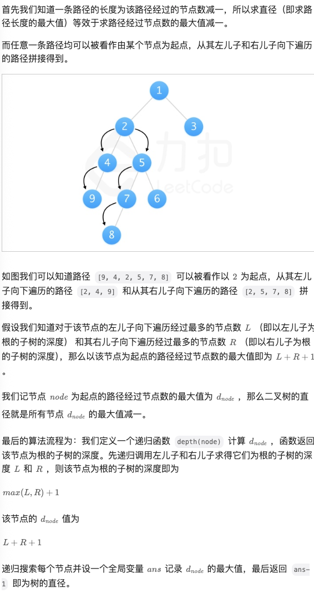

# 94.二叉树的中序遍历

## 题目描述

给定一个二叉树的根节点 `root` ，返回 *它的 **中序** 遍历* 。

 

**示例 1：**


```
输入：root = [1,null,2,3]
输出：[1,3,2]
```

**示例 2：**

```
输入：root = []
输出：[]
```

**示例 3：**

```
输入：root = [1]
输出：[1]
```

 

**提示：**

- 树中节点数目在范围 `[0, 100]` 内
- `-100 <= Node.val <= 100`

 

**进阶:** 递归算法很简单，你可以通过迭代算法完成吗？

## 我的Python解答

现在我只知道逻辑上的遍历方式，大概能够想到是使用递归

直接看答案

## Python参考答案

递归：

时间复杂度o(n) 空间复杂度o(h)

```python
class Solution:
    def inorderTraversal(self, root: Optional[TreeNode]) -> List[int]:
        def dfs(node: Optional[TreeNode]) -> None:
            if node is None:
                return
            dfs(node.left)       # 左
            ans.append(node.val) # 根（这行代码移到前面就是前序，移到后面就是后序）
            dfs(node.right)      # 右

        ans = []
        dfs(root)
        return ans
```


```python
class Solution:
    def inorderTraversal(self, root: Optional[TreeNode]) -> List[int]:
        ans = []

        while root:
            if root.left:
                # 找 root 的前驱 pre：在中序遍历中，root 的上一个节点
                # 从 root.left 开始，一直向右走，直到走到尽头，或者遇到指向 root 的线索（回到 root 的路）
                pre = root.left
                while pre.right and pre.right is not root:
                    pre = pre.right

                # root 的左子树尚未访问
                if pre.right is None:
                    pre.right = root  # 建立线索（回到 root 的路），相当于把 pre.right 当作栈
                    root = root.left  # 访问左子树
                    continue

                # root 的左子树访问完毕，去掉线索，恢复原样
                pre.right = None  # 注：如果调用完 inorderTraversal 不再使用这棵二叉树，这行代码可以去掉

            # root 的左子树访问完毕
            ans.append(root.val)  # 记录当前节点的值
            root = root.right  # 如果有右子树就访问右子树，没有就顺着线索回到指向的节点

        return ans
```

时间o(n)。空间o(1)

# 144.前序遍历

## 我的解答

```python
# Definition for a binary tree node.
# class TreeNode:
#     def __init__(self, val=0, left=None, right=None):
#         self.val = val
#         self.left = left
#         self.right = right
class Solution:
    def preorderTraversal(self, root: Optional[TreeNode]) -> List[int]:
        # 前序遍历，左中右
        def bfs(node: Optional[TreeNode]) -> None:
            if node is None:
                return
            ans.append(node.val)
            bfs(node.left)
            bfs(node.right)
            return
        ans = []
        bfs(root)
        return ans
```

## 参考答案

morris解法

```python
class Solution:
    def preorderTraversal(self, root: TreeNode) -> List[int]:
        res = list()
        if not root:
            return res
        
        p1 = root
        while p1:
            p2 = p1.left
            if p2:
                while p2.right and p2.right != p1:
                    p2 = p2.right
                if not p2.right:
                    res.append(p1.val)
                    p2.right = p1
                    p1 = p1.left
                    continue
                else:
                    p2.right = None
            else:
                res.append(p1.val)
            p1 = p1.right
        
        return res
```


# 145.后序遍历

## 我的解答

递归：

```python
# Definition for a binary tree node.
# class TreeNode:
#     def __init__(self, val=0, left=None, right=None):
#         self.val = val
#         self.left = left
#         self.right = right
class Solution:
    def postorderTraversal(self, root: Optional[TreeNode]) -> List[int]:
        def dfs(node: Optional[TreeNode]) -> None:
            if node is None:
                return
            dfs(node.left)
            dfs(node.right)
            ans.append(node.val)
        ans = []
        dfs(root)
        return ans
```

## 参考答案

morris遍历

```python
class Solution:
    def postorderTraversal(self, root: TreeNode) -> List[int]:
        def addPath(node: TreeNode):
            count = 0
            while node:
                count += 1
                res.append(node.val)
                node = node.right
            i, j = len(res) - count, len(res) - 1
            while i < j:
                res[i], res[j] = res[j], res[i]
                i += 1
                j -= 1
        
        if not root:
            return list()
        
        res = list()
        p1 = root

        while p1:
            p2 = p1.left
            if p2:
                while p2.right and p2.right != p1:
                    p2 = p2.right
                if not p2.right:
                    p2.right = p1
                    p1 = p1.left
                    continue
                else:
                    p2.right = None
                    addPath(p1.left)
            p1 = p1.right
        
        addPath(root)
        return res
```

# 104.二叉树的最大深度

## 题目描述

给定一个二叉树 `root` ，返回其最大深度。

二叉树的 **最大深度** 是指从根节点到最远叶子节点的最长路径上的节点数。

 

**示例 1：**


 

```
输入：root = [3,9,20,null,null,15,7]
输出：3
```

**示例 2：**

```
输入：root = [1,null,2]
输出：2
```

 

**提示：**

- 树中节点的数量在 `[0, 104]` 区间内。
- `-100 <= Node.val <= 100`

## 我的解答

```python
# Definition for a binary tree node.
# class TreeNode:
#     def __init__(self, val=0, left=None, right=None):
#         self.val = val
#         self.left = left
#         self.right = right
class Solution:
    def maxDepth(self, root: Optional[TreeNode]) -> int:
        def dfs(node: Optional[TreeNode]):
            if node is None:
                return 0
            return max(dfs(node.left), dfs(node.right)) + 1
        return dfs(root)
```

结果：


## 参考答案

### 自底向上

```python
class Solution:
    def maxDepth(self, root: Optional[TreeNode]) -> int:
        if root is None:
            return 0
        l_depth = self.maxDepth(root.left)
        r_depth = self.maxDepth(root.right)
        return max(l_depth, r_depth) + 1
```

时间空间均为o(n)

### 自顶向下

```python
class Solution:
    def maxDepth(self, root: Optional[TreeNode]) -> int:
        ans = 0
        def dfs(node: Optional[TreeNode], depth: int) -> None:
            if node is None:
                return
            depth += 1
            nonlocal ans
            ans = max(ans, depth)
            dfs(node.left, depth)
            dfs(node.right, depth)
        dfs(root, 0)
        return ans
```

时间空间均为o(n)

# 226.翻转二叉树

## 题目描述

给你一棵二叉树的根节点 `root` ，翻转这棵二叉树，并返回其根节点。

 

**示例 1：**


```
输入：root = [4,2,7,1,3,6,9]
输出：[4,7,2,9,6,3,1]
```

**示例 2：**


```
输入：root = [2,1,3]
输出：[2,3,1]
```

**示例 3：**

```
输入：root = []
输出：[]
```

 

**提示：**

- 树中节点数目范围在 `[0, 100]` 内
- `-100 <= Node.val <= 100`

## 我的解答

```python
# Definition for a binary tree node.
# class TreeNode:
#     def __init__(self, val=0, left=None, right=None):
#         self.val = val
#         self.left = left
#         self.right = right
class Solution:
    def invertTree(self, root: Optional[TreeNode]) -> Optional[TreeNode]:
        def dfs(node: Optional[TreeNode]):
            # 递归更换
            if node is None:
                return
            node.left, node.right = node.right, node.left
            dfs(node.left)
            dfs(node.right)
            return node
        return dfs(root)
```

结果：


## 参考答案

```python
class Solution:
    def invertTree(self, root: Optional[TreeNode]) -> Optional[TreeNode]:
        if root is None:
            return None
        left = self.invertTree(root.left)  # 翻转左子树
        right = self.invertTree(root.right)  # 翻转右子树
        root.left = right  # 交换左右儿子
        root.right = left
        return root
```

```python
class Solution:
    def invertTree(self, root: Optional[TreeNode]) -> Optional[TreeNode]:
        if root is None:
            return None
        root.left, root.right = root.right, root.left  # 交换左右儿子
        self.invertTree(root.left)  # 翻转左子树
        self.invertTree(root.right)  # 翻转右子树
        return root
```

# 101.对称二叉树

## 题目描述

给你一个二叉树的根节点 `root` ， 检查它是否轴对称。

 

**示例 1：**


```
输入：root = [1,2,2,3,4,4,3]
输出：true
```

**示例 2：**


```
输入：root = [1,2,2,null,3,null,3]
输出：false
```

 

**提示：**

- 树中节点数目在范围 `[1, 1000]` 内
- `-100 <= Node.val <= 100`

 

**进阶：**你可以运用递归和迭代两种方法解决这个问题吗？

## 我的解答

耗费较长时间，直接看答案

## 参考答案

### 递归

```python
class Solution:
    def isSymmetric(self, root: TreeNode) -> bool:
        if not root:
            return True
        return self.compare(root.left, root.right)
        
    def compare(self, left, right):
        #首先排除空节点的情况
        if left == None and right != None: return False
        elif left != None and right == None: return False
        elif left == None and right == None: return True
        #排除了空节点，再排除数值不相同的情况
        elif left.val != right.val: return False
        
        #此时就是：左右节点都不为空，且数值相同的情况
        #此时才做递归，做下一层的判断
        outside = self.compare(left.left, right.right) #左子树：左、 右子树：右
        inside = self.compare(left.right, right.left) #左子树：右、 右子树：左
        isSame = outside and inside #左子树：中、 右子树：中 （逻辑处理）
        return isSame
```

结果：


### 迭代：使用队列

```python
import collections
class Solution:
    def isSymmetric(self, root: TreeNode) -> bool:
        if not root:
            return True
        queue = collections.deque()
        queue.append(root.left) #将左子树头结点加入队列
        queue.append(root.right) #将右子树头结点加入队列
        while queue: #接下来就要判断这这两个树是否相互翻转
            leftNode = queue.popleft()
            rightNode = queue.popleft()
            if not leftNode and not rightNode: #左节点为空、右节点为空，此时说明是对称的
                continue
            
            #左右一个节点不为空，或者都不为空但数值不相同，返回false
            if not leftNode or not rightNode or leftNode.val != rightNode.val:
                return False
            queue.append(leftNode.left) #加入左节点左孩子
            queue.append(rightNode.right) #加入右节点右孩子
            queue.append(leftNode.right) #加入左节点右孩子
            queue.append(rightNode.left) #加入右节点左孩子
        return True
```

### 迭代：使用栈

```python
class Solution:
    def isSymmetric(self, root: TreeNode) -> bool:
        if not root:
            return True
        st = [] #这里改成了栈
        st.append(root.left)
        st.append(root.right)
        while st:
            rightNode = st.pop()
            leftNode = st.pop()
            if not leftNode and not rightNode:
                continue
            if not leftNode or not rightNode or leftNode.val != rightNode.val:
                return False
            st.append(leftNode.left)
            st.append(rightNode.right)
            st.append(leftNode.right)
            st.append(rightNode.left)
        return True
```

### 层次遍历

```python
class Solution:
    def isSymmetric(self, root: TreeNode) -> bool:
        if not root:
            return True
        
        queue = collections.deque([root.left, root.right])
        
        while queue:
            level_size = len(queue)
            
            if level_size % 2 != 0:
                return False
            
            level_vals = []
            for i in range(level_size):
                node = queue.popleft()
                if node:
                    level_vals.append(node.val)
                    queue.append(node.left)
                    queue.append(node.right)
                else:
                    level_vals.append(None)
                    
            if level_vals != level_vals[::-1]:
                return False
            
        return True
```

# 543.二叉树的直径

## 题目描述

给你一棵二叉树的根节点，返回该树的 **直径** 。

二叉树的 **直径** 是指树中任意两个节点之间最长路径的 **长度** 。这条路径可能经过也可能不经过根节点 `root` 。

两节点之间路径的 **长度** 由它们之间边数表示。

 

**示例 1：**


```
输入：root = [1,2,3,4,5]
输出：3
解释：3 ，取路径 [4,2,1,3] 或 [5,2,1,3] 的长度。
```

**示例 2：**

```
输入：root = [1,2]
输出：1
```

 

**提示：**

- 树中节点数目在范围 `[1, 104]` 内
- `-100 <= Node.val <= 100`

## 我的解答

最开始设想的是左右子树最大深度相加

```python
# Definition for a binary tree node.
# class TreeNode:
#     def __init__(self, val=0, left=None, right=None):
#         self.val = val
#         self.left = left
#         self.right = right
class Solution:
    def diameterOfBinaryTree(self, root: Optional[TreeNode]) -> int:
        # 说白了，就是左右子树最大深度相加
        def dfs(node: Optional[TreeNode])->int:
            if node is None:
                return 0
            return max(dfs(node.left), dfs(node.right)) + 1
        return dfs(root.left) + dfs(root.right)
```

但是错误了，对于输入用例`[4,-7,-3,null,null,-9,-3,9,-7,-4,null,6,null,-6,-6,null,null,0,6,5,null,9,null,null,-1,-4,null,null,null,-2]`，输出为7，而不是正确答案8

所以最暴力的做法就是再加一个层序遍历，确保遍历每一个潜在根节点，当然这个做法的时空开销和重复计算开销很大，我一度认为会超时，像这种重复计算的开销，是不是要使用树形dp呢

```python
# Definition for a binary tree node.
# class TreeNode:
#     def __init__(self, val=0, left=None, right=None):
#         self.val = val
#         self.left = left
#         self.right = right
class Solution:
    def diameterOfBinaryTree(self, root: Optional[TreeNode]) -> int:
        ans = 0
        # 说白了，就是左右子树最大深度相加
        def dfs(node: Optional[TreeNode])->int:
            if node is None:
                return 0
            return max(dfs(node.left), dfs(node.right)) + 1
        # 需要加一个层序遍历
        queue = deque()
        queue.append(root)
        while queue:
            node = queue.pop()
            if node.left:
                queue.append(node.left)
            if node.right:
                queue.append(node.right)
            ans = max(dfs(node.left) + dfs(node.right), ans)
        return ans
```

结果：


## 参考答案

### 深度优先搜索



```python
class Solution:
    def diameterOfBinaryTree(self, root: TreeNode) -> int:
        self.ans = 1
        def depth(node):
            # 访问到空节点了，返回0
            if not node:
                return 0
            # 左儿子为根的子树的深度
            L = depth(node.left)
            # 右儿子为根的子树的深度
            R = depth(node.right)
            # 计算d_node即L+R+1 并更新ans
            self.ans = max(self.ans, L + R + 1)
            # 返回该节点为根的子树的深度
            return max(L, R) + 1

        depth(root)
        return self.ans - 1
```

**复杂度分析**

- 时间复杂度：*O*(*N*)，其中 *N* 为二叉树的节点数，即遍历一棵二叉树的时间复杂度，每个结点只被访问一次。
- 空间复杂度：*O*(*He**i**g**h**t*)，其中 *He**i**g**h**t* 为二叉树的高度。由于递归函数在递归过程中需要为每一层递归函数分配栈空间，所以这里需要额外的空间且该空间取决于递归的深度，而递归的深度显然为二叉树的高度，并且每次递归调用的函数里又只用了常数个变量，所以所需空间复杂度为 *O*(*He**i**g**h**t*) 。

```python
class Solution:
    def diameterOfBinaryTree(self, root: Optional[TreeNode]) -> int:
        ans = 0
        def dfs(node: Optional[TreeNode]) -> int:
            if node is None:
                return -1  # 对于叶子来说，链长就是 -1+1=0
            l_len = dfs(node.left) + 1  # 左子树最大链长+1
            r_len = dfs(node.right) + 1  # 右子树最大链长+1
            nonlocal ans
            ans = max(ans, l_len + r_len)  # 两条链拼成路径
            return max(l_len, r_len)  # 当前子树最大链长
        dfs(root)
        return ans
```

# 102.二叉树的层序遍历（中等）

## 题目描述

给你二叉树的根节点 `root` ，返回其节点值的 **层序遍历** 。 （即逐层地，从左到右访问所有节点）。

 

**示例 1：**


```
输入：root = [3,9,20,null,null,15,7]
输出：[[3],[9,20],[15,7]]
```

**示例 2：**

```
输入：root = [1]
输出：[[1]]
```

**示例 3：**

```
输入：root = []
输出：[]
```

 

**提示：**

- 树中节点数目在范围 `[0, 2000]` 内
- `-1000 <= Node.val <= 1000`

## 我的解答

常规的层次遍历，额外添加layer约束，表征物理层号

```python
# Definition for a binary tree node.
# class TreeNode:
#     def __init__(self, val=0, left=None, right=None):
#         self.val = val
#         self.left = left
#         self.right = right
class Solution:
    def levelOrder(self, root: Optional[TreeNode]) -> List[List[int]]:
        if root is None:
            return []
        ans = []
        # 层序按理来说一个队列可以解决，但是还需要真正的层次结果
        queue = deque()
        queue.append([root,1]) # 节点和layer
        while queue:
            tmp = queue.popleft()
            node, layer = tmp[0], tmp[1]
            while len(ans)<layer:
                ans.append([])
            if node.left:
                queue.append([node.left, layer+1])
            if node.right:
                queue.append([node.right, layer+1])
            ans[-1].append(node.val)
        return ans
```

结果：


## 参考答案

### 方法1:两个数组

```python
class Solution:
    def levelOrder(self, root: Optional[TreeNode]) -> List[List[int]]:
        if root is None:
            return []
        ans = []
        cur = [root]
        while cur:
            nxt = []
            vals = []
            for node in cur:
                vals.append(node.val)
                if node.left:  nxt.append(node.left)
                if node.right: nxt.append(node.right)
            cur = nxt
            ans.append(vals)
        return ans
```

#### 复杂度分析

- 时间复杂度：O(*n*)，其中 *n* 为二叉树的节点个数。虽然写了个二重循环，但每个节点只会添加到列表中一次，所以总的循环次数是节点个数之和，即 O(*n*)。
- 空间复杂度：O(*n*)。满二叉树（每一层都填满）最后一层有大约 *n*/2 个节点，因此数组中最多有 O(*n*) 个元素，所以空间复杂度是 O(*n*) 的。

### 方法2:一个队列

```python
class Solution:
    def levelOrder(self, root: Optional[TreeNode]) -> List[List[int]]:
        if root is None:
            return []
        ans = []
        q = deque([root])
        while q:
            vals = []
            for _ in range(len(q)):
                node = q.popleft()
                vals.append(node.val)
                if node.left:  q.append(node.left)
                if node.right: q.append(node.right)
            ans.append(vals)
        return ans
```

#### 复杂度分析

- 时间复杂度：O(*n*)，其中 *n* 为二叉树的节点个数。虽然写了个二重循环，但每个节点只会入队出队各一次，所以总的循环次数是节点个数之和，即 O(*n*)。
- 空间复杂度：O(*n*)。满二叉树（每一层都填满）最后一层有大约 *n*/2 个节点，因此队列中最多有 O(*n*) 个元素，所以空间复杂度是 O(*n*) 的。

# 108.将有序数组转换为二叉搜索树

## 题目描述

给你一个整数数组 `nums` ，其中元素已经按 **升序** 排列，请你将其转换为一棵 平衡 二叉搜索树。

 

**示例 1：**


```
输入：nums = [-10,-3,0,5,9]
输出：[0,-3,9,-10,null,5]
解释：[0,-10,5,null,-3,null,9] 也将被视为正确答案：
```

**示例 2：**


```
输入：nums = [1,3]
输出：[3,1]
解释：[1,null,3] 和 [3,1] 都是高度平衡二叉搜索树。
```

 

**提示：**

- `1 <= nums.length <= 104`
- `-104 <= nums[i] <= 104`
- `nums` 按 **严格递增** 顺序排列

## 我的解答

这个问题，用有序的中间节点作为根节点，左边放左子树，右边放右子树，绝对不会错

```python
# Definition for a binary tree node.
# class TreeNode:
#     def __init__(self, val=0, left=None, right=None):
#         self.val = val
#         self.left = left
#         self.right = right
class Solution:
    def sortedArrayToBST(self, nums: List[int]) -> Optional[TreeNode]:
        # 以中间节点为根节点，一定不会错
        left, right = 0, len(nums)
        def dfs(left,right):
            if left>=right:
                return None
            middle = (left+right)//2
            cur = TreeNode(val=nums[middle])
            cur.left = dfs(left,middle)
            cur.right = dfs(middle+1,right)
            return cur
        return dfs(left,right)
```

结果：


## 参考答案

```python
class Solution:
    def sortedArrayToBST(self, nums: List[int]) -> Optional[TreeNode]:
        if not nums:
            return None
        m = len(nums) // 2
        left = self.sortedArrayToBST(nums[:m])
        right = self.sortedArrayToBST(nums[m + 1:])
        return TreeNode(nums[m], left, right)
```

```python
class Solution:
    def sortedArrayToBST(self, nums: List[int]) -> Optional[TreeNode]:
        # 把 nums[left:right] 转成平衡二叉搜索树
        def dfs(left: int, right: int) -> Optional[TreeNode]:
            if left == right:
                return None
            m = (left + right) // 2
            return TreeNode(nums[m], dfs(left, m), dfs(m + 1, right))
        return dfs(0, len(nums))
```


#### 复杂度分析

- 时间复杂度：O(*n*)，其中 *n* 是 *nums* 的长度。每次递归要么返回空节点，要么把 *nums* 的一个数转成一个节点，所以递归次数是 O(*n*) 的，所以时间复杂度是 O(*n*)。需要注意，Python 的第一种写法有切片的复制开销，二叉树的每一层都需要花费 O(*n*) 的时间，一共有 O(log*n*) 层，所以时间复杂度是 O(*n*log*n*)；第二种写法避免了切片的复制开销，时间复杂度是 O(*n*)。
- 空间复杂度：O(*n*)。如果不计入返回值和切片的空间，那么空间复杂度为 O(log*n*)，即递归栈的开销。

# 98.验证二叉搜索树（中等）

## 题目描述

给你一个二叉树的根节点 `root` ，判断其是否是一个有效的二叉搜索树。

**有效** 二叉搜索树定义如下：

- 节点的左子树只包含 **严格小于** 当前节点的数。
- 节点的右子树只包含 **严格大于** 当前节点的数。
- 所有左子树和右子树自身必须也是二叉搜索树。

 

**示例 1：**


```
输入：root = [2,1,3]
输出：true
```

**示例 2：**


```
输入：root = [5,1,4,null,null,3,6]
输出：false
解释：根节点的值是 5 ，但是右子节点的值是 4 。
```

 

**提示：**

- 树中节点数目范围在`[1, 104]` 内
- `-231 <= Node.val <= 231 - 1`

## 我的解答

想到的比较笨的方法，二叉搜索树本质上是中序遍历有序，那么就维护一个中序遍历的结果，对比去重+sort后的结果，是否一致

```python
# Definition for a binary tree node.
# class TreeNode:
#     def __init__(self, val=0, left=None, right=None):
#         self.val = val
#         self.left = left
#         self.right = right
class Solution:
    def isValidBST(self, root: Optional[TreeNode]) -> bool:
        # 本质就是中序遍历有序
        ans = []
        def dfs(node):
            if node is None:
                return
            left = dfs(node.left)
            nonlocal ans
            ans.append(node.val)
            right = dfs(node.right)
        dfs(root)
        return ans == sorted(set(ans))
```

结果：


## 参考答案

### 方法1:前序遍历

```python
class Solution:
    def isValidBST(self, root: Optional[TreeNode], left=-inf, right=inf) -> bool:
        if root is None:
            return True
        x = root.val
        return left < x < right and \
               self.isValidBST(root.left, left, x) and \
               self.isValidBST(root.right, x, right)
```

#### 复杂度分析

- 时间复杂度：O(*n*)，其中 *n* 为二叉搜索树的节点个数。
- 空间复杂度：O(*n*)。最坏情况下，二叉搜索树退化成一条链（注意题目没有保证它是**平衡**树），因此递归需要 O(*n*) 的栈空间。

### 方法2:中序遍历

```python
class Solution:
    pre = -inf
    def isValidBST(self, root: Optional[TreeNode]) -> bool:
        if root is None:
            return True
        if not self.isValidBST(root.left):  # 左
            return False
        if root.val <= self.pre:  # 中
            return False
        self.pre = root.val
        return self.isValidBST(root.right)  # 右
```

#### 复杂度分析

- 时间复杂度：O(*n*)，其中 *n* 为二叉搜索树的节点个数。
- 空间复杂度：O(*n*)。最坏情况下，二叉搜索树退化成一条链（注意题目没有保证它是**平衡**树），因此递归需要 O(*n*) 的栈空间

### 方法3:后序遍历

```python
class Solution:
    def isValidBST(self, root: Optional[TreeNode]) -> bool:
        def dfs(node: Optional[TreeNode]) -> Tuple:
            if node is None:
                return inf, -inf
            l_min, l_max = dfs(node.left)
            r_min, r_max = dfs(node.right)
            x = node.val
            # 也可以在递归完左子树之后立刻判断，如果发现不是二叉搜索树，就不用递归右子树了
            if x <= l_max or x >= r_min:
                return -inf, inf
            return min(l_min, x), max(r_max, x)
        return dfs(root)[1] != inf
```

#### 复杂度分析

- 时间复杂度：O(*n*)，其中 *n* 为二叉搜索树的节点个数。
- 空间复杂度：O(*n*)。最坏情况下，二叉搜索树退化成一条链（注意题目没有保证它是**平衡**树），因此递归需要 O(*n*) 的栈空间。

点评

- **前序遍历**在某些数据下不需要递归到叶子节点就能返回（比如根节点左儿子的值大于根节点的值，左儿子就不会继续往下递归了），而中序遍历和后序遍历至少要递归到一个叶子节点。从这个角度上来说，前序遍历是最快的。
- **中序遍历**很好地利用了二叉搜索树的性质，使用到的变量最少。
- **后序遍历**的思想是最通用的，即自底向上计算子问题的过程。**想要学好动态规划的话，请务必掌握自底向上的思想。**