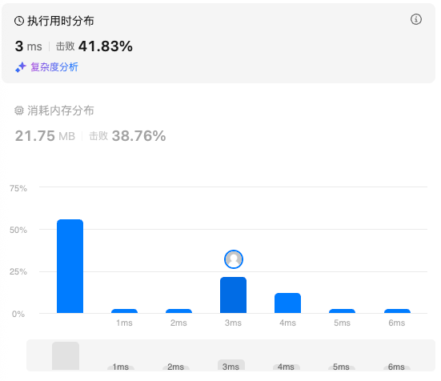

# 230.二叉搜索树中第K小的元素（中等）

## 题目描述

给定一个二叉搜索树的根节点 `root` ，和一个整数 `k` ，请你设计一个算法查找其中第 `k` 小的元素（`k` 从 1 开始计数）。

 

**示例 1：**


```
输入：root = [3,1,4,null,2], k = 1
输出：1
```

**示例 2：**


```
输入：root = [5,3,6,2,4,null,null,1], k = 3
输出：3
```

 

 

**提示：**

- 树中的节点数为 `n` 。
- `1 <= k <= n <= 104`
- `0 <= Node.val <= 104`

 

**进阶：**如果二叉搜索树经常被修改（插入/删除操作）并且你需要频繁地查找第 `k` 小的值，你将如何优化算法？

## 我的Python解答

二叉搜索树中序遍历有序，那么就维护一个times表征当前节点是第几个节点，如果找到了，就赋值给ans，但是按理来说这里应该有一个早停策略的，但是一时间想不起来如何早停，准备看答案

```python
# Definition for a binary tree node.
# class TreeNode:
#     def __init__(self, val=0, left=None, right=None):
#         self.val = val
#         self.left = left
#         self.right = right
class Solution:
    def kthSmallest(self, root: Optional[TreeNode], k: int) -> int:
        times = 1
        self.ans = 0
        # 本质上是二分查找，二叉搜索树的中序遍历有序
        def dfs(node: Optional[TreeNode]):
            if node is None:
                return
            dfs(node.left)
            nonlocal times
            if times == k:
                self.ans = node.val
            times += 1
            dfs(node.right)
        dfs(root)
        return self.ans
```

结果：



## Python参考答案

### 写法一：记录答案

在中序遍历，即「左-根-右」的过程中，每次递归完左子树，就把 *k* 减少 1，表示我们按照中序遍历访问到了一个节点。如果减一后 *k* 变成 0，那么答案就是当前节点的值，用一个外部变量 *ans* 记录。

所以它这里在最开始判断的时候加上对k的判断，就是一种早停策略

```python
class Solution:
    def kthSmallest(self, root: Optional[TreeNode], k: int) -> int:
        ans = 0
        def dfs(node: Optional[TreeNode]) -> None:
            nonlocal k, ans
            if node is None or k == 0:
                return
            dfs(node.left)  # 左
            k -= 1
            if k == 0:
                ans = node.val  # 根
            dfs(node.right)  # 右
        dfs(root)
        return ans
```

#### 复杂度分析

- 时间复杂度：O(*n*)，其中 *n* 是二叉树的大小（节点个数）。
- 空间复杂度：O(*h*)，其中 *h* 是树高，递归需要 O(*h*) 的栈空间。最坏情况下树是一条链，*h*=*n*，空间复杂度为 O(*n*)。

### 写法二：不记录答案 + 提前返回

写法一使用了一个外部变量记录答案，能否不使用外部变量记录呢？

可以，做法如下：

1. 递归边界：如果当前节点是空节点，返回 −1，表示没有找到。注意题目保证节点值非负。
2. 执行中序遍历，先递归左子树。
3. 判断左子树的返回值 *leftRes* 是否为 −1。如果不是 −1，说明我们在左子树中找到了答案，返回 *leftRes*。如果是 −1，说明尚未找到答案，继续下一步。
4. 把 *k* 减少 1。如果 *k*=0，那么答案就是当前节点值，返回当前节点值。
5. 现在，答案要么在当前节点的右子树中，要么在除了当前子树的其余节点中。递归右子树，如果答案在右子树中，那么直接返回答案；如果答案不在右子树中，那么右子树也会返回 −1，由于当前子树搜索完毕，所以当前子树没有找到答案，返回 −1。综上所述，可以直接返回右子树的返回值。

```python
class Solution:
    def kthSmallest(self, root: Optional[TreeNode], k: int) -> int:
        def dfs(node: Optional[TreeNode]) -> int:
            if node is None:
                return -1  # 题目保证节点值非负，用 -1 表示没有找到
            left_res = dfs(node.left)
            if left_res != -1:  # 答案在左子树中
                return left_res
            nonlocal k
            k -= 1
            if k == 0:  # 答案就是当前节点
                return node.val
            return dfs(node.right)  # 右子树会返回答案或者 -1
        return dfs(root)
```

# 199.二叉树的右视图（中等）

## 题目描述

给定一个二叉树的 **根节点** `root`，想象自己站在它的右侧，按照从顶部到底部的顺序，返回从右侧所能看到的节点值。

 

**示例 1：**

**输入：**root = [1,2,3,null,5,null,4]

**输出：**[1,3,4]

**解释：**


**示例 2：**

**输入：**root = [1,2,3,4,null,null,null,5]

**输出：**[1,3,4,5]

**解释：**


**示例 3：**

**输入：**root = [1,null,3]

**输出：**[1,3]

**示例 4：**

**输入：**root = []

**输出：**[]

 

**提示:**

- 二叉树的节点个数的范围是 `[0,100]`
- `-100 <= Node.val <= 100` 

## 我的解答

使用层序遍历，每一层的最后一个元素加入ans的list里面，但是我这里还是笨方法，额外添加了一个layer来表征当前节点对应的层次号

```python
# Definition for a binary tree node.
# class TreeNode:
#     def __init__(self, val=0, left=None, right=None):
#         self.val = val
#         self.left = left
#         self.right = right
from collections import deque
class Solution:
    def rightSideView(self, root: Optional[TreeNode]) -> List[int]:
        # 本质上是每一层的最右侧一个节点，那么应该使用的是层序遍历
        if root is None:
            return []
        queue = deque()
        queue.append([root,1])
        ans = []
        while queue:
            tmp = queue.popleft()
            node, layer = tmp[0], tmp[1]
            if node.left:
                queue.append([node.left, layer+1])
            if node.right:
                queue.append([node.right, layer+1])
            if len(ans)==layer:
                ans[-1] = node.val
            else:
                ans.append(node.val)
        return ans
```

结果：


## 参考答案

### 递归

**思路**：先递归右子树，再递归左子树，当某个深度首次到达时，对应的节点就在右视图中。

```python
class Solution:
    def rightSideView(self, root: Optional[TreeNode]) -> List[int]:
        ans = []
        def dfs(node: Optional[TreeNode], depth: int) -> None:
            if node is None:
                return
            if depth == len(ans):  # 这个深度首次遇到
                ans.append(node.val)
            dfs(node.right, depth + 1)  # 先递归右子树，保证首次遇到的一定是最右边的节点
            dfs(node.left, depth + 1)
        dfs(root, 0)
        return ans
```

复杂度分析

- 时间复杂度：O(*n*)，其中 *n* 是二叉树的节点个数。
- 空间复杂度：O(*h*)，其中 *h* 是二叉树的高度。递归需要 O(*h*) 的栈空间。最坏情况下，二叉树退化成一条链，递归需要 O(*n*) 的栈空间。

结果：


### 层序遍历

本质上，每一层我们是已知节点数目的，就是len

```python
class Solution:
    def rightSideView(self, root: Optional[TreeNode]) -> List[int]:
        if not root:
            return []
        q=deque([root])
        ans=[]
        while q:
            ans.append(q[0].val)
            n=len(q)
            for _ in range(n):
                node=q.popleft()
                if node.right:
                    q.append(node.right)        #先放右边
                if node.left:
                    q.append(node.left)
        return ans
```

# 114.二叉树展开为链表（中等）

## 题目描述

给你二叉树的根结点 `root` ，请你将它展开为一个单链表：

- 展开后的单链表应该同样使用 `TreeNode` ，其中 `right` 子指针指向链表中下一个结点，而左子指针始终为 `null` 。
- 展开后的单链表应该与二叉树 [**先序遍历**](https://baike.baidu.com/item/先序遍历/6442839?fr=aladdin) 顺序相同。

 

**示例 1：**


```
输入：root = [1,2,5,3,4,null,6]
输出：[1,null,2,null,3,null,4,null,5,null,6]
```

**示例 2：**

```
输入：root = []
输出：[]
```

**示例 3：**

```
输入：root = [0]
输出：[0]
```

 

**提示：**

- 树中结点数在范围 `[0, 2000]` 内
- `-100 <= Node.val <= 100`

 

**进阶：**你可以使用原地算法（`O(1)` 额外空间）展开这棵树吗？

## 我的解答

第一想法是一边先序遍历一边构造新的链表

```python
# Definition for a binary tree node.
# class TreeNode:
#     def __init__(self, val=0, left=None, right=None):
#         self.val = val
#         self.left = left
#         self.right = right
class Solution:
    def flatten(self, root: Optional[TreeNode]) -> None:
        """
        Do not return anything, modify root in-place instead.
        """
        last = dummy = TreeNode(right=root)
        def dfs(node):
            if node is None:
                return
            nonlocal last
            last.right = TreeNode(val=node.val)
            last = last.right
            dfs(node.left)
            dfs(node.right)
        dfs(root)
        # print(dummy)
        root = dummy.right
```

但是这样只是在函数内容吧root指向来dummy.right，在外部仍然没有改变root，这就是这个题的返回值是None的原因了，只有原地修改能够实现任务。

耗时太久，直接看答案

## 参考答案

### 方法一：头插法


采用**头插法**构建链表，也就是从节点 6 开始，在 6 的前面插入 5，在 5 的前面插入 4，依此类推。

为此，要按照 6→5→4→3→2→1 的顺序访问节点。如何遍历这棵树，才能实现这个顺序？

按照**右子树 - 左子树 - 根**的顺序 DFS 这棵树。

DFS 的同时，记录当前链表的头节点为 *head*。一开始 *head* 是空节点。

具体来说：

1. 如果当前节点为空，返回。
2. 递归右子树。
3. 递归左子树。
4. 把 *root*.*left* 置为空。
5. 头插法，把 *root* 插在 *head* 的前面，也就是 *root*.*right*=*head*。
6. 现在 *root* 是链表的头节点，把 *head* 更新为 *root*。

```python
class Solution:
    head = None

    def flatten(self, root: Optional[TreeNode]) -> None:
        if root is None:
            return
        self.flatten(root.right)
        self.flatten(root.left)
        root.left = None
        root.right = self.head  # 头插法，相当于链表的 root.next = head
        self.head = root  # 现在链表头节点是 root
```

结果：


复杂度分析

- 时间复杂度：O(*n*)，其中 *n* 是二叉树的节点个数。
- 空间复杂度：O(*n*)。递归需要 O(*n*) 的栈空间。

### 方法二：分治

方法一需要用到一个在 DFS 之外的变量 *head*，能否只在 DFS 中解决呢？

考虑分治，假如我们计算出了 *root*=1 左子树的链表 2→3→4，以及右子树的链表 5→6，那么接下来只需要穿针引线，把节点 1 和两条链表连起来：

1. 先把 2→3→4 和 5→6 连起来，也就是左子树链表尾节点 4 的 *right* 更新为节点 5（即 *root*.*right*），得到 2→3→4→5→6。
2. 然后把 1 和 2→3→4→5→6 连起来，也就是节点 1 的 *right* 更新为节点 2（即 *root*.*left*），得到 1→2→3→4→5→6。
3. 最后把 *root*.*left* 置为空。

上面的过程，我们需要知道左子树链表的尾节点 4。所以 DFS 需要返回链表的尾节点。

链表合并完成后，返回合并后的链表的尾节点，也就是右子树链表的尾节点。如果右子树是空的，则返回左子树链表的尾节点。如果左右子树都是空的，返回当前节点。

```python
class Solution:
    def flatten(self, root: Optional[TreeNode]) -> Optional[TreeNode]:
        if root is None:
            return None
        left_tail = self.flatten(root.left)
        right_tail = self.flatten(root.right)
        if left_tail:
            left_tail.right = root.right  # 左子树链表 -> 右子树链表
            root.right = root.left  # 当前节点 -> 左右子树合并后的链表
            root.left = None
        return right_tail or left_tail or root
```

# 105.从前序与中序遍历序列构造二叉树（中等）

## 题目描述

给定两个整数数组 `preorder` 和 `inorder` ，其中 `preorder` 是二叉树的**先序遍历**， `inorder` 是同一棵树的**中序遍历**，请构造二叉树并返回其根节点。

 

**示例 1:**


```
输入: preorder = [3,9,20,15,7], inorder = [9,3,15,20,7]
输出: [3,9,20,null,null,15,7]
```

**示例 2:**

```
输入: preorder = [-1], inorder = [-1]
输出: [-1]
```

 

**提示:**

- `1 <= preorder.length <= 3000`
- `inorder.length == preorder.length`
- `-3000 <= preorder[i], inorder[i] <= 3000`
- `preorder` 和 `inorder` 均 **无重复** 元素
- `inorder` 均出现在 `preorder`
- `preorder` **保证** 为二叉树的前序遍历序列
- `inorder` **保证** 为二叉树的中序遍历序列

## 我的解答

递归构造，首先先序遍历的第一个元素一定是根节点，中序遍历找到根节点，左侧是左子树，右侧是右子树，就可以迭代继续构造了。但是这样时空都很高

```python
# Definition for a binary tree node.
# class TreeNode:
#     def __init__(self, val=0, left=None, right=None):
#         self.val = val
#         self.left = left
#         self.right = right
class Solution:
    def findIndex(self, nums: List[int], target:int)->int:
        # 找某个元素的index（保证一定存在）
        for i, x in enumerate(nums):
            if x==target:
                return i
        return -1

    def buildTree(self, preorder: List[int], inorder: List[int]) -> Optional[TreeNode]:
        if len(preorder)<=0:
            return None
        root = TreeNode(val = preorder[0])
        idx = self.findIndex(inorder,root.val)
        left_in = inorder[:idx]
        left_pre = preorder[1:idx+1]
        right_in = inorder[idx+1:]
        right_pre = preorder[idx+1:]
        root.left = self.buildTree(left_pre,left_in)
        root.right = self.buildTree(right_pre,right_in)
        return root
```

结果：


## 参考答案


**递归边界**：如果 *preorder* 的长度是 0，对应着空节点，返回空。

```python
class Solution:
    def buildTree(self, preorder: List[int], inorder: List[int]) -> Optional[TreeNode]:
        if not preorder:  # 空节点
            return None
        left_size = inorder.index(preorder[0])  # 左子树的大小
        left = self.buildTree(preorder[1: 1 + left_size], inorder[:left_size])
        right = self.buildTree(preorder[1 + left_size:], inorder[1 + left_size:])
        return TreeNode(preorder[0], left, right)
```

（这个和我的思路一致，但是更加精炼）

复杂度分析

- 时间复杂度：O(*n*2)，其中 *n* 为 *preorder* 的长度。最坏情况下二叉树是一条链，我们需要递归 O(*n*) 次，每次都需要 O(*n*) 的时间查找 *preorder*[0] 和复制数组。
- 空间复杂度：O(*n*2)。

### 写法二

上面的写法有两个优化点：

1. 用一个哈希表（或者数组）预处理 *inorder* 每个元素的下标，这样就可以 O(1) 查到 *preorder*[0] 在 *inorder* 的位置，从而 O(1) 知道左子树的大小。
2. 把递归参数改成子数组下标区间（**左闭右开区间**）的左右端点，从而避免复制数组。

```python
class Solution:
    def buildTree(self, preorder: List[int], inorder: List[int]) -> Optional[TreeNode]:
        index = {x: i for i, x in enumerate(inorder)}

        def dfs(pre_l: int, pre_r: int, in_l: int) -> Optional[TreeNode]:
            if pre_l == pre_r:  # 空节点
                return None
            left_size = index[preorder[pre_l]] - in_l  # 左子树的大小
            left = dfs(pre_l + 1, pre_l + 1 + left_size, in_l)
            right = dfs(pre_l + 1 + left_size, pre_r, in_l + 1 + left_size)
            return TreeNode(preorder[pre_l], left, right)

        return dfs(0, len(preorder), 0)  # 左闭右开区间
```

复杂度分析

- 时间复杂度：O(*n*)，其中 *n* 为 *preorder* 的长度。递归 O(*n*) 次，每次只需要 O(1) 的时间。
- 空间复杂度：O(*n*)。

> 注：由于哈希表常数比数组大，实际运行效率可能不如写法一。

# 473.路径总和III（中等）

## 题目描述

给定一个二叉树的根节点 `root` ，和一个整数 `targetSum` ，求该二叉树里节点值之和等于 `targetSum` 的 **路径** 的数目。

**路径** 不需要从根节点开始，也不需要在叶子节点结束，但是路径方向必须是向下的（只能从父节点到子节点）。

 

**示例 1：**


```
输入：root = [10,5,-3,3,2,null,11,3,-2,null,1], targetSum = 8
输出：3
解释：和等于 8 的路径有 3 条，如图所示。
```

**示例 2：**

```
输入：root = [5,4,8,11,null,13,4,7,2,null,null,5,1], targetSum = 22
输出：3
```

 

**提示:**

- 二叉树的节点个数的范围是 `[0,1000]`
- `-109 <= Node.val <= 109` 
- `-1000 <= targetSum <= 1000` 

## 我的解答

给我的第一感觉是树形dp，但是没有一个好的思路，直接看答案，不耽误时间

## 参考答案

如果二叉树是一条链，本题就和 [560. 和为 K 的子数组](https://leetcode.cn/problems/subarray-sum-equals-k/) 完全一样了：统计有多少个非空连续子数组的元素和恰好等于 *targetSum*。所以必须先弄明白 560 题（特殊情况），再来做本题（一般情况）。

这两题的联系如下：

| **560. 和为 K 的子数组**                           | **437. 路径总和 III**                          |
| -------------------------------------------------- | ---------------------------------------------- |
| 连续子数组                                         | 方向向下的路径                                 |
| 前缀                                               | 从根节点开始的路径                             |
| 做法：枚举子数组**右端点**，统计有多少个**左端点** | 做法：枚举路径的**终点**，统计有多少个**起点** |

我们要解决的问题是：DFS 遍历这棵树，遍历到节点 *node* 时，假设 *node* 是路径的终点，那么有多少个起点，满足起点到终点 *node* 的路径总和恰好等于 *targetSum*？

和 560 题一样的套路：一边遍历二叉树，一边用哈希表 *cnt* 统计前缀和（从根节点开始的路径和）的出现次数。设从根到终点 *node* 的路径和为 *s*，那么起点的个数就是 *cnt*[*s*−*targetSum*]，加入答案。对比 560 题，我们在枚举子数组的右端点（终点），统计有多少个左端点（起点），做法完全一致。

**问**：为什么这样做是对的？不会漏算多算吗？

**答**：不会漏算多算。首先最暴力的做法是，枚举终点，枚举起点，判断起点到终点的路径和是否恰好等于 *targetSum*，是就把答案加一。暴力做法必然不会漏算多算。我们的做法其实是对暴力的优化，保留了**枚举终点**这一步，把枚举起点这一步通过哈希表优化成了 O(1)。

**问**：为什么要初始化哈希表 *cnt*[0]=1？

**答**：同 560 题，这里的 0 相当于前缀和数组中的 *s*[0]=0。举个最简单的例子，根节点值为 1，*targetSum*=1。如果不把 0 加到哈希表中，按照我们的算法，没法算出这里有 1 条符合要求的路径。也可以这样理解，要想**把任意路径和都表示成两个前缀和的差**，必须添加一个 0，否则当路径是前缀时（从根节点开始的路径），没法减去一个数，具体见 [前缀和及其扩展](https://leetcode.cn/problems/range-sum-query-immutable/solution/qian-zhui-he-ji-qi-kuo-zhan-fu-ti-dan-py-vaar/) 中的讲解。

**问**：为什么代码中要先更新 *ans*，再更新 *cnt*？

**答**：在 *targetSum*=0 的情况下，这俩谁先谁后都可以。但如果 *targetSum*=0，假设根节点值为 1，如果先把 *cnt*[1] 增加 1，再把 *ans* 增加 *cnt*[*s*−*targetSum*]=*cnt*[1]=1，就相当于我们找到了一条和为 *targetSum*=0 的路径，但和为 0 的路径是不存在的。另一种理解方式是，空路径的元素和等于 0，我们把这个 0 当作了符合要求的路径，但题目要统计的是非空路径。

**问**：代码中的「恢复现场」用意何在？

**答**：如果不恢复现场，当我们递归完左子树，要递归右子树时，*cnt* 中还保存着左子树的数据。但递归到右子树，要计算的路径并不涉及到左子树的任何节点，如果不恢复现场，*cnt* 中统计的前缀和个数会更多，我们算出来的答案可能比正确答案更大。

**问**：为什么要在递归完右子树后才能恢复现场？能否在递归完左子树后就恢复现场呢？换句话说，代码中的恢复现场能否写在 `dfs(node.left, s)` 和 `dfs(node.right, s)` 之间？

**答**：看代码，恢复现场恢复的是什么？是去掉当前节点 *node* 的信息。递归 *node* 的右子树时，需不需要 *node* 的信息？需要，因为 *node* 在路径中。所以要在递归完右子树后，才能恢复现场。恢复现场的代码不能写在 `dfs(node.left, s)` 和 `dfs(node.right, s)` 之间。

**问**：为什么递归参数 *s* 不需要恢复现场？

**答**：*s* 是基本类型，在函数调用的时候会**复制**一份往下传递，`s += node.val` 修改的**仅仅**是当前递归函数中的 *s* 参数，并不会影响到其他递归函数中的 *s*。注：如果把 *s* 放在递归函数外，此时只有一个 *s*，执行 `s += node.val` 就会影响全局了，这种情况需要 `s -= node.val` 恢复现场。

**问**：能不能枚举起点？

**答**：首先对比一下，枚举终点的话，起点都在上面，都在一条链中（根到当前节点），很好维护；而枚举起点，终点都在下面（*node* 子树），是分散的，不好维护。对比可以发现，枚举终点，维护起点是更方便的。硬要枚举起点是可以做的，对于每个节点 *node*，返回根到 *node* 子树中的每个节点的前缀和（返回一个哈希表）。在合并左右子树的哈希表时，应当使用启发式合并，也就是把小的哈希表合并到大的哈希表中，从而保证 O(*n*log*n*) 的时间复杂度。所以枚举起点不仅麻烦，而且更慢。

```python
class Solution:
    def pathSum(self, root: Optional[TreeNode], targetSum: int) -> int:
        # key：从根到 node 的节点值之和
        # value：节点值之和的出现次数
        # 注意在递归过程中，哈希表只保存根到 node 的路径的前缀的节点值之和
        cnt = defaultdict(int)  
        cnt[0] = 1
        ans = 0

        # s 表示从根到 node 的父节点的节点值之和（node 的节点值尚未计入）
        def dfs(node: Optional[TreeNode], s: int) -> None:
            if node is None:
                return

            nonlocal ans
            s += node.val
            # 把 node 当作路径的终点，统计有多少个起点
            ans += cnt[s - targetSum]

            cnt[s] += 1
            dfs(node.left, s)
            dfs(node.right, s)
            cnt[s] -= 1  # 恢复现场（撤销 cnt[s] += 1）

        dfs(root, 0)
        return ans
```

复杂度分析

- 时间复杂度：O(*n*)，其中 *n* 是二叉树的节点个数。
- 空间复杂度：O(*n*)。