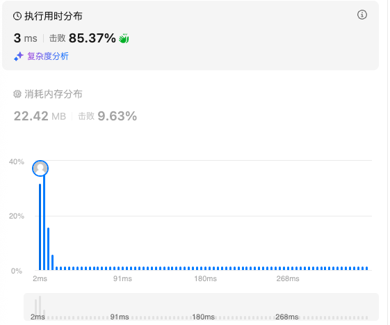

# 155.最小栈（中等）

## 题目描述

设计一个支持 `push` ，`pop` ，`top` 操作，并能在常数时间内检索到最小元素的栈。

实现 `MinStack` 类:

- `MinStack()` 初始化堆栈对象。
- `void push(int val)` 将元素val推入堆栈。
- `void pop()` 删除堆栈顶部的元素。
- `int top()` 获取堆栈顶部的元素。
- `int getMin()` 获取堆栈中的最小元素。

 

**示例 1:**

```
输入：
["MinStack","push","push","push","getMin","pop","top","getMin"]
[[],[-2],[0],[-3],[],[],[],[]]

输出：
[null,null,null,null,-3,null,0,-2]

解释：
MinStack minStack = new MinStack();
minStack.push(-2);
minStack.push(0);
minStack.push(-3);
minStack.getMin();   --> 返回 -3.
minStack.pop();
minStack.top();      --> 返回 0.
minStack.getMin();   --> 返回 -2.
```

## 我的Python解答

直观的感觉是维护一个小根堆，从而实现常数级别的最小元素检索。直接看答案

## Python参考答案

给你一个数组 *nums*，如何计算**每个**前缀的最小值？

定义 *preMin*[*i*] 表示 *nums*[0] 到 *nums*[*i*] 的最小值。

这可以从左到右计算：

- *preMin*[0]=*nums*[0]。
- *preMin*[1]=min(*nums*[0],*nums*[1])。
- *preMin*[2]=min(*nums*[0],*nums*[1],*nums*[2])=min(*preMin*[1],*nums*[2])。
- *preMin*[3]=min(*nums*[0],*nums*[1],*nums*[2],*nums*[3])=min(*preMin*[2],*nums*[3])。
- ……

一般地，我们有

*preMin*[*i*]=min(*preMin*[*i*−1],*nums*[*i*])

回到本题

把 *nums* 视作栈，本题相当于在 *nums* 的末尾**动态地添加/删除元素**。

- 栈中除了保存添加的元素，还保存前缀最小值。（栈中保存的是 pair）
- 添加元素：设当前栈的大小是 *n*。添加元素 *val* 后，额外维护 *preMin*[*n*]=min(*preMin*[*n*−1],*val*)，其中 *preMin*[*n*−1] 是添加 *val* 之前，栈顶保存的前缀最小值。
- 删除元素：弹出栈顶即可。

细节

一开始栈为空（*n*=0），添加 *val* 时，我们没有对应的 *preMin*[*n*−1]。需要特判栈为空的情况吗？

不需要。初始化的时候，在栈底加一个 ∞ 哨兵，作为 *preMin*[−1]。

> 注意题目保证 pop,top,getMin 都是在非空栈上操作的。

```python
class MinStack:
    def __init__(self):
        # 这里的 0 写成任意数都可以，反正用不到
        self.st = [(0, inf)]  # 栈底哨兵

    def push(self, val: int) -> None:
        self.st.append((val, min(self.st[-1][1], val)))

    def pop(self) -> None:
        self.st.pop()

    def top(self) -> int:
        return self.st[-1][0]

    def getMin(self) -> int:
        return self.st[-1][1]
```

结果：



# 394.字符串解码（中等）

## 题目描述

给定一个经过编码的字符串，返回它解码后的字符串。

编码规则为: `k[encoded_string]`，表示其中方括号内部的 `encoded_string` 正好重复 `k` 次。注意 `k` 保证为正整数。

你可以认为输入字符串总是有效的；输入字符串中没有额外的空格，且输入的方括号总是符合格式要求的。

此外，你可以认为原始数据不包含数字，所有的数字只表示重复的次数 `k` ，例如不会出现像 `3a` 或 `2[4]` 的输入。

测试用例保证输出的长度不会超过 `105`。

 

**示例 1：**

```
输入：s = "3[a]2[bc]"
输出："aaabcbc"
```

**示例 2：**

```
输入：s = "3[a2[c]]"
输出："accaccacc"
```

**示例 3：**

```
输入：s = "2[abc]3[cd]ef"
输出："abcabccdcdcdef"
```

**示例 4：**

```
输入：s = "abc3[cd]xyz"
输出："abccdcdcdxyz"
```

 

**提示：**

- `1 <= s.length <= 30`
- `s` 由小写英文字母、数字和方括号 `'[]'` 组成
- `s` 保证是一个 **有效** 的输入。
- `s` 中所有整数的取值范围为 `[1, 300]` 

## 我的解答

碰壁点：没有考虑到数字是多位数的情况，因此第一遍提交的时候把num_st想的太简单了，导致示例“"100[leetcode]"” 返回结果为空

```python
class Solution:
    def decodeString(self, s: str) -> str:
        # 维护两个栈
        char_st = deque()
        num_st = deque()
        num_st.append("[")
        for c in s:
            if 0<= ord(c)-ord('a') <= (ord('z')-ord('a')):
                char_st.append(c)
            elif c == "[":
                char_st.append(c)
                num_st.append(c)
            elif c!="]":
                # c是数字
                num_st.append(c)
            else:
                # 遇到结束符号了
                num_st.pop() # 初始值为“【”
                times = ""
                while num_st[-1] != "[":
                    times = num_st.pop() + times
                times = int(times)
                tmp = ""
                while char_st[-1] != "[":
                    tmp = char_st.pop() + tmp
                char_st.pop() # 出栈"["
                tmp = tmp*times
                char_st.append(tmp)
        ans = ""
        while char_st:
            ans = char_st.pop() + ans
        return ans
```

结果：


## 参考答案

递归：

```python
class Solution:
    def decodeString(self, s: str) -> str:
        if not s:
            return s

        # s[0] 是字母
        if s[0].isalpha():
            # 分离出 s[0]，解码剩下的
            return s[0] + self.decodeString(s[1:])

        # s[0] 是数字，后面至少有一对括号
        i = s.find('[')  # 找左括号
        # 找右括号，注意对于 [...[...]...] 这种情况，第一个右括号并不是我们要找的，第二个才是
        balance = 1  # 左括号个数减去右括号个数
        for j in count(i + 1):  # 从 i+1 开始向右遍历，找与 s[i] 匹配的右括号
            if s[j] == '[':
                balance += 1
            elif s[j] == ']':
                balance -= 1
                if balance == 0:  # 左右括号个数相等，找到与 s[i] 匹配的右括号 s[j]
                    return self.decodeString(s[i + 1: j]) * int(s[:i]) + self.decodeString(s[j + 1:])
```

```python
class Solution:
    def decodeString(self, s: str) -> str:
        i = 0

        def decode() -> str:
            nonlocal i
            res = ''  # 或者 res = []，具体见另一份代码【Python3 列表】
            k = 0
            while i < len(s):
                c = s[i]
                i += 1
                if c.isalpha():
                    res += c
                elif c.isdigit():
                    k = k * 10 + int(c)
                elif c == '[':  # 递
                    res += decode() * k  # 把括号内的字符串重复 k 次
                    k = 0  # 重置 k，若不重置，2[a]3[b] 后面的 3 会算出 k = 23
                else:  # ']' 归
                    break
            return res

        return decode()
```

```python
class Solution:
    def decodeString(self, s: str) -> str:
        i = 0

        def decode() -> str:
            nonlocal i
            res = []
            k = 0
            while i < len(s):
                c = s[i]
                i += 1
                if c.isalpha():
                    res.append(c)
                elif c.isdigit():
                    k = k * 10 + int(c)
                elif c == '[':  # 递
                    res.append(decode() * k)  # 把括号内的字符串重复 k 次
                    k = 0  # 重置 k，若不重置，2[a]3[b] 后面的 3 会算出 k = 23
                else:  # ']' 归
                    break
            return ''.join(res)

        return decode()
```

用栈：

```python
class Solution:
    def decodeString(self, s: str) -> str:
        stack = []  # 用于模拟计算机的递归
        res = ''
        k = 0
        for c in s:
            if c.isalpha():
                res += c
            elif c.isdigit():
                k = k * 10 + int(c)
            elif c == '[':
                # 模拟递归
                # 在递归之前，把当前递归函数中的局部变量 res 和 k 保存到栈中
                stack.append((res, k))
                # 递归，初始化 res 和 k
                res = ''
                k = 0
            else:  # ']'
                # 递归结束，从栈中恢复递归之前保存的局部变量
                pre_res, pre_k = stack.pop()
                # 此时 res 是下层递归的返回值，将其重复 pre_k 次，拼接到递归前的 pre_res 之后
                res = pre_res + res * pre_k
        return res
```

```python
class Solution:
    def decodeString(self, s: str) -> str:
        stk = []
        for ch in s:
            # 不是']'就入栈,遇到']'再解码
            if ch != ']':
                stk.append(ch)
                continue

            # 解码step 1: 提取本段字符串
            sub = ""
            while stk[-1] != '[':
                sub = stk.pop() + sub
            
            stk.pop()  # 移出'['
            
            # 解码step 2: 提取本段数字
            k, base = 0, 1
            while stk and stk[-1].isdigit():
                k += int(stk.pop()) * base
                base *= 10

            # 本段解码后再次入栈
            stk.append(sub * k)

        return "".join(stk)
```

