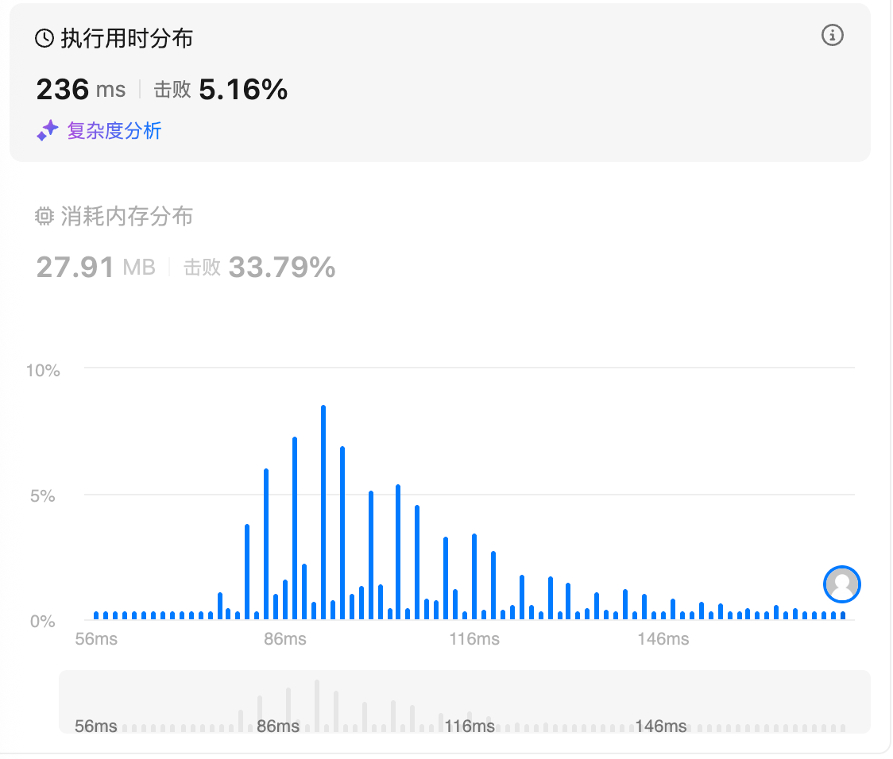

# 739.每日温度（中等）

## 题目描述

给定一个整数数组 `temperatures` ，表示每天的温度，返回一个数组 `answer` ，其中 `answer[i]` 是指对于第 `i` 天，下一个更高温度出现在几天后。如果气温在这之后都不会升高，请在该位置用 `0` 来代替。

 

**示例 1:**

```
输入: temperatures = [73,74,75,71,69,72,76,73]
输出: [1,1,4,2,1,1,0,0]
```

**示例 2:**

```
输入: temperatures = [30,40,50,60]
输出: [1,1,1,0]
```

**示例 3:**

```
输入: temperatures = [30,60,90]
输出: [1,1,0]
```

 

**提示：**

- `1 <= temperatures.length <= 105`
- `30 <= temperatures[i] <= 100`

## 我的Python解答

维护一个递减的单调栈

```python
class Solution:
    def dailyTemperatures(self, temperatures: List[int]) -> List[int]:
        # 单调栈，存储下标，维护的是单调递减的队列
        st = deque()
        ans = [0] * len(temperatures)
        for idx, t in enumerate(temperatures):
            if not st or t<=temperatures[st[-1]]:
                st.append(idx)
                continue
            # t > 栈中最后一个元素
            # print((idx, t))
            while st and temperatures[st[-1]]<t:
                cur = st.pop()
                ans[cur] = idx - cur
            st.append(idx)
        return ans
```

结果：



## Python参考答案

### 从右到左

递增单调栈

栈中记录下一个更大元素的「候选项」的下标。

每次循环，我们可以在「候选项」中找到答案。

```python
class Solution:
    def dailyTemperatures(self, temperatures: List[int]) -> List[int]:
        n = len(temperatures)
        ans = [0] * n
        st = []
        for i in range(n - 1, -1, -1):
            t = temperatures[i]
            while st and t >= temperatures[st[-1]]:
                st.pop()
            if st:
                ans[i] = st[-1] - i
            st.append(i)
        return ans
```

### 从左到右

递减单调栈

```python
class Solution:
    def dailyTemperatures(self, temperatures: List[int]) -> List[int]:
        n = len(temperatures)
        ans = [0] * n
        st = []  # todolist
        for i, t in enumerate(temperatures):
            while st and t > temperatures[st[-1]]:
                j = st.pop()
                ans[j] = i - j
            st.append(i)
        return ans
```

# 84.柱状图中最大的矩形（困难）

## 题目描述

给定 *n* 个非负整数，用来表示柱状图中各个柱子的高度。每个柱子彼此相邻，且宽度为 1 。

求在该柱状图中，能够勾勒出来的矩形的最大面积。

 

**示例 1:**


```
输入：heights = [2,1,5,6,2,3]
输出：10
解释：最大的矩形为图中红色区域，面积为 10
```

**示例 2：**


```
输入： heights = [2,4]
输出： 4
```

 

**提示：**

- `1 <= heights.length <=105`
- `0 <= heights[i] <= 104`

## 我的解答

耗时太久，直接看答案

## 参考答案


首先，面积最大矩形的高度**一定是** *heights* **中的元素**。这可以用反证法证明：假如高度不在 *heights* 中，比如 4，那我们可以增加高度直到触及某根柱子的顶部，比如增加到 5，由于矩形底边长不变，高度增加，我们得到了面积更大的矩形，矛盾，所以面积最大矩形的高度一定是 *heights* 中的元素。

枚举每个 *h*=*heights*[*i*]，作为矩形的高。那么矩形的宽最大是多少？我们需要知道：

- 在 *i* 左侧的**小于** *h* 的最近元素的下标 *left*，如果不存在则为 −1。求出了 *left*，那么 *left*+1 就是矩形最左边那根柱子。如果 *left*=−1，那么加一后是 0，就是整个 *heights* 最左边的柱子。
- 在 *i* 右侧的**小于** *h* 的最近元素的下标 *right*，如果不存在则为 *n*。求出了 *right*，那么 *right*−1 就是矩形最右边那根柱子。如果 *right*=*n*，那么减一后是 *n*−1，就是整个 *heights* 最右边的柱子。

比如示例 1（上图），选择 *i*=2 这个柱子作为矩形的高，那么左边小于 *heights*[2]=5 的最近元素的下标为 *left*=1，右边小于 *heights*[2]=5 的最近元素的下标为 *right*=4。矩形的宽就是 *right*−*left*−1=4−1−1=2，矩形面积为 *h*⋅(*right*−*left*−1)=5⋅2=10。

枚举 *i*，计算对应的矩形面积，更新答案的最大值。

为什么这样做不会漏掉答案？题目本质是计算高×宽的最大值，高是我们枚举的，所以只要保证宽尽量大，答案就一定能被我们枚举计算到。

如何快速计算 *left* 和 *right*？可以用**单调栈**。


**问**：为什么一定要找「最近」的？

**答**：看上面的图，比如 5 右侧小于 5 的最近高度是 2，如果我们找的不是高度 2 而是更远的高度 3，那么我们会误认为矩形右边界最远可以是高度 2（3 的左边是 2），然而这样的矩形已经超出柱状图的范围了，不符合题目要求。

### 写法一：三次遍历

```python
class Solution:
    def largestRectangleArea(self, heights: List[int]) -> int:
        n = len(heights)
        left = [-1] * n
        st = []
        for i, h in enumerate(heights):
            while st and heights[st[-1]] >= h:
                st.pop()
            if st:
                left[i] = st[-1]
            st.append(i)

        right = [n] * n
        st.clear()
        for i in range(n - 1, -1, -1):
            h = heights[i]
            while st and heights[st[-1]] >= h:
                st.pop()
            if st:
                right[i] = st[-1]
            st.append(i)

        ans = 0
        for h, l, r in zip(heights, left, right):
            ans = max(ans, h * (r - l - 1))
        return ans
```

#### 复杂度分析

- 时间复杂度：O(*n*)，其中 *n* 为 *heights* 的长度。每个元素入栈出栈各至多一次，所以二重循环是 O(*n*) 的。
- 空间复杂度：O(*n*)。

### 写法二：两次遍历

为了做到两次遍历，以及写法三的一次遍历，首先，把 *right*[*i*] 的定义略作修改，调整为：在 *i* 右侧的**小于或等于** *h*=*heights*[*i*] 的最近元素的下标。

如果 *heights* 中没有相同的元素，这样修改不影响 *right*[*i*]。

如果 *heights* 中有相同的元素呢？比如 *heights*=[1,3,4,3,2]，左边那个 3 的 *right*[*i*] 会变小，导致矩形面积变小，这是否会导致计算错误？

不会。注意在这种情况下，这两个高为 3 的柱子，对应的矩形面积（在写法一中）是一样大的，虽然（在写法二中）左边那个 3 的矩形面积变小了，但右边那个 3 的矩形面积是不变的，所以我们**不会错过正确答案**。

修改 *right*[*i*] 的定义后，我们可以把 *left* 和 *right* 合在一起计算，从而减少一次遍历：

- 在计算 *left* 的过程中，如果栈顶元素 ≥*heights*[*i*]，那么 *i* 就是栈顶元素的 *right*。

```python
class Solution:
    def largestRectangleArea(self, heights: List[int]) -> int:
        n = len(heights)
        left = [-1] * n
        right = [n] * n
        st = []
        for i, h in enumerate(heights):
            while st and heights[st[-1]] >= h:
                right[st.pop()] = i
            if st:
                left[i] = st[-1]
            st.append(i)

        ans = 0
        for h, l, r in zip(heights, left, right):
            ans = max(ans, h * (r - l - 1))
        return ans
```

#### 复杂度分析

- 时间复杂度：O(*n*)，其中 *n* 为 *heights* 的长度。每个元素入栈出栈各至多一次，所以二重循环是 O(*n*) 的。
- 空间复杂度：O(*n*)。

### 写法三：一次遍历

写法二告诉我们，栈顶出栈时，当前下标就是栈顶的 *right*。

如果此刻能顺带求出栈顶的 *left*，那不就能一步到位，一次遍历就搞定了？

想一想，栈顶的 *left* 在哪？

由于单调栈是底小顶大的，栈顶下面那个柱子的高度一定比栈顶小，所以栈顶下面的值就是 *left*。

为简化代码逻辑，可以在一开始把 −1 入栈，当作哨兵。当栈中只有一个数的时候，栈顶下面那个数刚好就是 −1，对应 *left*[*i*]=−1 的情况。

此外，循环结束的时候，栈中还有数据，这些数据也要计算矩形面积。处理这种情况可以再写一个循环，但更简单的办法是，往 *heights* 的末尾加一个 −1（或者任意 ≤min(*heights*) 的数），从而保证循环结束的时候，栈一定是空的（不包括哨兵）。

```python
class Solution:
    def largestRectangleArea(self, heights: List[int]) -> int:
        heights.append(-1)  # 最后大火收汁，用 -1 把栈清空
        st = [-1]  # 在栈中只有一个数的时候，栈顶的「下面那个数」是 -1，对应 left[i] = -1 的情况
        ans = 0
        for right, h in enumerate(heights):
            while len(st) > 1 and heights[st[-1]] >= h:
                i = st.pop()  # 矩形的高（的下标）
                left = st[-1]  # 栈顶下面那个数就是 left
                ans = max(ans, heights[i] * (right - left - 1))
            st.append(right)
        return ans
```

#### 复杂度分析

- 时间复杂度：O(*n*)，其中 *n* 为 *heights* 的长度。每个元素入栈出栈各至多一次，所以二重循环是 O(*n*) 的。
- 空间复杂度：O(min(*n*,*U*))。其中 *U* 为 *heights* 中的不同元素个数。注意栈中没有重复元素。