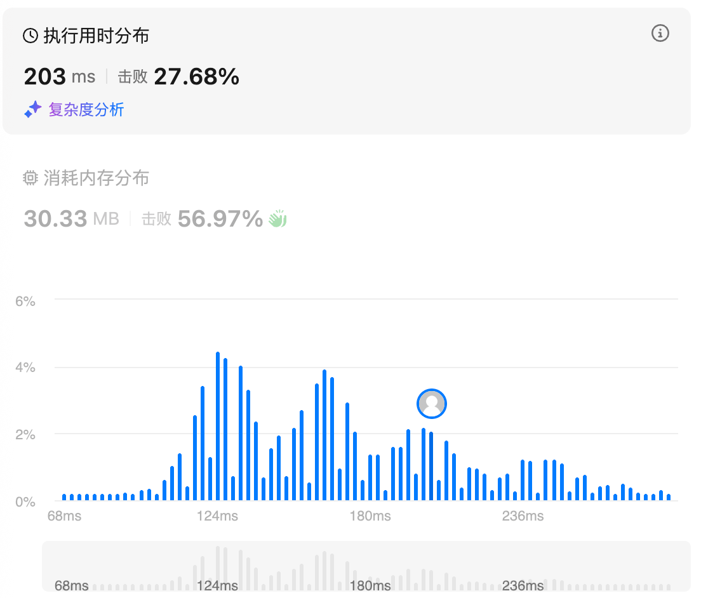
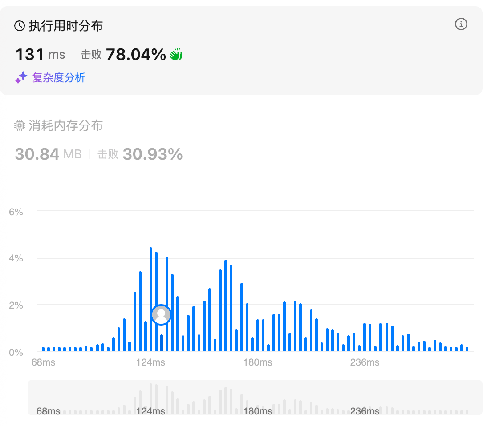
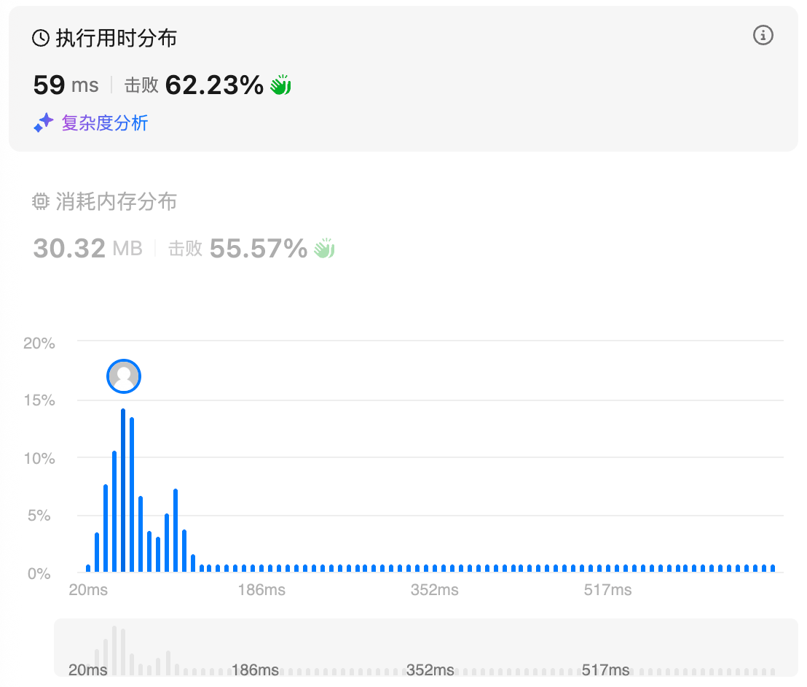
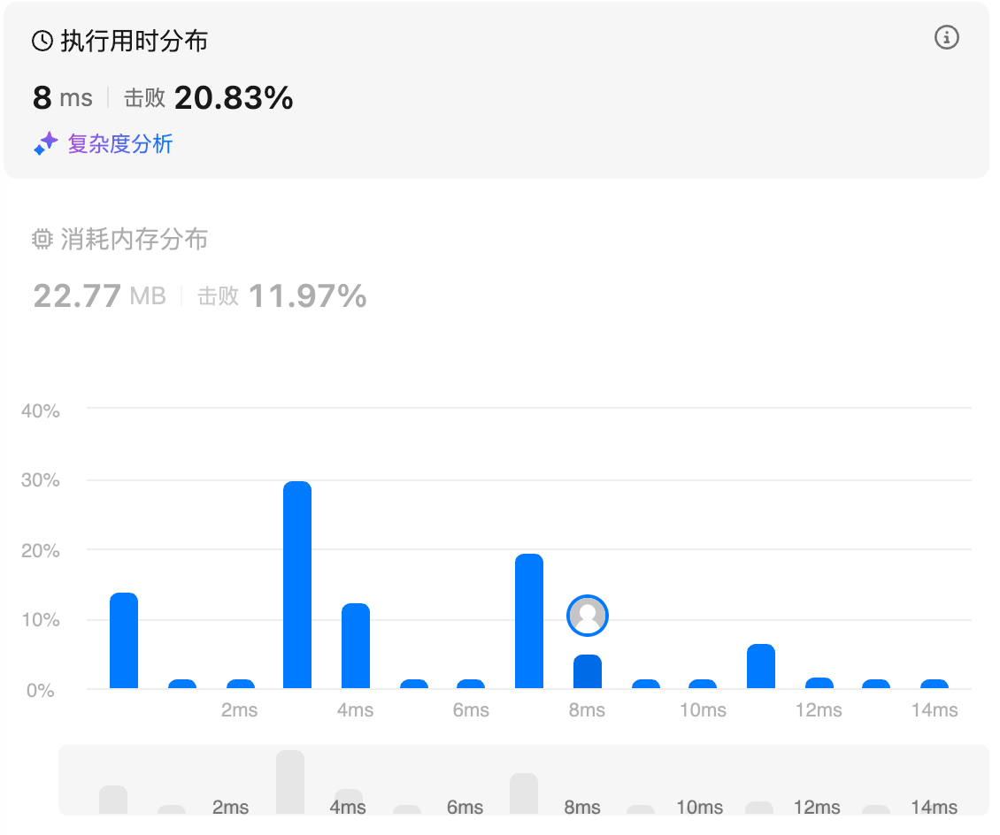

# 84.柱状图中最大的矩形（困难）

## 题目描述

给定 *n* 个非负整数，用来表示柱状图中各个柱子的高度。每个柱子彼此相邻，且宽度为 1 。

求在该柱状图中，能够勾勒出来的矩形的最大面积。

 

**示例 1:**


```
输入：heights = [2,1,5,6,2,3]
输出：10
解释：最大的矩形为图中红色区域，面积为 10
```

**示例 2：**


```
输入： heights = [2,4]
输出： 4
```

 

**提示：**

- `1 <= heights.length <=105`
- `0 <= heights[i] <= 104`

## 我的Python解答

```python
class Solution:
    def largestRectangleArea(self, heights: List[int]) -> int:
        # 两个单调栈
        n = len(heights)
        left = [-1] * n
        st = []
        for i,h in enumerate(heights):
            while st and heights[st[-1]] >=h:
                st.pop()
            if st:
                left[i] = st[-1]
            st.append(i)
        
        right = [n] * n
        st.clear()
        for i in range(n-1, -1, -1):
            h = heights[i]
            while st and heights[st[-1]] >= h:
                st.pop()
            if st:
                right[i] = st[-1]
            st.append(i)
        
        ans = 0
        for h, l ,r in zip(heights, left, right):
            ans = max(ans, h * (r-l-1))
        return ans
```

结果：



## Python参考答案

看视频学到了一个思路，维护一个单调递增的栈，压栈可以实现确认左边界，出栈可以实现确认右边界，因此对left和right数组的变更之需要一个遍历即可

```python
class Solution:
    def largestRectangleArea(self, heights: List[int]) -> int:
        n = len(heights)
        left = [-1] * n
        right = [n] * n
        st = []
        for idx, h in enumerate(heights):
            while st and h < heights[st[-1]]:
                right[st.pop()] = idx
            if st:
                left[idx] = st[-1]
            st.append(idx)
        ans = 0
        for h, l, r in zip(heights, left, right):
            ans = max(ans, h * (r - l - 1))
        return ans
```

结果：



# 215.数组中的第K个最大元素（中等）

## 题目描述

给定整数数组 `nums` 和整数 `k`，请返回数组中第 `**k**` 个最大的元素。

请注意，你需要找的是数组排序后的第 `k` 个最大的元素，而不是第 `k` 个不同的元素。

你必须设计并实现时间复杂度为 `O(n)` 的算法解决此问题。

 

**示例 1:**

```
输入: [3,2,1,5,6,4], k = 2
输出: 5
```

**示例 2:**

```
输入: [3,2,3,1,2,4,5,5,6], k = 4
输出: 4
```

 

**提示：**

- `1 <= k <= nums.length <= 105`
- `-104 <= nums[i] <= 104`

## 我的解答

知道使用堆排序，但是不知道怎么实现，直接看答案

## 参考答案

仿照快速排序的思想，一次把一个元素放到正确的位置上来，如果idx为len-k，那就是结果

```python
class Solution:
    def partition(self, nums: List[int], left:int, right:int) -> int:
        i = randint(left,right)
        pivot = nums[i]
        nums[i], nums[left] = nums[left], nums[i]
        i, j = left+1, right
        while True:
            while i<=j and nums[i] < pivot:
                i += 1
            while i<=j and nums[j] > pivot:
                j -= 1
            if i>=j:
                break
            nums[i], nums[j] = nums[j], nums[i]
            i += 1
            j -= 1
        nums[left], nums[j] = nums[j], nums[left]
        return j

    def findKthLargest(self, nums: List[int], k: int) -> int:
        n = len(nums)
        target_idx = n-k
        left, right = 0, n-1
        while True:
            i = self.partition(nums, left, right)
            if i == target_idx:
                return nums[i]
            if i>target_idx:
                right = i-1
            else:
                left = i+1
```

结果：



### 堆排序

Python 的 heapq 默认是小顶堆。如果在 Python 中使用大顶堆，本题方式为将原数值取负数存入小顶堆中，取出元素时再进行取反获得原数值，通过 小顶堆 + 负数存储 模拟实现 大顶堆。

大顶堆与小顶堆的选择，从后面对四种写法具体的时间复杂度分析可知：

- 大顶堆和小顶堆都可以。

- 如果 k 远小于 n，这种情况下很可能存在大量 小于等于目标元素的数，写法四的效率最高。
- 如果 k 和 n 差不多，大顶堆和小顶堆解法效率基本一致，小顶堆解法的常数项优于大顶堆解法。



写法一，大顶堆，维护所有元素：

- 建立一个大顶堆，维护所有元素（初始化时 n 个元素全部入堆），然后做 k−1 次出堆操作后，堆顶元素（剩余元素的最大值）就是目标。

- 时间复杂度 O((n + k) * logn)。

写法二，小顶堆，维护所有元素：

- 建立一个小顶堆，维护所有元素（初始化时 n 个元素全部入堆），然后做 n−k 次出堆操作后，堆顶元素（剩余元素的最小值）就是目标。

- 时间复杂度 O((2n−k) * logn)。

写法三，Top-K 问题，小顶堆，维护 k 个元素：

- 小顶堆，维护 k 个元素（初始化时前 k 个元素入堆），然后遍历剩余所有元素（n-k 个），每次入堆操作后，弹出堆顶元素（先入堆后弹出，执行了 n-k 次）。遍历完成后，堆中元素数量为 k，堆顶是这 k 个元素中的最小值（原数组的第 k 大元素）。

- 时间复杂度 O((2n - k) * logk)。

写法四，Top-K 问题的优化写法，小顶堆，维护 k 个元素，通过提前判断减少无效的堆操作：

- 基于写法三，当小顶堆初始化完成（堆中元素数量达到 k），遍历剩余所有元素（n-k 个），仅在 新元素 大于 堆顶元素 时才执行先入堆后弹出，否则，不对堆执行任何操作。

- 通过提前判断，减少了对 小于等于当前堆顶元素 的无效操作（他们一定不可能成为最终的目标元素），适合含有大量 小于等于目标元素 的情况。这种情况下，写法三相比写法二可以减少大量入堆出堆操作。

- 时间复杂度仍为 O((2n - k) * logk)。

- 如果存在大量 小于等于目标元素的数 的情况，时间复杂度最理想情况可为 O(k * logk + (n - k))，同时当 k 远小于 n 时，近似等于 O(n)。

```python
# 调用 库的堆容器，多种写法。

# 写法一，大顶堆，维护所有元素
import heapq

class Solution:
    def findKthLargest(self, nums: List[int], k: int) -> int:
        # Python的heapq默认是小顶堆，通过取负数模拟大顶堆
        max_heap = []
        for x in nums:
            heapq.heappush(max_heap, -x)
        
        for i in range(k - 1):
            heapq.heappop(max_heap)
        return -max_heap[0]

# 写法二，小顶堆，维护所有元素
import heapq

class Solution:
    def findKthLargest(self, nums: List[int], k: int) -> int:
        min_heap = []
        for x in nums:
            heapq.heappush(min_heap, x)
        
        for i in range(len(nums) - k):
            heapq.heappop(min_heap)
        return min_heap[0]

# 写法三，Top-K 问题，小顶堆，维护 k 个元素
import heapq

class Solution:
    def findKthLargest(self, nums: List[int], k: int) -> int:
        min_heap = []
        for x in nums:
            heapq.heappush(min_heap, x)
            if len(min_heap) > k:
                heapq.heappop(min_heap)
        return min_heap[0]

# 写法四，Top-K 问题的优化写法，小顶堆，维护 k 个元素，通过提前判断减少无效的堆操作
import heapq

class Solution:
    def findKthLargest(self, nums: List[int], k: int) -> int:
        min_heap = []
        for x in nums:
            # 堆大小不足k时，直接入堆
            if len(min_heap) < k:
                heapq.heappush(min_heap, x)
            # 堆大小达k后，仅当元素大于堆顶时才替换
            else:
                if x > min_heap[0]:
                    heapq.heappop(min_heap)
                    heapq.heappush(min_heap, x)
        return min_heap[0]
```

## Python收获

### python中的heapq

#### 一、`heapq` 模块概述

`heapq` 是 Python 标准库中的一个模块，提供了一组用于**堆排序**和**优先队列**操作的函数。默认情况下，`heapq` 实现的是**最小堆（min-heap）**，即堆顶元素是当前最小的元素。堆是完全二叉树的一种实现，它的特性是：

- **父节点的值**小于或等于其左右子节点的值（最小堆）。
- 通过堆可以在 **O(log n)** 的时间复杂度内完成插入和删除操作。

在 Python 中，堆通过**列表**实现，堆顶元素始终位于 `list[0]` 位置，插入和删除元素时会自动调整堆的结构。`heapq` 提供的主要函数包括：`heappush`, `heappop`, `heapify`, `heappushpop`, `heapreplace`, `nlargest`, `nsmallest` 等。

#### 二、基本操作函数详解

##### 1. `heapq.heappush(heap, item)`

将元素 `item` 推入堆中，保持堆的性质不变。

```python
import heapq
heap = [1, 3, 5]
heapq.heappush(heap, 2)  # 插入 2
print(heap)  # 输出：[1, 2, 5, 3]
```

堆的性质保证了：推入元素后，堆的顺序仍然有效，`heap[0]` 仍然是最小值。

##### 2. `heapq.heappop(heap)`

弹出并返回堆中的最小元素，并保持堆的性质不变。

```python
import heapq
heap = [1, 2, 3]
min_item = heapq.heappop(heap)
print(min_item)  # 输出：1
print(heap)  # 输出：[2, 3]
```

`heappop` 操作会将堆顶元素弹出，并将最后一个元素移动到堆顶，随后重新调整堆。

##### 3. `heapq.heapify(x)`

将列表 `x` 转换为堆。此操作原地进行，时间复杂度是 O(n)，适合在已有数据情况下构建堆。

```python
import heapq
x = [4, 1, 7, 3, 8, 5]
heapq.heapify(x)
print(x)  # 输出：[1, 3, 5, 4, 8, 7]
```

`heapify` 会对列表进行原地调整，使其符合堆结构要求，`x[0]` 成为最小值。

##### 4. `heapq.heappushpop(heap, item)`

先将元素 `item` 推入堆中，然后再弹出并返回堆中的最小元素。该方法相比 `heappush()` 和 `heappop()` 的组合操作更高效，因为它只需要调整堆一次。

```python
import heapq
heap = [1, 2, 3]
result = heapq.heappushpop(heap, 4)
print(result)  # 输出：1 (堆顶最小元素被弹出)
print(heap)  # 输出：[2, 4, 3]
```

在该操作中，`4` 会先被加入堆，再从堆中弹出最小元素 `1`。

##### 5. `heapq.heapreplace(heap, item)`

先弹出堆顶元素，再将 `item` 插入堆中。与 `heappop()` 后再 `heappush()` 相比，`heapreplace()` 只进行一次堆调整，效率更高。

```python
import heapq
heap = [1, 2, 3]
result = heapq.heapreplace(heap, 4)
print(result)  # 输出：1 (堆顶最小元素被弹出)
print(heap)  # 输出：[2, 4, 3]
```

`heapreplace` 可以确保弹出的元素是最小的，同时插入的元素仍然保证堆的性质。

#### 三、附加功能：`nlargest` 与 `nsmallest`

这两个函数用于直接从数据中选出前 K 个最大或最小的元素，利用堆结构在 **O(n log k)** 的时间复杂度内高效完成。

- `heapq.nlargest(n, iterable, key=None)`：返回可迭代对象中前 `n` 个最大元素，`key` 参数用于自定义排序规则。
- `heapq.nsmallest(n, iterable, key=None)`：返回可迭代对象中前 `n` 个最小元素，`key` 参数用于自定义排序规则。

```python
import heapq
data = [5, 1, 3, 8, 7, 2]
print(heapq.nlargest(3, data))  # 输出：[8, 7, 5]
print(heapq.nsmallest(3, data))  # 输出：[1, 2, 3]
```

如果没有 `key`，默认按元素的大小排序。`nlargest` 和 `nsmallest` 不改变原始数据。

#### 四、`merge` 函数：多路归并

`heapq.merge(*iterables)` 用于对多个已排序的可迭代对象进行归并排序，返回一个 **按升序排列的元素生成器**。它可以对多个有序序列合并成一个有序序列。

```python
import heapq
list1 = [1, 5, 9]
list2 = [2, 6, 10]
list3 = [3, 7, 11]
merged = list(heapq.merge(list1, list2, list3))
print(merged)  # 输出：[1, 2, 3, 5, 6, 7, 9, 10, 11]
```

该操作不会修改原始序列，并且非常高效，适用于多路归并算法。

#### 五、堆的实现与性能分析

堆是基于完全二叉树实现的，因此：

- 查找最小（或最大）元素：O(1)
- 插入元素：O(log n)
- 删除最小（或最大）元素：O(log n)
- 构建堆：O(n)
  由于堆是一个完全二叉树，其高度始终是 `log n`，因此堆操作的效率相对较高，适合用于任务调度、流式数据的 Top-K 查找、优先队列等场景。

#### 六、堆的应用场景

堆广泛应用于**优先队列**、**图算法**、**流式数据**、**Top-K 问题**等场景：

- **优先队列**：在任务调度中，堆用来快速获取优先级最高（或最低）的任务。
- **Dijkstra 算法**：最短路径算法中需要频繁获取当前距离最短的节点。
- **Top-K 问题**：在海量数据流中维护前 K 大或前 K 小的元素。
- **合并多个已排序的列表**：如归并排序的多路归并。

#### 七、常见误区与注意事项

1）堆结构并不是有序的，它只保证堆顶元素最小（或最大），并不保证其他元素的顺序，因此不要用堆来替代排序。
2）`heapq` 操作原地修改堆，不会返回新列表，因此如果你需要保留原数据，建议先进行 `heapq.heapify` 构建堆，再进行操作。
3）`heapq` 并没有提供直接的“更新”操作（如 `decrease-key` 或 `increase-key`），通常需要通过“删除 + 插入”来实现。
4）`heapq.merge` 是一个生成器，使用时最好转换为列表或通过迭代器按需获取元素。

#### 八、总结

`heapq` 提供了一组高效的堆操作，主要用于维护优先队列、Top-K 查找和多路归并。它基于二叉堆实现，支持插入、删除、查找最小元素等基本操作，常用于任务调度、图算法、流式数据处理等场景。理解堆的性能特性与操作细节，可以帮助你在实际编程中高效地处理大量数据。

# 347.前K个高频元素（中等）

## 题目描述

给你一个整数数组 `nums` 和一个整数 `k` ，请你返回其中出现频率前 `k` 高的元素。你可以按 **任意顺序** 返回答案。

 

**示例 1：**

**输入：**nums = [1,1,1,2,2,3], k = 2

**输出：**[1,2]

**示例 2：**

**输入：**nums = [1], k = 1

**输出：**[1]

**示例 3：**

**输入：**nums = [1,2,1,2,1,2,3,1,3,2], k = 2

**输出：**[1,2]

 

**提示：**

- `1 <= nums.length <= 105`
- `-104 <= nums[i] <= 104`
- `k` 的取值范围是 `[1, 数组中不相同的元素的个数]`
- 题目数据保证答案唯一，换句话说，数组中前 `k` 个高频元素的集合是唯一的

 

**进阶：**你所设计算法的时间复杂度 **必须** 优于 `O(n log n)` ，其中 `n` 是数组大小。

## 我的解答

最开始想的其实不是堆排序，而是获取cnt之后再遍历一边，反转过来，把统计信息用作键，真实num作为值，后没有这样做因为还是不清楚前k个。看了解析发现这个和桶排序的思想比较相似，但是最后一步用list存储可以实现o（1）元素读取

堆排序

```python
class Solution:
    def topKFrequent(self, nums: List[int], k: int) -> List[int]:
        cnt = Counter(nums)
        q = []
        for key, fre in cnt.items():
            heapq.heappush(q,(fre, key))
            if len(q)>k:
                heapq.heappop(q)
        result = [0] * k
        for i in range(k-1, -1, -1):
            result[i] = heapq.heappop(q)[1]
        return result
```

结果：



## 参考答案

### 第一步

既然答案与元素的出现次数有关，那么先用一个哈希表 *cnt* **统计每个元素的出现次数**。哈希表的 key 是元素值，value 是 key 在数组中的出现次数。

此时问题变成：

- 返回一个列表，包含前 *k* 大的出现次数对应的元素值。

### 第二步

**把出现次数相同的元素，放到同一个桶中**。同一个桶内的元素出现次数相同，无需对桶内元素排序。

设出现次数的最大值为 *maxCnt*。创建一个大小为 *maxCnt*+1 的列表 *buckets*，其中 *buckets*[*c*] 存储出现次数为 *c* 的元素。（每个 *buckets*[*c*] 都是一个列表）

> 注意 *maxCnt*≤*n*，这保证了时间复杂度是 O(*n*) 的。

遍历 *cnt*，把出现次数为 *c* 的元素 *x* 添加到 *buckets*[*c*] 中。

### 第三步

倒序遍历 *buckets*，把 *buckets*[*c*] 中的元素加到答案中。

一旦答案的长度等于 *k*，就立刻返回答案。

> 注 1：题目保证答案唯一，所以一定会出现答案长度恰好等于 *k* 的情况。
>
> 注 2：可以按任意顺序返回答案。比如示例 1 返回 [1,2] 还是 [2,1] 都是正确的。

```python
class Solution:
    def topKFrequent(self, nums: List[int], k: int) -> List[int]:
        # 第一步：统计每个元素的出现次数
        cnt = Counter(nums)
        max_cnt = max(cnt.values())

        # 第二步：把出现次数相同的元素，放到同一个桶中
        buckets = [[] for _ in range(max_cnt + 1)]  # 也可以用 defaultdict(list)
        for x, c in cnt.items():
            buckets[c].append(x)

        # 第三步：倒序遍历 buckets，把出现次数前 k 大的元素加入答案
        ans = []
        for bucket in reversed(buckets):
            ans += bucket
            # 注意题目保证答案唯一，一定会出现恰好等于 k 的情况
            if len(ans) == k:
                return ans
```

复杂度分析

- 时间复杂度：O(*n*)，其中 *n* 是 *nums* 的长度。
- 空间复杂度：O(*n*)。

```python
class Solution:
    def topKFrequent(self, nums: List[int], k: int) -> List[int]:
        counter = collections.Counter(nums)
        # counter = collections.Counter([elem for elem in nums])
        # return [].append(counter.most_common(k))
        res = []
        for elem in counter.most_common(k):
            res.append(elem[0])
        return res
```

时间O(nlogk)

