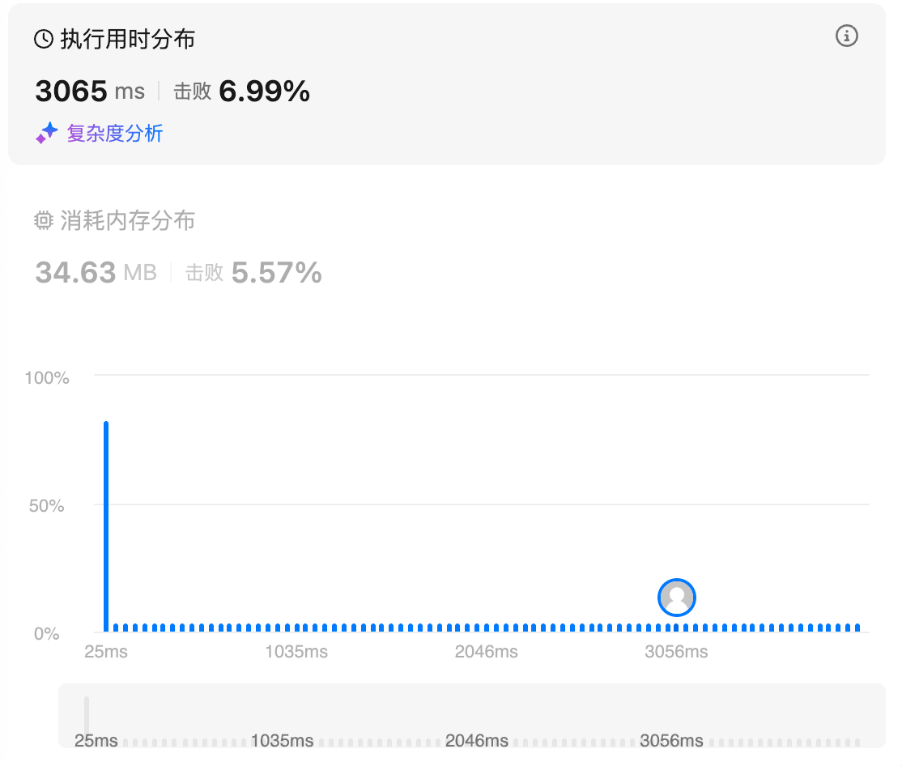
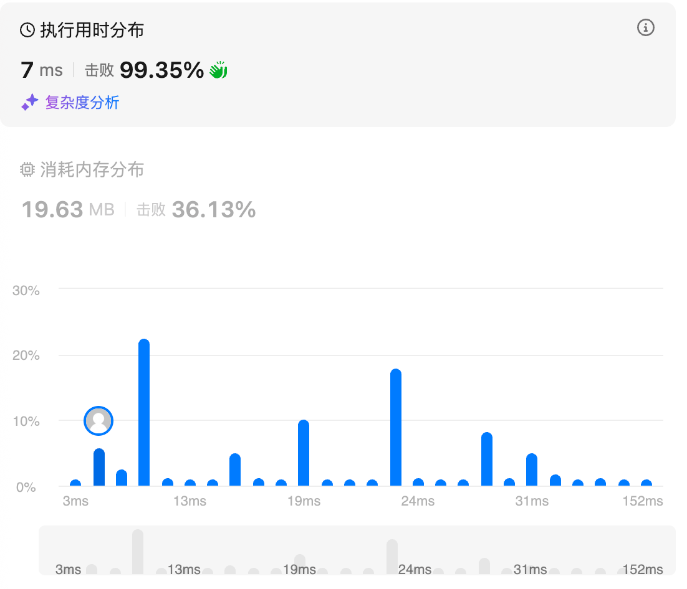

# 45.跳跃游戏II（中等）

## 题目描述

给定一个长度为 `n` 的 **0 索引**整数数组 `nums`。初始位置在下标 0。

每个元素 `nums[i]` 表示从索引 `i` 向后跳转的最大长度。换句话说，如果你在索引 `i` 处，你可以跳转到任意 `(i + j)` 处：

- `0 <= j <= nums[i]` 且
- `i + j < n`

返回到达 `n - 1` 的最小跳跃次数。测试用例保证可以到达 `n - 1`。

 

**示例 1:**

```
输入: nums = [2,3,1,1,4]
输出: 2
解释: 跳到最后一个位置的最小跳跃数是 2。
     从下标为 0 跳到下标为 1 的位置，跳 1 步，然后跳 3 步到达数组的最后一个位置。
```

**示例 2:**

```
输入: nums = [2,3,0,1,4]
输出: 2
```

 

**提示:**

- `1 <= nums.length <= 104`
- `0 <= nums[i] <= 1000`
- 题目保证可以到达 `n - 1`

## 我的Python解答

### 记忆化搜索

```python
class Solution:
    def jump(self, nums: List[int]) -> int:
        # 最小跳跃 等价于 每一次都尽可能贪心跳大步骤
        # 已经确保可以跳到，所以需要维护的是step
        # 使用递归比较好理解
        @cache
        def dfs(i):
            # i 表征当前位置，可以跳的步数为[1,nums[i]]
            if i>=len(nums)-1:
                return 0
            if nums[i]==0:
                return inf
            # print((i, nums[i]))
            return min([dfs(i+j)+1 for j in range(nums[i], 0, -1)])
        return dfs(0)
```

结果：



## Python参考答案


⚠**注意**：不是在无路可走的那个位置造桥，而是当发现无路可走的时候，时光倒流到能跳到最远点的那个位置造桥。换句话说，**在无路可走之前，我们只是在默默地收集信息**。当发现无路可走的时候，才从收集到的信息中，选择最远点造桥。所建造的这座桥的左端点（起跳位置）可能在我们当前走的这座桥的中间。

也可以理解成，当发现无路可走的时候，往回跳，选择合适的位置造桥。我们可以在最终算账的时候，把往回跳的情况**擦掉**，只保留往右跳，也能到达终点。所以**往回跳不计入跳跃次数**。

答疑

**问**：为什么代码只需要遍历到 *n*−2？

**答**：代码中的 for 循环计算的是在到达终点**之前**需要造多少座桥。*n*−1 已经是终点了，不需要造桥。或者说，遍历到 *n*−2 时，要么已经可以到达终点，要么需要造最后一座桥。

**问**：如果题目没有保证一定能到达 *n*−1，代码要怎么改？

**答**：见 [1326. 灌溉花园的最少水龙头数目](https://leetcode.cn/problems/minimum-number-of-taps-to-open-to-water-a-garden/)，[题解](https://leetcode.cn/problems/minimum-number-of-taps-to-open-to-water-a-garden/solutions/2123855/yi-zhang-tu-miao-dong-pythonjavacgo-by-e-wqry/)。

```python
class Solution:
    def jump(self, nums: List[int]) -> int:
        ans = 0
        cur_right = 0  # 已建造的桥的右端点
        next_right = 0  # 下一座桥的右端点的最大值
        for i in range(len(nums) - 1):
            # 遍历的过程中，记录下一座桥的最远点
            next_right = max(next_right, i + nums[i])
            if i == cur_right:  # 无路可走，必须建桥
                cur_right = next_right  # 建桥后，最远可以到达 next_right
                ans += 1
        return ans
```

复杂度分析

- 时间复杂度：O(*n*)。其中 *n* 是 *nums* 的长度。
- 空间复杂度：O(1)。

# 1326.灌溉花园的最少水龙头数目（困难）

## 题目描述

在 x 轴上有一个一维的花园。花园长度为 `n`，从点 `0` 开始，到点 `n` 结束。

花园里总共有 `n + 1` 个水龙头，分别位于 `[0, 1, ..., n]` 。

给你一个整数 `n` 和一个长度为 `n + 1` 的整数数组 `ranges` ，其中 `ranges[i]` （下标从 0 开始）表示：如果打开点 `i` 处的水龙头，可以灌溉的区域为 `[i - ranges[i], i + ranges[i]]` 。

请你返回可以灌溉整个花园的 **最少水龙头数目** 。如果花园始终存在无法灌溉到的地方，请你返回 **-1** 。

 

**示例 1：**


```
输入：n = 5, ranges = [3,4,1,1,0,0]
输出：1
解释：
点 0 处的水龙头可以灌溉区间 [-3,3]
点 1 处的水龙头可以灌溉区间 [-3,5]
点 2 处的水龙头可以灌溉区间 [1,3]
点 3 处的水龙头可以灌溉区间 [2,4]
点 4 处的水龙头可以灌溉区间 [4,4]
点 5 处的水龙头可以灌溉区间 [5,5]
只需要打开点 1 处的水龙头即可灌溉整个花园 [0,5] 。
```

**示例 2：**

```
输入：n = 3, ranges = [0,0,0,0]
输出：-1
解释：即使打开所有水龙头，你也无法灌溉整个花园。
```

 

**提示：**

- `1 <= n <= 104`
- `ranges.length == n + 1`
- `0 <= ranges[i] <= 100`

## 我的解答

在答案的帮助下

```python
class Solution:
    def minTaps(self, n: int, ranges: List[int]) -> int:
        # 参考45的贪心做法，本质上还是要维护右端点，但是现在当前节点能达到的最远端不是自己决定的，而是全部信息决定的，因此需要先遍历，维护一个映射后的右端点
        real_jump = [0]*(n+1)
        for i, r in enumerate(ranges):
            left = max(0, i-r)
            real_jump[left] = max(real_jump[left], i+r)
        ans = 0
        cur_right = 0
        next_right = 0
        for i in range(n):
            next_right = max(next_right, real_jump[i])
            if i==cur_right:
                # 当前到达右边界
                if i==next_right:
                    return -1
                cur_right = next_right
                ans += 1
        return ans
```

结果：



## 参考答案

```python
class Solution:
    def minTaps(self, n: int, ranges: List[int]) -> int:
        right_most = [0] * (n + 1)
        for i, r in enumerate(ranges):
            left = max(i - r, 0)
            right_most[left] = max(right_most[left], i + r)

        ans = 0
        cur_right = 0  # 已建造的桥的右端点
        next_right = 0  # 下一座桥的右端点的最大值
        for i in range(n):  # 如果走到 n-1 时没有返回 -1，那么必然可以到达 n
            next_right = max(next_right, right_most[i])
            if i == cur_right:  # 到达已建造的桥的右端点
                if i == next_right:  # 无论怎么造桥，都无法从 i 到 i+1
                    return -1
                cur_right = next_right  # 造一座桥
                ans += 1
        return ans
```

# 763.划分字母区间（中等）

## 题目描述

给你一个字符串 `s` 。我们要把这个字符串划分为尽可能多的片段，同一字母最多出现在一个片段中。例如，字符串 `"ababcc"` 能够被分为 `["abab", "cc"]`，但类似 `["aba", "bcc"]` 或 `["ab", "ab", "cc"]` 的划分是非法的。

注意，划分结果需要满足：将所有划分结果按顺序连接，得到的字符串仍然是 `s` 。

返回一个表示每个字符串片段的长度的列表。

 

**示例 1：**

```
输入：s = "ababcbacadefegdehijhklij"
输出：[9,7,8]
解释：
划分结果为 "ababcbaca"、"defegde"、"hijhklij" 。
每个字母最多出现在一个片段中。
像 "ababcbacadefegde", "hijhklij" 这样的划分是错误的，因为划分的片段数较少。 
```

**示例 2：**

```
输入：s = "eccbbbbdec"
输出：[10]
```

 

**提示：**

- `1 <= s.length <= 500`
- `s` 仅由小写英文字母组成

## 我的解答

我也知道需要统计当前字母的起止位置，然后就是逐个遍历，不断判断右端点，如果当前已经到右端点了，说明第一段记录完毕，继续下一段。但是问题在于我不知道怎么获取当前字母的起止位置。

俩哈希表就完事了

```python
class Solution:
    def partitionLabels(self, s: str) -> List[int]:
        tmp = list(s)
        cnt = Counter(tmp)
        ans = []
        tmp_len = 0
        target_cnt = defaultdict(int)
        for i,c in enumerate(tmp):
            target_cnt[c] += 1
            cnt[c] -= 1
            tmp_len += 1
            if cnt[c] == 0:
                # 确保所有的都是0了才可以分出来一个
                del cnt[c]
                del target_cnt[c]
                if len(target_cnt) == 0:
                    ans.append(tmp_len)
                    tmp_len = 0
        return ans
```

结果：


突然想起来起止位置哈希表就能做的，list作为值即可

```python
class Solution:
    def partitionLabels(self, s: str) -> List[int]:
        ans = []
        pos = defaultdict(list)
        for i,c in enumerate(s):
            pos[c].append(i)
        left = right = 0
        count = 0
        while count<len(s):
            cur = count
            right = pos[s[cur]][-1]
            while cur<right:
                right = max(right, pos[s[cur]][-1])
                cur += 1
            ans.append(right-left+1)
            count = cur+1
            left = cur+1
        return ans
```

结果：


## 参考答案

「同一字母最多出现在一个片段中」意味着，一个片段若要包含字母 a，那么所有的字母 a 都必须在这个片段中。

例如示例 1，*s*=ababcbacadefegdehijhklij，其中字母 a 的下标在区间 [0,8] 中，那么包含 a 的片段至少要包含区间 [0,8]。

把所有出现在 *s* 中的字母及其下标区间列出来：

| 字母 | 下标       | 下标区间 |
| ---- | ---------- | -------- |
| a    | [0,2,6,8]  | [0,8]    |
| b    | [1,3,5]    | [1,5]    |
| c    | [4,7]      | [4,7]    |
| d    | [9,14]     | [9,14]   |
| e    | [10,12,15] | [10,15]  |
| f    | [11]       | [11,11]  |
| g    | [13]       | [13,13]  |
| h    | [16,19]    | [16,19]  |
| i    | [17,22]    | [17,22]  |
| j    | [18,23]    | [18,23]  |
| k    | [20]       | [20,20]  |
| l    | [21]       | [21,21]  |

例如字母 d 的区间为 [9,14]，片段要包含 d，必须包含区间 [9,14]，但区间 [9,14] 中还有其它字母 e,f,g，所以该片段也必须包含这些字母对应的区间 [10,15],[11,11],[13,13]，合并后得到区间 [9,15]。

将表格中的区间合并为如下几个大区间：

[0,8],[9,15],[16,23]

这些区间满足「同一字母最多出现在一个片段中」的要求。

由于题目要求划分出尽量多的片段，而我们又无法将上述区间的任何区间划分开，所以合并出的**区间长度**即为答案。

算法

1. 遍历 *s*，计算字母 *c* 在 *s* 中的最后出现的下标 *last*[*c*]。
2. 初始化当前正在合并的区间左右端点 *start*=0, *end*=0。
3. 再次遍历 *s*，由于当前区间必须包含所有 *s*[*i*]，所以用 *last*[*s*[*i*]] 更新区间右端点 *end* 的最大值。
4. 如果发现 *end*=*i*，那么当前区间合并完毕，把区间长度 *end*−*start*+1 加入答案。然后更新 *start*=*i*+1 作为下一个区间的左端点。
5. 遍历完毕，返回答案。

【还真是，只保留最后下标即可】

```python
class Solution:
    def partitionLabels(self, s: str) -> List[int]:
        last = {c: i for i, c in enumerate(s)}  # 每个字母最后出现的下标
        ans = []
        start = end = 0
        for i, c in enumerate(s):
            end = max(end, last[c])  # 更新当前区间右端点的最大值
            if end == i:  # 当前区间合并完毕
                ans.append(end - start + 1)  # 区间长度加入答案
                start = i + 1  # 下一个区间的左端点
        return ans
```

复杂度分析

- 时间复杂度：O(*n*)，其中 *n* 是 *s* 的长度。
- 空间复杂度：O(∣Σ∣)。其中 ∣Σ∣ 是字符集合的大小，本题字符均为小写字母，所以 ∣Σ∣=26。

# 70.爬楼梯

## 题目描述

假设你正在爬楼梯。需要 `n` 阶你才能到达楼顶。

每次你可以爬 `1` 或 `2` 个台阶。你有多少种不同的方法可以爬到楼顶呢？

**示例 1：**

```
输入：n = 2
输出：2
解释：有两种方法可以爬到楼顶。
1. 1 阶 + 1 阶
2. 2 阶
```

**示例 2：**

```
输入：n = 3
输出：3
解释：有三种方法可以爬到楼顶。
1. 1 阶 + 1 阶 + 1 阶
2. 1 阶 + 2 阶
3. 2 阶 + 1 阶
```

**提示：**

- `1 <= n <= 45`

## 我的解答

记忆化搜索：

```python
class Solution:
    def climbStairs(self, n: int) -> int:
        # 先记忆化搜索
        @cache
        def dfs(i:int):
            if i==n:
                return 0
            if i==n-1:
                return 1
            if i==n-2:
                return 2
            return dfs(i+1) + dfs(i+2)
        return dfs(0)
```

结果：


但是总感觉思路很奇怪，因此看答案吧，再复习一下记忆化搜索-递推-dp

## 参考答案

### 一、启发思考：寻找子问题

假设 *n*=9。

我们要解决的问题是从 0 爬到 9 有多少种不同的方法（或者说爬 9 个台阶的方案数）。

分类讨论：

- 如果最后一步爬了 1 个台阶，那么我们得先爬到 8，要解决的问题缩小成：从 0 爬到 8 有多少种不同的方法。
- 如果最后一步爬了 2 个台阶，那么我们得先爬到 7，要解决的问题缩小成：从 0 爬到 7 有多少种不同的方法。

由于这两种情况都会把原问题变成一个**和原问题相似的、规模更小的子问题**，所以可以用**递归**解决。

> 注 1：从大往小思考，主要是为了方便把递归翻译成递推。从小往大思考也是可以的。
>
> 注 2：动态规划有「选或不选」和「枚举选哪个」两种基本思考方式。在做题时，可根据题目要求，选择适合题目的一种来思考。本题用到的是「枚举选哪个」。

### 二、递归怎么写：状态定义与状态转移方程

因为要解决的问题都是「从 0 爬到 *i*」，所以定义 *dfs*(*i*) 表示从 0 爬到 *i* 有多少种不同的方法（或者说爬 *i* 个台阶的方案数）。

分类讨论：

- 如果最后一步爬了 1 个台阶，那么我们得先爬到 *i*−1，要解决的问题缩小成：从 0 爬到 *i*−1 有多少种不同的方法。
- 如果最后一步爬了 2 个台阶，那么我们得先爬到 *i*−2，要解决的问题缩小成：从 0 爬到 *i*−2 有多少种不同的方法。

由于这两种方法是互相独立的（爬的台阶个数不同），所以根据**加法原理**，从 0 爬到 *i* 的方法数等于这两种方法数之和，即

*dfs*(*i*)=*dfs*(*i*−1)+*dfs*(*i*−2)

递归边界：*dfs*(0)=1, *dfs*(1)=1。从 0 爬到 0 有一种方法，即原地不动。从 0 爬到 1 有一种方法，即爬 1 个台阶。

递归入口：*dfs*(*n*)，也就是答案（爬 *n* 个台阶的方案数）。

**问**：为什么 0 到 0 算一种方法？

**答**：也可以这样理解，如果 *dfs*(0)=0，那么 *dfs*(2)=*dfs*(1)+*dfs*(0)=1，这显然是错误的，因为有两种方法可以爬到 2。所以（倒推出）*dfs*(0) 是 1。

```python
# 会超时的递归代码
class Solution:
    def climbStairs(self, n: int) -> int:
        def dfs(i: int) -> int:
            if i <= 1:  # 递归边界
                return 1
            return dfs(i - 1) + dfs(i - 2)
        return dfs(n)
```

复杂度分析

- 时间复杂度：O(2*n*)。搜索树可以近似为一棵二叉树，树高为 O(*n*)，所以节点个数为 O(2*n*)，遍历搜索树需要 O(2*n*) 的时间。
- 空间复杂度：O(*n*)。递归需要 O(*n*) 的栈空间。

### 三、递归 + 记录返回值 = 记忆化搜索

上面的做法太慢了，怎么优化呢？

注意到「先爬 1 个台阶，再爬 2 个台阶」和「先爬 2 个台阶，再爬 1 个台阶」，都相当于爬 3 个台阶，都会从 *dfs*(*i*) 递归到 *dfs*(*i*−3)。

一叶知秋，整个递归中有大量重复递归调用（递归入参相同）。由于递归函数没有副作用，同样的入参无论计算多少次，算出来的结果都是一样的，因此可以用**记忆化搜索**来优化：

- 如果一个状态（递归入参）是第一次遇到，那么可以在返回前，把状态及其结果记到一个 *memo* 数组中。
- 如果一个状态不是第一次遇到（*memo* 中保存的结果不等于 *memo* 的初始值），那么可以直接返回 *memo* 中保存的结果。

**注意**：*memo* 数组的**初始值**一定不能等于要记忆化的值！例如初始值设置为 0，并且要记忆化的 *dfs*(*i*) 也等于 0，那就没法判断 0 到底表示第一次遇到这个状态，还是表示之前遇到过了，从而导致记忆化失效。一般把初始值设置为 −1。本题由于方案数均为正数，所以可以初始化成 0。

> Python 用户可以无视上面这段，直接用 `@cache` 装饰器。

```python
class Solution:
    def climbStairs(self, n: int) -> int:
        @cache  # 缓存装饰器，避免重复计算 dfs 的结果
        def dfs(i: int) -> int:
            if i <= 1:  # 递归边界
                return 1
            return dfs(i - 1) + dfs(i - 2)
        return dfs(n)
```

复杂度分析

- 时间复杂度：O(*n*)。由于每个状态只会计算一次，动态规划的时间复杂度 = 状态个数 × 单个状态的计算时间。本题状态个数等于 O(*n*)，单个状态的计算时间为 O(1)，所以动态规划的时间复杂度为 O(*n*)。
- 空间复杂度：O(*n*)。有多少个状态，*memo* 数组的大小就是多少。

### 四、1:1 翻译成递推

我们可以去掉递归中的「递」，只保留「归」的部分，即自底向上计算。

具体来说，*f*[*i*] 的定义和 *dfs*(*i*) 的定义是一样的，都表示从 0 爬到 *i* 有多少种不同的方法（或者说爬 *i* 个台阶的方案数）。

相应的递推式（状态转移方程）也和 *dfs* 一样：

*f*[*i*]=*f*[*i*−1]+*f*[*i*−2]

> 相当于之前是用递归去计算每个状态，现在是**枚举**并计算每个状态。

初始值 *f*[0]=1, *f*[1]=1，翻译自递归边界 *dfs*(0)=1, *dfs*(1)=1。

答案为 *f*[*n*]，翻译自递归入口 *dfs*(*n*)。

```python
class Solution:
    def climbStairs(self, n: int) -> int:
        f = [0] * (n + 1)
        f[0] = f[1] = 1
        for i in range(2, n + 1):
            f[i] = f[i - 1] + f[i - 2]
        return f[n]
```

### 五、空间优化

观察状态转移方程，发现一旦算出 *f*[*i*]，那么 *f*[*i*−2] 及其左边的状态就永远不会用到了。

这意味着每次循环，只需要知道「上一个状态」和「上上一个状态」的 *f* 值是多少，分别记作 *f*1 和 *f*0。它俩的初始值均为 1，对应着 *f*[1] 和 *f*[0]。

每次循环，计算出新的状态 *newF*=*f*1+*f*0，那么对于下一轮循环来说：

- 「上上一个状态」就是 *f*1，更新 *f*0=*f*1。
- 「上一个状态」就是 *newF*，更新 *f*1=*newF*。

最后答案为 *f*1，因为最后一轮循环算出的 *newF* 赋给了 *f*1。

```python
class Solution:
    def climbStairs(self, n: int) -> int:
        f0 = f1 = 1
        for _ in range(2, n + 1):
            new_f = f1 + f0
            f0 = f1
            f1 = new_f
        return f1

class Solution:
    def climbStairs(self, n: int) -> int:
        f0 = f1 = 1
        for _ in range(2, n + 1):
            f0, f1 = f1, f1 + f0
        return f1
```

复杂度分析

- 时间复杂度：O(*n*)。
- 空间复杂度：O(1)。

### 六、矩阵快速幂优化

把状态转移方程用矩阵乘法表示，即

[*f*[*i*]*f*[*i*−1]]=\[1110][*f*[*i*−1]*f*[*i*−2]]

把上式中的三个矩阵分别记作 *F*[*i*],*M*,*F*[*i*−1]，即

*F*[*i*]=*M*×*F*[*i*−1]

那么有

*F*[*n*]=*M*×*F*[*n*−1]=*M*×*M*×*F*[*n*−2]=*M*×*M*×*M*×*F*[*n*−3] ⋮=*M**n*×*F*[0]

其中 *M**n* 可以用**快速幂**计算，原理请看[【图解】一张图秒懂快速幂](https://leetcode.cn/problems/powx-n/solution/tu-jie-yi-zhang-tu-miao-dong-kuai-su-mi-ykp3i/)。

初始值

*F*[0]=[*f*[0]*f*[−1]]=[10]

答案为 *f*[*n*]，即 *F*[*n*] 的第一项。

```python
# a @ b，其中 @ 是矩阵乘法
def mul(a: List[List[int]], b: List[List[int]]) -> List[List[int]]:
    return [[sum(x * y for x, y in zip(row, col)) for col in zip(*b)]
            for row in a]

# a^n @ f0
def pow_mul(a: List[List[int]], n: int, f0: List[List[int]]) -> List[List[int]]:
    res = f0
    while n:
        if n & 1:
            res = mul(a, res)
        a = mul(a, a)
        n >>= 1
    return res

class Solution:
    def climbStairs(self, n: int) -> int:
        m = [[1, 1], [1, 0]]
        f0 = [[1], [0]]
        fn = pow_mul(m, n, f0)
        return fn[0][0]
```

复杂度分析

- 时间复杂度：O(log*n*)。
- 空间复杂度：O(1)。

# 118.杨辉三角

## 题目描述

给定一个非负整数 *`numRows`，*生成「杨辉三角」的前 *`numRows`* 行。

在**「杨辉三角」**中，每个数是它左上方和右上方的数的和。


 

**示例 1:**

```
输入: numRows = 5
输出: [[1],[1,1],[1,2,1],[1,3,3,1],[1,4,6,4,1]]
```

**示例 2:**

```
输入: numRows = 1
输出: [[1]]
```

 

**提示:**

- `1 <= numRows <= 30`

## 我的解答

记忆化搜索

```python
class Solution:
    def generate(self, numRows: int) -> List[List[int]]:
        ans = []
        @cache
        def dfs(i):
            # i表示当前的层数，第i层有i个元素
            nonlocal ans
            if i==1:
                ans.append([1])
                return [1]
            elif i==2:
                ans.append([1])
                ans.append([1,1])
                return [1,1]
            pre = dfs(i-1)
            cur = [1]
            for i in range(len(pre)-1):
                cur.append(pre[i]+pre[i+1])
            cur.append(1)
            ans.append(cur)
            return cur
        dfs(numRows)
        return ans
```

结果：


递推：

```python
class Solution:
    def generate(self, numRows: int) -> List[List[int]]:
        ans = []
        f = [[] for _ in range(numRows+1)]
        f[0] = [1]
        f[1] = [1,1]
        for i in range(2,numRows):
            tmp = f[i-1]
            cur = [1]*(len(tmp)+1)
            for j in range(len(tmp)-1):
                cur[j+1] = tmp[j]+tmp[j+1]
            f[i] = cur
        f.pop()
        return f
    
        f = [[1], [1,1]]
        if numRows==1:
            return [[1]]
        for _ in range(2,numRows):
            tmp = f[-1]
            cur = [1]*(len(tmp)+1)
            for j in range(len(tmp)-1):
                cur[j+1] = tmp[j]+tmp[j+1]
            f.append(cur)
        return f
```

结果：


## 参考答案

把杨辉三角的每一排左对齐：

\[1]\[1,1]\[1,2,1]\[1,3,3,1][1,4,6,4,1]

设要计算的二维数组是 *c*，计算方法如下：

- 每一排的第一个数和最后一个数都是 1，即 *c*\[*i*][0]=*c*\[*i*][*i*]=1。
- 其余数字，等于左上方的数，加上正上方的数，即 *c*\[*i*][*j*]=*c*\[*i*−1][*j*−1]+*c*\[*i*−1][*j*]。例如 4=1+3, 6=3+3 等。

```python
class Solution:
    def generate(self, numRows: int) -> List[List[int]]:
        c = [[1] * (i + 1) for i in range(numRows)]
        for i in range(2, numRows):
            for j in range(1, i):
                # 左上方的数 + 正上方的数
                c[i][j] = c[i - 1][j - 1] + c[i - 1][j]
        return c
```

复杂度分析

- 时间复杂度：O(*numRows*2)。
- 空间复杂度：O(1)。返回值不计入。

附：如何理解这个式子

递推式

*c*\[*i*][*j*]=*c*\[*i*−1][*j*−1]+*c*\[*i*−1][*j*]

本质上是一个组合数恒等式，其中 *c*\[*i*][*j*] 表示从 *i* 个不同物品中选出 *j* 个物品的方案数。

如何理解上式呢？考虑其中某个物品**选或不选**：

- **选**：问题变成从剩下 *i*−1 个不同物品中选出 *j*−1 个物品的方案数，即 *c*\[*i*−1][*j*−1]。
- **不选**：问题变成从剩下 *i*−1 个不同物品中选出 *j* 个物品的方案数，即 *c*\[*i*−1][*j*]。

二者相加（加法原理），得

*c*\[*i*][*j*]=*c*\[*i*−1][*j*−1]+*c*\[*i*−1][*j*]