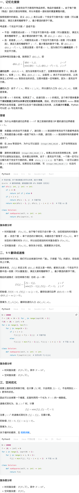

# 198.打家劫舍（中等）

## 题目描述

你是一个专业的小偷，计划偷窃沿街的房屋。每间房内都藏有一定的现金，影响你偷窃的唯一制约因素就是相邻的房屋装有相互连通的防盗系统，**如果两间相邻的房屋在同一晚上被小偷闯入，系统会自动报警**。

给定一个代表每个房屋存放金额的非负整数数组，计算你 **不触动警报装置的情况下** ，一夜之内能够偷窃到的最高金额。

 

**示例 1：**

```
输入：[1,2,3,1]
输出：4
解释：偷窃 1 号房屋 (金额 = 1) ，然后偷窃 3 号房屋 (金额 = 3)。
     偷窃到的最高金额 = 1 + 3 = 4 。
```

**示例 2：**

```
输入：[2,7,9,3,1]
输出：12
解释：偷窃 1 号房屋 (金额 = 2), 偷窃 3 号房屋 (金额 = 9)，接着偷窃 5 号房屋 (金额 = 1)。
     偷窃到的最高金额 = 2 + 9 + 1 = 12 。
```

 

**提示：**

- `1 <= nums.length <= 100`
- `0 <= nums[i] <= 400`

## 我的Python解答

```python
class Solution:
    def rob(self, nums: List[int]) -> int:
        # 记忆化搜索
        n = len(nums)
        @cache
        def dfs(i:int):
            # 表示到第i家时最大价值
            if i<0:
                return 0
            return max(dfs(i-1), dfs(i-2)+nums[i])
        return dfs(n-1)
    
    def rob(self, nums: List[int]) -> int:
        # 递推
        n = len(nums)
        f = [0]* (n+2)
        for i in range(n):
            f[i+2] = max(f[i+1], f[i]+nums[i])
        return f[n+1]
    
    def rob(self, nums: List[int]) -> int:
        # 空间优化
        f0 = f1 = f2 = 0
        for i in range(len(nums)):
            f2 = max(f0 + nums[i], f1)
            f0, f1 = f1, f2
        return f2
```

结果：


## Python参考答案

```python
class Solution:
    def rob(self, nums: List[int]) -> int:
        # dfs(i) 表示从 nums[0] 到 nums[i] 最多能偷多少
        @cache  # 缓存装饰器，避免重复计算 dfs 的结果
        def dfs(i: int) -> int:
            if i < 0:  # 递归边界（没有房子）
                return 0
            return max(dfs(i - 1), dfs(i - 2) + nums[i])

        return dfs(len(nums) - 1)  # 从最后一个房子开始思考

class Solution:
    def rob(self, nums: List[int]) -> int:
        f = [0] * (len(nums) + 2)
        for i, x in enumerate(nums):
            f[i + 2] = max(f[i + 1], f[i] + x)
        return f[-1]

class Solution:
    def rob(self, nums: List[int]) -> int:
        f0 = f1 = 0
        for x in nums:
            f0, f1 = f1, max(f1, f0 + x)
        return f1
```

# 279.完全平方数（中等）

## 题目描述

给你一个整数 `n` ，返回 *和为 `n` 的完全平方数的最少数量* 。

**完全平方数** 是一个整数，其值等于另一个整数的平方；换句话说，其值等于一个整数自乘的积。例如，`1`、`4`、`9` 和 `16` 都是完全平方数，而 `3` 和 `11` 不是。

 

**示例 1：**

```
输入：n = 12
输出：3 
解释：12 = 4 + 4 + 4
```

**示例 2：**

```
输入：n = 13
输出：2
解释：13 = 4 + 9
```

 

**提示：**

- `1 <= n <= 104`

## 我的解答

耗时太久，已经忘记完全背包的做法了，直接看答案

尝试用回溯：

```python
class Solution:
    def numSquares(self, n: int) -> int:
        if n==1:
            return 1
        upper = int(math.sqrt(n))
        nums = [a**2 for a in range(upper, 0, -1)] # 逆序数
        # 回溯
        @cache
        def dfs(idx:int, targt:int):
            if targt == 0:
                return 0
            if idx >= upper or targt<0:
                return inf
            return min(dfs(idx, targt-nums[idx]), dfs(idx+1, targt)) + 1

        return dfs(0,n)-1
```

真是奇了怪了，答案是错误的。在ai的辅助下找到了错因：`return min(dfs(idx, targt-nums[idx]), dfs(idx+1, targt)) + 1`这里是错误的，应该是`return min(dfs(idx, targt-nums[idx])+1, dfs(idx+1, targt))`

修改之后还是超时了

## 参考答案



```python
# 写在外面，多个测试数据之间可以共享，减少计算量
@cache  # 缓存装饰器，避免重复计算 dfs 的结果（记忆化）
def dfs(i: int, j: int) -> int:
    if i == 0:
        return inf if j else 0
    if j < i * i:
        return dfs(i - 1, j)  # 只能不选
    return min(dfs(i - 1, j), dfs(i, j - i * i) + 1)  # 不选 vs 选

class Solution:
    def numSquares(self, n: int) -> int:
        return dfs(isqrt(n), n)

N = 10000
f = [[0] * (N + 1) for _ in range(isqrt(N) + 1)]
f[0] = [0] + [inf] * N
for i in range(1, len(f)):
    for j in range(N + 1):
        if j < i * i:
            f[i][j] = f[i - 1][j]  # 只能不选
        else:
            f[i][j] = min(f[i - 1][j], f[i][j - i * i] + 1)  # 不选 vs 选

class Solution:
    def numSquares(self, n: int) -> int:
        return f[isqrt(n)][n]  # 也可以写 f[-1][n]

N = 10000
f = [0] + [inf] * N
for i in range(1, isqrt(N) + 1):
    for j in range(i * i, N + 1):
        f[j] = min(f[j], f[j - i * i] + 1)  # 不选 vs 选

class Solution:
    def numSquares(self, n: int) -> int:
        return f[n]
```

