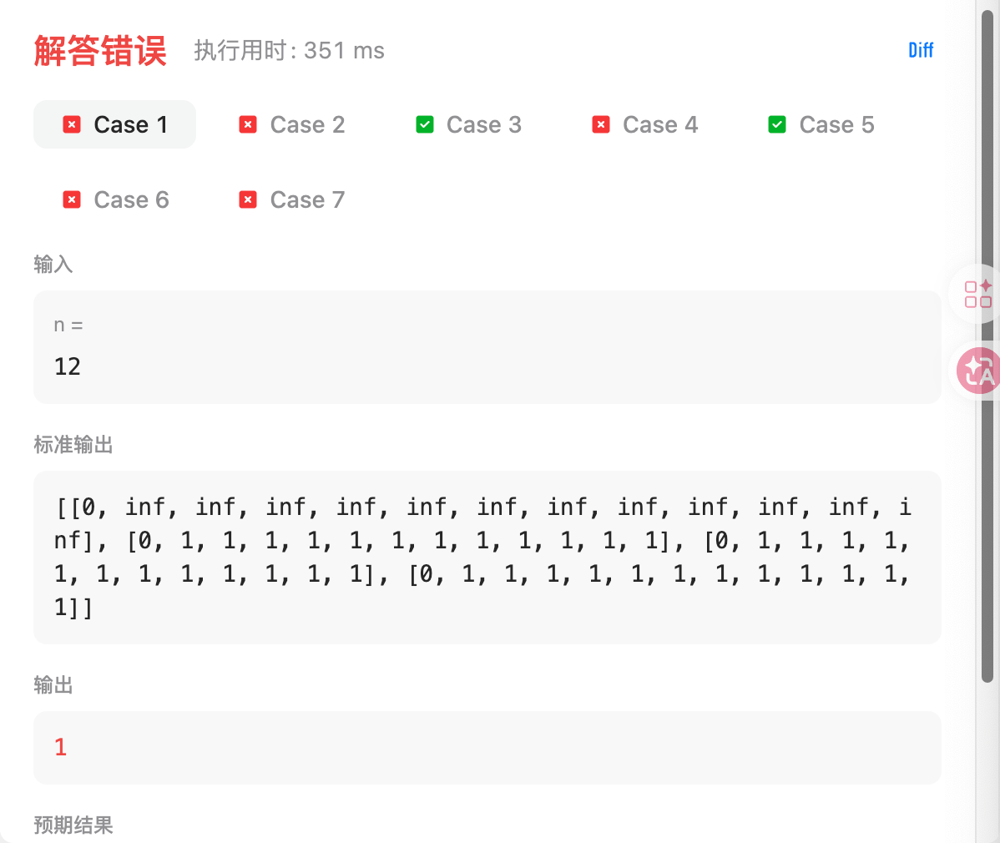
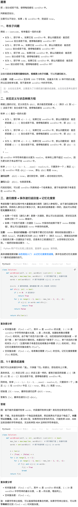

# 322.零钱兑换（中等）

## 题目描述

给你一个整数数组 `coins` ，表示不同面额的硬币；以及一个整数 `amount` ，表示总金额。

计算并返回可以凑成总金额所需的 **最少的硬币个数** 。如果没有任何一种硬币组合能组成总金额，返回 `-1` 。

你可以认为每种硬币的数量是无限的。

 

**示例 1：**

```
输入：coins = [1, 2, 5], amount = 11
输出：3 
解释：11 = 5 + 5 + 1
```

**示例 2：**

```
输入：coins = [2], amount = 3
输出：-1
```

**示例 3：**

```
输入：coins = [1], amount = 0
输出：0
```

 

**提示：**

- `1 <= coins.length <= 12`
- `1 <= coins[i] <= 231 - 1`
- `0 <= amount <= 104`

## 我的Python解答

```python
class Solution:
    def coinChange(self, coins: List[int], amount: int) -> int:
        @cache
        def dfs(i:int, c:int):
            if i<0:
                return 0 if c==0 else inf
            if c<coins[i]:
                return dfs(i-1,c)
            return min(dfs(i, c-coins[i])+1, dfs(i-1,c))
        ans = dfs(len(coins)-1, amount)
        return ans if ans<inf else -1
```

结果：


```python
class Solution:
    # def coinChange(self, coins: List[int], amount: int) -> int:
    #     @cache
    #     def dfs(i:int, c:int):
    #         if i<0:
    #             return 0 if c==0 else inf
    #         if c<coins[i]:
    #             return dfs(i-1,c)
    #         return min(dfs(i, c-coins[i])+1, dfs(i-1,c))
    #     ans = dfs(len(coins)-1, amount)
    #     return ans if ans<inf else -1

    def coinChange(self, coins: List[int], amount: int) -> int:
        dp = [[inf]*(amount+1) for _ in range(len(coins)+1)]
        dp[0][0] = 0
        for i in range(len(coins)):
            for j in range(amount+1):
                # if amount < coins[i]: # 注意，这里写错为amount了，但是却通过了
                if j < coins[i]:
                    dp[i+1][j] = dp[i][j]
                else:
                    dp[i+1][j] = min(dp[i+1][j-coins[i]]+1, dp[i][j])
        # print(dp)
        return dp[-1][-1] if dp[-1][-1] != inf else -1
    
    def coinChange(self, coins: List[int], amount: int) -> int:
        dp = [[inf]*(amount+1) for _ in range(2)]
        dp[0][0] = 0
        for i in range(len(coins)):
            for j in range(amount+1):
                if j < coins[i]:
                    dp[(i+1)%2][j] = dp[i%2][j]
                else:
                    dp[(i+1)%2][j] = min(dp[(i+1)%2][j-coins[i]]+1, dp[i%2][j])
        # print(dp)
        return dp[len(coins)%2][-1] if dp[len(coins)%2][-1] != inf else -1
    
    def coinChange(self, coins: List[int], amount: int) -> int:
        dp = [inf]*(amount+1)
        dp[0] = 0
        for i in range(len(coins)):
            for j in range(amount+1):
                if j >= coins[i]:
                    dp[j] = min(dp[j-coins[i]]+1, dp[j])
        # print(dp)
        return dp[-1] if dp[-1] != inf else -1
```

【到这里我又开始困惑了，for循环是怎么界定的，为什么外层遍历到len，而内存遍历到dfs的第二个参数+1】

因为dfs对第一个参数的入参是len-1，第二个参数的入参是amount，所以在for的时候，结尾都是入参的+1，这样才能更新到dp\[len][amount]

## Python参考答案

```python
class Solution:
    def coinChange(self, coins: List[int], amount: int) -> int:
        @cache  # 缓存装饰器，避免重复计算 dfs 的结果（记忆化）
        def dfs(i: int, c: int) -> int:
            if i < 0:
                return 0 if c == 0 else inf
            if c < coins[i]:  # 只能不选
                return dfs(i - 1, c)
            # 不选 vs 继续选
            return min(dfs(i - 1, c), dfs(i, c - coins[i]) + 1)

        ans = dfs(len(coins) - 1, amount)
        return ans if ans < inf else -1

class Solution:
    def coinChange(self, coins: List[int], amount: int) -> int:
        n = len(coins)
        f = [[inf] * (amount + 1) for _ in range(n + 1)]
        f[0][0] = 0
        for i, x in enumerate(coins):
            for c in range(amount + 1):
                if c < x:
                    f[i + 1][c] = f[i][c]
                else:
                    f[i + 1][c] = min(f[i][c], f[i + 1][c - x] + 1)
        ans = f[n][amount]
        return ans if ans < inf else -1

class Solution:
    def coinChange(self, coins: List[int], amount: int) -> int:
        n = len(coins)
        f = [[inf] * (amount + 1) for _ in range(2)]
        f[0][0] = 0
        for i, x in enumerate(coins):
            for c in range(amount + 1):
                if c < x:
                    f[(i + 1) % 2][c] = f[i % 2][c]
                else:
                    f[(i + 1) % 2][c] = min(f[i % 2][c], f[(i + 1) % 2][c - x] + 1)
        ans = f[n % 2][amount]
        return ans if ans < inf else -1

class Solution:
    def coinChange(self, coins: List[int], amount: int) -> int:
        f = [0] + [inf] * amount
        for x in coins:
            for c in range(x, amount + 1):
                f[c] = min(f[c], f[c - x] + 1)
        ans = f[amount]
        return ans if ans < inf else -1
```

# 279.完全平方数（中等）

## 题目描述

给你一个整数 `n` ，返回 *和为 `n` 的完全平方数的最少数量* 。

**完全平方数** 是一个整数，其值等于另一个整数的平方；换句话说，其值等于一个整数自乘的积。例如，`1`、`4`、`9` 和 `16` 都是完全平方数，而 `3` 和 `11` 不是。

 

**示例 1：**

```
输入：n = 12
输出：3 
解释：12 = 4 + 4 + 4
```

**示例 2：**

```
输入：n = 13
输出：2
解释：13 = 4 + 9
```

 

**提示：**

- `1 <= n <= 104`

## 我的解答

```python
class Solution:
    def numSquares(self, n: int) -> int:
        @cache
        def dfs(i:int, j:int):
            if i<1:
                return 0 if j==0 else inf
            if i*i > j:
                return dfs(i-1, j)
            else:
                return min(dfs(i,j-i*i)+1, dfs(i-1,j))
        return dfs(isqrt(n), n)
```

这个结果超出内存了。现在我的疑惑是，dfs的边界到底应该怎么写？最开始的时候我写的是return 1，但是测试后发现答案都比预期大了1，改为0，则通过了所有测试

现在完全感觉脑子一团浆糊，没有24年做的那种通透感了，到底是哪里出了问题？记忆化到递推，现在的问题：

1. 记忆化搜索的边界条件、参数的意义还是没有彻底掌握
2. 翻译为递推公式之后，哪里需要偏移，初始化数组是什么，哪些元素需要再初始化，for循环的起止是什么

```python
class Solution:
    def numSquares(self, n: int) -> int:
        dp = [[0]*(n+1) for _ in range(isqrt(n)+1)]
        for j in range(1, n+1):
            dp[0][j] = inf
        for i in range(isqrt(n)):
            for j in range(n+1):
                if i*i > j:
                    dp[i+1][j] = dp[i][j]
                else:
                    dp[i+1][j] = min(dp[i+1][j-i*i]+1, dp[i][j])
        print(dp)
        return dp[isqrt(n)][n]
```




我草泥马的，不使用偏置方案就通过了。我宣布，以后记忆化改递推，我再也不偏置了

```python
class Solution:
    def numSquares(self, n: int) -> int:
        dp = [[0]*(n+1) for _ in range(isqrt(n)+1)]
        for j in range(1, n+1):
            dp[0][j] = inf
        for i in range(1,isqrt(n)+1):
            for j in range(n+1):
                if i*i > j:
                    dp[i][j] = dp[i-1][j]
                else:
                    dp[i][j] = min(dp[i][j-i*i]+1, dp[i-1][j])
        # print(dp)
        return dp[isqrt(n)][n]
```


## 参考答案

```python
# 写在外面，多个测试数据之间可以共享，减少计算量
@cache  # 缓存装饰器，避免重复计算 dfs 的结果（记忆化）
def dfs(i: int, j: int) -> int:
    if i == 0:
        return inf if j else 0
    if j < i * i:
        return dfs(i - 1, j)  # 只能不选
    return min(dfs(i - 1, j), dfs(i, j - i * i) + 1)  # 不选 vs 选

class Solution:
    def numSquares(self, n: int) -> int:
        return dfs(isqrt(n), n)

N = 10000
f = [[0] * (N + 1) for _ in range(isqrt(N) + 1)]
f[0] = [0] + [inf] * N
for i in range(1, len(f)):
    for j in range(N + 1):
        if j < i * i:
            f[i][j] = f[i - 1][j]  # 只能不选
        else:
            f[i][j] = min(f[i - 1][j], f[i][j - i * i] + 1)  # 不选 vs 选

class Solution:
    def numSquares(self, n: int) -> int:
        return f[isqrt(n)][n]  # 也可以写 f[-1][n]

N = 10000
f = [0] + [inf] * N
for i in range(1, isqrt(N) + 1):
    for j in range(i * i, N + 1):
        f[j] = min(f[j], f[j - i * i] + 1)  # 不选 vs 选

class Solution:
    def numSquares(self, n: int) -> int:
        return f[n]
```

# 139.单词拆分（中等）

## 题目描述

给你一个字符串 `s` 和一个字符串列表 `wordDict` 作为字典。如果可以利用字典中出现的一个或多个单词拼接出 `s` 则返回 `true`。

**注意：**不要求字典中出现的单词全部都使用，并且字典中的单词可以重复使用。

 

**示例 1：**

```
输入: s = "leetcode", wordDict = ["leet", "code"]
输出: true
解释: 返回 true 因为 "leetcode" 可以由 "leet" 和 "code" 拼接成。
```

**示例 2：**

```
输入: s = "applepenapple", wordDict = ["apple", "pen"]
输出: true
解释: 返回 true 因为 "applepenapple" 可以由 "apple" "pen" "apple" 拼接成。
     注意，你可以重复使用字典中的单词。
```

**示例 3：**

```
输入: s = "catsandog", wordDict = ["cats", "dog", "sand", "and", "cat"]
输出: false
```

 

**提示：**

- `1 <= s.length <= 300`
- `1 <= wordDict.length <= 1000`
- `1 <= wordDict[i].length <= 20`
- `s` 和 `wordDict[i]` 仅由小写英文字母组成
- `wordDict` 中的所有字符串 **互不相同**

## 我的解答

```python
class Solution:
    def wordBreak(self, s: str, wordDict: List[str]) -> bool:

        n = len(wordDict)
        @cache
        def dfs(s:str):
            if s=="":
                return True
            tmp = []
            for i in range(n):
                cur = wordDict[i]
                if s[:len(cur)]==cur:
                    tmp.append(dfs(s[len(cur):]))
            return any(tmp)
            
        return dfs(s)
```

回溯，本质还是暴力。暂时想不出来怎么改递推

结果：


## 参考答案



```python
class Solution:
    def wordBreak(self, s: str, wordDict: List[str]) -> bool:
        max_len = max(map(len, wordDict))  # 用于限制下面 j 的循环次数
        words = set(wordDict)  # 便于快速判断 s[j:i] in words

        @cache  # 缓存装饰器，避免重复计算 dfs 的结果（记忆化）
        def dfs(i: int) -> bool:
            if i == 0:  # 成功拆分！
                return True
            for j in range(i - 1, max(i - max_len - 1, -1), -1):
                if s[j:i] in words and dfs(j):
                    return True
            return False

        return dfs(len(s))

class Solution:
    def wordBreak(self, s: str, wordDict: List[str]) -> bool:
        max_len = max(map(len, wordDict))  # 用于限制下面 j 的循环次数
        words = set(wordDict)  # 便于快速判断 s[j:i] in words

        @cache  # 缓存装饰器，避免重复计算 dfs 的结果（记忆化）
        def dfs(i: int) -> bool:
            if i == 0:  # 成功拆分！
                return True
            return any(s[j:i] in words and dfs(j)
                       for j in range(i - 1, max(i - max_len - 1, -1), -1))

        return dfs(len(s))

class Solution:
    def wordBreak(self, s: str, wordDict: List[str]) -> bool:
        max_len = max(map(len, wordDict))  # 用于限制下面 j 的循环次数
        words = set(wordDict)  # 便于快速判断 s[j:i] in words

        n = len(s)
        f = [True] + [False] * n
        for i in range(1, n + 1):
            for j in range(i - 1, max(i - max_len - 1, -1), -1):
                if f[j] and s[j:i] in words:
                    f[i] = True
                    break
        return f[n]

class Solution:
    def wordBreak(self, s: str, wordDict: List[str]) -> bool:
        max_len = max(map(len, wordDict))  # 用于限制下面 j 的循环次数
        words = set(wordDict)  # 便于快速判断 s[j:i] in words

        n = len(s)
        f = [True] + [False] * n
        for i in range(1, n + 1):
            f[i] = any(f[j] and s[j:i] in words
                       for j in range(i - 1, max(i - max_len - 1, -1), -1))
        return f[n]

作者：灵茶山艾府
链接：https://leetcode.cn/problems/word-break/solutions/2968135/jiao-ni-yi-bu-bu-si-kao-dpcong-ji-yi-hua-chrs/
来源：力扣（LeetCode）
著作权归作者所有。商业转载请联系作者获得授权，非商业转载请注明出处。
```

