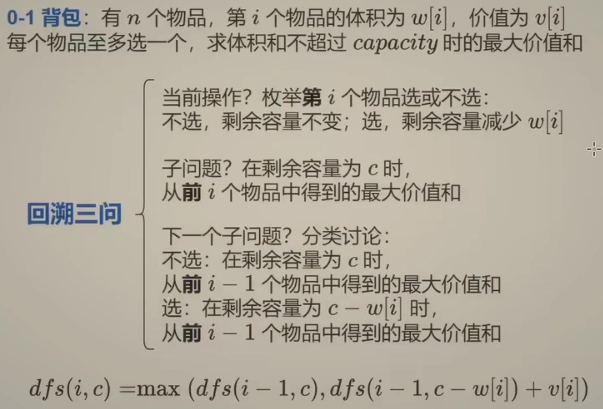
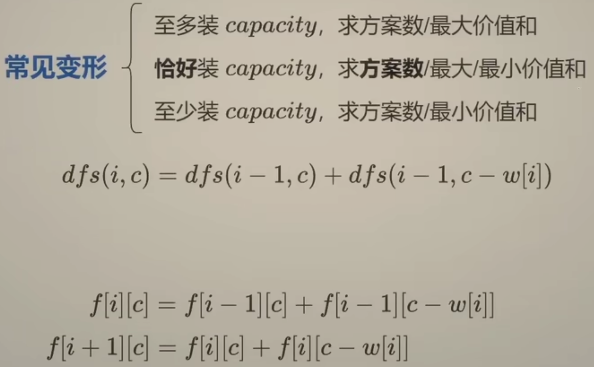

# 专题描述

本次为dp专题，为什么会开这个专题呢？

因为前几天做dp的题总是理不清从递归开始，递归的入参和返回值的含义，以及递归应该从哪里开始

这就导致了，记忆化搜索搞不好，递推公式无法转化，就不能使用迭代的dp数组来做题了

明显感觉到比24年刷的吃力很多，因此决定从专题入手，跟随0x3f的脚步，尝试拿捏递归

# 198.打家劫舍（中等）普通回溯问题

## 题目描述

你是一个专业的小偷，计划偷窃沿街的房屋。每间房内都藏有一定的现金，影响你偷窃的唯一制约因素就是相邻的房屋装有相互连通的防盗系统，**如果两间相邻的房屋在同一晚上被小偷闯入，系统会自动报警**。

给定一个代表每个房屋存放金额的非负整数数组，计算你 **不触动警报装置的情况下** ，一夜之内能够偷窃到的最高金额。

 

**示例 1：**

```
输入：[1,2,3,1]
输出：4
解释：偷窃 1 号房屋 (金额 = 1) ，然后偷窃 3 号房屋 (金额 = 3)。
     偷窃到的最高金额 = 1 + 3 = 4 。
```

**示例 2：**

```
输入：[2,7,9,3,1]
输出：12
解释：偷窃 1 号房屋 (金额 = 2), 偷窃 3 号房屋 (金额 = 9)，接着偷窃 5 号房屋 (金额 = 1)。
     偷窃到的最高金额 = 2 + 9 + 1 = 12 。
```

 

**提示：**

- `1 <= nums.length <= 100`
- `0 <= nums[i] <= 400`

## 我的Python解答

从递归入手，dfs(i)表达的意思是，到选择到第i个房子的时候，能够获取的最大收获

所以递归终点是小于0，已经没有房子可选了，直接返回0

对于第i个房子，如果选择这家，那么需要的是第i-2家时最大的收获+这个第i家的最大收获

如果不选，那就是第i-1家的最大收获

```python
class Solution:
    def rob(self, nums: List[int]) -> int:
        @cache
        def dfs(i:int):
            if i<0:
                return 0
            return max(dfs(i-1), dfs(i-2)+nums[i])
        return dfs(len(nums)-1)
```

转为递推，就是把dfs(i)视为dp[i]，现在通过记忆化搜索可以知道，当前状态dp[i]是由前两个状态转移得到的

那么迭代的话从哪里开始到哪里结束呢？

第一次设想的是注释里面的内容， 我们直接进行翻译操作，防止越界，需要i最少从2起步，但是这样就导致了dp[0]和dp[1]都始终为0，而dp[0]我们都知道就是nums[0]本体的，所以想到了视频里面的“偏移”操作

因为当前状态由前两个状态得到，那么在计算dp[0]的时候，至少需要知道前两个状态，但是数组越界，因此整体数组长度+2，让dp[0]和dp[1]表征偏移之前的越界状态，这样就可以正常更新dfs(0)和dfs(1)了。

```python
class Solution:
    def rob(self, nums: List[int]) -> int:
        n = len(nums)
        # dp = [0] * (n)
        # for i in range(2,n):
            # dp[i] = max(dp[i-1], dp[i-2]+nums[i])
        dp = [0] * (n+2)
        for i in range(n):
            dp[i+2] = max(dp[i+1], dp[i]+nums[i])
        print(dp)
        return dp[-1]
```

难道一定要偏移吗？实际上可以不偏移，但是数组还是必须加两个0，否则只有在len>=3的时候才生效，主动在末尾添加两个0，这样就可以计算dfs(0)了，由max(dp[-1], dp[-2]+nums[i])得到，这两项表征最后一项和倒数第二项，是我们添加的0，不影响最终结果

```python
class Solution:
    def rob(self, nums: List[int]) -> int:
        n = len(nums)
        dp = [0] * (n+2)
        for i in range(n):
            dp[i] = max(dp[i-1], dp[i-2]+nums[i])
        print(dp)
        return dp[n-1]
```

空间可以优化吗？可以的，因为当前状态只和前两个相关，最少可以只用两个临时变量：

```python
class Solution:
    def rob(self, nums: List[int]) -> int:
		f0 = f1 = 0
        for i in range(len(nums)):
            f0, f1 = f1, max(f0+nums[i], f1)
        print((f0, f1))
        return max(f0,f1)
```

那如果我在递归的时候只能想起来按顺序递归，没有想到dfs(i)从末尾递归呢？

你别说，还真可以，但是开销很大，本质上是暴力枚举，而且无法改为递推式子

经过ai的提醒，发现直接return max(nums[i] + dis(i+2), dis(i+1))即可，因为深度思考一下，dfs2本身也考虑了2号元素选还是不选，已经是最优解了

```python
class Solution:
    def rob(self, nums: List[int]) -> int:
        n = len(nums)
        @cache
        def dfs(i:int):
            if i>=n:
                return 0
            # 表示第i个房子选还是不选
            choose = nums[i] + max(dfs(j) for j in range(i+2,n+2)) #这里n+2防止max接受空
            not_choose = dfs(i+1)
            return max(choose, not_choose)
        return dfs(0)
```


所以正向也是可以递推的，也是依赖于两个状态。

```python
class Solution:
    def rob(self, nums: List[int]) -> int:
        n = len(nums)
        dp = [0] * (n+2)
        for i in range(n-1, -1, -1):
            dp[i] = max(dp[i+1], nums[i] + dp[i+2])
        return dp[0]
```

所以，如果dfs入参是n，那么dp就正向遍历；dfs入参是0，那么dp就负向遍历？

大模型的回答：

你的理解基本正确：**递归定义的参数决定了递推的遍历方向**。

- **如果 `dfs(i)` 表示「前 i 个元素」**（即考虑范围是 `[0..i]`），则计算 `dfs(i)` 需要依赖 `dfs(i-1)`、`dfs(i-2)` 等更小的索引，因此递推时应**从小到大正向遍历**（`i` 从 0 到 n）。
- **如果 `dfs(i)` 表示「从 i 到末尾」**（即考虑范围是 `[i..n-1]`），则计算 `dfs(i)` 需要依赖 `dfs(i+1)`、`dfs(i+2)` 等更大的索引，因此递推时应**从大到小反向遍历**（`i` 从 n-1 到 0）。

这个规律适用于大多数线性动态规划问题，其本质是**子问题的依赖方向**与**递推计算顺序**保持一致。

# 494.目标和（中等）0-1背包问题

## 题目描述

给你一个非负整数数组 `nums` 和一个整数 `target` 。

向数组中的每个整数前添加 `'+'` 或 `'-'` ，然后串联起所有整数，可以构造一个 **表达式** ：

- 例如，`nums = [2, 1]` ，可以在 `2` 之前添加 `'+'` ，在 `1` 之前添加 `'-'` ，然后串联起来得到表达式 `"+2-1"` 。

返回可以通过上述方法构造的、运算结果等于 `target` 的不同 **表达式** 的数目。

 

**示例 1：**

```
输入：nums = [1,1,1,1,1], target = 3
输出：5
解释：一共有 5 种方法让最终目标和为 3 。
-1 + 1 + 1 + 1 + 1 = 3
+1 - 1 + 1 + 1 + 1 = 3
+1 + 1 - 1 + 1 + 1 = 3
+1 + 1 + 1 - 1 + 1 = 3
+1 + 1 + 1 + 1 - 1 = 3
```

**示例 2：**

```
输入：nums = [1], target = 1
输出：1
```

 

**提示：**

- `1 <= nums.length <= 20`
- `0 <= nums[i] <= 1000`
- `0 <= sum(nums[i]) <= 1000`
- `-1000 <= target <= 1000`

## 我的解答

先从回溯视角考虑，每一个元素都是两种情况，总共2^n种，短测试可以过，长测试肯定会超时。现在这个写法使用记忆化搜索的收益不大，因为total参数的不确定性很大，甚至，加上记忆化后还会报错，因为路径不一致，不能随意排除！

```python
class Solution:
    def findTargetSumWays(self, nums: List[int], target: int) -> int:
        # 从回溯视角考虑，每一个元素都有选+和选-两种情况
        # 总共有2^n种情况，是一颗满二叉树，需要找的就是到叶子结点，路径的总和为target的路径数目
        n = len(nums)
        ans = 0
        def dfs(i:int, total:int):
            # 表示到第i个元素时，前i个（包括i）的sum
            if i==n:
                nonlocal ans
                ans += 1 if total==target else 0
                return
            dfs(i+1, total + nums[i]) # 选+
            dfs(i+1, total - nums[i]) # 选-
        dfs(0,0)
        return ans
```

## 参考答案

这个问题就是两个参数的记忆化搜索，构造出来的dp数组也是二维的

从0-1背包开始，注意下面的定义，对于index，一直是在描述前i个物品的情况下，加上第二个参数的约束，能达到的XX值，这样方便写递推式







对于这个题，分析一下，假设所有正号的和为p，总共的和为s，那么选负号的和就是s-p

所以应该满足p-(s-p)=target，也就是说p = (target + s) // 2

所以先判断target+sum是不是偶数且是不是非负数

转换之后，问题就变成，有若干整数，选择，恰好装满c，有几种方案

```python
class Solution:
    def findTargetSumWays(self, nums: List[int], target: int) -> int:
        # p， sum-p, target = p-(sum-p)
        # p = (s+t)/2
        target += sum(nums)
        if target < 0 or target %2:
            return 0
        target //= 2
        # 问题变成，在nums中，选若干数，使得sum为target
        @cache
        def dfs(i:int, c:int):
            if i<0:
                return 1 if c==0 else 0
            if c<nums[i]:
                return dfs(i-1,c)
            return dfs(i-1,c)+dfs(i-1,c-nums[i])
        return dfs(len(nums)-1, target)
```

翻译为递推式子：

由于枚举target的时候要考虑0～target，所以总共target+1个元素；

枚举数字的时候，由于当前状态由上一个数字的状态得到，所以要再多存储一行，来实现对i=0的更新

```python
class Solution:
    def findTargetSumWays(self, nums: List[int], target: int) -> int:
        # p， sum-p, target = p-(sum-p)
        # p = (s+t)/2
        target += sum(nums)
        if target < 0 or target %2:
            return 0
        target //= 2
        dp= [[0]*(target+1) for _ in range(len(nums)+1)]
        dp[0][0] = 1
        for i in range(len(nums)):
            for j in range(target+1):
                if j < nums[i]:
                    dp[i+1][j] = dp[i][j]
                else:
                    dp[i+1][j] = dp[i][j] + dp[i][j-nums[i]]
        return dp[-1][-1]

```

优化空间：两个一维数组，使用求模操作；再次优化：只用一个数组，假设现在针对的是第i个元素，需要的是上一个元素的target和target-nu ms[1]，也就是一维数组的左上角，既然左上角要保留，那么一维数组就应该反向遍历

# 322.零钱兑换（中等）完全背包问题

## 题目描述

给你一个整数数组 `coins` ，表示不同面额的硬币；以及一个整数 `amount` ，表示总金额。

计算并返回可以凑成总金额所需的 **最少的硬币个数** 。如果没有任何一种硬币组合能组成总金额，返回 `-1` 。

你可以认为每种硬币的数量是无限的。

 

**示例 1：**

```
输入：coins = [1, 2, 5], amount = 11
输出：3 
解释：11 = 5 + 5 + 1
```

**示例 2：**

```
输入：coins = [2], amount = 3
输出：-1
```

**示例 3：**

```
输入：coins = [1], amount = 0
输出：0
```

 

**提示：**

- `1 <= coins.length <= 12`
- `1 <= coins[i] <= 231 - 1`
- `0 <= amount <= 104`

## 我的解答

这一次我先def dfs空，扔在那里，然后写了return，因为找最少，所以一个min先扎上，再写外层的return dfs(n-1, amount)，表示的是前n-1个coin的组合中刚好组成amount时的最小选择个数

然后再翻回去写dfs内部的东西，就比较清晰了

```python
class Solution:
    def coinChange(self, coins: List[int], amount: int) -> int:
        n = len(coins)
        @cache
        def dfs(i:int, amount:int):
            if i<0:
                return 0 if amount==0 else inf
            if coins[i] > amount:
                # 当前面额太大了，选不了了
                return dfs(i-1, amount)
            # 分别表示选择当前coin和不选择当前coin
            return min(dfs(i,amount-coins[i])+1, dfs(i-1,amount))
        ans =  dfs(n-1, amount)
        return ans if ans<inf else -1
```

这时候写为递推式也就没有毛病了

```python
class Solution:
    def coinChange(self, coins: List[int], amount: int) -> int:
        n = len(coins)
        dp = [inf]*(amount+1)
        dp[0] = 0
        for coin in coins:
            for j in range(amount+1):
                if j>=coin:
                    dp[j] = min(dp[j], dp[j-coin]+1)
        tmp = dp[-1]
        return tmp if tmp<inf else -1

        dp = [[inf]*(amount+1) for _ in range(2)]
        dp[0][0] = 0
        for i in range(n):
            for j in range(amount+1):
                if coins[i] > j:
                    dp[(i+1)%2][j] = dp[i%2][j]
                else:
                    dp[(i+1)%2][j] = min(dp[(i+1)%2][j-coins[i]]+1, dp[i%2][j])
        tmp = dp[n%2][amount]
        return tmp if tmp<inf else -1

        dp = [[inf]*(amount+1) for _ in range(n+1)]
        dp[0][0] = 0
        for i in range(n):
            for j in range(amount+1):
                if coins[i] > j:
                    dp[i+1][j] = dp[i][j]
                else:
                    dp[i+1][j] = min(dp[i+1][j-coins[i]]+1, dp[i][j])
        tmp = dp[n][amount]
        return tmp if tmp<inf else -1
```

