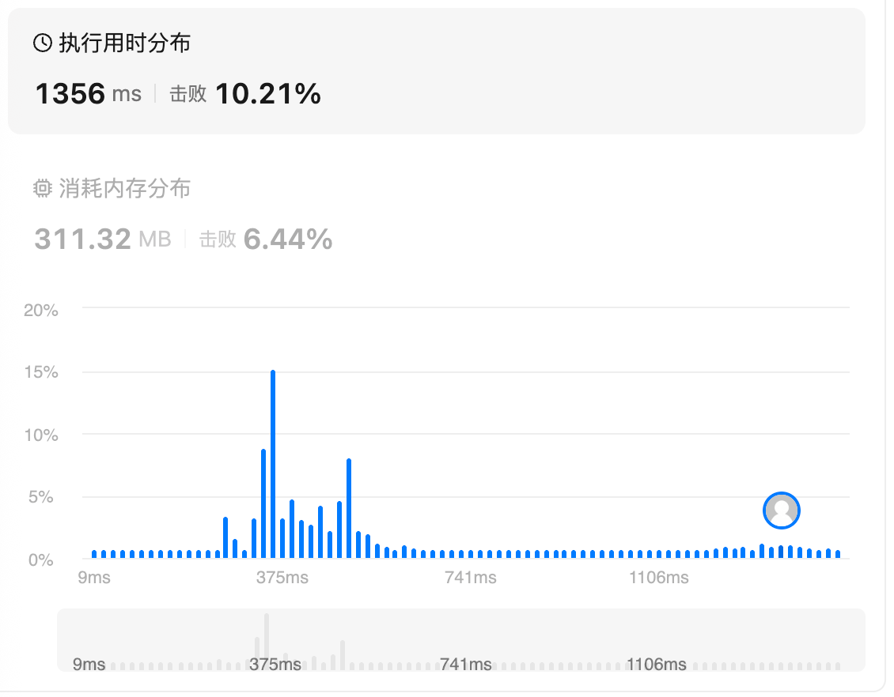
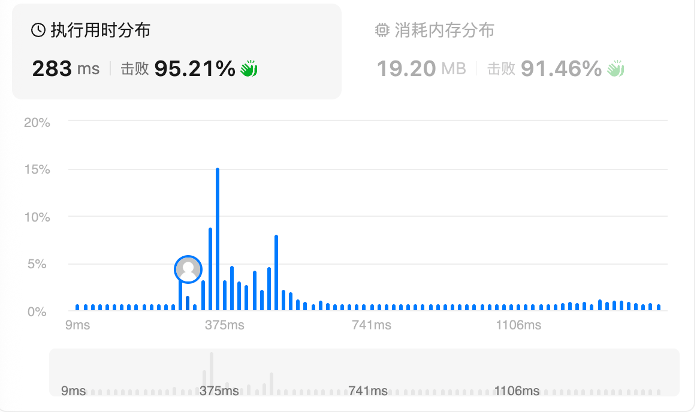
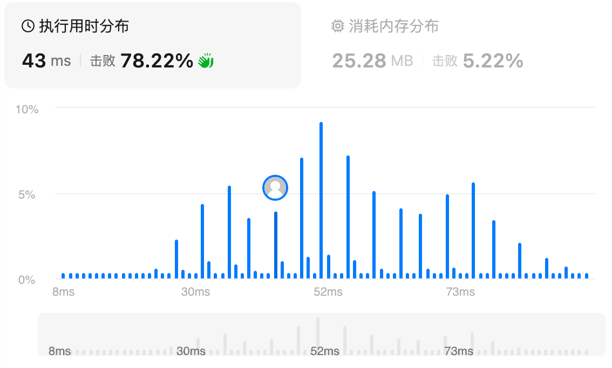
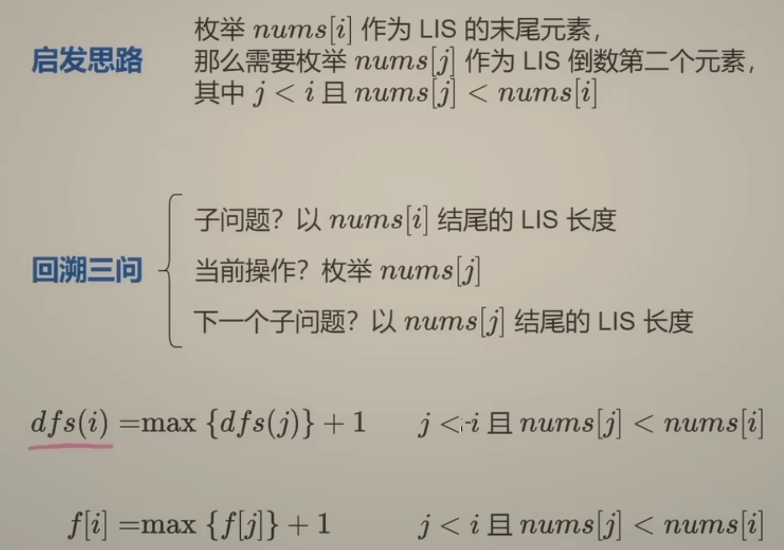
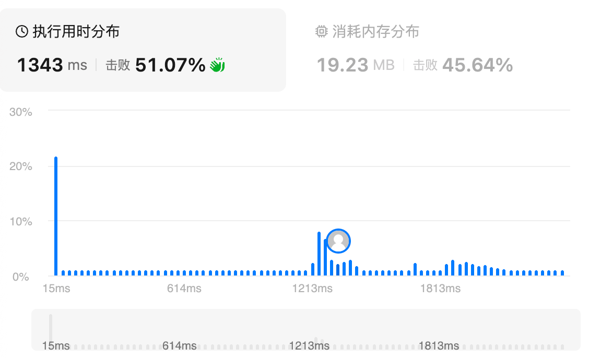
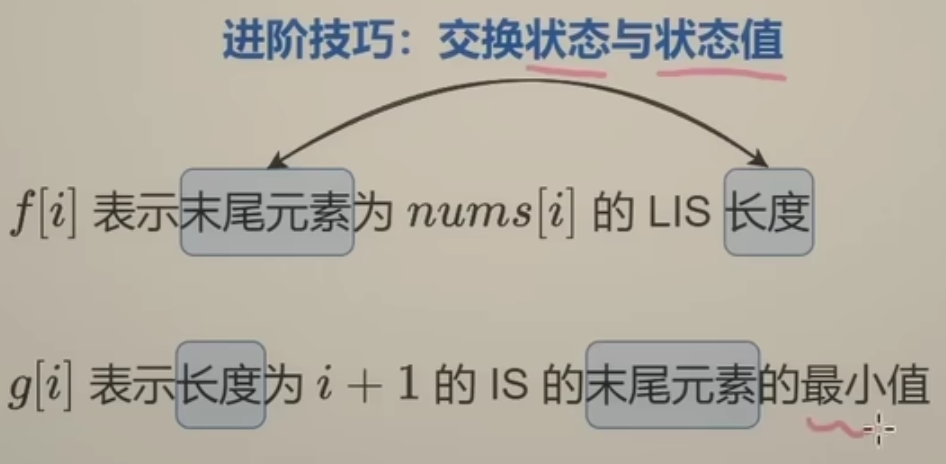
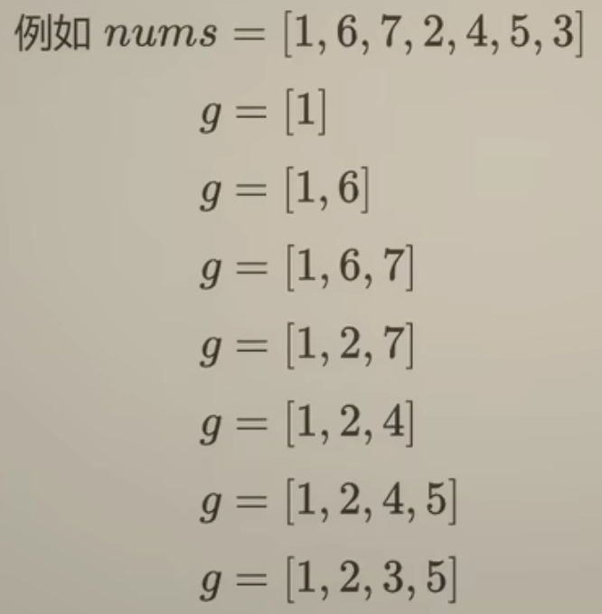
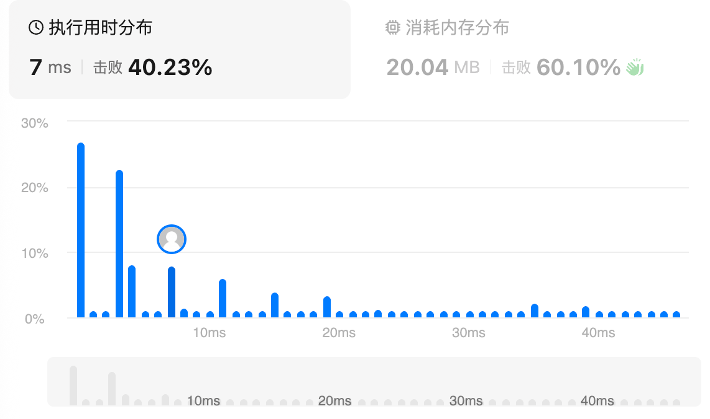
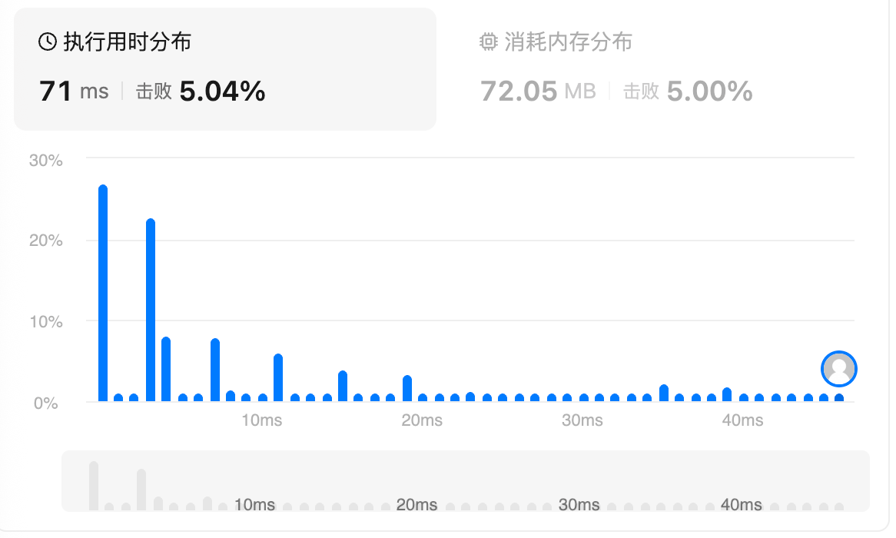
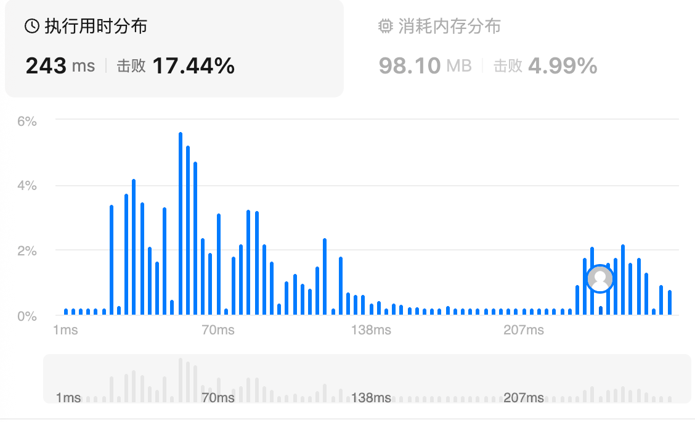

# 1143.最长公共子序列（中等）线性DP

## 题目描述

给定两个字符串 `text1` 和 `text2`，返回这两个字符串的最长 **公共子序列** 的长度。如果不存在 **公共子序列** ，返回 `0` 。

一个字符串的 **子序列** 是指这样一个新的字符串：它是由原字符串在不改变字符的相对顺序的情况下删除某些字符（也可以不删除任何字符）后组成的新字符串。

- 例如，`"ace"` 是 `"abcde"` 的子序列，但 `"aec"` 不是 `"abcde"` 的子序列。

两个字符串的 **公共子序列** 是这两个字符串所共同拥有的子序列。

 

**示例 1：**

```
输入：text1 = "abcde", text2 = "ace" 
输出：3  
解释：最长公共子序列是 "ace" ，它的长度为 3 。
```

**示例 2：**

```
输入：text1 = "abc", text2 = "abc"
输出：3
解释：最长公共子序列是 "abc" ，它的长度为 3 。
```

**示例 3：**

```
输入：text1 = "abc", text2 = "def"
输出：0
解释：两个字符串没有公共子序列，返回 0 。
```

 

**提示：**

- `1 <= text1.length, text2.length <= 1000`
- `text1` 和 `text2` 仅由小写英文字符组成。

## 我的Python解答

从递归的角度来看，首先要最大值，最后肯定return max()，先把初始框架扎好

```python
def dfs(i:int, j:int):
    return max()
dfs(len(text1)-1, len(text2)-1)
```

接下来就是往里面填内容了，主要考虑边界条件，和非边界条件。

边界：如果任意一个字符串遍历到外面了，那就返回0，因为绝对不会有重复了；

非边界：如果当前i和j指向的字母相同，那么就dfs(i-1, j-1)+1；如果指向不同，就考虑当前哪一个指针开始移动，所以求的是max

```python
class Solution:
    def longestCommonSubsequence(self, text1: str, text2: str) -> int:
        @cache
        def dfs(i:int, j:int):
            # 终止：有空字符串说明到头了
            if i<0 or j<0:
                return 0
            if text1[i] == text2[j]:
                return dfs(i-1, j-1) + 1
            return max(dfs(i,j-1), dfs(i-1, j))

        return dfs(len(text1)-1, len(text2)-1)
```

结果：



```python
class Solution:
    def longestCommonSubsequence(self, text1: str, text2: str) -> int:
        m, n = len(text1), len(text2)
        dp = [[0]*(n+1) for _ in range(m+1)]
        for i,x in enumerate(text1):
            for j,y in enumerate(text2):
                if x==y:
                    dp[i+1][j+1] = dp[i][j] + 1
                else:
                    dp[i+1][j+1] = max(dp[i+1][j], dp[i][j+1])
        return dp[m][n]

class Solution:
    def longestCommonSubsequence(self, text1: str, text2: str) -> int:
        m, n = len(text1), len(text2)
        dp = [[0]*(n+1) for _ in range(2)]
        for i,x in enumerate(text1):
            for j,y in enumerate(text2):
                if x==y:
                    dp[(i+1)%2][j+1] = dp[i%2][j] + 1
                else:
                    dp[(i+1)%2][j+1] = max(dp[(i+1)%2][j], dp[i%2][j+1])
        return dp[m%2][n]
```

这个似乎是无法使用一维数组的，因为它当前元素的遍历需要前元素和上前元素的值，那如果每次j之前，我都维护一个pre临时变量呢？

但是我理不清这个pre应该存储哪里，需要看答案

## Python参考答案

```python
class Solution:
    def longestCommonSubsequence(self, text1: str, text2: str) -> int:
        m, n = len(text1), len(text2)
        dp = [0]*(n+1)
        for i,x in enumerate(text1):
            pre = dp[0]
            for j,y in enumerate(text2):
                tmp = dp[j+1]
                if x==text2[j]:
                    dp[j+1] = pre + 1
                else:
                    dp[j+1] = max(dp[j], dp[j+1])
                pre = tmp
        return dp[n]
```



# 72.编辑距离（中等）

## 题目描述

给你两个单词 `word1` 和 `word2`， *请返回将 `word1` 转换成 `word2` 所使用的最少操作数* 。

你可以对一个单词进行如下三种操作：

- 插入一个字符
- 删除一个字符
- 替换一个字符

 

**示例 1：**

```
输入：word1 = "horse", word2 = "ros"
输出：3
解释：
horse -> rorse (将 'h' 替换为 'r')
rorse -> rose (删除 'r')
rose -> ros (删除 'e')
```

**示例 2：**

```
输入：word1 = "intention", word2 = "execution"
输出：5
解释：
intention -> inention (删除 't')
inention -> enention (将 'i' 替换为 'e')
enention -> exention (将 'n' 替换为 'x')
exention -> exection (将 'n' 替换为 'c')
exection -> execution (插入 'u')
```

 

**提示：**

- `0 <= word1.length, word2.length <= 500`
- `word1` 和 `word2` 由小写英文字母组成

## 我的解答

耗时太久，查看答案

## 参考答案

主要是思路的问题

插入，删除和替换总共三种方案

如果当前i和j对应元素不一致，那么应该

插入：dfs(i, j-1)，在第i个位置后面插入一个元素，和j对应元素一致，所以j需要左移

删除：dfs(i-1,j)，删除第i个元素，因此i需要左移，由于不知道i-1和j是否指向一致，所以j不变

替换：dfs(i-1,j-1)，第i个元素替换为j同款元素，所以i和j都要左移

```python
class Solution:
    def minDistance(self, word1: str, word2: str) -> int:
        m = len(word1)
        n = len(word2)
        @cache
        def dfs(i:int, j:int):
            if i<0:
                return j+1
            if j<0:
                return i+1
            if word1[i] == word2[j]:
                return dfs(i-1,j-1)
            return min(dfs(i-1,j), dfs(i,j-1), dfs(i-1,j-1))+1

        return dfs(m-1, n-1)
```



```python
class Solution:
    def minDistance(self, word1: str, word2: str) -> int:
        m = len(word1)
        n = len(word2)
        dp = [[0]*(n+1) for _ in range(m+1)]
        for i in range(m+1):
            dp[i][0] = i
        for j in range(n+1):
            dp[0][j] = j
        for i,x in enumerate(word1):
            for j, y in enumerate(word2):
                if x==y:
                    dp[i+1][j+1] = dp[i][j]
                else:
                    dp[i+1][j+1] = min(dp[i][j+1], dp[i+1][j], dp[i][j]) + 1
        return dp[m][n]
    
class Solution:
    def minDistance(self, word1: str, word2: str) -> int:
        m = len(word1)
        n = len(word2)
        dp = list(range(n+1))
        for i,x in enumerate(word1):
            pre = dp[0]
            dp[0] += 1
            for j,y in enumerate(word2):
                tmp = dp[j+1]
                if x==y:
                    dp[j+1] = pre
                else:
                    dp[j+1] = min(pre, dp[j], tmp) + 1
                pre = tmp
        return dp[n]
```

# 300.最长递增子序列（中等）

## 题目描述

给你一个整数数组 `nums` ，找到其中最长严格递增子序列的长度。

**子序列** 是由数组派生而来的序列，删除（或不删除）数组中的元素而不改变其余元素的顺序。例如，`[3,6,2,7]` 是数组 `[0,3,1,6,2,2,7]` 的子序列。

 

**示例 1：**

```
输入：nums = [10,9,2,5,3,7,101,18]
输出：4
解释：最长递增子序列是 [2,3,7,101]，因此长度为 4 。
```

**示例 2：**

```
输入：nums = [0,1,0,3,2,3]
输出：4
```

**示例 3：**

```
输入：nums = [7,7,7,7,7,7,7]
输出：1
```

 

**提示：**

- `1 <= nums.length <= 2500`
- `-104 <= nums[i] <= 104`

 

**进阶：**

- 你能将算法的时间复杂度降低到 `O(n log(n))` 吗?

## 我的解答

用时太长，为什么一下子没有思路了呢？

## 参考答案



这个思路本质上就是，对于每一个元素，都考虑它自己作为子集的最大元素的情况。

所以对于当前元素，它的前向元素都要再过一遍，来确定当前元素作为末尾真正的最大长度

```python
class Solution:
    def lengthOfLIS(self, nums: List[int]) -> int:
        n = len(nums)
        @cache
        def dfs(i:int):
            ans = 0
            for j in range(i):
                if nums[j] < nums[i]:
                    ans = max(ans, dfs(j))
            return ans + 1
        return max(dfs(i) for i in range(n))
```

```python
class Solution:
    def lengthOfLIS(self, nums: List[int]) -> int:
        n = len(nums)
        dp = [0]*(n)
        dp[0] = 0
        for i in range(n):
            for j in range(i):
                if nums[j] < nums[i]:
                    dp[i] = max(dp[i], dp[j])
            dp[i] += 1
        print(dp)
        return max(dp)
```

结果：







这个技巧不打职业不用学

因为只问长度，所以这个解法可行，如果当前元素小于g的末尾元素，那就贪心的倒叙找出来第一个大于它的数，进行替换，如果大于末尾元素，就添加进去

# 122.买卖股票的最佳时机II（中等）状态机DP

## 题目描述

给你一个整数数组 `prices` ，其中 `prices[i]` 表示某支股票第 `i` 天的价格。

在每一天，你可以决定是否购买和/或出售股票。你在任何时候 **最多** 只能持有 **一股** 股票。然而，你可以在 **同一天** 多次买卖该股票，但要确保你持有的股票不超过一股。

返回 *你能获得的 **最大** 利润* 。

 

**示例 1：**

```
输入：prices = [7,1,5,3,6,4]
输出：7
解释：在第 2 天（股票价格 = 1）的时候买入，在第 3 天（股票价格 = 5）的时候卖出, 这笔交易所能获得利润 = 5 - 1 = 4。
随后，在第 4 天（股票价格 = 3）的时候买入，在第 5 天（股票价格 = 6）的时候卖出, 这笔交易所能获得利润 = 6 - 3 = 3。
最大总利润为 4 + 3 = 7 。
```

**示例 2：**

```
输入：prices = [1,2,3,4,5]
输出：4
解释：在第 1 天（股票价格 = 1）的时候买入，在第 5 天 （股票价格 = 5）的时候卖出, 这笔交易所能获得利润 = 5 - 1 = 4。
最大总利润为 4 。
```

**示例 3：**

```
输入：prices = [7,6,4,3,1]
输出：0
解释：在这种情况下, 交易无法获得正利润，所以不参与交易可以获得最大利润，最大利润为 0。
```

 

**提示：**

- `1 <= prices.length <= 3 * 104`
- `0 <= prices[i] <= 104`

## 我的解答

单调栈做法，维护一个单调递减的单调栈，遇见上升趋势就买出，并且修改单调栈，压入当前价格，表示可以再次买回。也就是说，单调栈里面存储的是可以买入的价格序列，因此需要递减的

```python
class Solution:
    def maxProfit(self, prices: List[int]) -> int:
        n = len(prices)
        # 维护一个单调栈，单调递减
        st = []
        ans = 0
        for i, x in enumerate(prices):
            if len(st)==0:
                st.append(x)
                continue
            if len(st) and x >= st[-1]:
                ans += (x-st.pop())
            while len(st) and x>=st[-1]:
                st.pop()
            st.append(x)
        return ans
```

结果：



这个题被归并到状态机dp中，但是我实在想不出来记忆化搜索和dp的做法，看答案

## 参考答案

考虑这样定义，dfs(i, hold)表示第i天在是否持有股票的时候的最大利润

考虑从后向前递归，如果i天持有股票，i-1天可以是什么都不干的持有股票，利润不变；也可以是买入股票，利润为-prices[i]；

如果第i天没有股票，i-1天可以是什么都不干的不持有；也可以是卖出股票，利润为+prices[i]

```python
class Solution:
    def maxProfit(self, prices: List[int]) -> int:
        n = len(prices)
        @cache
        def dfs(i:int, hold:bool):
            if i<0:
                return 0 if not hold else -inf
            if hold:
                return max(dfs(i-1,True), dfs(i-1,False)-prices[i])
            return max(dfs(i-1, False), dfs(i-1,True)+prices[i])
        return dfs(len(prices)-1, False)
```



改递推：

```python
class Solution:
    def maxProfit(self, prices: List[int]) -> int:
        dp = [[0]*2 for _ in range(n+1)]
        dp[0][1] = -inf
        for i in range(n):
            dp[i+1][1] = max(dp[i][1], dp[i][0]-prices[i])
            dp[i+1][0] = max(dp[i][0],dp[i][1]+prices[i])
        return dp[n][0] 

class Solution:
    def maxProfit(self, prices: List[int]) -> int:
        n = len(prices)
        f0 = 0
        f1 = -inf
        for i in range(n):
            f1, f0 = max(f1,f0-prices[i]), max(f0,f1+prices[i])
        return f0
```

# 309.买卖股票的最佳时机含冷冻期（中等）

## 题目描述

给定一个整数数组`prices`，其中第 `prices[i]` 表示第 `*i*` 天的股票价格 。

设计一个算法计算出最大利润。在满足以下约束条件下，你可以尽可能地完成更多的交易（多次买卖一支股票）:

- 卖出股票后，你无法在第二天买入股票 (即冷冻期为 1 天)。

**注意：**你不能同时参与多笔交易（你必须在再次购买前出售掉之前的股票）。

 

**示例 1:**

```
输入: prices = [1,2,3,0,2]
输出: 3 
解释: 对应的交易状态为: [买入, 卖出, 冷冻期, 买入, 卖出]
```

**示例 2:**

```
输入: prices = [1]
输出: 0
```

 

**提示：**

- `1 <= prices.length <= 5000`
- `0 <= prices[i] <= 1000`

## 我的解答

耗时有点久，主要是三个状态没有快速理清

```python
class Solution:
    def maxProfit(self, prices: List[int]) -> int:
        # 三个状态，未持有，持有，冷静，分别为0，1，2
        n = len(prices)
        @cache
        def dfs(i:int, status:int):
            if i<0:
                return 0 if status==0 else -inf
            if status == 0:
                return max(dfs(i-1, 2), dfs(i-1,0))
            elif status == 1:
                return max(dfs(i-1, 2)-prices[i], dfs(i-1,0)-prices[i])
            else:
                return dfs(i-1,1) + prices[i]
        return max(dfs(n-1,0), dfs(n-1, 1), dfs(n-1,2))
```

这个答案是错误的

## 参考答案

参考打家劫舍，所谓的有冷静期，就是说，你的买入和卖出最少相隔1天，那就应该d f s(i-2)

```python
class Solution:
    def maxProfit(self, prices: List[int]) -> int:
        n = len(prices)
        @cache
        def dfs(i:int, hold:bool):
            if i<0:
                return -inf if hold else 0
            if hold:
                return max(dfs(i-1,True), dfs(i-2,False)-prices[i])
            return max(dfs(i-1,False), dfs(i-1,True)+prices[i])
        return dfs(n-1,False)
```

# 188.买卖股票的最佳时机IV（困难）

## 题目描述

给你一个整数数组 `prices` 和一个整数 `k` ，其中 `prices[i]` 是某支给定的股票在第 `i` 天的价格。

设计一个算法来计算你所能获取的最大利润。你最多可以完成 `k` 笔交易。也就是说，你最多可以买 `k` 次，卖 `k` 次。

**注意：**你不能同时参与多笔交易（你必须在再次购买前出售掉之前的股票）。

 

**示例 1：**

```
输入：k = 2, prices = [2,4,1]
输出：2
解释：在第 1 天 (股票价格 = 2) 的时候买入，在第 2 天 (股票价格 = 4) 的时候卖出，这笔交易所能获得利润 = 4-2 = 2 。
```

**示例 2：**

```
输入：k = 2, prices = [3,2,6,5,0,3]
输出：7
解释：在第 2 天 (股票价格 = 2) 的时候买入，在第 3 天 (股票价格 = 6) 的时候卖出, 这笔交易所能获得利润 = 6-2 = 4 。
     随后，在第 5 天 (股票价格 = 0) 的时候买入，在第 6 天 (股票价格 = 3) 的时候卖出, 这笔交易所能获得利润 = 3-0 = 3 。
```

 

**提示：**

- `1 <= k <= 100`
- `1 <= prices.length <= 1000`
- `0 <= prices[i] <= 1000`

## 我的解答

```python
class Solution:
    def maxProfit(self, k: int, prices: List[int]) -> int:
        n = len(prices)
        @cache
        def dfs(i:int, hold:bool, k:int):
            # 这里的k只考虑卖出
            if i<0 or k<0:
                return -inf if hold else 0
            if hold:
                return max(dfs(i-1, True,k), dfs(i-1,False,k)-prices[i])
            return max(dfs(i-1,True,k-1)+prices[i], dfs(i-1,False,k))
        return dfs(n-1, False, k)
```



```python
class Solution:
    def maxProfit(self, k: int, prices: List[int]) -> int:
        n = len(prices)
        dp = [[[0]*(k+1) for _ in range(2)] for _ in range(n+1)]
        for a in range(k+1):
            dp[0][1][a] = -inf
        for b in range(n+1):
            dp[b][1][0] = -inf
        for i in range(n):
            for m in range(k):
                dp[i+1][0][m+1] = max(dp[i][1][m]+prices[i], dp[i][0][m+1])
                dp[i+1][1][m+1] = max(dp[i][1][m+1], dp[i][0][m+1]-prices[i])
        print(dp)
        return dp[n][0][k]
```

这个递推式是错误的，错因在于dfs里面本身也是错误的，因为对于k<0，不管hold不hold，都应该返回-inf

## 参考答案

**问**：为什么第二维度的大小是 *k*+2？

**答**：在记忆化搜索中，*j* 的范围是 [−1,*k*]，这一共有 *k*+2 个数。1:1 翻译成递推就需要 *k*+2 的数组大小。

**问**：*f* 数组中的 *j*=0 表示什么意思？

**答**：这对应着记忆化搜索中的 *j*=−1 的状态，也就是交易 −1 次的状态。注意这是不合法的，所以初始值一定是 −∞。

**问**：*f* 的初始值怎么确定？

**答**：*f* 的初始值来自记忆化搜索的递归边界，递归边界怎么写，初始值就怎么写。

```python
class Solution:
    def maxProfit(self, k: int, prices: List[int]) -> int:
        n = len(prices)
        @cache  # 缓存装饰器，避免重复计算 dfs 的结果（记忆化）
        def dfs(i: int, j: int, hold: bool) -> int:
            if j < 0:
                return -inf
            if i < 0:
                return -inf if hold else 0
            if hold:
                return max(dfs(i - 1, j, True), dfs(i - 1, j - 1, False) - prices[i])
            return max(dfs(i - 1, j, False), dfs(i - 1, j, True) + prices[i])
        return dfs(n - 1, k, False)

class Solution:
    def maxProfit(self, k: int, prices: List[int]) -> int:
        n = len(prices)
        f = [[[-inf] * 2 for _ in range(k + 2)] for _ in range(n + 1)]
        for j in range(1, k + 2):
            f[0][j][0] = 0
        for i, p in enumerate(prices):
            for j in range(1, k + 2):
                f[i + 1][j][0] = max(f[i][j][0], f[i][j][1] + p)
                f[i + 1][j][1] = max(f[i][j][1], f[i][j - 1][0] - p)
        return f[-1][-1][0]

class Solution:
    def maxProfit(self, k: int, prices: List[int]) -> int:
        f = [[-inf] * 2 for _ in range(k + 2)]
        for j in range(1, k + 2):
            f[j][0] = 0
        for p in prices:
            for j in range(k + 1, 0, -1):
                f[j][0] = max(f[j][0], f[j][1] + p)
                f[j][1] = max(f[j][1], f[j - 1][0] - p)
        return f[-1][0]
```

# 516.最长回文子序列（中等）

## 题目描述

给你一个字符串 `s` ，找出其中最长的回文子序列，并返回该序列的长度。

子序列定义为：不改变剩余字符顺序的情况下，删除某些字符或者不删除任何字符形成的一个序列。

 

**示例 1：**

```
输入：s = "bbbab"
输出：4
解释：一个可能的最长回文子序列为 "bbbb" 。
```

**示例 2：**

```
输入：s = "cbbd"
输出：2
解释：一个可能的最长回文子序列为 "bb" 。
```

 

**提示：**

- `1 <= s.length <= 1000`
- `s` 仅由小写英文字母组成

## 我的解答

我觉得没有一点问题，但是就是错误：

```python
class Solution:
    def longestPalindromeSubseq(self, s: str) -> int:
        n = len(s)
        @cache
        def dfs(i:int, s:str):
            if i<0 or s == "":
                return 0
            if s == s[::-1]:
                return len(s)
            return max(dfs(i-1, s), dfs(i-1, s[:i]+s[i+1:]))

        return dfs(n-1, s)
```


## 参考答案

思路1:求s和反转后的s的最长公共子序列

思路2:从两侧向内缩小问题规模，考虑两边元素选还是不选

```python
class Solution:
    def longestPalindromeSubseq(self, s: str) -> int:
        @cache  # 缓存装饰器，避免重复计算 dfs 的结果（记忆化）
        def dfs(i: int, j: int) -> int:
            if i > j:
                return 0  # 空串
            if i == j:
                return 1  # 只有一个字母
            if s[i] == s[j]:
                return dfs(i + 1, j - 1) + 2  # 都选
            return max(dfs(i + 1, j), dfs(i, j - 1))  # 枚举哪个不选
        return dfs(0, len(s) - 1)
    
class Solution:
    def longestPalindromeSubseq(self, s: str) -> int:
        n = len(s)
        f = [[0] * n for _ in range(n)]
        for i in range(n - 1, -1, -1):
            f[i][i] = 1
            for j in range(i + 1, n):
                if s[i] == s[j]:
                    f[i][j] = f[i + 1][j - 1] + 2
                else:
                    f[i][j] = max(f[i + 1][j], f[i][j - 1])
        return f[0][-1]

class Solution:
    def longestPalindromeSubseq(self, s: str) -> int:
        n = len(s)
        f = [0] * n
        for i in range(n - 1, -1, -1):
            f[i] = 1
            pre = 0  # 初始值为 f[i+1][i]
            for j in range(i + 1, n):
                tmp = f[j]
                f[j] = pre + 2 if s[i] == s[j] else max(f[j], f[j - 1])
                pre = tmp
        return f[-1]
```

