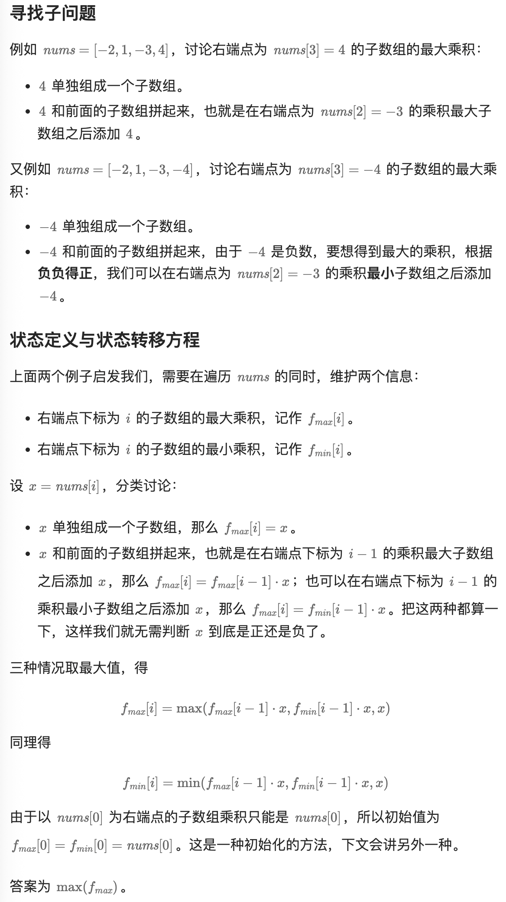

# 300.最长递增子序列（中等）

不连续的子集可以先记忆化

## 题目描述

给你一个整数数组 `nums` ，找到其中最长严格递增子序列的长度。

**子序列** 是由数组派生而来的序列，删除（或不删除）数组中的元素而不改变其余元素的顺序。例如，`[3,6,2,7]` 是数组 `[0,3,1,6,2,2,7]` 的子序列。

 

**示例 1：**

```
输入：nums = [10,9,2,5,3,7,101,18]
输出：4
解释：最长递增子序列是 [2,3,7,101]，因此长度为 4 。
```

**示例 2：**

```
输入：nums = [0,1,0,3,2,3]
输出：4
```

**示例 3：**

```
输入：nums = [7,7,7,7,7,7,7]
输出：1
```

 

**提示：**

- `1 <= nums.length <= 2500`
- `-104 <= nums[i] <= 104`

 

**进阶：**

- 你能将算法的时间复杂度降低到 `O(n log(n))` 吗?

## 我的Python解答

为什么这个题我还是没有什么好的思路，明明做了那么多遍？

## Python参考答案

1. dp[i]的定义

本题中，正确定义dp数组的含义十分重要。【本质上dfs(i)的定义就是以nums[i]为末尾的递增子序列的长度】

**dp[i]表示i之前包括i的以nums[i]结尾的最长递增子序列的长度**

为什么一定表示 “以nums[i]结尾的最长递增子序” ，因为我们在 做 递增比较的时候，如果比较 nums[j] 和 nums[i] 的大小，那么两个递增子序列一定分别以nums[j]为结尾 和 nums[i]为结尾， 要不然这个比较就没有意义了，不是尾部元素的比较那么 如何算递增呢。

1. 状态转移方程

位置i的最长升序子序列等于j从0到i-1各个位置的最长升序子序列 + 1 的最大值。

所以：if (nums[i] > nums[j]) dp[i] = max(dp[i], dp[j] + 1);

**注意这里不是要dp[i] 与 dp[j] + 1进行比较，而是我们要取dp[j] + 1的最大值**。

1. dp[i]的初始化

每一个i，对应的dp[i]（即最长递增子序列）起始大小至少都是1.

1. 确定遍历顺序

dp[i] 是有0到i-1各个位置的最长递增子序列 推导而来，那么遍历i一定是从前向后遍历。

j其实就是遍历0到i-1，那么是从前到后，还是从后到前遍历都无所谓，只要吧 0 到 i-1 的元素都遍历了就行了。 所以默认习惯 从前向后遍历。

遍历i的循环在外层，遍历j则在内层

```cpp
for (int i = 1; i < nums.size(); i++) {
    for (int j = 0; j < i; j++) {
        if (nums[i] > nums[j]) dp[i] = max(dp[i], dp[j] + 1);
    }
    if (dp[i] > result) result = dp[i]; // 取长的子序列
}
```

1. 举例推导dp数组

输入：[0,1,0,3,2]，dp数组的变化如下：


```python
class Solution:
    def lengthOfLIS(self, nums: List[int]) -> int:
        if len(nums) <= 1:
            return len(nums)
        dp = [1] * len(nums)
        result = 1
        for i in range(1, len(nums)):
            for j in range(0, i):
                if nums[i] > nums[j]:
                    dp[i] = max(dp[i], dp[j] + 1)
            result = max(result, dp[i]) #取长的子序列
        return result

```


```python
class Solution:
    def lengthOfLIS(self, nums: List[int]) -> int:
        @cache
        def dfs(i: int) -> int:
            res = 0
            for j in range(i):
                if nums[j] < nums[i]:
                    res = max(res, dfs(j))
            return res + 1  # 加一提到循环外面

        return max(dfs(i) for i in range(len(nums)))

class Solution:
    def lengthOfLIS(self, nums: List[int]) -> int:
        f = [0] * len(nums)
        for i, x in enumerate(nums):
            for j, y in enumerate(nums[:i]):
                if x > y:
                    f[i] = max(f[i], f[j])
            f[i] += 1
        return max(f)
```

# 152.乘积最大子数组（中等）

连续的子集最好直接递推

## 题目描述

给你一个整数数组 `nums` ，请你找出数组中乘积最大的非空连续 子数组（该子数组中至少包含一个数字），并返回该子数组所对应的乘积。

测试用例的答案是一个 **32-位** 整数。

**请注意**，一个只包含一个元素的数组的乘积是这个元素的值。

 

**示例 1:**

```
输入: nums = [2,3,-2,4]
输出: 6
解释: 子数组 [2,3] 有最大乘积 6。
```

**示例 2:**

```
输入: nums = [-2,0,-1]
输出: 0
解释: 结果不能为 2, 因为 [-2,-1] 不是子数组。
```

 

**提示:**

- `1 <= nums.length <= 2 * 104`
- `-10 <= nums[i] <= 10`
- `nums` 的任何子数组的乘积都 **保证** 是一个 **32-位** 整数

## 我的解答

```python
class Solution:
    def maxProduct(self, nums: List[int]) -> int:
        # 非空连续，按理来说要枚举的是左右端点
        left, right = 0, len(nums)-1
        @cache
        def dfs(i:int, j:int):
            if i>j:
                return -inf
            # 去除左边 去除右边 同时去除两边
            total = nums[i]
            for a in range(i+1,j+1):
                total *= nums[a]
            return max(dfs(i+1,j), dfs(i,j-1),dfs(i+1,j-1), total)
        return dfs(left, right)
```

666超时了，看答案

## 参考答案



```python
class Solution:
    def maxProduct(self, nums: List[int]) -> int:
        n = len(nums)
        f_max = [0] * n
        f_min = [0] * n
        f_max[0] = f_min[0] = nums[0]
        for i in range(1, n):
            x = nums[i]
            f_max[i] = max(f_max[i-1] * x, f_min[i-1] * x, x)
            f_min[i] = min(f_max[i-1] * x, f_min[i-1] * x, x)

        return max(f_max)
```

结果：


```python
class Solution:
    def maxProduct(self, nums: List[int]) -> int:
        ans = -inf  # 注意答案可能是负数
        f_max = f_min = 1
        for x in nums:
            f_max, f_min = max(f_max * x, f_min * x, x), \
                           min(f_max * x, f_min * x, x)
            ans = max(ans, f_max)
        return ans

class Solution:
    def maxProduct(self, nums: List[int]) -> int:
        ans = -inf
        f_max = f_min = 1
        for x in nums:
            if x < 0:
                # 下面与 x 相乘后，最大的正数变成最小的负数，最小的负数变成最大的正数
                # 提前交换，这样可以把 x < 0 和 x >= 0 的情况合并，合并后，计算 max 和 min 可以少一项
                f_max, f_min = f_min, f_max
            f_max = max(f_max * x, x)
            f_min = min(f_min * x, x)
            ans = max(ans, f_max)
        return ans
```

