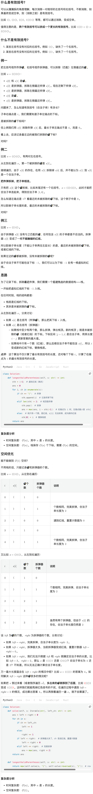
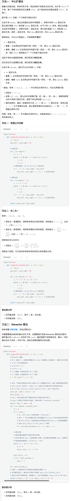

# 300.最长递增子序列（中等）

## 题目描述

给你一个整数数组 `nums` ，找到其中最长严格递增子序列的长度。

**子序列** 是由数组派生而来的序列，删除（或不删除）数组中的元素而不改变其余元素的顺序。例如，`[3,6,2,7]` 是数组 `[0,3,1,6,2,2,7]` 的子序列。

 

**示例 1：**

```
输入：nums = [10,9,2,5,3,7,101,18]
输出：4
解释：最长递增子序列是 [2,3,7,101]，因此长度为 4 。
```

**示例 2：**

```
输入：nums = [0,1,0,3,2,3]
输出：4
```

**示例 3：**

```
输入：nums = [7,7,7,7,7,7,7]
输出：1
```

 

**提示：**

- `1 <= nums.length <= 2500`
- `-104 <= nums[i] <= 104`

 

**进阶：**

- 你能将算法的时间复杂度降低到 `O(n log(n))` 吗?

## 我的Python解答

```python
class Solution:
    def lengthOfLIS(self, nums: List[int]) -> int:
        dp = [1]*len(nums) # 表示以元素i为结尾的最长子等子序列的长度
        for i in range(len(nums)):
            for j in range(i):
                if nums[i] > nums[j]:
                    dp[i] = max(dp[j]+1,dp[i])
        # print(dp)
        return max(dp)
```

结果：


## Python参考答案

这种时候递推比记忆化搜索好理解

```python
class Solution:
    def lengthOfLIS(self, nums: List[int]) -> int:
        @cache
        def dfs(i: int) -> int:
            res = 0
            for j in range(i):
                if nums[j] < nums[i]:
                    res = max(res, dfs(j))
            return res + 1  # 加一提到循环外面

        return max(dfs(i) for i in range(len(nums)))

class Solution:
    def lengthOfLIS(self, nums: List[int]) -> int:
        f = [0] * len(nums)
        for i, x in enumerate(nums):
            for j, y in enumerate(nums[:i]):
                if x > y:
                    f[i] = max(f[i], f[j])
            f[i] += 1
        return max(f)
```

# 152.乘积最大子数组（中等）

## 题目描述

给你一个整数数组 `nums` ，请你找出数组中乘积最大的非空连续 子数组（该子数组中至少包含一个数字），并返回该子数组所对应的乘积。

测试用例的答案是一个 **32-位** 整数。

**请注意**，一个只包含一个元素的数组的乘积是这个元素的值。

 

**示例 1:**

```
输入: nums = [2,3,-2,4]
输出: 6
解释: 子数组 [2,3] 有最大乘积 6。
```

**示例 2:**

```
输入: nums = [-2,0,-1]
输出: 0
解释: 结果不能为 2, 因为 [-2,-1] 不是子数组。
```

 

**提示:**

- `1 <= nums.length <= 2 * 104`
- `-10 <= nums[i] <= 10`
- `nums` 的任何子数组的乘积都 **保证** 是一个 **32-位** 整数

## 我的解答

```python
class Solution:
    def maxProduct(self, nums: List[int]) -> int:
        dp_max = [-inf] * len(nums)
        dp_min = [inf] * len(nums)
        dp_max[0] = nums[0]
        dp_min[0] = nums[0]
        for i in range(1,len(nums)):
            dp_max[i] = max(dp_max[i-1] * nums[i], dp_min[i-1] * nums[i], nums[i])
            dp_min[i] = min(dp_max[i-1] * nums[i], dp_min[i-1] * nums[i], nums[i])
        return max(dp_max)
```

结果：


```python
class Solution:
    def maxProduct(self, nums: List[int]) -> int:
        ans = nums[0]
        f_max = f_min = nums[0]
        for i in range(1, len(nums)):
            f_max, f_min = max(f_max, f_min,1) * nums[i], min(f_max, f_min, 1)*nums[i]
            ans = max(ans, f_max, f_min)
        return ans
```

这里的max判断需要额外添加f_min，因为把nums[i]给提出到乘法外面了，如果当前元素为负数，max和min的值会互换，因此max里面加上最小值的判断。如果x乘到max或者min里面，那就只用判断f_max了

结果：


## 参考答案

```python
class Solution:
    def maxProduct(self, nums: List[int]) -> int:
        n = len(nums)
        f_max = [0] * n
        f_min = [0] * n
        f_max[0] = f_min[0] = nums[0]
        for i in range(1, n):
            x = nums[i]
            # 把 x 加到右端点为 i-1 的（乘积最大/最小）子数组后面，
            # 或者单独组成一个子数组，只有 x 一个元素
            f_max[i] = max(f_max[i - 1] * x, f_min[i - 1] * x, x)
            f_min[i] = min(f_max[i - 1] * x, f_min[i - 1] * x, x)
        return max(f_max)

class Solution:
    def maxProduct(self, nums: List[int]) -> int:
        ans = -inf  # 注意答案可能是负数
        f_max = f_min = 1
        for x in nums:
            f_max, f_min = max(f_max * x, f_min * x, x), \
                           min(f_max * x, f_min * x, x)
            ans = max(ans, f_max)
        return ans

class Solution:
    def maxProduct(self, nums: List[int]) -> int:
        ans = -inf
        f_max = f_min = 1
        for x in nums:
            if x < 0:
                # 下面与 x 相乘后，最大的正数变成最小的负数，最小的负数变成最大的正数
                # 提前交换，这样可以把 x < 0 和 x >= 0 的情况合并，合并后，计算 max 和 min 可以少一项
                f_max, f_min = f_min, f_max
            f_max = max(f_max * x, x)
            f_min = min(f_min * x, x)
            ans = max(ans, f_max)
        return ans
```

# 416.分割等和子集（中等）

## 题目描述

给你一个 **只包含正整数** 的 **非空** 数组 `nums` 。请你判断是否可以将这个数组分割成两个子集，使得两个子集的元素和相等。

 

**示例 1：**

```
输入：nums = [1,5,11,5]
输出：true
解释：数组可以分割成 [1, 5, 5] 和 [11] 。
```

**示例 2：**

```
输入：nums = [1,2,3,5]
输出：false
解释：数组不能分割成两个元素和相等的子集。
```

 

**提示：**

- `1 <= nums.length <= 200`
- `1 <= nums[i] <= 100`

## 我的解答

做这个题必须要意识到是在找子集的和恰好等于target的情况，那就很公式化了

```python
class Solution:
    def canPartition(self, nums: List[int]) -> bool:
        # 相当于是两个空数组瓜分nums，每一个数都有放到左和右两种情况
        # 本质上就是找子集，使得和为total//2
        total = sum(nums)
        if total % 2 == 1:
            return False
        total = total // 2
        n = len(nums)
        @cache
        def dfs(i:int, target:int):
            if i < 0:
                return False
            if target == 0:
                return True
            return dfs(i-1, target) or dfs(i-1, target - nums[i])
        return dfs(n-1, total)
```

结果：


其实在判断边界条件的时候少判断了targt<0，这时候也返回False

```python
class Solution:
    def canPartition(self, nums: List[int]) -> bool:
        # 相当于是两个空数组瓜分nums，每一个数都有放到左和右两种情况
        # 本质上就是找子集，使得和为total//2
        total = sum(nums)
        if total % 2 == 1:
            return False
        total = total // 2
        n = len(nums)
        dp = [[False] * (total+1) for _ in range(n+1)]
        for i in range(n+1):
            dp[i][0] = True
        for i in range(n):
            for j in range(total+1):
                if j < nums[i]:
                    dp[i+1][j] = dp[i][j]
                else:
                    dp[i+1][j] = dp[i][j] or dp[i][j-nums[i]]
        return dp[n][total]
```

结果：


```python
class Solution:
    def canPartition(self, nums: List[int]) -> bool:
        # 相当于是两个空数组瓜分nums，每一个数都有放到左和右两种情况
        # 本质上就是找子集，使得和为total//2
        total = sum(nums)
        if total % 2 == 1:
            return False
        total = total // 2
        n = len(nums)
        dp = [[False] * (total+1) for _ in range(2)]
        for i in range(2):
            dp[i][0] = True
        for i in range(n):
            for j in range(total+1):
                if j < nums[i]:
                    dp[(i+1)%2][j] = dp[i%2][j]
                else:
                    dp[(i+1)%2][j] = dp[i%2][j] or dp[i%2][j-nums[i]]
        return dp[n%2][total]
```


```python
class Solution:
    def canPartition(self, nums: List[int]) -> bool:
        # 相当于是两个空数组瓜分nums，每一个数都有放到左和右两种情况
        # 本质上就是找子集，使得和为total//2
        total = sum(nums)
        if total % 2 == 1:
            return False
        total = total // 2
        n = len(nums)
        dp = [True] + [False]*total
        for i,x in enumerate(nums):
            for j in range(total, -1, -1):
                if j >= x:
                    dp[j] = dp[j] or dp[j-x]
        return dp[-1]
```


## 参考答案

```python
class Solution:
    def canPartition(self, nums: List[int]) -> bool:
        @cache  # 缓存装饰器，避免重复计算 dfs 的结果（记忆化）
        def dfs(i: int, j: int) -> bool:
            if i < 0:
                return j == 0
            if j < nums[i]:
                return dfs(i - 1, j)  # 只能不选
            return dfs(i - 1, j - nums[i]) or dfs(i - 1, j)  # 选或不选

        s = sum(nums)
        return s % 2 == 0 and dfs(len(nums) - 1, s // 2)
    
class Solution:
    def canPartition(self, nums: List[int]) -> bool:
        @cache  # 缓存装饰器，避免重复计算 dfs 的结果（记忆化）
        def dfs(i: int, j: int) -> bool:
            if i < 0:
                return j == 0
            return j >= nums[i] and dfs(i - 1, j - nums[i]) or dfs(i - 1, j)

        s = sum(nums)
        return s % 2 == 0 and dfs(len(nums) - 1, s // 2)

class Solution:
    def canPartition(self, nums: List[int]) -> bool:
        s = sum(nums)
        if s % 2:
            return False
        s //= 2  # 注意这里把 s 减半了
        n = len(nums)
        f = [[False] * (s + 1) for _ in range(n + 1)]
        f[0][0] = True
        for i, x in enumerate(nums):
            for j in range(s + 1):
                f[i + 1][j] = j >= x and f[i][j - x] or f[i][j]
        return f[n][s]

class Solution:
    def canPartition(self, nums: List[int]) -> bool:
        s = sum(nums)
        if s % 2:
            return False
        s //= 2  # 注意这里把 s 减半了
        f = [True] + [False] * s
        s2 = 0
        for i, x in enumerate(nums):
            s2 = min(s2 + x, s)
            for j in range(s2, x - 1, -1):
                f[j] = f[j] or f[j - x]
            if f[s]:
                return True
        return False
```

# 32.最长有效括号（困难）

## 题目描述

给你一个只包含 `'('` 和 `')'` 的字符串，找出最长有效（格式正确且连续）括号 子串 的长度。

左右括号匹配，即每个左括号都有对应的右括号将其闭合的字符串是格式正确的，比如 `"(()())"`。

 

**示例 1：**

```
输入：s = "(()"
输出：2
解释：最长有效括号子串是 "()"
```

**示例 2：**

```
输入：s = ")()())"
输出：4
解释：最长有效括号子串是 "()()"
```

**示例 3：**

```
输入：s = ""
输出：0
```

 

**提示：**

- `0 <= s.length <= 3 * 104`
- `s[i]` 为 `'('` 或 `')'`

## 我的解答

耗时过久，看答案

## 参考答案



```python
class Solution:
    def longestValidParentheses(self, s: str) -> int:
        stk = [-1]  # 虚拟红线（哨兵）
        ans = 0
        for i, ch in enumerate(s):
            if ch == '(':  # 炸弹
                stk.append(i)  # 记录炸弹下标
            elif len(stk) > 1:  # 栈顶是炸弹
                stk.pop()  # 拆弹
                ans = max(ans, i - stk[-1])  # 右端点为 i 时，左端点最小是 stk[-1] + 1
            else:  # 栈只有一个数，是红线，s[i] 无法拆弹，成为新的红线
                stk[0] = i  # 替换栈底
        return ans

class Solution:
    def solve(self, s: Iterable[str], left_ch: str) -> int:
        ans = left = right = 0
        for ch in s:
            if ch == left_ch:
                left += 1
            else:
                right += 1
            if left < right:  # 拆弹器太多了，ch 变成红线，重置计数器
                left = right = 0
            elif left == right:  # 完美拆弹
                ans = max(ans, right * 2)
        return ans

    def longestValidParentheses(self, s: str) -> int:
        return max(self.solve(s, '('), self.solve(reversed(s), ')'))  # reversed 是 O(1) 的
```

另一个思路：先用栈判断合法括号，标注为1，不合法标注为0

然后就是找最长连续1了

```python
class Solution:
    def longestValidParentheses(self, s: str) -> int:
        st = []
        nums = [0] * (len(s)+1) # 额外添加一个0方便结束while
        for i,x in enumerate(s):
            if x == "(":
                st.append(i)
            else:
                if len(st)>0 and s[st[-1]] == "(":
                    nums[i] = 1
                    nums[st.pop()] = 1
                else:
                    st.append(i)
        ans = 0
        i = 0
        while i<len(s): # i有效区为s
            if nums[i] == 0:
                i += 1
                continue
            for j in range(i, len(nums)): # 这个要长一些，因为最后一个肯定是0
                if nums[j] == 1:
                    continue
                ans = max(ans, j-i)
                i = j+1
                break
        return ans
```

结果：


傻了，最后不要while判断

```python
class Solution:
    def longestValidParentheses(self, s: str) -> int:
        st = []
        nums = [0] * (len(s))
        for i,x in enumerate(s):
            if x == "(":
                st.append(i)
            else:
                if len(st)>0 and s[st[-1]] == "(":
                    nums[i] = 1
                    nums[st.pop()] = 1
                else:
                    st.append(i)
        l = ans = 0
        for i in range(len(nums)):
            if nums[i] == 1:
                l+= 1
            else:
                ans = max(ans, l)
                l = 0
        return max(ans, l)
```

# 62.不同路径（中等）

## 题目描述

一个机器人位于一个 `m x n` 网格的左上角 （起始点在下图中标记为 “Start” ）。

机器人每次只能向下或者向右移动一步。机器人试图达到网格的右下角（在下图中标记为 “Finish” ）。

问总共有多少条不同的路径？

 

**示例 1：**


```
输入：m = 3, n = 7
输出：28
```

**示例 2：**

```
输入：m = 3, n = 2
输出：3
解释：
从左上角开始，总共有 3 条路径可以到达右下角。
1. 向右 -> 向下 -> 向下
2. 向下 -> 向下 -> 向右
3. 向下 -> 向右 -> 向下
```

**示例 3：**

```
输入：m = 7, n = 3
输出：28
```

**示例 4：**

```
输入：m = 3, n = 3
输出：6
```

 

**提示：**

- `1 <= m, n <= 100`
- 题目数据保证答案小于等于 `2 * 109`

## 我的解答

记忆化搜索

```python
class Solution:
    def uniquePaths(self, m: int, n: int) -> int:
        @cache
        def dfs(i:int, j:int):
            # 表示到（i，j）有多少种路径
            if i<=0 or j<=0:
                return 1
            return dfs(i,j-1) + dfs(i-1, j)
        return dfs(m-1,n-1)
```

结果：


```python
class Solution:
    def uniquePaths(self, m: int, n: int) -> int:
        dp = [[0]*(n) for _ in range(m)]
        for i in range(m):
            dp[i][0] = 1
        for j in range(n):
            dp[0][j] = 1
        for i in range(m-1):
            for j in range(n-1):
                dp[i+1][j+1] = dp[i][j+1] + dp[i+1][j]
        return dp[m-1][n-1]
```

结果：


```python
class Solution:
    def uniquePaths(self, m: int, n: int) -> int:
        # if m < n:
        #     m, n = n, m
        dp = [1] * n
        for i in range(m-1):
            for j in range(n-1):
                dp[j+1] = dp[j] + dp[j+1]
        return dp[-1]
```

结果：


## 参考答案

```python
class Solution:
    def uniquePaths(self, m: int, n: int) -> int:
        @cache  # 缓存装饰器，避免重复计算 dfs 的结果（一行代码实现记忆化）
        def dfs(i: int, j: int) -> int:
            if i < 0 or j < 0:
                return 0
            if i == 0 and j == 0:
                return 1
            return dfs(i - 1, j) + dfs(i, j - 1)
        return dfs(m - 1, n - 1)

class Solution:
    @cache
    def uniquePaths(self, m: int, n: int) -> int:
        if m == 0 or n == 0:
            return 0
        if m == 1 and n == 1:
            return 1
        return self.uniquePaths(m - 1, n) + self.uniquePaths(m, n - 1)

class Solution:
    def uniquePaths(self, m: int, n: int) -> int:
        f = [[0] * (n + 1) for _ in range(m + 1)]
        for i in range(m):
            for j in range(n):
                if i == j == 0:
                    f[1][1] = 1
                else:
                    f[i + 1][j + 1] = f[i][j + 1] + f[i + 1][j]
        return f[m][n]

class Solution:
    def uniquePaths(self, m: int, n: int) -> int:
        f = [[0] * (n + 1) for _ in range(m + 1)]
        f[0][1] = 1
        for i in range(m):
            for j in range(n):
                f[i + 1][j + 1] = f[i][j + 1] + f[i + 1][j]
        return f[m][n]

class Solution:
    def uniquePaths(self, m: int, n: int) -> int:
        f = [0] * (n + 1)
        f[1] = 1
        for _ in range(m):
            for j in range(n):
                f[j + 1] += f[j]
        return f[n]

class Solution:
    def uniquePaths(self, m: int, n: int) -> int:
        return comb(m + n - 2, m - 1)

# ----
    
def comb(n: int, k: int) -> int:
    k = min(k, n - k)
    res = 1
    for i in range(1, k + 1):
        res = res * (n + 1 - i) // i
    return res

class Solution:
    def uniquePaths(self, m: int, n: int) -> int:
        return comb(m + n - 2, m - 1)

```

# 64.最小路径和（中等）

## 题目描述

给定一个包含非负整数的 `*m* x *n*` 网格 `grid` ，请找出一条从左上角到右下角的路径，使得路径上的数字总和为最小。

**说明：**每次只能向下或者向右移动一步。

 

**示例 1：**


```
输入：grid = [[1,3,1],[1,5,1],[4,2,1]]
输出：7
解释：因为路径 1→3→1→1→1 的总和最小。
```

**示例 2：**

```
输入：grid = [[1,2,3],[4,5,6]]
输出：12
```

 

**提示：**

- `m == grid.length`
- `n == grid[i].length`
- `1 <= m, n <= 200`
- `0 <= grid[i][j] <= 200`

## 我的解答

```python
class Solution:
    def minPathSum(self, grid: List[List[int]]) -> int:
        m, n = len(grid), len(grid[0])
        @cache
        def dfs(i:int, j:int):
            if i<0 or j<0:
                return inf
            if i==0 and j==0:
                return grid[0][0] # 强迫必须到原点
            return min(dfs(i-1,j), dfs(i, j-1)) + grid[i][j]
        return dfs(m-1, n-1)
```

结果：


```python
# 其实从记忆化搜索到递推花了挺长时间的，主要问题在于初始化错误。
class Solution:
    def minPathSum(self, grid: List[List[int]]) -> int:
        m, n = len(grid), len(grid[0])
        dp = [[0]*(n) for _ in range(m)]
        a = 0
        for j in range(m):
            a += grid[j][0]
            dp[j][0] = a
        a = 0
        for j in range(n):
            a += grid[0][j]
            dp[0][j] = a
        for i in range(1,m):
            for j in range(1,n):
                dp[i][j] = min(dp[i-1][j], dp[i][j-1]) + grid[i][j]
        # print(dp)
        return dp[m-1][n-1]
```

结果：


## 参考答案

```python
class Solution:
    def minPathSum(self, grid: List[List[int]]) -> int:
        @cache  # 缓存装饰器，避免重复计算 dfs 的结果（记忆化）
        def dfs(i: int, j: int) -> int:
            if i < 0 or j < 0:
                return inf
            if i == 0 and j == 0:
                return grid[i][j]
            return min(dfs(i, j - 1), dfs(i - 1, j)) + grid[i][j]
        return dfs(len(grid) - 1, len(grid[0]) - 1)

class Solution:
    def minPathSum(self, grid: List[List[int]]) -> int:
        m, n = len(grid), len(grid[0])
        f = [[inf] * (n + 1) for _ in range(m + 1)]
        for i, row in enumerate(grid):
            for j, x in enumerate(row):
                if i == j == 0:
                    f[1][1] = x
                else:
                    f[i + 1][j + 1] = min(f[i + 1][j], f[i][j + 1]) + x
        return f[m][n]

class Solution:
    def minPathSum(self, grid: List[List[int]]) -> int:
        m, n = len(grid), len(grid[0])
        f = [[inf] * (n + 1) for _ in range(m + 1)]
        f[0][1] = 0
        for i, row in enumerate(grid):
            for j, x in enumerate(row):
                f[i + 1][j + 1] = min(f[i + 1][j], f[i][j + 1]) + x
        return f[m][n]

class Solution:
    def minPathSum(self, grid: List[List[int]]) -> int:
        f = [inf] * (len(grid[0]) + 1)
        f[1] = 0
        for row in grid:
            for j, x in enumerate(row):
                f[j + 1] = min(f[j], f[j + 1]) + x
        return f[-1]

class Solution:
    def minPathSum(self, grid: List[List[int]]) -> int:
        m, n = len(grid), len(grid[0])
        f = grid[0]  # 这里没有拷贝，f 和 grid[0] 都持有同一段内存
        for j in range(1, n):
            f[j] += f[j - 1]
        for i in range(1, m):
            f[0] += grid[i][0]
            for j in range(1, n):
                f[j] = min(f[j - 1], f[j]) + grid[i][j]
        return f[-1]
```

# 5.最长回文串（中等）

## 题目描述

给你一个字符串 `s`，找到 `s` 中最长的 回文 子串。

 

**示例 1：**

```
输入：s = "babad"
输出："bab"
解释："aba" 同样是符合题意的答案。
```

**示例 2：**

```
输入：s = "cbbd"
输出："bb"
```

 

**提示：**

- `1 <= s.length <= 1000`
- `s` 仅由数字和英文字母组成

## 我的解答

直接进行一个字符串的反转，然后一个指针遍历一遍就行了。**实际上这个思路是错误的，要找的是最长公共子序列，没那么简单**

```python
class Solution:
    def longestPalindrome(self, s: str) -> str:
        n = len(s)
        r = s[::-1]
        # 直接反转字符串，找最长公共子序列
        ans = s[0]
        tmp = []
        for i in range(len(s)):
            x = s[i]
            y = r[i]
            if x!=y:
                ans = "".join(tmp) if len(tmp)>len(ans) else ans
                tmp = []
                continue
            tmp.append(x)
        return ans if len(ans)>len(tmp) else "".join(tmp)
```

耗时太久，看答案

## 参考答案



```python
class Solution:
    def longestPalindrome(self, s: str) -> str:
        n = len(s)
        ans_left = ans_right = 0

        # 奇回文串
        for i in range(n):
            l = r = i
            while l >= 0 and r < n and s[l] == s[r]:
                l -= 1
                r += 1
            # 循环结束后，s[l+1] 到 s[r-1] 是回文串
            if r - l - 1 > ans_right - ans_left:
                ans_left, ans_right = l + 1, r  # 左闭右开区间

        # 偶回文串
        for i in range(n - 1):
            l, r = i, i + 1
            while l >= 0 and r < n and s[l] == s[r]:
                l -= 1
                r += 1
            if r - l - 1 > ans_right - ans_left:
                ans_left, ans_right = l + 1, r  # 左闭右开区间

        return s[ans_left: ans_right]

class Solution:
    def longestPalindrome(self, s: str) -> str:
        n = len(s)
        ans_left = ans_right = 0

        for i in range(2 * n - 1):
            l, r = i // 2, (i + 1) // 2
            while l >= 0 and r < n and s[l] == s[r]:
                l -= 1
                r += 1
            # 循环结束后，s[l+1] 到 s[r-1] 是回文串
            if r - l - 1 > ans_right - ans_left:
                ans_left, ans_right = l + 1, r  # 左闭右开区间

        return s[ans_left: ans_right]

class Solution:
    def longestPalindrome(self, s: str) -> str:
        # Manacher 模板
        # 将 s 改造为 t，这样就不需要讨论 len(s) 的奇偶性，因为新串 t 的每个回文子串都是奇回文串（都有回文中心）
        # s 和 t 的下标转换关系：
        # (si+1)*2 = ti
        # ti/2-1 = si
        # ti 为偶数，对应奇回文串（从 2 开始）
        # ti 为奇数，对应偶回文串（从 3 开始）
        t = "#".join("^" + s + "$")

        # 定义一个奇回文串的回文半径=(长度+1)/2，即保留回文中心，去掉一侧后的剩余字符串的长度
        # half_len[i] 表示在 t 上的以 t[i] 为回文中心的最长回文子串的回文半径
        # 即 [i-half_len[i]+1,i+half_len[i]-1] 是 t 上的一个回文子串
        half_len = [0] * (len(t) - 2)
        half_len[1] = 1
        # box_r 表示当前右边界下标最大的回文子串的右边界下标+1
        # box_m 为该回文子串的中心位置，二者的关系为 r=mid+half_len[mid]
        box_m = box_r = max_i = 0
        for i in range(2, len(half_len)):
            hl = 1
            if i < box_r:
                # 记 i 关于 box_m 的对称位置 i'=box_m*2-i
                # 若以 i' 为中心的最长回文子串范围超出了以 box_m 为中心的回文串的范围（即 i+half_len[i'] >= box_r）
                # 则 half_len[i] 应先初始化为已知的回文半径 box_r-i，然后再继续暴力匹配
                # 否则 half_len[i] 与 half_len[i'] 相等
                hl = min(half_len[box_m * 2 - i], box_r - i)
                
            # 暴力扩展
            # 算法的复杂度取决于这部分执行的次数
            # 由于扩展之后 box_r 必然会更新（右移），且扩展的的次数就是 box_r 右移的次数
            # 因此算法的复杂度 = O(len(t)) = O(n)
            while t[i - hl] == t[i + hl]:
                hl += 1
                box_m, box_r = i, i + hl
                
            half_len[i] = hl
            if hl > half_len[max_i]:
                max_i = i

        hl = half_len[max_i]
        # 注意 t 上的最长回文子串的最左边和最右边都是 '#'
        # 所以要对应到 s，最长回文子串的下标是从 max_i-hl+2 到 max_i+hl-2
        # 结合上文的下标转换关系，得到其在 s 上的下标范围是从 (max_i-hl)/2 到 (max_i+hl)/2-2
        return s[(max_i - hl) // 2: (max_i + hl) // 2 - 1]
```

区间DP：

这里为什么要初始化为True呢

```python
class Solution:
    def longestPalindrome(self, s: str) -> str:
        n = len(s)
        maxlen = -inf
        ans = ""
        dp = [[True]*(n+1) for _ in range(n+1)]
        for i in range(n-1,-1,-1):
            dp[i][i] = True
            for j in range(i, n):
                dp[i][j] = s[i]==s[j] and dp[i+1][j-1]
                if dp[i][j] and j-i+1 > maxlen:
                    maxlen = j-i+1
                    ans = s[i:j+1]
        return ans
```

```python
class Solution:
    def longestPalindrome(self, s: str) -> str:
        n = len(s)
        maxlen = -inf
        ans = ""
        dp = [[False]*(n) for _ in range(n)]
        for i in range(n-1,-1,-1):
            dp[i][i] = True
            if maxlen < 1:
                maxlen = 1
                ans = s[i]
            for j in range(i+1, n):
                if j==i+1:
                    dp[i][j] = (s[i]==s[j])
                else:
                    dp[i][j] = (s[i]==s[j]) and dp[i+1][j-1]
                if dp[i][j] and maxlen<j-i+1:
                    maxlen = j-i+1
                    ans = s[i:j+1]
        return ans
```

