# 1143.最长公共子序列（中等）

## 题目描述

给定两个字符串 `text1` 和 `text2`，返回这两个字符串的最长 **公共子序列** 的长度。如果不存在 **公共子序列** ，返回 `0` 。

一个字符串的 **子序列** 是指这样一个新的字符串：它是由原字符串在不改变字符的相对顺序的情况下删除某些字符（也可以不删除任何字符）后组成的新字符串。

- 例如，`"ace"` 是 `"abcde"` 的子序列，但 `"aec"` 不是 `"abcde"` 的子序列。

两个字符串的 **公共子序列** 是这两个字符串所共同拥有的子序列。

 

**示例 1：**

```
输入：text1 = "abcde", text2 = "ace" 
输出：3  
解释：最长公共子序列是 "ace" ，它的长度为 3 。
```

**示例 2：**

```
输入：text1 = "abc", text2 = "abc"
输出：3
解释：最长公共子序列是 "abc" ，它的长度为 3 。
```

**示例 3：**

```
输入：text1 = "abc", text2 = "def"
输出：0
解释：两个字符串没有公共子序列，返回 0 。
```

 

**提示：**

- `1 <= text1.length, text2.length <= 1000`
- `text1` 和 `text2` 仅由小写英文字符组成。

## 我的Python解答

现在的难点在于优化为一维数组，目前没有一个头绪

```python
class Solution:
    def longestCommonSubsequence(self, text1: str, text2: str) -> int:
        m, n = len(text1), len(text2)
        @cache
        def dfs(i:int, j:int):
            if i<0 or j<0:
                return 0
            return max(dfs(i,j-1), dfs(i-1,j), dfs(i-1,j-1)+int(text1[i]==text2[j]))
        return dfs(m-1,n-1)
    
class Solution:
    def longestCommonSubsequence(self, text1: str, text2: str) -> int:
        m, n = len(text1), len(text2)
        dp = [[0]*(n+1) for _ in range(m+1)]
        for i in range(m):
            for j in range(n):
                dp[i+1][j+1] = max(dp[i][j]+int(text1[i]==text2[j]), dp[i][j+1], dp[i+1][j])
        return dp[m][n]
```

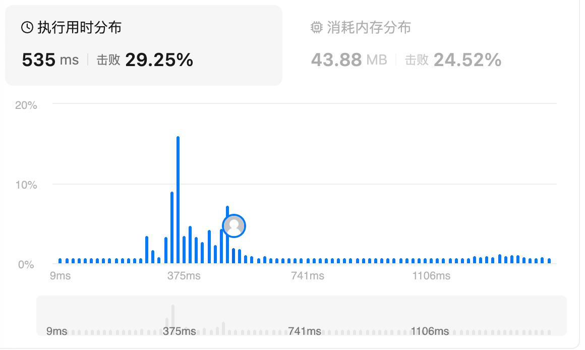

这个是我写的错误一维数组案例：

```python
class Solution:
    def longestCommonSubsequence(self, text1: str, text2: str) -> int:
        m, n = len(text1), len(text2)
        dp = [0]*(n+1)
        for i in range(m):
            pre = dp[0]
            for j in range(n):
                dp[j+1] = max(pre+int(text1[i]==text2[j]), dp[j+1], dp[j])
                pre = dp[j+1]
        return dp[n]
```

错就错在保存pre和tmp错误了。对于当前元素，需要保存的是它更新前的数值，这样下一个元素才能使用。这里相当于是保存了更新后的数值，那就称为当前行内更新过的元素的累加了。

## Python参考答案

```python
class Solution:
    def longestCommonSubsequence(self, s: str, t: str) -> int:
        f = [0] * (len(t) + 1)
        for x in s:
            pre = 0  # f[0]
            for j, y in enumerate(t):
                tmp = f[j + 1]
                f[j + 1] = pre + 1 if x == y else max(f[j + 1], f[j])
                pre = tmp
        return f[-1]
```

# 72.编辑距离（中等）

## 题目描述

给你两个单词 `word1` 和 `word2`， *请返回将 `word1` 转换成 `word2` 所使用的最少操作数* 。

你可以对一个单词进行如下三种操作：

- 插入一个字符
- 删除一个字符
- 替换一个字符

 

**示例 1：**

```
输入：word1 = "horse", word2 = "ros"
输出：3
解释：
horse -> rorse (将 'h' 替换为 'r')
rorse -> rose (删除 'r')
rose -> ros (删除 'e')
```

**示例 2：**

```
输入：word1 = "intention", word2 = "execution"
输出：5
解释：
intention -> inention (删除 't')
inention -> enention (将 'i' 替换为 'e')
enention -> exention (将 'n' 替换为 'x')
exention -> exection (将 'n' 替换为 'c')
exection -> execution (插入 'u')
```

 

**提示：**

- `0 <= word1.length, word2.length <= 500`
- `word1` 和 `word2` 由小写英文字母组成

## 我的解答

这里边界条件需要返回的是两个差值，表示直接插入元素，或者删除元素，才能对齐。不能设置inf，否则所有dfs都会返回inf了

```python
class Solution:
    def minDistance(self, word1: str, word2: str) -> int:
        m, n = len(word1), len(word2)
        @cache
        def dfs(i:int, j:int):
            if i<0 or j<0:
                return abs(i-j)
            # 插入，替换和删除三种做法
            if word1[i] == word2[j]:
                return dfs(i-1, j-1)
            # 一次只比较一对
            return min(dfs(i-1,j), dfs(i,j-1),dfs(i-1,j-1))+1
        return dfs(m-1, n-1)
```

结果：

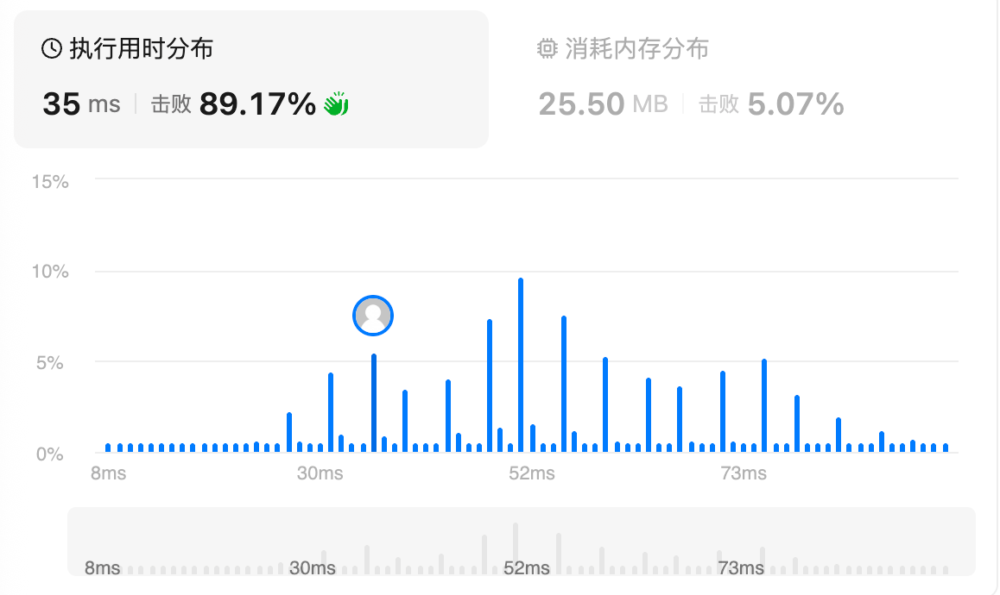

```python
class Solution:
    def minDistance(self, word1: str, word2: str) -> int:
        m, n = len(word1), len(word2)
        dp = [[0]*(n+1) for _ in range(m+1)]
        dp[0] = list(range(n+1))
        for i in range(m+1):
            dp[i][0] = i
        for i,x in enumerate(word1):
            for j,y in enumerate(word2):
                if x==y:
                    dp[i+1][j+1] = dp[i][j]
                else:
                    dp[i+1][j+1] = min(dp[i+1][j], dp[i][j+1], dp[i][j]) + 1
        return dp[m][n]
```

结果：

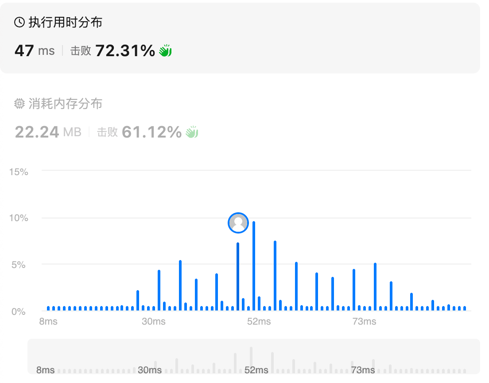

错误的一维解法：主要错在pre定义后的后续操作，pre定义为dp[0]没有问题，但是不要忘了我们在二维的时候，第一列也是初始化了的，dp[0] = i+1，又因为dp[0]不被修改，所以直接+=1即可

```python
class Solution:
    def minDistance(self, word1: str, word2: str) -> int:
        m, n = len(word1), len(word2)
        dp = list(range(n+1))

        for i,x in enumerate(word1):
            pre = 0
            for j,y in enumerate(word2):
                tmp = dp[j+1]
                if x==y:
                    dp[j+1] = pre
                else:
                    dp[j+1] = min(dp[j], dp[j+1], pre) + 1
                pre = tmp
        print(dp)
        return dp[n]
```

## 参考答案

修改我的解法：

```python
class Solution:
    def minDistance(self, word1: str, word2: str) -> int:
        m, n = len(word1), len(word2)
        dp = list(range(n+1))

        for i,x in enumerate(word1):
            pre = 0
            for j,y in enumerate(word2):
                tmp = dp[j+1]
                if x==y:
                    dp[j+1] = pre
                else:
                    dp[j+1] = min(dp[j], dp[j+1], pre) + 1
                pre = tmp
        print(dp)
        return dp[n]
```

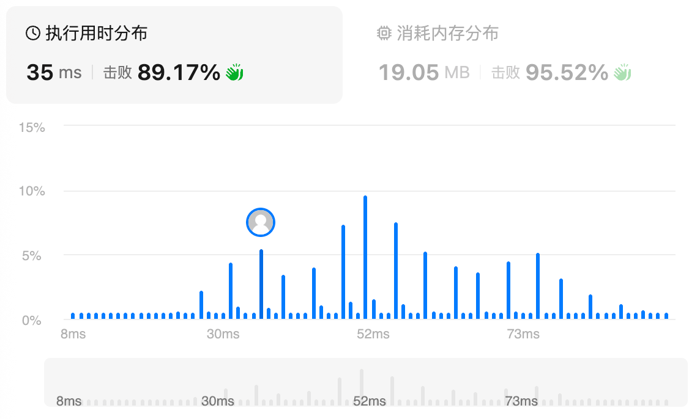

```python
class Solution:
    def minDistance(self, s: str, t: str) -> int:
        f = list(range(len(t) + 1))
        for x in s:
            pre = f[0]
            f[0] += 1  # f[0] = i + 1
            for j, y in enumerate(t):
                tmp = f[j + 1]
                f[j + 1] = pre if x == y else min(f[j + 1], f[j], pre) + 1
                pre = tmp
        return f[-1]
```

# 136.只出现一次的数字

## 题目描述

给你一个 **非空** 整数数组 `nums` ，除了某个元素只出现一次以外，其余每个元素均出现两次。找出那个只出现了一次的元素。

你必须设计并实现线性时间复杂度的算法来解决此问题，且该算法只使用常量额外空间。

 

**示例 1 ：**

**输入：**nums = [2,2,1]

**输出：**1

**示例 2 ：**

**输入：**nums = [4,1,2,1,2]

**输出：**4

**示例 3 ：**

**输入：**nums = [1]

**输出：**1

 

**提示：**

- `1 <= nums.length <= 3 * 104`
- `-3 * 104 <= nums[i] <= 3 * 104`
- 除了某个元素只出现一次以外，其余每个元素均出现两次。

## 我的解答

耗时超过两分钟没有思路，因为要求了线性时间复杂度+常数空间

答案肯定是比较巧妙的解法，直接看

## 参考答案

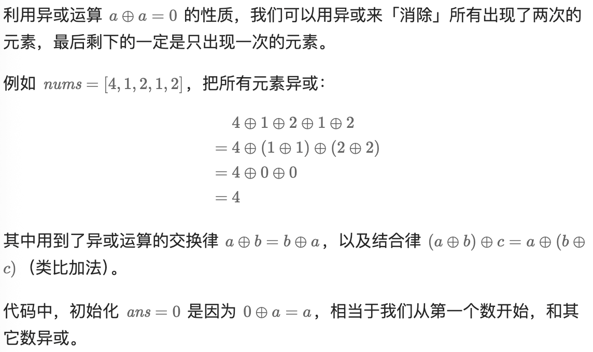

```python
class Solution:
    def singleNumber(self, nums: List[int]) -> int:
        return reduce(xor, nums)
```

```python
class Solution:
    def singleNumber(self, nums: List[int]) -> int:
        return reduce(lambda x, y: x ^ y, nums)
```

```python
class Solution:
    def singleNumber(self, nums: List[int]) -> int:
        ans = 0
        for x in nums:
            ans = ans ^ x
        return ans
```

## python收获

### python中的reduce函数

`reduce()` 是 Python 中一个功能强大的高阶函数，用于对可迭代对象中的元素进行累积计算。它位于 `functools` 模块中，在 Python 3 中需要导入才能使用。下面从多个方面详细介绍 `reduce`。

---

#### 1. 基本概念
`reduce()` 将一个接受两个参数的函数以累积的方式应用到可迭代对象的元素上，从而将可迭代对象缩减为单个值。这个过程可以理解为：
- 首先将序列的前两个元素传给函数，得到计算结果；
- 然后将这个结果和下一个元素传给函数，依此类推；
- 最后返回最终的计算结果。

---

#### 2. 语法
```python
from functools import reduce

reduce(function, iterable[, initializer])
```

**参数说明**：
- `function`：一个接受两个参数的函数，`reduce` 会将其累积应用到元素上。
- `iterable`：一个可迭代对象（如列表、元组、字符串等）。
- `initializer`（可选）：初始值。如果提供，则作为第一个参数参与第一次调用；如果未提供且 `iterable` 为空，则会抛出 `TypeError`。

---

#### 3. 工作原理
假设有一个列表 `[a, b, c, d]` 和一个函数 `f(x, y)`，调用 `reduce(f, [a, b, c, d])` 的执行过程为：
1. 先计算 `f(a, b)`，得到结果 `r1`；
2. 然后计算 `f(r1, c)`，得到 `r2`；
3. 最后计算 `f(r2, d)`，得到最终结果 `r3`。

如果提供了初始值 `init`，则从 `f(init, a)` 开始，后续步骤相同。

---

#### 4. 常见使用示例

##### 4.1 求和
```python
from functools import reduce

numbers = [1, 2, 3, 4, 5]
total = reduce(lambda x, y: x + y, numbers)
print(total)  # 输出 15

# 等同于 sum(numbers)
```

##### 4.2 求积
```python
product = reduce(lambda x, y: x * y, [1, 2, 3, 4])
print(product)  # 输出 24
```

##### 4.3 求最大值
```python
max_value = reduce(lambda x, y: x if x > y else y, [3, 7, 2, 9, 5])
print(max_value)  # 输出 9
```

##### 4.4 字符串拼接
```python
words = ["Hello", " ", "World", "!"]
sentence = reduce(lambda x, y: x + y, words)
print(sentence)  # 输出 "Hello World!"
```

##### 4.5 使用初始值
```python
# 求和时加上初始值 10
total = reduce(lambda x, y: x + y, [1, 2, 3], 10)
print(total)  # 输出 16，相当于 10+1+2+3
```

##### 4.6 空序列处理
如果可迭代对象为空且未提供 `initializer`，会引发 `TypeError`：
```python
reduce(lambda x, y: x + y, [])  # TypeError: reduce() of empty sequence with no initial value
```

提供初始值则可避免：
```python
reduce(lambda x, y: x + y, [], 0)  # 输出 0
```

---

#### 5. 与 `map()`、`filter()` 的区别
- `map()`：对每个元素应用函数，返回一个与输入长度相同的结果序列。
- `filter()`：根据条件筛选元素，返回长度 ≤ 原序列的结果序列。
- `reduce()`：将整个序列缩减为一个单一值。

三者的共同点是都接收一个函数和一个可迭代对象，但处理方式和输出不同。

---

#### 6. 使用 `operator` 模块简化
Python 的 `operator` 模块提供了许多内置运算符函数，可以避免写 `lambda`，使代码更简洁：
```python
from functools import reduce
import operator

# 求和
reduce(operator.add, [1, 2, 3, 4])   # 10

# 求积
reduce(operator.mul, [1, 2, 3, 4])   # 24

# 拼接字符串
reduce(operator.concat, ["a", "b", "c"], "")  # "abc"
```

---

#### 7. Python 2 与 Python 3 的区别
- 在 Python 2 中，`reduce` 是内置函数，可以直接使用（无需导入）。
- 在 Python 3 中，`reduce` 被移到了 `functools` 模块，需要 `from functools import reduce` 才能使用。这样做是为了鼓励使用更显式的循环或其他内置函数（如 `sum()`、`any()`、`all()` 等），提高代码可读性。

---

#### 8. 与 `itertools.accumulate` 的区别
- `reduce` 返回**单个最终结果**。
- `itertools.accumulate` 返回一个迭代器，产生**每一步的累积结果**（包括中间值）。
```python
from itertools import accumulate
list(accumulate([1, 2, 3, 4], lambda x, y: x + y))  # [1, 3, 6, 10]
```

---

#### 9. 注意事项
- **函数必须接受两个参数**，且返回值会作为下一次调用的第一个参数。
- **可读性**：对于简单的累积操作（如求和、求积），Python 提供了专门的函数（`sum`、`math.prod`）更直观。`reduce` 更适合复杂的累积逻辑。
- **性能**：`reduce` 本身是高效的（用 C 实现），但每次函数调用仍有开销。对于大型数据，应考虑是否能用内置函数替代。
- **初始值的作用**：不仅用于处理空序列，还能改变计算起点，例如计算乘积时从 1 开始可正确处理空列表。

---

#### 10. 应用场景举例
- 将多个字典合并为一个
- 实现一个简单的 `map` + `filter` 组合
- 计算阶乘
- 在函数式编程风格中构建管道

```python
# 合并字典
dicts = [{'a': 1}, {'b': 2}, {'c': 3}]
merged = reduce(lambda d1, d2: {**d1, **d2}, dicts, {})
print(merged)  # {'a': 1, 'b': 2, 'c': 3}
```

---

### 11. 总结
`reduce()` 是函数式编程的重要工具，能够简洁地表达累积逻辑。但需注意，Python 中有许多内置函数和循环可以完成同样任务，选择时应优先考虑代码的可读性。理解 `reduce` 有助于深入掌握 Python 的函数式编程特性，并为阅读他人代码打下基础。

更多详情可参考 [官方文档](https://docs.python.org/3/library/functools.html#functools.reduce)。

# 169.多数元素

## 题目描述

给定一个大小为 `n` 的数组 `nums` ，返回其中的多数元素。多数元素是指在数组中出现次数 **大于** `⌊ n/2 ⌋` 的元素。

你可以假设数组是非空的，并且给定的数组总是存在多数元素。

 

**示例 1：**

```
输入：nums = [3,2,3]
输出：3
```

**示例 2：**

```
输入：nums = [2,2,1,1,1,2,2]
输出：2
```

 

**提示：**

- `n == nums.length`
- `1 <= n <= 5 * 104`
- `-109 <= nums[i] <= 109`
- 输入保证数组中一定有一个多数元素。

 

**进阶：**尝试设计时间复杂度为 O(n)、空间复杂度为 O(1) 的算法解决此问题。

## 我的解答

```python
from collections import Counter
class Solution:
    def majorityElement(self, nums: List[int]) -> int:
        cnt = Counter(nums)
        # return max(cnt.items(), key=lambda x: x[1])[0]
        return cnt.most_common(1)[0][0]
```

结果：

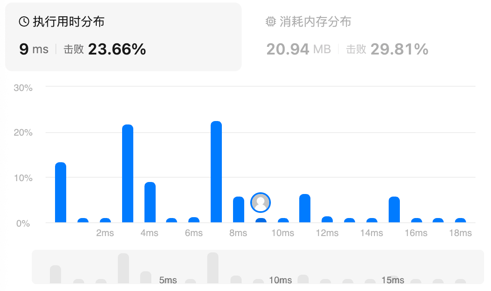


## 参考答案

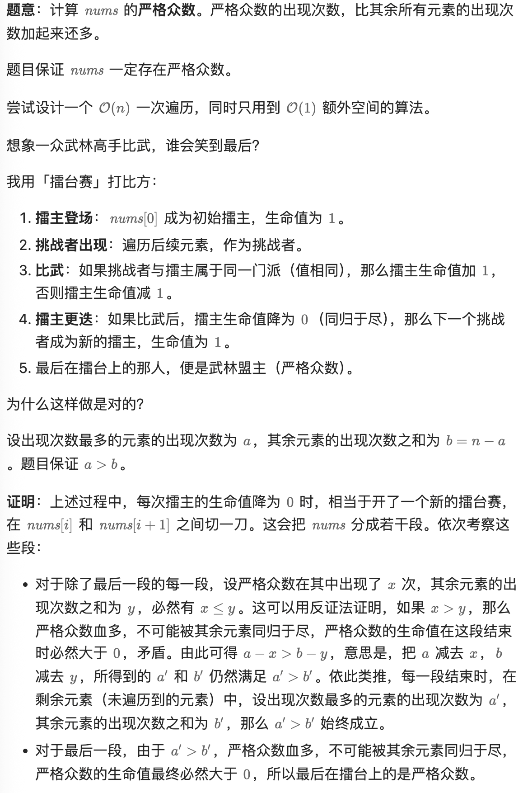

```python
class Solution:
    def majorityElement(self, nums: List[int]) -> int:
        ans = hp = 0
        for x in nums:
            if hp == 0:  # x 是初始擂主，生命值为 1
                ans, hp = x, 1
            else:  # 比武，同门加血，否则扣血
                hp += 1 if x == ans else -1
        return ans
```

# 75.颜色分类（中等）

## 题目描述

给定一个包含红色、白色和蓝色、共 `n` 个元素的数组 `nums` ，**[原地](https://baike.baidu.com/item/原地算法)** 对它们进行排序，使得相同颜色的元素相邻，并按照红色、白色、蓝色顺序排列。

我们使用整数 `0`、 `1` 和 `2` 分别表示红色、白色和蓝色。

必须在不使用库内置的 sort 函数的情况下解决这个问题。

 

**示例 1：**

```
输入：nums = [2,0,2,1,1,0]
输出：[0,0,1,1,2,2]
```

**示例 2：**

```
输入：nums = [2,0,1]
输出：[0,1,2]
```

 

**提示：**

- `n == nums.length`
- `1 <= n <= 300`
- `nums[i]` 为 `0`、`1` 或 `2`

 

**进阶：**

- 你能想出一个仅使用常数空间的一趟扫描算法吗？

## 我的解答

管那么多干啥，直接统计counter，然后依据数目覆盖nums

```python
class Solution:
    def sortColors(self, nums: List[int]) -> None:
        """
        Do not return anything, modify nums in-place instead.
        """
        cnt = Counter(nums)
        start = 0
        for element in range(3):
            for times in range(cnt[element]):
                nums[start+times] = element
            start += cnt[element]
```

结果：

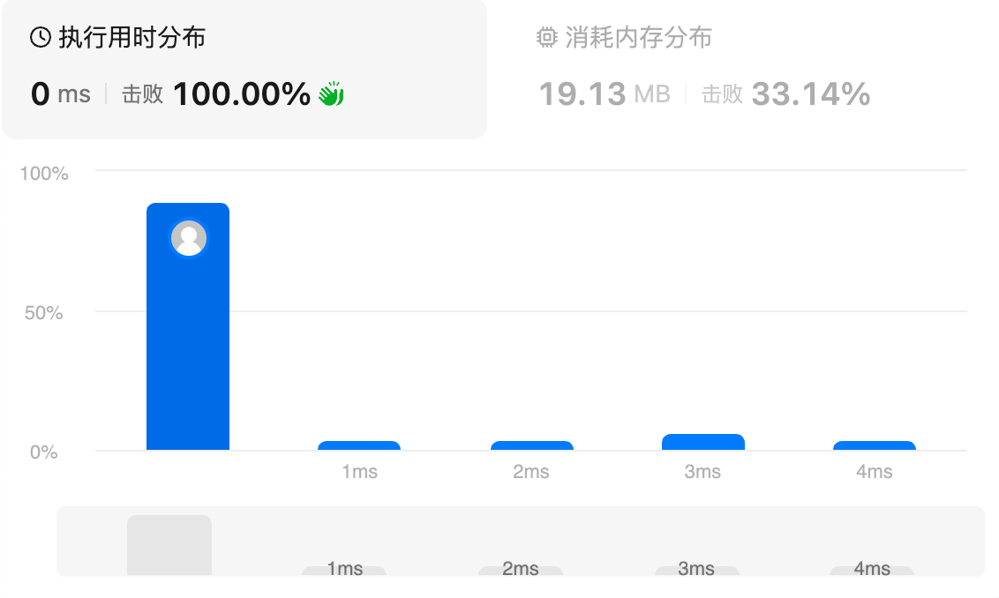

## 参考答案

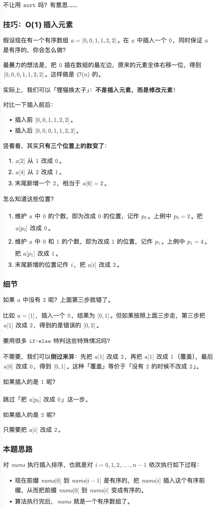

```python
class Solution:
    def sortColors(self, nums: List[int]) -> None:
        p0 = p1 = 0
        for i, x in enumerate(nums):
            nums[i] = 2
            if x <= 1:
                nums[p1] = 1
                p1 += 1
            if x == 0:
                nums[p0] = 0
                p0 += 1
```

# 31.下一个排列（中等）

## 题目描述

整数数组的一个 **排列** 就是将其所有成员以序列或线性顺序排列。

- 例如，`arr = [1,2,3]` ，以下这些都可以视作 `arr` 的排列：`[1,2,3]`、`[1,3,2]`、`[3,1,2]`、`[2,3,1]` 。

整数数组的 **下一个排列** 是指其整数的下一个字典序更大的排列。更正式地，如果数组的所有排列根据其字典顺序从小到大排列在一个容器中，那么数组的 **下一个排列** 就是在这个有序容器中排在它后面的那个排列。如果不存在下一个更大的排列，那么这个数组必须重排为字典序最小的排列（即，其元素按升序排列）。

- 例如，`arr = [1,2,3]` 的下一个排列是 `[1,3,2]` 。
- 类似地，`arr = [2,3,1]` 的下一个排列是 `[3,1,2]` 。
- 而 `arr = [3,2,1]` 的下一个排列是 `[1,2,3]` ，因为 `[3,2,1]` 不存在一个字典序更大的排列。

给你一个整数数组 `nums` ，找出 `nums` 的下一个排列。

必须**[ 原地 ](https://baike.baidu.com/item/原地算法)**修改，只允许使用额外常数空间。

 

**示例 1：**

```
输入：nums = [1,2,3]
输出：[1,3,2]
```

**示例 2：**

```
输入：nums = [3,2,1]
输出：[1,2,3]
```

**示例 3：**

```
输入：nums = [1,1,5]
输出：[1,5,1]
```

 

**提示：**

- `1 <= nums.length <= 100`
- `0 <= nums[i] <= 100`

## 我的解答

耗时太久，只是模拟了一遍流程，但是没有实现

```python
class Solution:
    def nextPermutation(self, nums: List[int]) -> None:
        """
        Do not return anything, modify nums in-place instead.
        """
        # 如果整体倒叙有序，那结果就是正序排序
        # 子问题，如果从i到j都是倒序有序，j+1比j大
        # 分析一下，割裂的升序交换j和j+1
        # 割裂的降序，j到降序结尾轮转一下
        if len(nums) == 1:
            return
        i = 0
        j = 1
        while j<len(nums):
            if nums[j] <= nums[j-1]:
                j+= 1
            else:
                break
        if j==len(nums):
            nums = nums[::-1]
            return
        # i到j-1闭区间严格非递增
        if nums[j+1] > nums[j]
        k = j # 找后面的序列是升or降
```


## 参考答案

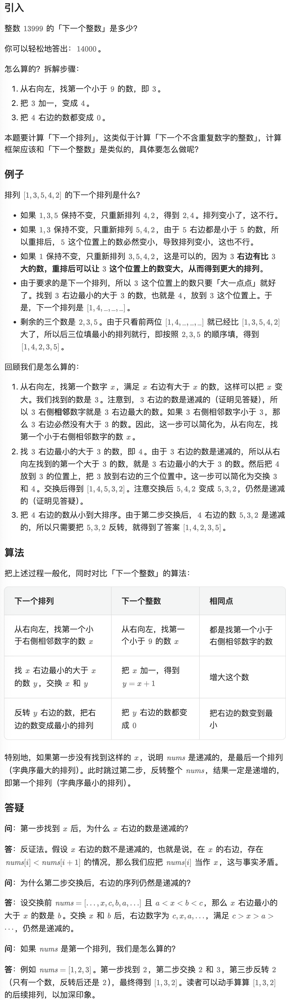

```python
class Solution:
    def nextPermutation(self, nums: List[int]) -> None:
        n = len(nums)

        # 第一步：从右向左找到第一个小于右侧相邻数字的数 nums[i]
        i = n - 2
        while i >= 0 and nums[i] >= nums[i + 1]:
            i -= 1

        # 如果找到了，进入第二步；否则跳过第二步，反转整个数组
        if i >= 0:
            # 第二步：从右向左找到 nums[i] 右边最小的大于 nums[i] 的数 nums[j]
            j = n - 1
            while nums[j] <= nums[i]:
                j -= 1
            # 交换 nums[i] 和 nums[j]
            nums[i], nums[j] = nums[j], nums[i]

        # 第三步：反转 nums[i+1:]（如果上面跳过第二步，此时 i = -1）
        # nums[i+1:] = nums[i+1:][::-1] 这样写也可以，但空间复杂度不是 O(1) 的
        left, right = i + 1, n - 1
        while left < right:
            nums[left], nums[right] = nums[right], nums[left]
            left += 1
            right -= 1
```

# 287.寻找重复数（中等）

## 题目描述

给定一个包含 `n + 1` 个整数的数组 `nums` ，其数字都在 `[1, n]` 范围内（包括 `1` 和 `n`），可知至少存在一个重复的整数。

假设 `nums` 只有 **一个重复的整数** ，返回 **这个重复的数** 。

你设计的解决方案必须 **不修改** 数组 `nums` 且只用常量级 `O(1)` 的额外空间。

 

**示例 1：**

```
输入：nums = [1,3,4,2,2]
输出：2
```

**示例 2：**

```
输入：nums = [3,1,3,4,2]
输出：3
```

**示例 3 :**

```
输入：nums = [3,3,3,3,3]
输出：3
```

 

 

**提示：**

- `1 <= n <= 105`
- `nums.length == n + 1`
- `1 <= nums[i] <= n`
- `nums` 中 **只有一个整数** 出现 **两次或多次** ，其余整数均只出现 **一次**

 

**进阶：**

- 如何证明 `nums` 中至少存在一个重复的数字?
- 你可以设计一个线性级时间复杂度 `O(n)` 的解决方案吗？

## 我的解答

```python
class Solution:
    def findDuplicate(self, nums: List[int]) -> int:
        cnt = defaultdict(int)
        for x in nums:
            if x in cnt:
                return x
            else:
                cnt[x] += 1
```

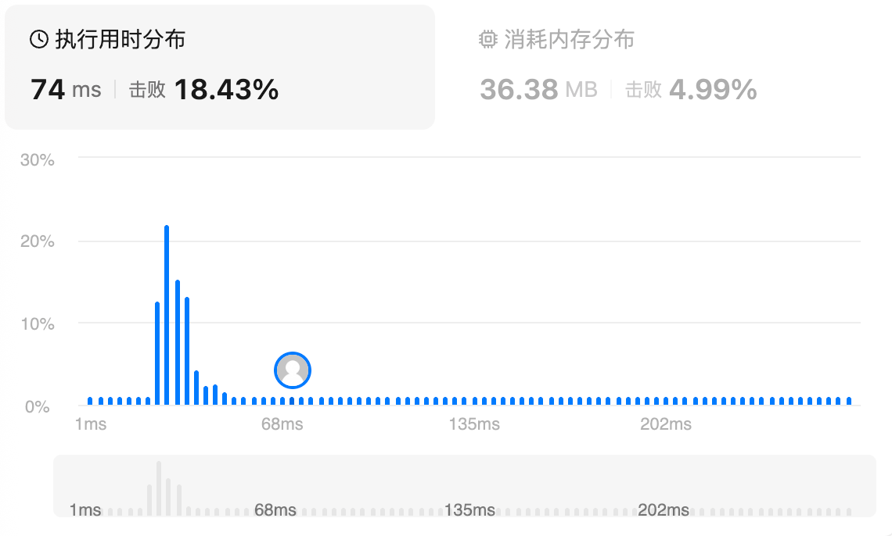

## 参考答案

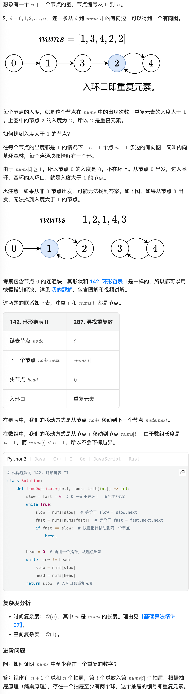

```python
# 代码逻辑同 142. 环形链表 II
class Solution:
    def findDuplicate(self, nums: List[int]) -> int:
        slow = fast = 0  # 0 一定不在环上，适合作为起点
        while True:
            slow = nums[slow]  # 等价于 slow = slow.next
            fast = nums[nums[fast]]  # 等价于 fast = fast.next.next
            if fast == slow:  # 快慢指针移动到同一个节点
                break

        head = 0  # 再用一个指针，从起点出发
        while slow != head:
            slow = nums[slow]
            head = nums[head]
        return slow  # 入环口即重复元素
```

666这个方法给我一辈子也想不到，第一次while通过快慢指针构建出来一个逻辑上的链表，然后slow就被困在循环里面了

第二个while仍旧快慢指针，slow一致在循环，head一直在往循环里面走

### 第一阶段：找相遇点

- `slow = fast = 0`：两个指针都从索引 `0` 出发。
- 循环条件为 `True`，直到快慢指针相遇才跳出。
- `slow = nums[slow]`：慢指针每次走一步，相当于 `slow = slow.next`。
- `fast = nums[nums[fast]]`：快指针每次走两步，相当于先走到 `nums[fast]`，再走到 `nums[nums[fast]]`，即 `fast = fast.next.next`。
- 由于链表中存在环，快慢指针最终会在环内的某一点相遇（类似环形链表中的判断环）。

### 第二阶段：找环的入口（即重复数字）

根据 Floyd 判圈算法的结论：
- 设从链表头到环入口的距离为 `a`，环入口到相遇点的距离为 `b`，相遇点继续走到环入口的距离为 `c`（即环的剩余部分），环的周长为 `r = b + c`。
- 当快慢指针相遇时，慢指针走了 `a + b`，快指针走了 `a + b + k*r`（其中 `k` 是快指针在环内绕的圈数）。由于快指针速度是慢指针的两倍，有 `2*(a+b) = a+b + k*r`，从而 `a+b = k*r`，即 `a = k*r - b`。
- 进一步，`a` 等于 `(k-1)*r + c`。这意味着如果让一个指针从链表头出发，另一个指针从相遇点出发，每次都走一步，它们最终会在环入口处相遇。

因此代码中：
- `head = 0`：新指针从链表头（索引0）开始。
- `while slow != head`：当两个指针不相等时，继续前进：
    - `slow = nums[slow]`
    - `head = nums[head]`
- 最终它们会在环入口相遇，此时 `slow` 就是环入口的索引，也就是重复的那个数字。

### 为什么返回的 `slow` 就是重复的数字？

在链表的视角下，每个节点的“值”实际上是 `nums[i]`，而节点的索引 `i` 是“地址”。环入口是一个索引，该索引对应的值 `nums[入口]` 就是被多个节点指向的目标。但是注意，我们最终返回的是入口索引本身吗？实际上，在代码中，`slow` 最终是一个索引值（例如某个下标），但题目要求返回的是重复的数字，即 `nums[索引]`。不过，这里有一个微妙的等价关系：

在 Floyd 算法中，我们通过比较指针的索引来找到环的入口，返回的是入口的索引。但是，由于我们将数组的值和索引混用，这里环入口的索引恰好就是重复的数字吗？让我们仔细分析：

假设环的入口索引为 `p`，那么 `nums[p]` 是某个值。但重复的数字是指被多个下标指向的值，也就是 `nums[p]` 这个值。然而，根据链表的构造，从 `p` 出发的下一个节点是 `nums[p]`，这个 `nums[p]` 也是一个索引。如果 `p` 是环入口，意味着有两个不同的节点（比如 `i` 和 `j`）都指向 `p`，即 `nums[i] = p` 且 `nums[j] = p`。那么重复的数字就是 `p` 本身吗？不对，重复的数字是指数组中的值，即 `nums[i]` 和 `nums[j]` 的值相等，这个相等的值是 `p`（因为 `nums[i] = p`）。所以重复的数字就是 `p`，即环入口的索引。

因此，当我们找到环入口的索引 `p` 时，它就是一个被重复指向的值，也就是重复的数字。所以直接返回 `slow` 即可。

###  验证示例

假设 `nums = [1,3,4,2,2]`，索引 0~4，值范围 1~4。

构造链表：
- 0 -> nums[0] = 1
- 1 -> nums[1] = 3
- 2 -> nums[2] = 4
- 3 -> nums[3] = 2
- 4 -> nums[4] = 2

从0出发：0→1→3→2→4→2→4→2... 环为 2→4→2，环入口是2。重复数字是2，正确。
