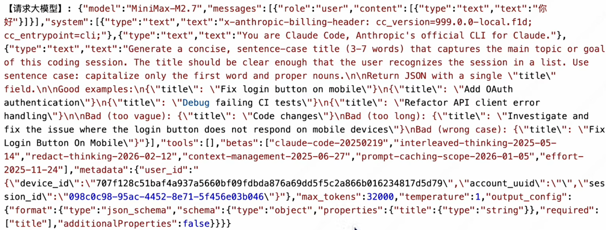
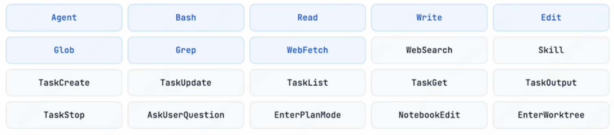
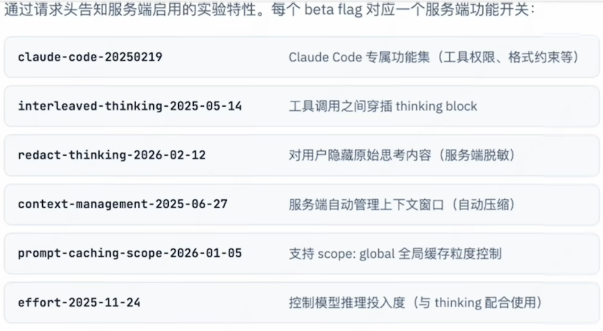
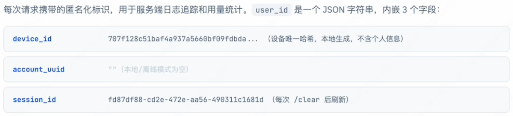

下面这份总结，我把材料分成三层来用：

**第一层：Anthropic 官方文档与官方 cookbook。** 这部分可信度最高，能确认 Claude Code 当前公开版本确实存在的机制。([Claude API Docs](https://docs.anthropic.com/en/docs/claude-code/memory))

**第二层：你指定的《Claude Reviews Claude》第 11 章以及相邻章节。** 这类内容基于源码/构建产物逆向分析，能看到很多实现细节，但要注意它反映的是**被分析那一版** Claude Code 的实现，不一定和今天公开文档逐字一致。([Open Claude](https://openedclaude.github.io/claude-reviews-claude/zh-CN/chapters/11-compact-system))

**第三层：其他第三方源码分析与经验文章。** 它们对某些细节有补充价值，但我会明确标注“官方未确认”或“更像社区观察”。([Claude Fast](https://claudefa.st/blog/guide/mechanics/session-memory))

------

# 一、先给结论：Claude Code 实际上有不止一种“记忆”

如果把 Claude Code 的“记忆”严格拆开，它至少有 5 类，而且它们不是同一层东西：

1. **规则/指令型持久记忆**：`CLAUDE.md` 及相关规则文件。它们不是“模型学会了什么”，而是每次会话启动时会被重新注入上下文的外部记忆。官方明确说这是 Claude Code 的一套核心 memory system。([Claude API Docs](https://docs.anthropic.com/en/docs/claude-code/memory))
2. **自动记忆（Auto memory）**：项目级的 `MEMORY.md` 索引与主题文件。这是 Claude Code 另一套显式持久记忆系统，用于跨会话保留偏好、流程、背景。官方明确把它叫作第二套 complementary memory system。([Claude API Docs](https://docs.anthropic.com/en/docs/claude-code/memory))
3. **会话转录存储（Session transcript persistence）**：`~/.claude/projects/.../*.jsonl`。这不是“长期知识库”，而是为了 `resume / continue / rewind / fork` 保存的完整会话轨迹，里面会有消息、工具调用、工具结果等。官方文档和 SDK 文档都明确写了这一点。([Claude](https://code.claude.com/docs/en/claude-directory))
4. **子代理记忆（Subagent memory）**：给自定义 subagent 单独准备的 `agent-memory` 目录体系。它和主代理的 Auto memory 不是一回事，但机制很相似。([Claude](https://code.claude.com/docs/en/sub-agents))
5. **压缩后会话记忆（Compaction/session-memory summaries）**：这是长会话维持上下文窗口时产生的“压缩记忆”。官方公开确认 Claude Code 会先清理旧工具输出，再在必要时总结会话；而逆向分析进一步显示内部至少有微压缩、session-memory 压缩和完整 compact 三层。([Claude](https://code.claude.com/docs/en/how-claude-code-works?utm_source=chatgpt.com))

你如果做研究，最重要的是把这五类分开。很多讨论把它们混成“Claude Code 有一个 memory”，这是不准确的。

------

# 二、记忆存储机制：它到底把什么存在哪里

## 2.1 规则/指令型记忆：`CLAUDE.md` 家族

官方当前文档把 Claude Code 的第一套记忆系统定义为各种作用域下的 `CLAUDE.md` 文件。它们会在**每次会话启动时自动加载**，作为上下文的一部分，而不是像系统配置那样硬性执行。官方明确说，这些 memory files “load at the start of every conversation” 并且是 “treated as context, not hard rules”。([Claude API Docs](https://docs.anthropic.com/en/docs/claude-code/memory))

官方列出的主要位置包括：

- 受策略管理的系统级路径
- 项目级 `./CLAUDE.md`
- 项目级 `./.claude/CLAUDE.md`
- 用户级 `~/.claude/CLAUDE.md`。([Claude API Docs](https://docs.anthropic.com/en/docs/claude-code/memory))

官方搜索结果还显示本地项目可以有 `./CLAUDE.local.md`，并且工作目录向上的层级中的 `CLAUDE.md` 会在会话开始时被加载；子目录中的 `CLAUDE.md` 则在进入对应目录后按需读取。([Claude](https://code.claude.com/docs/en/memory?utm_source=chatgpt.com))

逆向分析进一步补充了更细的加载模型：Claude Code 会从当前工作目录一路向上遍历到根目录，收集 `CLAUDE.md`、`.claude/CLAUDE.md`、`.claude/rules/*.md`、`CLAUDE.local.md` 等规则文件，并按优先级合并。它还支持 `@include` 递归，限制最大深度并避免循环引用。这个实现细节在官方公开文档里没写得这么细，但和官方“分层加载、目录层级感知”的描述是相容的。([Open Claude](https://openedclaude.github.io/claude-reviews-claude/zh-CN/chapters/10-context-assembly))

一个重要细节是：官方明确说这些 `CLAUDE.md` 内容**不是 system prompt 本体**，而是以**用户消息**的形式在系统提示后注入。这个细节很关键，因为它决定了这些记忆参与的是“上下文竞争”，而不是拥有绝对最高优先级。([Claude API Docs](https://docs.anthropic.com/en/docs/claude-code/memory))

### 问题：`CLAUDE.md` 是不是只在当前 session 启动时加载一次？后续多轮怎么持续生效？

**是的，常规情况下可以理解为：当前 session 启动时注入一次，而不是每一轮都重新去读磁盘。**
它之所以能在后续多轮继续起作用，不是因为 Claude Code 每轮重新读取 `CLAUDE.md`，而是因为它**作为上下文的一部分留在当前会话的 context window 里**。但它只是“context”，**不是强制配置**，所以持续遵循并没有硬保证。([Claude API Docs](https://docs.anthropic.com/en/docs/claude-code/memory))

#### 官方确认到什么程度

官方文档明确说：

- **每个 Claude Code session 都从一个 fresh context window 开始**。跨会话保留知识靠两套机制：`CLAUDE.md` 和 auto memory。([Claude API Docs](https://docs.anthropic.com/en/docs/claude-code/memory))
- `CLAUDE.md` / auto memory **都在每次会话开始时加载**。([Claude API Docs](https://docs.anthropic.com/en/docs/claude-code/memory))
- `CLAUDE.md` 内容是**作为 system prompt 之后的一条 user message** 注入的，而不是 system prompt 本体，所以它是“上下文中的指令”，不是硬规则。([Claude API Docs](https://docs.anthropic.com/en/docs/claude-code/memory))
- 当前工作目录上方层级中的 `CLAUDE.md` / `CLAUDE.local.md` 会在启动时整文件加载；**子目录里的规则文件是按需懒加载**的，也就是你后来读到对应子目录文件时，才会补充进上下文。([Claude API Docs](https://docs.anthropic.com/en/docs/claude-code/memory))

所以，从公开文档能下的最稳妥结论是：

> **启动时加载一次主规则；之后不是“每轮重读”，而是“已注入上下文持续存在”；只有子目录规则会在会话中按需新增加载”。** ([Claude API Docs](https://docs.anthropic.com/en/docs/claude-code/memory))

#### 那为什么后续多轮还能继续遵循？

因为在同一个 session 里，Claude 每一轮都会看到当前 context window，而 `CLAUDE.md` 已经在里面。Claude Code 官方也明确把 `CLAUDE.md` 列为 context window 的组成部分之一。([Claude](https://code.claude.com/docs/en/how-claude-code-works))

但要注意两点：

第一，**它没有强制力**。官方直接说了：Claude treats them as context, **not enforced configuration**。所以如果指令含糊、冲突，或者被后来更强的局部上下文压过去，模型可能偏离。([Claude API Docs](https://docs.anthropic.com/en/docs/claude-code/memory))

第二，**conversation 里的早期自然语言指令可能会在压缩后丢失，但 `CLAUDE.md` 不会**。官方写得很明确：如果 `/compact` 后你感觉某条“规则”丢了，往往是因为它只存在于对话里，没有写进 `CLAUDE.md`。`CLAUDE.md` 在 `/compact` 后会**从磁盘重新读取并重新注入**。([Claude](https://code.claude.com/docs/en/how-claude-code-works))

#### 所以更精确的机制是

同一个 session 内：

1. 启动时把 `CLAUDE.md` 注入上下文。([Claude API Docs](https://docs.anthropic.com/en/docs/claude-code/memory))
2. 多轮对话时它留在 context window 里继续起作用。([Claude](https://code.claude.com/docs/en/how-claude-code-works))
3. 如果读到子目录，再按需加载更局部的规则。([Claude API Docs](https://docs.anthropic.com/en/docs/claude-code/memory))
4. 如果发生 `/compact` 或自动压缩，再**重读磁盘并重新注入**。([Claude API Docs](https://docs.anthropic.com/en/docs/claude-code/memory))

所以答案不是“只加载一次然后永不更新”，而是：

> **平时按 session 启动加载一次；会话中可能按目录懒加载补充；发生 compaction 时会重新从磁盘注入。** ([Claude API Docs](https://docs.anthropic.com/en/docs/claude-code/memory))

## 2.2 自动记忆：`~/.claude/projects/<project>/memory/`

官方当前文档明确了 Auto memory 的存储位置：每个项目在 `~/.claude/projects/<project>/memory/` 下有单独目录，同一 git 仓库下的 worktree 和子目录会共享记忆；也可以通过 `autoMemoryDirectory` 改目录，但只能在 policy/local/user 级配置，不能在项目级配置里改。([Claude API Docs](https://docs.anthropic.com/en/docs/claude-code/memory))

这个目录里至少包含：

- `MEMORY.md`：索引文件
- 多个 topic files：主题文件。([Claude API Docs](https://docs.anthropic.com/en/docs/claude-code/memory))

官方对读取方式说得很清楚：会话启动时只自动加载 `MEMORY.md` 的前 **200 行** 或前 **25KB**，topic files 不会自动进上下文，而是在需要时再通过文件工具读取。([Claude API Docs](https://docs.anthropic.com/en/docs/claude-code/memory))

这说明 Auto memory 的设计不是“所有历史知识都塞进 prompt”，而是：

- 用一个轻量索引文件先告诉模型“有哪些记忆”
- 需要时再追进去读某个主题文件

第三方分析对这点也有类似描述，认为 `MEMORY.md` 更像一个“指针系统”而不是正文仓库，Agent 先看索引，再决定读哪份记忆文档。这个和官方机制是吻合的。([MindStudio](https://www.mindstudio.ai/blog/claude-code-source-leak-memory-architecture/))

需要注意一个版本差异：你指定的逆向分析文里曾出现 `~/.claude/memory/MEMORY.md` 这样的路径描述，但 Anthropic 当前官方文档已经明确改为 `~/.claude/projects/<project>/memory/`。这很可能意味着逆向分析对应的是更早/不同版本。做研究时应优先以官方当前路径为准。([Open Claude](https://openedclaude.github.io/claude-reviews-claude/zh-CN/chapters/10-context-assembly))

### 问题：自动记忆模块里，`MEMORY.md` 到底存什么？只加载前 200 行会不会影响 resume？topic files 是什么？为什么不用常规 RAG？

#### 先给核心结论

`MEMORY.md` **不是原始历史对话 transcript**，也不是用来做 session resume 的主存储。
它更像是一个**项目级的“记忆索引 + 提炼后的 notes”**：保存 Claude 从你的纠正、偏好、调试经验里提炼出的 **learnings and patterns**。resume 真正依赖的是**session transcript JSONL**，不是 auto memory。([Claude API Docs](https://docs.anthropic.com/en/docs/claude-code/memory))

#### `MEMORY.md` 存的到底是什么？

官方文档把 auto memory 定义得非常清楚：

- 它是 Claude 自己写的 notes，来源于你的 corrections 和 preferences。([Claude API Docs](https://docs.anthropic.com/en/docs/claude-code/memory))
- 它存的是 **learnings and patterns**，用例包括 **build commands、debugging insights、preferences Claude discovers**。([Claude API Docs](https://docs.anthropic.com/en/docs/claude-code/memory))
- `MEMORY.md` 本身是 memory 目录的**索引文件**。Claude 在整个 session 中会读写这个目录，用 `MEMORY.md` 记录“有哪些记忆、它们存在哪里”。([Claude API Docs](https://docs.anthropic.com/en/docs/claude-code/memory))

所以它更像：

- “这个项目常见的 build / test 命令是什么”
- “上次为什么这个 bug 出在这里”
- “API 设计约定有哪些”
- “这个 repo 里某类异常通常怎么排查”

而不是：

- 原样保存你和 Claude 的所有聊天
- 原样保存每次工具调用的细节
- 一字不差地保存整个历史会话

#### topic files 是什么？本地以什么形式存？

官方给了明确目录示例：

```text
~/.claude/projects/<project>/memory/
├── MEMORY.md          # concise index
├── debugging.md       # debugging patterns
├── api-conventions.md # API decisions
└── ...
```

也就是说，**topic files 就是普通 Markdown 文件**，例如 `debugging.md`、`api-conventions.md`、`patterns.md` 这类主题文件。它们和 `MEMORY.md` 一样，都是本地磁盘上的**纯 markdown 文件**，可以用 `/memory` 浏览、编辑、删除。([Claude API Docs](https://docs.anthropic.com/en/docs/claude-code/memory))

#### 为什么只加载前 200 行 / 25KB？会不会丢信息？

官方说得非常明确：

- 每次会话启动时，只自动加载 `MEMORY.md` 的前 **200 行**或前 **25KB**。([Claude API Docs](https://docs.anthropic.com/en/docs/claude-code/memory))
- `MEMORY.md` 超过这个阈值后，Claude 会把更详细的内容移到 topic files。([Claude API Docs](https://docs.anthropic.com/en/docs/claude-code/memory))
- **这个限制只作用于 `MEMORY.md`**，topic files 不在启动时自动加载。([Claude API Docs](https://docs.anthropic.com/en/docs/claude-code/memory))

这不是“信息丢失”，而是**显式的索引化设计**：

> 启动时只给模型一个“目录”和少量高价值摘要；真需要细节时，再按需去读具体 topic file。([Claude API Docs](https://docs.anthropic.com/en/docs/claude-code/memory))

#### 那 resume 为什么不会受影响？

因为 **resume 根本不是靠 auto memory 实现的**。

官方 SDK / session 文档明确写了，session 持久化保存的是：

- your prompt
- every tool call
- every tool result
- every response

并且这些会被写到磁盘，供你 `continue / resume / fork`。([Claude](https://code.claude.com/docs/en/agent-sdk/sessions?utm_source=chatgpt.com))

同一份文档还明确给了 session 文件位置：
`~/.claude/projects/<encoded-cwd>/<session-id>.jsonl`。([Claude](https://code.claude.com/docs/en/agent-sdk/sessions?utm_source=chatgpt.com))

所以：

- **Auto memory**：跨会话的提炼知识层
- **Session transcript JSONL**：恢复某次具体会话的原始运行轨迹层

二者分工不同。只加载 `MEMORY.md` 前半部分不会影响 `resume`，因为 `resume` 看的不是它。([Claude API Docs](https://docs.anthropic.com/en/docs/claude-code/memory))

#### 为什么不用常规 RAG 召回？

这一点我没找到 Anthropic 的官方明说，也没看到公开源码分析里有“auto memory 内部实际使用 embedding/vector DB”的可靠证据。**当前公开证据只支持：它是一个基于 markdown 文件的索引 + 按需读取系统。** ([Claude API Docs](https://docs.anthropic.com/en/docs/claude-code/memory))

所以更稳妥的表述是：

> **截至目前的公开资料，没有证据表明 Claude Code 的 auto memory 用了传统向量化 RAG。公开实现更像“文件系统上的可审计记忆目录 + 索引文件 + 按需文件读取”。** ([Claude API Docs](https://docs.anthropic.com/en/docs/claude-code/memory))

为什么会这样设计，公开材料支持的合理推断有四个：

1. **可审计、可编辑**：官方强调它们是 plain markdown，你随时能看、改、删。([Claude API Docs](https://docs.anthropic.com/en/docs/claude-code/memory))
2. **启动成本可控**：只固定加载 200 行/25KB 的索引，不会像向量召回那样把召回质量与索引状态耦合。([Claude API Docs](https://docs.anthropic.com/en/docs/claude-code/memory))
3. **本地化**：auto memory 是 machine-local，不跨机器共享，天然更适合文件目录。([Claude API Docs](https://docs.anthropic.com/en/docs/claude-code/memory))
4. **规模假设较小**：它服务的是“单项目的工作记忆”，不是海量知识库。这个场景下，索引 + 按需读文件通常就够了。这个最后一点是我的工程推断，不是官方明文。

## 2.3 会话持久化：`~/.claude/projects/<project>/<session>.jsonl`

这是最容易被误解的一层。Claude Code 会把每个 session 的完整运行轨迹落盘到 `~/.claude/projects/<project>/<session-id>.jsonl`。官方“Working with sessions”直接说，session 包含：

- prompt
- every tool call
- every tool result
- every response。([Claude](https://code.claude.com/docs/en/agent-sdk/sessions))

官方 `.claude` 目录文档也说：transcripts 存在 `projects/<project>/<session>.jsonl`，大工具输出会单独放到 `projects/<project>/<session>/tool-results/`，还有 `file-history` 快照等。默认保留 30 天。([Claude](https://code.claude.com/docs/en/claude-directory))

你指定的逆向分析把这一层讲得更细：每个 session 是一个**append-only JSONL**，路径名会对 cwd 做 sanitize；记录类型不只有 user/assistant/system，还包括 summary、title、mode、worktree-state、file-history-snapshot、content-replacement 等等；并且它用 `parentUuid` 链来表示主线、分支、sidechain、compaction 边界。这个设计很重要，因为它解释了 Claude Code 为什么能做 **resume / rewind / fork**，而不是只是简单“接着聊”。([Open Claude](https://openedclaude.github.io/claude-reviews-claude/zh-CN/chapters/09-session-persistence))

官方没有公开 `parentUuid` 这种内部细节，但官方已经确认“会话会保存每条消息、每次工具使用和结果，以便 resume/rewind/fork”，所以逆向分析给出的数据结构是对公开能力的合理底层解释。([Claude](https://code.claude.com/docs/en/how-claude-code-works))

## 2.4 `history.jsonl` 不是完整记忆，而只是 prompt 历史

这点顺便一并说明：官方 `.claude` 文档明确说 `~/.claude/history.jsonl` 只保存“every prompt you type”以及时间戳、项目路径，主要用于上箭头召回；它不是完整会话 transcript。([Claude](https://code.claude.com/docs/en/claude-directory))

所以如果有人看到 `history.jsonl` 很短，就以为 Claude Code 不存完整轨迹，那是误读。真正的主轨迹在 `projects/.../*.jsonl`。([Claude](https://code.claude.com/docs/en/claude-directory))

## 2.5 子代理记忆目录

官方 subagent 文档明确说，如果给子代理启用 memory，不同作用域会落到不同目录：

- `user`：`~/.claude/agent-memory/`
- `project`：`.claude/agent-memory/<agent>`
- `local`：`.claude/agent-memory-local/<agent>`。([Claude](https://code.claude.com/docs/en/sub-agents))

子代理系统提示里会自动加入“去读写这个 memory 目录”的说明，并自动加载该 `MEMORY.md` 的前 200 行或 25KB，同时给它 `Read/Write/Edit` 权限。([Claude](https://code.claude.com/docs/en/sub-agents))

所以 Claude Code 的 memory 不是只给主 agent 设计的，它把“主会话记忆”和“专门子角色的记忆”分开了。

------

# 三、记忆管理机制：这些记忆怎么读、怎么写、怎么更新、怎么失效

## 3.1 启动时的加载顺序与作用域优先级

官方当前文档确认：Claude Code 在启动时会把 memory files 和 auto memory 都读进上下文。([Claude API Docs](https://docs.anthropic.com/en/docs/claude-code/memory))

逆向分析进一步给出一套更细的加载顺序：managed → user → project → local → AutoMem → TeamMem，并且从 cwd 向上逐级扫描目录中的规则文件。虽然官方没有逐条确认这个完整顺序，但“多层级合并、目录树遍历、局部规则按需进入”这套思想与公开文档是匹配的。([Open Claude](https://openedclaude.github.io/claude-reviews-claude/zh-CN/chapters/10-context-assembly))

一个很关键的管理策略是：**上级目录的规则在会话开始时就加载，子目录规则在进入对应子树后按需加载。** 这让 Claude Code 能在 monorepo 中保持“全局惯例 + 局部例外”的双层记忆。([Claude](https://code.claude.com/docs/en/memory?utm_source=chatgpt.com))

## 3.2 Auto memory 的索引式管理

官方把 `MEMORY.md` 明确定位为 index file，而不是全文记忆。([Claude API Docs](https://docs.anthropic.com/en/docs/claude-code/memory))

这意味着它的管理逻辑本质上是：

- 启动时先读一小段索引
- 决定是否需要更深入的 topic file
- 需要时用文件工具加载 topic file 正文

第三方分析把这种机制称作“read index first, then selectively drill down”，并强调 read-before-write：先看已有记忆，再决定是更新现有主题还是新增主题。虽然这是第三方观察，不是 Anthropic 公开文档原话，但和官方索引式设计完全一致。([MindStudio](https://www.mindstudio.ai/blog/claude-code-source-leak-memory-architecture/))

## 3.3 自动记忆的启用、禁用与目录重定向

官方文档说 Auto memory 默认开启，可用 `/memory` 浏览和管理，也可以用：

- `/memory`
- 设置项 `autoMemoryEnabled`
- 环境变量 `CLAUDE_CODE_DISABLE_AUTO_MEMORY=1`

来控制。([Claude API Docs](https://docs.anthropic.com/en/docs/claude-code/memory))

这说明它的管理不完全是黑箱：用户可以显式关闭整套自动记忆系统，也可以查看其目录结构。([Claude API Docs](https://docs.anthropic.com/en/docs/claude-code/memory))

## 3.4 Session transcript 的写入策略

逆向分析对这一层非常细：会话 JSONL 是 append-only，内部有异步写队列，也保留了某些不安全场景下的同步写路径；文件实际 materialize 可能会延迟到第一条 user/assistant 消息出现；还会对 UUID 做去重，避免重复写入。([Open Claude](https://openedclaude.github.io/claude-reviews-claude/zh-CN/chapters/09-session-persistence))

虽然这些是逆向细节，但官方“.claude”文档和 SDK 文档已经能证实它确实是一个被频繁追加、支持恢复与分叉的持久化层。([Claude](https://code.claude.com/docs/en/claude-directory))

## 3.5 Resume / rewind / fork 其实是“对会话图”的操作

官方对外暴露的是 resume、continue、fork；逆向分析显示底层不是简单线性聊天，而是以 `parentUuid` 串起的会话图，compaction 边界可以把父指针断开。恢复时会从 JSONL 里重建“最新非 sidechain 叶子链”，并处理 orphaned parallel tool results、无效 tool_use、纯 thinking 段等。([Open Claude](https://openedclaude.github.io/claude-reviews-claude/zh-CN/chapters/09-session-persistence))

这意味着 Claude Code 的“会话记忆管理”并不是单纯一条字符串历史，而是一个**可分叉、可裁剪、可重建**的事件图。

## 3.6 保留策略与安全后果

官方文档明确写了默认 cleanup 周期是 **30 天**，旧转录、工具结果、file-history、debug logs 等会在启动时被清理；并且这些内容**明文保存在磁盘**，不做静态加密。([Claude](https://code.claude.com/docs/en/claude-directory))

它还明确提醒：如果工具读取了 `.env` 或其他密钥文件，内容可能进入 session JSONL。可用 `--no-session-persistence` 或 SDK 的 `persistSession: false` 关闭持久化。([Claude](https://code.claude.com/docs/en/claude-directory))

所以如果你做研究，这里要记一个非常重要的点：

> Claude Code 的“记忆”不是只在 prompt 里，也不是全都只活在云端；它有大量本地明文持久化状态，这些状态既支撑了恢复能力，也带来了本地泄露面。([Claude](https://code.claude.com/docs/en/claude-directory))

------

# 四、上下文压缩机制：Claude Code 怎么在长会话里活下来

官方和逆向分析在这里可以拼成一条很完整的链。

## 4.1 官方公开版本：先清工具结果，再做会话总结

Anthropic 官方“How Claude Code works”明确说，随着上下文变满，Claude Code 会：

1. 先清掉较早的工具输出
2. 如果还不够，再总结整个会话。([Claude](https://code.claude.com/docs/en/how-claude-code-works?utm_source=chatgpt.com))

官方 cookbook 把这三种上下文工程原语讲得更抽象：

- **Tool-result clearing**
- **Compaction**
- **Memory**。

其中 tool-result clearing 会把旧 `tool_result` 替换成简短占位符，但保留 `tool_use` 记录；它是最便宜的上下文释放手段，因为不需要额外推理。

如果只靠清理旧工具结果还不够，就进入 compaction：把长会话替换成高保真的摘要。官方还说 `/compact [instructions]` 可以手动触发，并可给出压缩重点；而一旦 compact 发生，启动内容会自动重新加载，只是 skill listing 不会自动再列一次。([Claude](https://code.claude.com/docs/en/commands?utm_source=chatgpt.com))

## 4.2 逆向分析版本：实际上是三层压缩，不是两层

你指定的第 11 章给出的最有价值结论是：

> Claude Code 不是“快满了就总结一下”这么简单，而是至少有 **microcompact → session-memory compact → full compact** 三层架构。([Open Claude](https://openedclaude.github.io/claude-reviews-claude/zh-CN/chapters/11-compact-system))

这三层从轻到重分别解决不同问题。

### 4.2.1 第一层：Microcompact

Microcompact 主要针对**旧工具结果**。逆向分析给出的可压缩工具集合包括：

- FileRead
- 各类 shell 工具
- Grep
- Glob
- web search / fetch
- 文件编辑/写入类工具。([Open Claude](https://openedclaude.github.io/claude-reviews-claude/zh-CN/chapters/11-compact-system))

但 **AgentTool** 和 **MCP** 结果不会被这层压缩。([Open Claude](https://openedclaude.github.io/claude-reviews-claude/zh-CN/chapters/11-compact-system))

它至少有两条路径：

**时间路径**：距离上次 assistant 消息超过某阈值后，把较旧 tool result 替换为类似 `[Old tool result content cleared]` 的占位，只保留最近 N 条。([Open Claude](https://openedclaude.github.io/claude-reviews-claude/zh-CN/chapters/11-compact-system))

**缓存路径**：如果 prompt cache 是热的，就通过 `cache_edits` API **删除旧 tool results**，而不改本地 message 对象。这样既减上下文，又尽量不破坏缓存命中。([Open Claude](https://openedclaude.github.io/claude-reviews-claude/zh-CN/chapters/11-compact-system))

这层解释了一个常见现象：你在长会话中发现 Claude 还能“记得它用过什么工具”，但不再保留完整 stdout/stderr。这正是 **tool_use 保留、tool_result 被清空**的效果。官方 cookbook 对这种原语有公开确认。

### 4.2.2 第二层：Session-memory compact

这是官方文档几乎没讲、但逆向分析和社区文章都提到的一层。它不是重新让大模型总结整段对话，而是利用一个后台维护的“session memory”来做更便宜的中间压缩。([Open Claude](https://openedclaude.github.io/claude-reviews-claude/zh-CN/chapters/11-compact-system))

逆向分析给出的默认配置是：

- `minTokens = 10k`
- `minTextBlockMessages = 5`
- `maxTokens = 40k`。([Open Claude](https://openedclaude.github.io/claude-reviews-claude/zh-CN/chapters/11-compact-system))

然后会把被总结的旧消息替换为：

- 一个 boundary
- session memory summary
- 再加最近消息。([Open Claude](https://openedclaude.github.io/claude-reviews-claude/zh-CN/chapters/11-compact-system))

社区分析还提到，这个 session memory summary 会单独落在 session 目录下，抽取 cadence 类似“第一次约 10k token，之后每 5k token 或 3 次工具调用更新”。这类细节官方没有确认，所以在学术写作里最好标成“第三方源码观察，未见官方文档确认”。([Claude Fast](https://claudefa.st/blog/guide/mechanics/session-memory))

### 4.2.3 第三层：Full compact

这是用户最能感知的 `/compact` 以及自动 compact。逆向分析把流程拆得非常细：

1. 运行 pre-compact hooks
2. 把图片条目剥离为 `[image]`
3. 移除重注入的附件，如 skill discovery / skill listing
4. fork 一个 agent 流式生成 compact summary，带重试
5. 格式化 summary，去掉 `<analysis>`，保留 `<summary>`
6. 清理文件状态缓存
7. 恢复压缩后必须保留的上下文
8. 重新跑像新会话一样的 SessionStart hooks
9. 运行 post-compact hooks
10. 重新附加 session metadata，保证标题等元数据还能留在尾部窗口里。([Open Claude](https://openedclaude.github.io/claude-reviews-claude/zh-CN/chapters/11-compact-system))

这里最关键的不是“它会总结”，而是**它总结完之后会主动恢复某些关键上下文**，包括：

- 最近 5 个文件，预算 50k、每文件 5k
- 最近调用过的 skills，预算 25k、每个 5k
- 当前 active plan
- plan-mode 指令
- deferred tool deltas
- agent listing deltas
- MCP instruction deltas。([Open Claude](https://openedclaude.github.io/claude-reviews-claude/zh-CN/chapters/11-compact-system))

这说明 Claude Code 的 compact 不是“把所有历史砍成一段 prose summary”，而是 **summary + 关键结构化上下文重建**。这点对研究上下文工程非常重要。

### 问题：第二层 `session-memory compact` 到底怎么做？压缩前后分别是什么？

#### 先区分：官方公开到哪一步

官方公开文档只确认到：

- 上下文逼近上限时，Claude Code **先清理旧工具输出**，再在需要时**总结对话**。([Claude](https://code.claude.com/docs/en/how-claude-code-works))

官方**没有**把 `session-memory compact` 这层中间机制讲开。
所以你问的这个问题，细节必须主要依赖 **2026-03-31 之后的源码分析**。最有价值的两份是：

- 你指定的《Claude Reviews Claude》第 11 章。([Opened Claude](https://openedclaude.github.io/claude-reviews-claude/zh-CN/chapters/11-compact-system))
- `oldeucryptoboi` 的 compaction deep dive（Apr 7, 2026）。([Laurent DeSegur](https://oldeucryptoboi.com/blog/context-compaction-deep-dive/))

#### 它的定位是什么？

按这些源码分析，Claude Code 的自动压缩不是两层，而是至少三层：

1. **microcompact**：删旧 tool results
2. **session-memory compact**：不用额外 LLM 摘要调用，**直接复用预先抽取好的 session memory**
3. **full compact**：真的再起一个 forked agent 做完整摘要

`session-memory compact` 的价值就在于：
**比 full compact 便宜很多，没有新的模型调用；但比单纯删 tool results 更激进。** ([Opened Claude](https://openedclaude.github.io/claude-reviews-claude/zh-CN/chapters/11-compact-system))

#### 它压缩前的数据是什么？

按源码分析，输入不是单一对象，而是两部分：

1. **当前消息数组 `messages`**：也就是这次会话到目前为止的对话、工具调用、工具结果等。([Laurent DeSegur](https://oldeucryptoboi.com/blog/context-compaction-deep-dive/))
2. **后台维护的 session memory 文件**：这是一个结构化 markdown 笔记，由后台 forked subagent 持续维护。([Laurent DeSegur](https://oldeucryptoboi.com/blog/context-compaction-deep-dive/))

也就是说，`session-memory compact` 不是“临时去读历史然后总结”，而是：

> **会话进行中，后台就一直在把会话提炼成一份结构化记忆文件；当真的要压缩时，直接把这份文件拿来当 summary 用。** ([Opened Claude](https://openedclaude.github.io/claude-reviews-claude/zh-CN/chapters/11-compact-system))

#### 这个 session memory 文件怎么产生？

按 `oldeucryptoboi` 的源码分析：

- 它由一个**forked subagent** 定期抽取。([Laurent DeSegur](https://oldeucryptoboi.com/blog/context-compaction-deep-dive/))
- 触发条件类似：
  `tokenGrowth >= minimumTokensBetweenUpdate`
  且
  `toolCalls >= toolCallsBetweenUpdates OR noToolCallsInLastTurn`。([Laurent DeSegur](https://oldeucryptoboi.com/blog/context-compaction-deep-dive/))
- 这个子代理**只允许编辑 session memory 文件**，不会去污染主会话。([Laurent DeSegur](https://oldeucryptoboi.com/blog/context-compaction-deep-dive/))

#### 这个文件里写什么？

这部分 `oldeucryptoboi` 给得最细。它说提取 prompt 规定了一个 **10 节 markdown 模板**，包括：

- Session Title
- Current State
- Task Specification
- Files and Functions
- Workflow
- Errors & Corrections
- Codebase and System Documentation
- Learnings
- Key Results
- Worklog。([Laurent DeSegur](https://oldeucryptoboi.com/blog/context-compaction-deep-dive/))

并且：

- 每节上限约 **2000 tokens**
- 全文件上限约 **12000 tokens**
- 超限时会要求“condense / aggressively shorten”。([Laurent DeSegur](https://oldeucryptoboi.com/blog/context-compaction-deep-dive/))

所以这不是简单 prose summary，而是**结构化工作记忆文件**。

#### 真正压缩时怎么做？

《Claude Reviews Claude》第 11 章给出的 before/after 非常清楚：

压缩前大致是：

```text
[msg1, msg2, ..., msg_summarized, ..., msg_recent1, msg_recent2]
```

压缩后变成：

```text
[boundary, session_memory_summary, msg_recent1, msg_recent2]
```

也就是：

- 加一个 compact boundary
- 把大段旧历史用 session memory summary 替代
- 只保留最近一部分消息。([Opened Claude](https://openedclaude.github.io/claude-reviews-claude/zh-CN/chapters/11-compact-system))

#### “最近一部分消息”怎么选？

这块《Claude Reviews Claude》和 `oldeucryptoboi` 基本一致：

默认保留策略是：

- `minTokens = 10,000`
- `minTextBlockMessages = 5`
- `maxTokens = 40,000`。([Opened Claude](https://openedclaude.github.io/claude-reviews-claude/zh-CN/chapters/11-compact-system))

做法是：

- 从“最后被摘要的消息”附近往回扩展/计算
- 至少满足：
  - 保留 10k token
  - 且至少 5 条含文本消息
- 但又不能超过 40k token
- 也不能越过最近一次 compact boundary。([Opened Claude](https://openedclaude.github.io/claude-reviews-claude/zh-CN/chapters/11-compact-system))

#### 为什么还要“调整 keep-index”？

因为不能把 API 语义结构切坏。源码分析提到它会专门保护这些不变量：

- `tool_use` / `tool_result` 不能拆开
- 同一 `message.id` 下的 thinking / stream 分片不能只留一半。([Opened Claude](https://openedclaude.github.io/claude-reviews-claude/zh-CN/chapters/11-compact-system))

这一步很关键。否则压缩后会出现“只剩工具结果没有工具调用”或者“thinking 块被截断”的坏状态。

#### 压缩后最终得到了什么？

可以把结果理解成：**新的 message array**

**compact boundary**

- **session memory summary（来自预提取 markdown）**
- **最近保留的消息子集**。([Opened Claude](https://openedclaude.github.io/claude-reviews-claude/zh-CN/chapters/11-compact-system))

然后系统还会估计 post-compact token 数；如果压完还是会立刻再次触发 auto-compact，就直接判失败返回 `null`，避免无限压缩循环。([Laurent DeSegur](https://oldeucryptoboi.com/blog/context-compaction-deep-dive/))

#### 这层和 full compact 的关系

按 `oldeucryptoboi` 的分析，fallback chain 是：

1. session memory compact
2. full compact with prompt cache sharing
3. full compact streaming
4. PTL retry with head truncation
5. 用户报错。([Laurent DeSegur](https://oldeucryptoboi.com/blog/context-compaction-deep-dive/))

所以 `session-memory compact` 不是替代 full compact，而是**优先尝试的低成本捷径**。

## 4.3 Compact summary 本身长什么样

逆向分析把 compact prompt 的结构也扒出来了：摘要要求覆盖 9 类信息，包括：

- 主要请求与用户意图
- 关键技术概念
- 文件与代码片段
- 错误与修复
- 解决问题过程
- 所有用户消息
- 未完成任务
- 当前工作状态
- 可选的下一步与引用。([Open Claude](https://openedclaude.github.io/claude-reviews-claude/zh-CN/chapters/11-compact-system))

并且 `<analysis>` scratchpad 会被剥掉，只留下 `<summary>`。([Open Claude](https://openedclaude.github.io/claude-reviews-claude/zh-CN/chapters/11-compact-system))

这很关键，因为它解释了为什么 Claude Code 的 compact 后摘要通常对“用户要求”和“工作进度”保真度较高，而不是只保留最后几轮闲聊。

## 4.4 自动触发阈值与防抖

官方公开环境变量提供了两个很重要的调节点：

- `CLAUDE_AUTOCOMPACT_PCT_OVERRIDE`，默认大约是上下文容量的 **95%**
- `CLAUDE_CODE_AUTO_COMPACT_WINDOW`，默认是模型上下文窗口，可被调小成更保守的触发窗。([Claude](https://code.claude.com/docs/en/env-vars))

逆向分析则把内部阈值算式写得更细：
有效窗口 = 模型窗口 - 预留输出 token（最多 20k）
自动 compact 阈值 = 有效窗口 - 13k
warning 态 ≈ 有效窗口 - 20k
blocking 态 ≈ 有效窗口 - 3k。([Open Claude](https://openedclaude.github.io/claude-reviews-claude/zh-CN/chapters/11-compact-system))

官方还确认了一个防抖/熔断设计：如果是同一个大文件或同一个工具输出反复导致填满上下文，Claude Code 在自动 compact 几次仍无效后，会**停止继续自动 compact 并报错**，而不是无限循环。逆向分析和 GitHub issue 都指向 `MAX_CONSECUTIVE_AUTOCOMPACT_FAILURES = 3`。([Claude](https://code.claude.com/docs/en/how-claude-code-works?utm_source=chatgpt.com))

## 4.5 Compact 后会重新加载什么

官方明确说 `/compact` 后，绝大多数启动内容会自动重新加载，包括 `CLAUDE.md` 等；例外是 skill listing 不会自动重列。([Claude](https://code.claude.com/docs/en/context-window))

官方还专门说明：compact 之后会**重新从磁盘读取 `CLAUDE.md` 并重新注入**。这意味着规则记忆不依赖老上下文本身，而是外部持久文件，所以 compact 不会“忘掉项目规则”。([Claude API Docs](https://docs.anthropic.com/en/docs/claude-code/memory))

------

# 五、把三大机制串起来：Claude Code 的“记忆—管理—压缩”其实是协同设计

现在把上面内容合起来，你会发现 Claude Code 不是只有一个 memory subsystem，而是一个协同结构：

## 5.1 长期稳定信息放到外部持久记忆

- `CLAUDE.md` 负责规则、工作方式、约束、团队惯例
- Auto memory 负责跨会话的经验、偏好、项目背景
- subagent memory 负责子角色专门知识。([Claude API Docs](https://docs.anthropic.com/en/docs/claude-code/memory))

这类信息不会依赖长对话链本身存活，因此 compact 掉历史也没关系。

## 5.2 会话即时状态放在 transcript 与 active context

- 当前对话
- 近几次工具调用和输出
- 当前打开/修改的文件
- 当前 plan。([Claude](https://code.claude.com/docs/en/agent-sdk/sessions))

这部分会随着上下文窗口膨胀而被清理、压缩、重构。

## 5.3 压缩时优先保留“结构”，不是保留“原文长度”

Claude Code 的压缩顺序大致是：

1. 先删旧 tool_result
2. 再用 session-memory 形式提取中层摘要
3. 最后做 full compact，总结历史并恢复关键结构化上下文。

所以它不是单纯做 token truncation，而是做**层次化上下文工程**。

------

# 六、研究上最值得注意的几个“细节级”结论

## 6.1 `CLAUDE.md` 不是系统提示，而是上下文竞争者

这意味着它很强，但不是不可被后来消息覆盖的绝对规则。研究对抗或 prompt governance 时，这一点必须单独建模。([Claude API Docs](https://docs.anthropic.com/en/docs/claude-code/memory))

## 6.2 Auto memory 是“索引 + 按需深入”，不是向量库式全量召回

官方公开设计是先读 `MEMORY.md` 的前 200 行/25KB，再按需读 topic files。它不是那种“把全历史向量化以后语义召回 N 条”的公开设计。([Claude API Docs](https://docs.anthropic.com/en/docs/claude-code/memory))

## 6.3 会话 JSONL 才是 resume/rewind/fork 的根

如果研究“agent 的真实交互轨迹”或“长会话恢复”，应该看 `projects/.../*.jsonl` 及其相关 sidecar 文件，而不是 `history.jsonl`。([Claude](https://code.claude.com/docs/en/claude-directory))

## 6.4 Compact 不是单步，而是一个多级 pipeline

这一点是《Claude Reviews Claude》第 11 章最有价值的贡献。即便官方没公开每个函数名，三层 compact 的存在能很好解释 Claude Code 的性能、缓存行为与可恢复性。([Open Claude](https://openedclaude.github.io/claude-reviews-claude/zh-CN/chapters/11-compact-system))

## 6.5 清理旧工具结果是第一优先级，因为最便宜

这说明 Claude Code 认为最先该牺牲的是“可重建的大块输出”，而不是“高层状态与意图”。这个设计哲学和很多 agent framework 的实践一致。

## 6.6 Compact 后会主动恢复文件、计划、技能等结构信息

这说明压缩的目标不是保留完整文本，而是恢复足够让 agent 接着工作的“工作记忆状态”。这比普通聊天模型的“对话摘要”更接近 IDE agent 的 operating state。([Open Claude](https://openedclaude.github.io/claude-reviews-claude/zh-CN/chapters/11-compact-system))

------

# 七、哪些是可以下结论的，哪些要谨慎

可以较高置信度下结论的：

- Claude Code 当前至少公开有两套持久记忆：`CLAUDE.md` 与 Auto memory。([Claude API Docs](https://docs.anthropic.com/en/docs/claude-code/memory))
- 会话轨迹以明文 JSONL 存在 `~/.claude/projects/...`，并支撑 resume/rewind/fork。([Claude](https://code.claude.com/docs/en/claude-directory))
- 上下文管理公开包含三大原语：memory、tool-result clearing、compaction。
- `/compact` 后会重新加载大部分启动内容，`CLAUDE.md` 会重读。([Claude](https://code.claude.com/docs/en/context-window))

要谨慎表述、最好注明“源码逆向/社区观察”的：

- 三层 compact 的全部内部函数名与确切阈值
- session-memory compact 的确切 cadence 与 feature flag
- Auto memory 可能的内部分类体系、freshness 逻辑、后台抽取 agent
- 某些 TeamMem / AutoDream / KAIROS 之类命名。([Open Claude](https://openedclaude.github.io/claude-reviews-claude/zh-CN/chapters/11-compact-system))

------

# 八、最凝练的一版总结

如果我把 Claude Code 的机制压缩成一句研究者视角的话：

> **Claude Code 不是靠“把全部历史一直塞在上下文里”来维持记忆，而是把记忆拆成外部持久记忆（CLAUDE.md、Auto memory、subagent memory）、本地可恢复事件轨迹（session JSONL）、以及多层上下文压缩（tool-result clearing → session-memory compact → full compact）。真正稳定跨会话的是外部持久记忆，真正支持恢复与分叉的是 JSONL 事件图，真正让长会话不爆窗的是分层压缩与关键状态重建。** ([Claude API Docs](https://docs.anthropic.com/en/docs/claude-code/memory))

如果你愿意，我下一条可以继续帮你做两件事中的一件：
一是把上面内容整理成**论文/报告可直接引用的分层框架图**；二是按**源码模块名**给你列一版“Claude Code 记忆与 compact 调用链”。

# 为什么 SKILL 可以做渐进式披露？怎么实现？模型如何决策 skill 和 tool 的使用？

### 先给最短答案

因为 Claude Code 把 skill 分成了三层信息：

1. **描述层**：先只把 skill 的 `description` 放进上下文，让模型知道“有哪些能力可选”
2. **正文层**：只有 skill 真被触发时，才把完整 `SKILL.md` 注入上下文
3. **附件层**：参考文档按需加载，脚本直接执行而不是全部塞进上下文

这就是渐进式披露。官方文档已经把这套行为说得非常明确了。([Claude](https://code.claude.com/docs/en/skills))

### 为什么要这样做？

官方给出的动机很直接：

- skill 目录里可以有大量 supporting files
- 这些详细文档**不需要每次都进上下文**
- `SKILL.md` 应保持聚焦，参考文件在需要时再读。([Claude](https://code.claude.com/docs/en/skills))

Victor Dibia 对泄漏源码的分析给了一个很形象的类比：
他把 Claude Code 的“大工具结果落盘 + 只留 preview + 用 Read 按需取全文”称为一种 **demand-paging**，并说这和 **skills 的 progressive disclosure 模式相似**。([Victor Dibia](https://newsletter.victordibia.com/p/inside-claude-code))

所以本质上，skill 的渐进式披露就是：

> **把“我得知道它存在”和“我得读完整内容”拆开，先付一个很小的上下文成本，再按需展开。** ([Claude](https://code.claude.com/docs/en/skills))

### 它具体怎么实现？

#### 第 1 层：启动时只暴露 description

官方技能文档明确写了：

- 每个 skill 的 `SKILL.md` 有 frontmatter + markdown 正文
- `description` 字段帮助 Claude 决定**什么时候自动加载这个 skill**。([Claude](https://code.claude.com/docs/en/skills))
- 在普通 session 中，**skill descriptions are loaded into context**，让 Claude 知道有哪些 skill 可用。([Claude](https://code.claude.com/docs/en/skills))

也就是说，初始时 Claude 看到的是“技能目录摘要”，不是完整 SOP。

#### 第 2 层：命中后才加载完整 `SKILL.md`

官方同一页写得很直接：

- 在 regular session 中，**full skill content only loads when invoked**。([Claude](https://code.claude.com/docs/en/skills))
- skill 被用户或 Claude 调用后，渲染后的 `SKILL.md` 会**作为一条单独消息进入对话**，并在本 session 余下时间里一直存在。([Claude](https://code.claude.com/docs/en/skills))

#### 第 3 层：supporting files 继续按需展开

官方进一步规定：

- `reference.md` / `examples.md` 这类 supporting files 是 **loaded when needed**
- `scripts/` 下的脚本是 **executed, not loaded**。([Claude](https://code.claude.com/docs/en/skills))

这就是第三层渐进展开：
**先看 skill 是否相关 → 再看 skill 正文 → 再看正文里引用的细资料 / 执行脚本。**

### skill 内容为什么能持续影响后续对话？

官方明确说：

- 被调用后的 skill 内容会以单条消息进入会话，并**持续到 session 结束**
- Claude Code **不会在后续 turn 重新读取 skill 文件**
- 如果发生 compaction，会把**每个 skill 的最近一次调用重新附加**到 summary 后面。([Claude](https://code.claude.com/docs/en/skills))

这点和你前面问 `CLAUDE.md` 的机制很像：

- 都不是“每轮重读文件”
- 都是“注入到上下文里持续生效”
- compact 后会被带过去。([Claude](https://code.claude.com/docs/en/skills))

### 模型如何决策 skill 的使用？

这是一个**软路由**，不是写死的 if/else。

官方能确认的部分是：

- `description` 决定 Claude 何时自动加载 skill。([Claude](https://code.claude.com/docs/en/skills))
- 默认情况下，Claude 和用户都可以调用 skill。([Claude](https://code.claude.com/docs/en/skills))
- `disable-model-invocation: true` 可以禁止模型自动触发，只允许用户手动触发。([Claude](https://code.claude.com/docs/en/skills))
- `user-invocable: false` 可以反过来只让 Claude 自动触发，隐藏 `/skill-name`。([Claude](https://code.claude.com/docs/en/skills))

所以 skill 决策大致是：

> **模型先看当前任务语义，与 skill descriptions 做匹配；若相关且 frontmatter 允许模型调用，就触发 skill，把完整 `SKILL.md` 拉进上下文。** ([Claude](https://code.claude.com/docs/en/skills))

这就是“为什么 skill 可以做渐进式披露”——因为**description 本身就是路由入口**。

### 模型如何决策 tool 的使用？

tool 和 skill 是两层不同东西。

官方 “How Claude Code works” 说得很清楚：
Claude Code 的 agentic loop 是 **models that reason + tools that act**。Claude Code 作为 harness，把工具、上下文管理和执行环境包在模型外面。([Claude](https://code.claude.com/docs/en/how-claude-code-works))

所以：

- **Skill** 是知识 / 工作流 / 偏好层
- **Tool** 是动作执行层

模型一般先判断要不要用某个 skill；skill 被注入后，skill 正文里会引导模型使用某些工具或资源。
但要注意，skill 里的 `allowed-tools` **不是把其他工具禁掉**，而是：

- 这些列出来的工具，在 skill 活跃时可预批准
- 其他工具仍然可调用
- 最终仍受全局 permission 设置约束。([Claude](https://code.claude.com/docs/en/skills))

所以“tool 的决策”依然是模型在 agent loop 中基于：

- 当前任务
- 系统提示 / harness 提示
- 已加载 skill 内容
- tool schema
- 权限状态

做出的选择。公开文档没有给出一个更硬的、显式的 symbolic planner。([Claude](https://code.claude.com/docs/en/how-claude-code-works))

### 一个很实用的结论

如果你发现：

- skill 明明还在上下文里
- 但 Claude 后面不怎么按 skill 行事了

官方文档直接给出的解释是：

> skill 还在，**只是模型选择了别的工具或别的做法**。
> 这时应加强 `description` 和正文，或者直接用 hooks 做确定性约束。([Claude](https://code.claude.com/docs/en/skills))

这说明 skill 路由和后续 tool 选择，本质仍然是**prompted policy + permissions + context competition**，不是完全确定性的程序逻辑。

------

## 最后把四个问题压成一句话

如果只用一句话概括 Claude Code 这套机制：

> **`CLAUDE.md` 和 auto memory 是“跨会话的外部持久上下文”，session JSONL 是“具体会话的可恢复轨迹”，session-memory compact 是“用后台结构化笔记替代旧历史的中档压缩”，skill 则是“先暴露 description、命中后再展开正文与附件的渐进式能力包”。** 官方文档确认了其中的大框架，而你关心的很多细节——尤其是 session-memory compact——目前主要来自 2026-03-31 之后的源码泄漏分析。([Claude API Docs](https://docs.anthropic.com/en/docs/claude-code/memory))

如果你要，我下一条可以继续给你做一版 **“按调用链画出的 Claude Code 记忆 / 压缩 / skill 时序图”**，把 `session start → context assembly → auto memory load → skill discovery → auto compact → rehydration` 连成一个统一流程。

# Agent的交互——访问大模型

## 1. 生成题目摘要



简短的系统提示词“你是claude code……” + 摘要命令“生成一个捕获核心议题的标题”

用户输入内容：“用户输入”

输出：一个标题，更改当前终端的标签名称

## 2.初始化session实现第一次交互

### 字段1:model

输入内容：

模型的名称

### 字段2:messages

输入的内容：

1. 自动注入的 system reminder：
   可用的skill列表
2. 自动注入的system reminder：
   当前的日期，防止对时间产生误判
3. 用户输入内容：
   用户的第一个输入

### 字段3：system

系统提示词以数组形式传，每段独设置缓存策略。分段缓存可以让常驻内容（如身份定义、为规则）只在第一次请求时计费，后续命中缓存免费复用。

1. 计费头部：
   用来服务端版本的追踪和计费
2. 身份+全量行为规则：（开始时最大的占用，全局缓存命中之后不重复计费）
   身份定义：你是claude code……
   任务规则
   工具使用方式
   代码风格
   git协议
   安全要求
   memory系统说明等
3. 会话级补充指令：（每轮可能变化，不做全局缓存）
   如何使用AskUserQuestion
   !命令语法
   Agent使用时机
   当前git状态

### 字段4: tools

模型可以在回答中自主决定调用哪些工具。每个工具都有完整的JSONSchema描述（name、description、input_schema)，模型根据描述判断何时使。蓝亮为最核的件操作具。



### 字段5: betas

服务端启用的实验特性



### 字段6: metadata



### 字段7: max_tokens

本次响应最多可以生成的token数量

### 字段8：thinking


## 3.用户上下文层级

包括：

1. 记忆内容，例如CLAUDE.md文件
2. 用户的真正query

